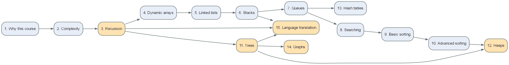

Fifteen teaching weeks, because that is what the لائحة sets: *"خمسة عشر أسبوعاً"*
— fifteen weeks of teaching per main semester (SWE 2013, p. 8; Medical
Informatics 2014, p. 7). The **midterm** falls in the window set by the faculty
calendar; the date is announced on the
[WhatsApp channel](https://whatsapp.com/channel/0029Vb8XynEFy72KWbH6vS2V), not
fixed here.

The plan covers the **union** of what all three bylaws declare, so every student
gets everything their own program promises. Which bylaw asks for what is in
[`02-coverage.md`](02-coverage.md).

Every week names the module you implement and the test file that grades it, so
this plan and the repository cannot quietly drift apart.

**Labs, weeks 1–3.** Alongside the first three lectures, the labs bring everyone
to the same Python: [Lab 01](../labs/lab01-python-basics.md) (interpreter,
numbers, strings, lists), [Lab 02](../labs/lab02-control-flow-functions.md)
(control flow, functions, errors, modules) and
[Lab 03](../labs/lab03-data-structures-classes.md) (data structures, classes,
generators). Exercises in `labs/`, graded by `tests/test_lab01.py` to
`tests/test_lab03.py`. See [the lab manual](../labs/).

---

## The plan

| Wk | Topic | Implement | Graded by |
|---|---|---|---|
| **1** | Why this course · ADTs · OOP philosophy · Know-How | — | Homework 1 |
| **2** | **Complexity, and the Array** — Big-O, measuring, the course `Array` | `dsa/array_ops.py` | `tests/test_array_ops.py` |
| **3** | **Recursion** — base case, recursive case, the call stack | `dsa/recursion.py` | `tests/test_recursion.py` |
| **4** | Dynamic arrays · amortised cost | `dsa/dynamic_array.py` | `tests/test_dynamic_array.py` |
| **5** | Linked lists — insert, remove, reverse | `dsa/linked_list.py` | `tests/test_linked_list.py` |
| **6** | Stacks — balanced brackets, shunting-yard | `dsa/stack.py` | `tests/test_stack_queue.py` |
| **7** | Queues — the O(n) vs O(1) demonstration | `dsa/queue.py` | `tests/test_stack_queue.py` |
| **8** | Searching — 7 variants · *midterm window* | `dsa/searching.py` | `tests/test_searching.py` |
| **9** | Basic sorting · counting sort | `dsa/sorting.py` | `tests/test_sorting.py` |
| **10** | Advanced sorting — merge, quick, heap | `dsa/sorting.py` | `tests/test_sorting.py` |
| **11** | **Trees** and the four traversals | `dsa/tree.py` | `tests/test_tree.py` |
| **12** | **Heaps** and priority queues | `dsa/heap.py` | `tests/test_heap.py` |
| **13** | Hash tables — chaining and open addressing | `dsa/hashmap.py` | `tests/test_hashmap.py` |
| **14** | **Graphs** and graph searches | `dsa/graph.py` | `tests/test_graph.py` |
| **15** | **Principles of language translation** | `dsa/translation.py` | `tests/test_translation.py` |

---

## Week by week

**1 — Why this course, and why Python.**
Languages are sets of decisions. Where C came from and the book to own.
Paradigms, type systems, memory models. The ladder from variable to data
structure. ADT vs implementation. *Know-how.*
→ [Lecture 01](../lectures/01-why-this-course/lecture.md)

**2 — Complexity, and the Array.**
Big-O, Θ and Ω; best, average and worst case; space against time; the rules for
reading cost off code — including the O(n) hidden inside one line of Python.
Then the part most courses skip: `measure()` and `plot_growth()` from
`viz/complexity.py`, so you *see* what Big-O throws away. The second half is the
**array**: contiguous memory, O(1) indexing, O(n) insertion, and the course
`Array` (`dsa/array.py`) — the one storage primitive every structure from here
on is built on. **From this week, no structure may store its data in a `list`,
`dict` or `set`.**
→ [Lecture 02](../lectures/02-complexity-and-arrays/lecture.md)
*Declared as "the basics of algorithmic analysis" (2013/2014), "analyzing and
managing the complexity" and "arrays" (2020).*

**3 — Recursion.**
Base case, recursive case, the call stack, and why Python stops you at about a
thousand frames. Fast exponentiation to show that *how* you recurse decides the
complexity. Towers of Hanoi for branching recursion. `merge_sorted` here is
half of merge sort in week 10.
→ [Lecture 03](../lectures/03-recursion/lecture.md)
*Declared first in the 2013/2014 list of topics — and taught nowhere before this
course in any of the three programs.*

**4 — Dynamic arrays.**
An array that grows. You build `DynamicArray` on the course `Array` from
Week 2 — not on a `list`. Doubling on resize,
and why that makes `append` **amortised** O(1). Plot `resize_count` and watch
the argument become a picture.
→ [Lecture 04](../lectures/04-dynamic-arrays/lecture.md)

**5 — Linked lists.**
Nodes and references. Why insertion at the head is O(1) and indexing is O(n) —
the exact mirror of an array. Reversal in place. This is the week to use the
debugger and watch `node.next` move.
→ [Lecture 05](../lectures/05-linked-lists/lecture.md)

**6 — Stacks.**
LIFO, built on your own `DynamicArray` with the top at the end. Then the
applications that justify
it: balanced-bracket checking, and infix → postfix by the shunting-yard
algorithm — which is the first half of week 15.

**7 — Queues.**
FIFO. `SlowQueue` (`DynamicArray.pop(0)`, O(n)) and `CircularQueue` (a ring on an `Array`, O(1))
are deliberately paired in `dsa/queue.py` so you measure the difference rather
than be told about it. You need a queue again in week 11 for level-order
traversal.

**8 — Searching.** *(midterm window)*
Linear, binary, binary recursive, `lower_bound`, `upper_bound`, jump,
exponential, interpolation. Eight functions, one idea: what a sorted invariant
buys you.

**9 — Basic sorting.**
Bubble, selection, insertion — each written twice, once plain and once as a
generator yielding snapshots, so `viz/animate.py` can animate *your* code. Then
counting sort, which beats the O(n log n) bound by not comparing at all.

**10 — Advanced sorting.**
Merge sort (divide and conquer, stable, O(n) extra space), quicksort (in place,
and why the pivot strategy decides between O(n log n) and O(n²)), heap sort —
which is week 12 arriving early.

**11 — Trees.**
Terminology, binary trees, binary search trees. Insert, search, and the delete
with three cases. The four traversals: in-order (which comes out **sorted**),
pre-order (which **rebuilds** the tree), post-order (which **frees** it), and
level-order (which needs a **queue**, not the call stack). Why an unbalanced BST
degrades into a linked list.

**12 — Heaps and priority queues.**
The heap property, and the fact that the array *is* the tree —
`viz.draw.draw_array_as_tree` shows this with no conversion at all. `sift_up`,
`sift_down`, and build-heap in O(n) rather than O(n log n). Then a priority
queue on top, and the link back to heap sort.

**13 — Hash tables.**
Hashing, collisions, load factor, resizing. Chaining against open addressing
with tombstones — both are in `dsa/hashmap.py`. Why "O(1) average" is a promise
about the *average*, and what breaks it.

**14 — Graphs and graph searches.**
Adjacency list against adjacency matrix, paired so you measure the trade-off.
BFS, DFS recursive and DFS with your own stack. Shortest path by edge count,
connected components, cycle detection — where the directed and undirected cases
genuinely differ — and topological sort.

**15 — The principles of language translation.**
The capstone, and the one week that needs everything in the course: a **stack**
to evaluate postfix, **recursion** to parse, and a **tree** to hold the result.
`tokenize` → `Parser` → an AST → `evaluate`. Precedence turns out not to be a
table of numbers but the *shape* of the grammar.
*Declared in the 2013/2014 bylaws, and the foundation of SWE141 Software
Construction (2013, p. 42).*

---

## Two notes on scope

**Dynamic programming is enrichment, not examinable.**
`dsa/dynamic_programming.py` is scaffolded and ready — `fib_naive` /
`fib_memo` / `fib_table`, coin change, LCS, edit distance, knapsack, LIS. **No
bylaw declares it for this course**, so it is not examined here.

It is still worth your weekend, and for a different reason depending on who you
are. If you are in **AI**, you meet this material again in **AI3001 Analysis and
Design of AI Algorithms**, and arriving having already seen it is a real
advantage. If you are in **SWE or Bio**, there is no later algorithms course in
your program at all — so this file is your only structured route into
divide-and-conquer, greedy methods and dynamic programming. I would rather tell
you that than let you find out in an interview.

**Where this stops.**
Balanced trees (AVL, red-black), weighted shortest paths (Dijkstra), minimum
spanning trees and NP-completeness are beyond what any of the three bylaws
declare for this course. They are named here so you know the words, and know
they exist, and know where to look next.

---

## Grading, in one line

Final **60%** · coursework **40%** — and you need **≥ 60% overall**, **≥ 30% of
the final**, and **≥ 75% attendance**.
Full detail and sources: [`00-course-guide.md`](00-course-guide.md).
