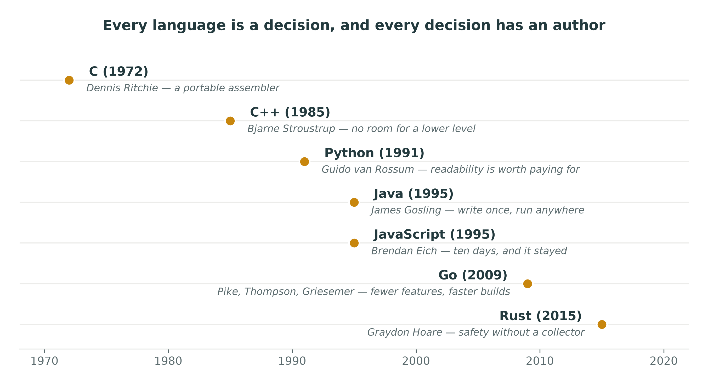
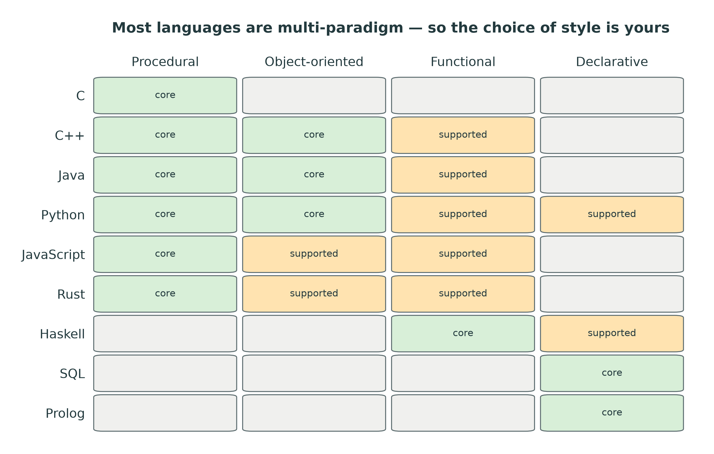
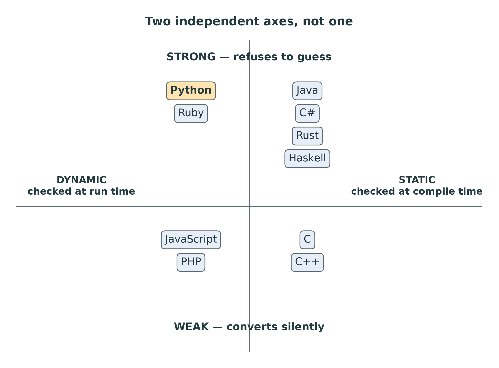
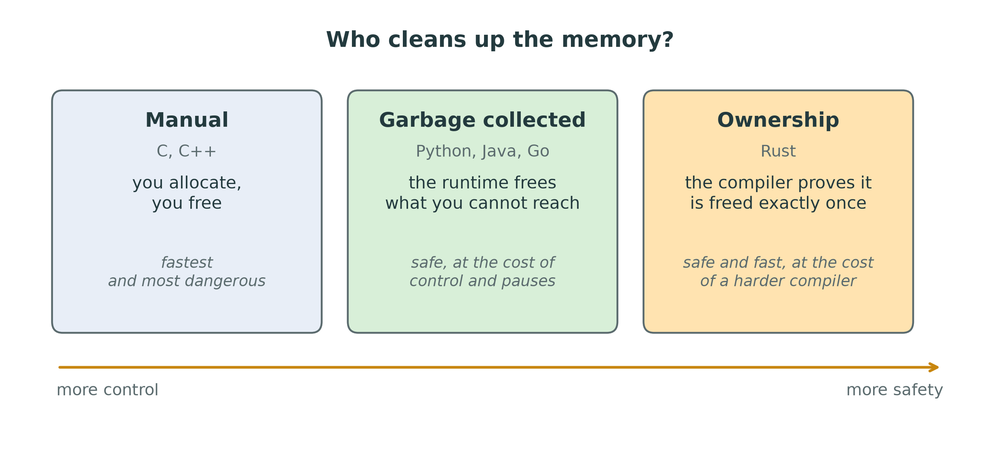
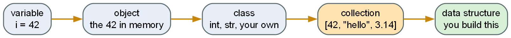
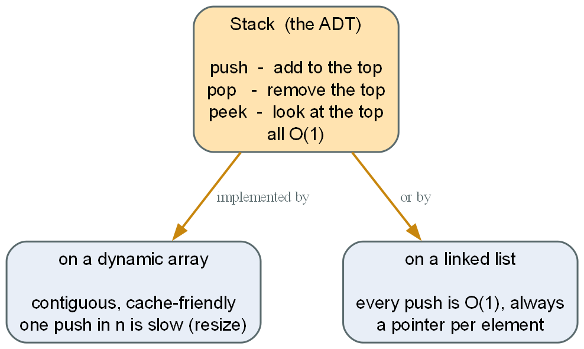
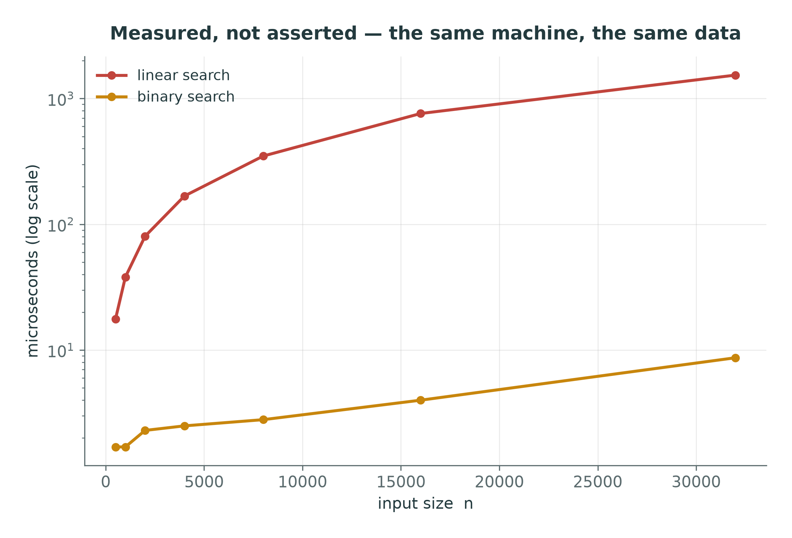

::: {.handout-only}

> **How to read this document.** This is the handout for Lecture 01. It contains
> everything that was on the slides, plus the parts I said out loud and the
> sources for every claim. If a statement comes from the faculty bylaw, the page
> number is printed next to it so you can check it yourself. You should check it
> yourself.
>
> Slides: `DSA27-L01-slides.pdf` · Repository: <https://github.com/helghareeb/DSA27>

:::

# Before We Start

## Where everything lives

| What | Where |
|---|---|
| Code, exercises, these notes | <https://github.com/helghareeb/DSA27> |
| Course updates, announcements | [WhatsApp channel](https://whatsapp.com/channel/0029Vb8XynEFy72KWbH6vS2V) |
| Some — not all — video lectures | <https://www.youtube.com/@0xHGH> |

::: {.handout-only}

Announcements go to the WhatsApp channel first. The repository is the source of
truth for anything technical: if the channel and the repository disagree, the
repository is right and I have made a mistake in the channel.

The QR code for the channel is in `docs/assets/whatsapp-channel-qr.jpg`, and on
the links page, `docs/links.md`.

:::

## The one thing to do today

```powershell
git clone https://github.com/helghareeb/DSA27.git
cd DSA27
py -3.13 -m venv .venv
.\.venv\Scripts\activate
pip install -r requirements.txt
pytest -m "not challenge"
```

Every one of those tests must pass **before** you write a line of course code.

::: {.handout-only}

Those tests do not check your algorithms. They check your machine: your
interpreter version, that you are inside a virtual environment, the plotting
stack, the Graphviz `dot` binary, and the drawing helpers in `viz/`. When one
fails, the message names exactly what is missing. Fix that first. Debugging a
linked list on a broken environment is a waste of your evening.

Full setup instructions, including the Windows "Microsoft Store opens instead of
Python" trap, are in the repository `README.md`.

:::

# Programming Languages Are Not the Same

## The argument that sounds right

Every language can print `Hello, World`.

Every language can add two numbers.

Every language is, in the end, reduced to instructions the same processor
executes.

**So all programming languages are the same. Only the syntax differs.**

::: {.handout-only}

This is the most common thing an intelligent second-year student believes, and I
want to spend real time on it, because the rest of the course depends on taking
it apart.

The argument is not stupid. It has a true premise: in terms of *what can be
computed*, the languages you will meet are equivalent — they are all
Turing-complete, so any program you can write in one, you can write in another.
That is a genuine theorem and it is worth knowing.

The error is in the word "same". Turing-equivalence tells you the set of
computable functions is identical. It tells you **nothing** about what the code
costs to write, what it costs to read six months later, what it costs to run,
which mistakes it lets you make silently, or how many people can maintain it.

:::

## Why it is wrong

Turing-equivalence says: **the same problems are solvable.**

It does not say they are solvable:

- at the same **cost**
- by the same number of **people**
- in the same amount of **time**
- with the same number of **mistakes surviving to production**

::: {.handout-only}

A language is not a neutral pipe you pour logic through. A language is a set of
**decisions** — about what is easy, what is hard, what is forbidden, and what
fails loudly versus what fails silently. Those decisions were made by people,
for reasons, and the reasons are usually written down.

:::

## A language is a set of decisions

$$\text{Programming Language} \longrightarrow \text{Design} \longrightarrow \text{Philosophy}$$

Ask of any language: **what did its designers refuse to do, and why?**

::: {.handout-only}

That chain — language, design, philosophy — is the one I drew on the board. Read
it right to left and it explains the language. Read it left to right and it
explains the code you are looking at.

:::

## The decisions have owners

| Person | Language | The decision, in one line |
|---|---|---|
| **Dennis Ritchie** | **C** | A portable assembler. Trust the programmer. |
| Bjarne Stroustrup | **C++** | Leave no room for a lower-level language. |
| Guido van Rossum | **Python** | Readability is worth paying for. |
| Graydon Hoare | **Rust** | Memory safety without a garbage collector. |
| Pike, Thompson, Griesemer | **Go** | Fewer features, faster builds, at scale. |

## Fifty years of decisions



::: {.handout-only}

**C.** Its own section follows — it is the one underneath all the others.

**Python.** Van Rossum's priority was that code is read far more often than it is
written. The consequences are everywhere: significant indentation (you cannot
write badly-indented Python, because badly-indented Python is a *different*
program), one obvious way to do things, a small keyword set. Run `import this` in
a Python prompt and read the nineteen lines that come out — that is *PEP 20, The
Zen of Python*, the language's philosophy stated by its own community.

**C++.** Stroustrup's rule was that C++ should not leave a gap underneath it that
forces you down to assembly or C. Hence: you pay for what you use and nothing
else, you get direct control of memory, and the language will let you do almost
anything — including destroy yourself. The philosophy produces both the
performance and the danger.

**Rust.** Hoare's question was whether memory safety requires a garbage
collector. Rust's answer — ownership and borrowing, checked at compile time — is
a genuinely new point in the design space, and it is why Rust has been the "most
admired" language in the Stack Overflow survey for years running.

**Go.** Deliberately *small*. Its designers left out features other languages
consider essential, on the grounds that a large team compiling a large codebase
benefits more from simplicity and build speed than from expressiveness.

Four different answers. None of them is wrong. They are answers to **different
questions**.

:::

## Where C came from

- **Dennis Ritchie**, at **Bell Labs**, in the early 1970s.
- Built out of Ken Thompson's language **B**, for one purpose: to write **Unix**.
- Unix was rewritten in C in 1973 — the first major operating system not
  written in assembly.
- Ritchie and Thompson shared the **1983 Turing Award**. Ritchie died in 2011.

::: {.handout-only}

That origin explains everything about how C looks. It was not designed to be
pleasant, or safe, or modern. It was designed to *be a portable assembler* —
something you could write an operating system in, and then move that operating
system to a different machine. So the language stays small, stays close to the
hardware, and trusts you completely. Every sharp edge in C is the price of that
one decision.

**C is still underneath you.** The CPython interpreter running your Python is
written in C. So are Linux, Windows' kernel, SQLite, git and ffmpeg. When your
Python `list` grows and quietly doubles its storage — the thing you will
implement by hand in Week 4 — that doubling is happening in C, a few layers
below your code.

:::

## The book to own

> **Brian W. Kernighan and Dennis M. Ritchie**\
> *The C Programming Language*, 2nd edition\
> Prentice Hall, 1988 · ISBN 0-13-110362-8

Everyone calls it **K&R**. Get the **2nd edition** — it covers ANSI C.

<https://cs.princeton.edu/~bwk/cbook.html>

::: {.handout-only}

The first edition is from 1978; the second, from 1988, is the one to buy. It is
under 300 pages, and it is still the best book written about the language —
partly because one of its two authors *created the language*. There is no more
primary source than that.

Buy it, or read it from the link above, which is Kernighan's own page for the
book. Do not download the scanned copies that turn up in search results; they
are pirated, and you can see from the page above where the real thing lives.

**And here is the joke paying off.** This lecture opened with "every language
can print `Hello, World`". Why *that* program, in every tutorial, in every
language, for fifty years? Because it is the first program in K&R. One book set
the opening line for the entire profession.

**Why C matters for this course specifically.** C makes memory visible.
`malloc`, `free`, pointers, `struct` — nothing is hidden and nothing is
automatic. Every structure we are about to build is transparent in C and
invisible in Python, which is exactly the honest drawback of Python that Part 3
gets to. If you ever want to *really* understand a linked list, write one in C.
You will never forget what a pointer is again.

:::

## A correction I owe you

On the board I put **Donald Knuth** next to Stroustrup and van Rossum. That was
loose, and I want to fix it.

- Knuth did not design a language you will write production code in.
- He wrote *The Art of Computer Programming*, created **TeX**, and invented
  **literate programming**.
- His subject is **algorithms** — their analysis, their correctness, their cost.

**He is not the bridge to languages. He is the bridge to this course.**

::: {.handout-only}

I am correcting this deliberately and in public, because it is a habit I want you
to copy. When you find out that something you said was wrong, you say so plainly,
you fix it, and you move on. You do not quietly delete it and hope nobody
noticed. In engineering, a person who corrects themselves is more trustworthy
than a person who is never wrong, because the second person does not exist.

And the correction is useful here. Knuth's life's work is the question this
course asks: *given a problem, what is the best way to organise the data, what
does the resulting algorithm cost, and how do you prove it?* The famous line is
his:

> "Premature optimization is the root of all evil (or at least most of it) in
> programming." — Donald Knuth, *Structured Programming with go to Statements*, 1974

Note the word **premature**. It is usually quoted by people who want permission
never to think about performance. Knuth's actual point, in context, is that you
should not micro-optimise the 97% of code that does not matter — *so that* you
can spend real effort on the 3% that does. Finding that 3% is what complexity
analysis is for. That is Week 2.

:::

## Paradigms: the same job, three ways

Sum the squares of the even numbers in a list.

```python
# Procedural — describe the steps
total = 0
for n in numbers:
    if n % 2 == 0:
        total += n * n

# Functional — describe the transformation
total = sum(map(lambda n: n * n, filter(lambda n: n % 2 == 0, numbers)))

# Declarative (comprehension) — describe the result
total = sum(n * n for n in numbers if n % 2 == 0)
```

Same output. Same language. **Three different ways of thinking.**



::: {.handout-only}

A **paradigm** is not a feature list, it is a way of decomposing a problem. The
four you will meet:

- **Procedural / imperative** — the program is a sequence of steps that change
  state. C, Pascal, and the inside of almost every Python function.
- **Object-oriented** — the program is objects that own their data and expose
  operations on it. Java, C#, C++, and Python when you write a `class`. *This is
  how `dsa/` is built: a `Stack` owns its storage and exposes `push`, `pop` and
  `peek`. You should not be able to reach inside it, and neither should its
  users.*
- **Functional** — the program is the composition of functions, and you avoid
  changing state. Haskell, Elixir, Lisp; and `map`, `filter` and closures in
  Python.
- **Declarative / logic** — you state *what* you want and the system works out
  *how*. SQL, regular expressions, CSS, Prolog.

Most languages you will use are **multi-paradigm**, and Python aggressively so.
That is a strength and a trap: Python will let you write all three styles above,
so *you* have to decide which one makes the code clearest. The third version is
the one I would accept in a review. It is shortest, it says what it means, and it
builds no intermediate list.

:::

## Type systems: two axes, not one

Students collapse these into one question. They are independent.



::: {.handout-only}

**Static vs dynamic** is about **when** types are checked.
**Strong vs weak** is about **how strictly** types are kept apart.

Python is **dynamically** typed — a name can be bound to an `int` now and a `str`
later — but **strongly** typed, which is why this raises an error instead of
guessing:

```python
>>> "3" + 5
TypeError: can only concatenate str (not "int") to str
```

JavaScript, which is dynamic and weak, answers `"35"`. Neither behaviour is a
bug. They are different decisions about whether a surprising conversion is more
useful than a loud failure. Python's answer — fail loudly — is the one that will
save you in this course, because a silent type coercion inside a sorting routine
is genuinely hard to find.

One more thing worth knowing: Python has **optional type hints**
(`def push(self, value: int) -> None:`). They are not enforced at run time — the
interpreter ignores them — but tools read them, and so do humans. The skeletons
in `dsa/` use them. Treat them as documentation your editor can check.

:::

## Memory: who cleans up?

- **Manual** — you allocate, you free. C, C++. Fastest, and the source of
  decades of security vulnerabilities.
- **Garbage collected** — the runtime frees what you can no longer reach. Python,
  Java, C#, Go. Safe, at the cost of control and some pauses.
- **Ownership** — the compiler proves at build time that memory is freed exactly
  once. Rust. Safe *and* fast, at the cost of a harder compiler to satisfy.



::: {.handout-only}

This matters to us more than it looks. When you implement `dsa/linked_list.py`
and you "remove" a node, in C you would call `free()`, and a mistake there is a
crash or a security hole. In Python you simply stop referring to the node and the
garbage collector deals with it.

That convenience is exactly what makes the structure hard to *see*. You will
build a linked list without ever touching a pointer. So use the debugger — set a
breakpoint in `dsa/linked_list.py`, press **F5**, choose *pytest: current test
file*, and watch `node.next` change in the Variables panel as you step with
**F10**. The repository README has the setup.

Seeing a reference move beats any diagram, including the ones I drew.

:::

# Comparing Languages Honestly

## What are you actually asking?

"Which language is best?" is not a question. These are questions:

- Best **for what task**? (a web service, embedded firmware, data analysis, a game)
- Best **for whom**? (you, alone, learning — or forty engineers for ten years)
- Best by **which measure**? (speed to write, speed to run, hiring pool, safety)
- Best **when**? (this project, or the one you maintain until 2035)

::: {.handout-only}

Change any one of those and the answer changes. A language that is perfect for a
weekend data-analysis script is a poor choice for firmware on a device with 64 KB
of RAM, and the reverse is equally true. This is not diplomacy, it is
engineering.

The image I put on the board is the point: a hammer, surrounded by bent nails. A
hammer is an excellent tool. The nails are bent because the hammer was the only
tool the person owned. Learn more than one language — and the reason is not the
second language itself. It is that you cannot see the decisions your first
language made until you have seen a different set.

:::

## The rankings disagree — and that is the lesson

| Index | What it actually counts | Crowns |
|---|---|---|
| **TIOBE** | Search-engine hits for "X programming" | Python |
| **Stack Overflow Survey** | Self-reported usage by respondents | JavaScript |
| **GitHub / Octoverse** | Commits and repositories | TypeScript / Python |
| **PYPL** | Google searches for "X tutorial" | Python |

Different instruments. Different answers. **None of them measures quality.**

::: {.handout-only}

**TIOBE, September 2026** — Python 17.76%, C 10.28%, C++ 8.67%, Java 7.54%,
C# 4.22%, JavaScript 2.76%, Visual Basic 2.55%. Rust sits at number 10.

Read those numbers carefully. TIOBE counts *search-engine results*, so it is a
proxy for how much people write and ask about a language — not how much code is
running in production, and certainly not how good the language is. Visual Basic
ranking above Rust should tell you everything about what the index is and is not.

Compare: the Stack Overflow Developer Survey has put **JavaScript** first in
self-reported usage nearly every year since 2011, while **Rust** has been the
*most admired* language — roughly 72% of the developers who use it want to keep
using it. Usage and admiration are different questions, measured differently,
with different answers.

**So what do you do with the rankings?** Two things, and only two:

1. Use them to see **trends over years**, not positions in a month. The
   interesting fact is not that Python is first this September — it is that it
   climbed there and stayed.
2. Use them to check that a language is **not dying**, because a language with no
   community has no libraries, no answers and no jobs.

Never use them to pick a language for a task. For that, you read about the task.

All figures above are dated **September 2026** and will be wrong soon. Any slide
that quotes a ranking without a date is lying to you by omission — including, I
will admit, some of my own older slides.

:::

## Ecosystem beats syntax

What you actually adopt when you adopt a language:

- **Libraries** — has someone already solved your problem, well?
- **Tooling** — debugger, profiler, package manager, formatter, test runner
- **Community** — is your question already answered?
- **Interoperability** — can it call the fast thing written in something else?
- **Longevity** — will it still be maintained in ten years?

::: {.handout-only}

Syntax is the part of a language you stop noticing after two weeks. The ecosystem
is the part you live inside for years. When a team argues about which language to
use, this list is what they are really arguing about, even when they think they
are arguing about semicolons.

:::

# Why Python for This Course

## The honest case for Python

- **Where the field is.** Research, scientific computing, data analysis, and
  essentially all AI/ML/DL tooling.
- **Bindings.** The heavy numerical work is C, C++, CUDA or Fortran underneath;
  Python is the layer you steer it from. NumPy is not slow Python — it is fast C
  with a Python handle on it.
- **Reading cost.** Python is close enough to pseudocode that an algorithm
  survives the translation onto the page. That matters in a course where the
  algorithm *is* the content.
- **You will meet it again.** In every one of your programs — AI, Medical
  Informatics, Software Engineering.

::: {.handout-only}

That "bindings" point is the arrow I drew from the Python cloud across to the
production box, and it is the reason Python occupies the position it does. A
language that is easy to write but slow to run would be a toy. A language that is
easy to write and can *call* the fast thing is infrastructure.

:::

## The honest case against Python — for us

Python already contains, as built-ins, most of what this course studies.

| You will build | Python already has |
|---|---|
| Dynamic array | `list` |
| Hash map | `dict` |
| Stack / queue | `list`, `collections.deque` |
| Sorting | `sorted()`, `list.sort()` — Timsort |
| Priority queue | `heapq` |

**The tool hides exactly the thing we are here to look at.**

::: {.handout-only}

This is a real drawback and I will not pretend otherwise. It is also precisely
why the rule in `dsa/__init__.py` exists:

> No module may use the built-in it is reimplementing.

So `dsa/dynamic_array.py` may not be backed by a `list` — it uses a raw `ctypes`
block, and `make_block()` is given to you because allocating raw memory is not
the lesson. `dsa/hashmap.py` may not be backed by a `dict`. If you route around
this rule the tests may even pass, and you will have learned nothing. The tests
are not the point. They are the *evidence* for the point.

**Python is the vehicle of this course, not its subject.** Everything you build
here — the cost of an insertion, why a hash map degrades, why quicksort's pivot
matters — transfers unchanged to C++, Java, Rust or Go. The syntax is the only
part that does not transfer, and the syntax is the cheap part.

:::

# From a Variable to a Data Structure

## The ladder

$$\texttt{variable} \rightarrow \texttt{object} \rightarrow \texttt{class} \rightarrow \texttt{collection} \rightarrow \textbf{data structure}$$

```python
i = 42                    # a name bound to an object
s = "hello"               # an object of class str
xs = [42, "hello", 3.14]  # a collection of references
```



In Python a variable is **not a box holding a value**. It is a **name bound to an
object**.

::: {.handout-only}

This is the ladder I drew, and it is worth climbing slowly.

In C, `int i = 42;` reserves four bytes and puts the number in them. The name
*is* the storage.

In Python, `i = 42` creates (or finds) an integer object somewhere in memory and
binds the name `i` to it. The name is a label, not a container. Two consequences
you will trip over this term:

```python
a = [1, 2, 3]
b = a            # b is not a copy. Both names point at ONE list.
b.append(4)
print(a)         # [1, 2, 3, 4]
```

and:

```python
xs = [42, "hello", 3.14]
```

A Python `list` does not store the objects; it stores **references** to them,
which is how one list holds three different types. When you build
`dsa/dynamic_array.py` on a raw `ctypes` block you will be storing references
too — and you will see the machinery that `list` normally hides.

:::

## Abstract Data Type vs implementation

**Abstract Data Type (ADT)** — النوع المجرد للبيانات
: The **contract**: what operations exist, what they mean, and what they cost.
  *Nothing* about how the data is stored.

**Data structure** — هيكل البيانات
: A concrete **arrangement of data in memory** that fulfils the contract.



::: {.handout-only}

One ADT, many structures. The ADT **Stack** says only: `push` adds, `pop` removes
the most recent, `peek` looks, all in O(1). That contract can be fulfilled by a
dynamic array or by a linked list. Both are honest stacks. They differ in cache
behaviour, in memory overhead per element, and in whether a single operation can
occasionally be slow.

Choosing between them **is the engineering**, and you cannot choose without
knowing the cost of each — which is why complexity comes before the structures,
in Week 2.

A short glossary, since I will use both languages all term:

| English | العربية |
|---|---|
| Data structure | هيكل البيانات |
| Algorithm | الخوارزمية |
| Abstract Data Type | النوع المجرد للبيانات |
| Complexity | التعقيد |
| Array | المصفوفة |
| Linked list | القائمة المتصلة |
| Stack | المكدس |
| Queue | الطابور |
| Tree | الشجرة |
| Graph | الرسم البياني |
| Hash table | جدول التجزئة |
| Sorting | الترتيب |
| Searching | البحث |
| Recursion | الاستدعاء الذاتي |

:::

## Know-How

Three different things, and only the third is worth much:

1. **Know-what** — you can define a stack. *An hour's reading.*
2. **Know-how** — you can build one that works. *This course's exercises.*
3. **Know-when and know-why** — you can say why a stack and not a queue, and what
   it costs. *This course's exams, and your career.*

::: {.handout-only}

**Know-How** is the word I wrote on the board and circled, and it is the spine of
this course.

The reason `dsa/` is a set of skeletons that all raise `NotImplementedError` is
level 2. The reason the exam will ask you *which structure and why* rather than
*define a heap* is level 3.

A student who has memorised that a hash map is "O(1) average" has level 1. A
student who can implement one has level 2. A student who can explain why their
hash map degraded to O(n) on real data, and then fix it, has level 3 — and is
employable.

:::

# Cost Is the Whole Point

## What an algorithm is

An **algorithm** is a finite, unambiguous procedure that turns an input into the
correct output.

We care about three properties, in this order:

1. **Correctness** — does it produce the right answer, always?
2. **Cost in time** — how does the work grow as the input grows?
3. **Cost in space** — how does the memory grow as the input grows?

::: {.handout-only}

Correctness first. A fast wrong answer is worthless, and "it worked on my three
test cases" is not correctness. This is why the exercises in this course are
delivered as **tests**: `tests/` defines what "correct" means, in a form a
machine can check, before you write a line of the implementation.

:::

## Measure, do not assert

Do not take my word that binary search beats linear search. **Measure it.**

```python
from viz.complexity import measure, plot_growth
import random

sizes = [1000, 2000, 4000, 8000, 16000]
make = lambda n: (sorted(random.random() for _ in range(n)), 0.5)

plot_growth(
    {"linear": measure(lambda a: linear_search(*a), sizes, make),
     "binary": measure(lambda a: binary_search(*a), sizes, make)},
    reference=["n", "log n"],
)
```



::: {.handout-only}

`viz/complexity.py` is already written for you — it is infrastructure, not an
exercise. `measure()` times a function over a range of input sizes and returns
the best time at each size; `plot_growth()` draws your measurements against
scaled reference curves for 1, log n, n, n log n, n², n³ and 2ⁿ.

Notice what the picture gives you that a table of Big-O does not: the **crossover
point**. Linear search often beats binary search on small inputs, because binary
search does more work per step and the constant factors dominate. Big-O
deliberately throws those constants away. That is what makes it useful at scale
and misleading at n = 20.

This is the habit I want. When you are unsure about cost, do not argue and do not
guess. Measure it, plot it, and look.

:::

## The gap is not small

| n | O(log n) | O(n) | O(n log n) | O(n²) | O(2ⁿ) |
|---|---|---|---|---|---|
| 10 | 3 | 10 | 33 | 100 | 1,024 |
| 100 | 7 | 100 | 664 | 10,000 | ~1.3 × 10³⁰ |
| 1,000 | 10 | 1,000 | 9,966 | 1,000,000 | — |
| 1,000,000 | 20 | 10⁶ | ~2 × 10⁷ | 10¹² | — |


At n = 1,000,000 the O(log n) algorithm does **20** steps. The O(n²) one does a
**trillion**.

::: {.handout-only}

Read the last row until it is uncomfortable. This is not an academic distinction
and it is not something a faster machine fixes. If your algorithm is O(n²) and
your data grows tenfold, your runtime grows a hundredfold; buying a computer
twice as fast buys back a factor of two.

Choosing the right structure is how you move between rows of that table. That is
the entire course, stated in one table.

:::

# The Course Itself

## Your course, officially

Three programs, three bylaws, **one course**.

| | **AI** | **Bio / Medical Informatics** | **Software Engineering** |
|---|---|---|---|
| Code | **CS2101** | **IS122** | **IS122** |
| Hours | 3 (2 lec + 2 lab) | 3 (2 lec + 2 lab) | 3 (2 lec + 2 lab) |
| Prerequisite | CS1002 OOP | CS012, MATH012 | CS012, MATH012 |
| Level | Level 2, Sem. 3 | Level 2 | Sophomore, Sem. 1 |
| Bylaw | 2020, p. 44 | 2014, p. 35 | 2013, p. 38 |

Different codes. Same subject, same hours, same room.

::: {.handout-only}

The Arabic name differs slightly too: **هياكل البيانات و الخوارزميات** in the AI
bylaw, **هياكل البيانات وتحليل الخوارزميات** in the other two. All four bylaw
PDFs are in the repository at `docs/course/regulations/`, and every claim on
this page carries its page number so you can check it.

**What the bائحة says this course contains.** The 2013 and 2014 texts are
identical, word for word:

> "Introduce the fundamental concepts of data structures and the algorithms that
> proceed from them. Topics include **recursion**, the underlying philosophy of
> **object-oriented programming**, fundamental data structures (including
> **stacks, queues, linked lists, hash tables, trees, and graphs**), the basics
> of **algorithmic analysis**, and an introduction to the **principles of
> language translation**."

The 2020 AI text adds **arrays, heaps, priority queues, sorting, searching,
graph searches and tree traversals** by name. The 15-week plan covers the union
of both, and `docs/course/02-coverage.md` maps every declared topic to the
module and the test that grades it.

**Two things worth knowing about where this course sits.**

*It assumes less than you think.* The bائحة says this course teaches recursion
and the philosophy of object orientation — it does not assume them. If you are
in Bio, nothing before this course taught you either. That is expected, and it
is why Week 3 is recursion.

*For two of the three programs, this is the only algorithms course you will
ever take.* The AI bائحة has a follow-on, AI3001 *Analysis and Design of AI
Algorithms*. The 2013 and 2014 bائحة have none at all. So if you are in SWE or
Bio, what you do not learn here, you will not be taught anywhere.

**What it unlocks**: Database Systems, Computer Networks and Computer Vision all
take this course as a prerequisite — and for SWE, so does **SWE141 Software
Construction**, which is where "principles of language translation" grows into
grammars and parsers. In Week 15 you will build the small version of it: text
in, a tree out, an answer at the end.


**And from next year**: the 2026 faculty bائحة replaces all three with a single
**CS201**, 3 credit hours, prerequisite CS101, Sophomore Fall, a major
requirement in all seven programs. It does not govern you. It is in the
repository if you want to see where the faculty is going.

:::

## How you pass

Same three rules in all three لائحة:

- Final written exam is **60%**; coursework is the other **40%**.
- Pass needs **≥ 60% overall** **and ≥ 30% of the final** — both.
- **≥ 75% attendance**, or you are **محروم** and cannot sit the final at all.

::: {.handout-only}

Sources: SWE 2013 pp. 11–13 and p. 18; Medical Informatics 2014 pp. 11–13 and
p. 18; AI 2020 pp. 14–16 and p. 19.

The three bائحة differ only in how the 40% is split — SWE and Bio require the
midterm to be at least 20%, AI at least 10%, and none of them may let any single
component exceed 60%. **The exact split for this course will be announced in the
lecture and on the WhatsApp channel**, and it will be written into
`docs/course/00-course-guide.md` once it is fixed. Until then, treat the split
as not yet decided, and the three rules above as binding.

Read the 30% rule again, because students lose years to it: someone who collects
35 of the 40 coursework marks and then scores 25% on the final has **failed**,
regardless of the total. Coursework cannot rescue a final exam below 30%.

The attendance rule is not a threat, it is arithmetic. 75% of a 15-week course
means you can miss roughly three sessions. Not five.

**Grade scale** — A+ (≥97%) through F (<60%), with **D** the minimum pass in any
course. The three bائحة disagree on whether A+ is worth 4.00 or 4.33 points;
three of the four documents say **4.00**. That conflict, and two others, are
documented rather than hidden in
`docs/course/regulations/dsa-in-your-program.md`.

:::

## How we will work

- **Lecture** — the idea, the cost, and why it exists.
- **Lab** — you implement it. The skeletons in `dsa/` all raise
  `NotImplementedError` on day one. That is the assignment.
- **Tests** — `tests/` defines "correct". `pytest -m challenge` runs every
  exercise.
- **Visualisation** — `viz/` draws arrays, lists, trees and graphs, animates your
  sorts, and plots your measured complexity. It never imports `dsa/`, so it works
  with whatever you write.


::: {.handout-only}

They all fail on day one. That is the point, and it is the honest version of a
course: you are not asked to reproduce my solution, you are asked to satisfy a
specification.

The full 15-week plan, with the module and test file for each week, is in
`docs/course/01-study-plan.md`, and the course map above is generated from it.

:::

# Homework 1

## Due before the next lecture

1. **Set up your environment.** Clone the repository, create the virtual
   environment, install the requirements, and make `pytest -m "not challenge"`
   pass. Bring the output.

2. **Read** Peter Norvig, *Teach Yourself Programming in Ten Years* —
   <https://norvig.com/21-days.html>. It is short.

3. **Run** `import this` in a Python prompt and read *The Zen of Python*. Pick
   the line you disagree with most, and be ready to say why.

4. **Write — one page, no more.** Choose two languages you have used or heard
   about. Compare them on **three criteria you choose yourself**, say which you
   would pick for a **specific named task**, and state what you are giving up by
   picking it.

::: {.handout-only}

On item 2: Norvig's essay is the antidote to "Learn X in 21 Days". His argument
is that expertise takes roughly ten years of deliberate practice, and that the
books promising otherwise are selling something. I put this on the last slide of
a talk seven years ago and I am putting it in the first lecture of this course,
because the sooner you stop looking for the shortcut, the sooner you start
walking the road.

On item 4: there is no correct answer and I am not looking for one. I am looking
for whether you can state a criterion, apply it, and be honest about the cost. A
paragraph ending "…so I would choose Go, and I am giving up the library ecosystem
I would have had in Python" earns full marks. A paragraph ending "…so Python is
the best language" earns very few.

:::

# Summary

## Six things to keep

1. Languages are **not** the same. Each is a set of decisions with an author and
   a reason.
2. "Which is best?" is unanswerable until you say **best for what, for whom, by
   which measure**.
3. Popularity indices measure **different things** and disagree. None measures
   quality. Always check the date.
4. We use Python because it reads like the algorithm — and we **reimplement its
   built-ins** because it otherwise hides the subject.
5. An **ADT** is a contract; a **data structure** is one way to keep it. Choosing
   between them is the engineering.
6. **Know-how** beats know-what; **know-why** beats both.

## Next

**Week 2 — Complexity.** How to say what an algorithm costs, and how to *measure*
whether you were right.

Before then: make `pytest -m "not challenge"` pass.

::: {.handout-only}

---

## Sources and further reading

**Official — the لائحة that governs you**

- *Software Engineering, 2013* — `Program-SoftwareEngineering-2013.pdf`.
  IS122 specification p. 38; study plan p. 29; grades p. 14; assessment p. 13;
  attendance p. 18.
- *Medical Informatics, 2014* — `Program-MedicalInformatics-2014.pdf`.
  IS122 specification p. 35; grades p. 14; assessment p. 12; attendance p. 18.
- *Artificial Intelligence, 2020* — `Program-ArtificialIntelligence-2020.pdf`.
  CS2101 specification p. 44; study plan p. 35; grades pp. 16–17; attendance p. 19.
- *FCIS Faculty Bylaw, 2026* — `FCIS-Bylaw-2026.pdf`. **Does not govern you**;
  it replaces all three above from next year with CS201 (p. 138).

All four are in `docs/course/regulations/`, and
`dsa-in-your-program.md` beside them extracts everything they say about this
course, with page numbers.

**Read this term**

- **Brian W. Kernighan and Dennis M. Ritchie, *The C Programming Language*,
  2nd ed., Prentice Hall, 1988. ISBN 0-13-110362-8** — "K&R", the book written
  by the man who made C. <https://cs.princeton.edu/~bwk/cbook.html>
- Peter Norvig, *Teach Yourself Programming in Ten Years* — <https://norvig.com/21-days.html>
- Tim Peters, *PEP 20 — The Zen of Python* — <https://peps.python.org/pep-0020/>
- Cormen, Leiserson, Rivest & Stein, *Introduction to Algorithms* (CLRS),
  4th ed., MIT Press, 2022 — the reference.
- Sedgewick & Wayne, *Algorithms*, 4th ed. — gentler, excellent figures.
- Goodrich, Tamassia & Goldwasser, *Data Structures and Algorithms in Python* —
  closest to what we do here.

**Data quoted in this lecture**

- TIOBE Index, September 2026 — <https://www.tiobe.com/tiobe-index/>
- Stack Overflow Developer Survey — <https://survey.stackoverflow.co/>

All figures are as of **22 September 2026** and will need rechecking.

---

*This document replaces "Programming Languages are Not the Same" (22 September
2019). The argument survives; the data, the links and one attribution did not.*

:::
