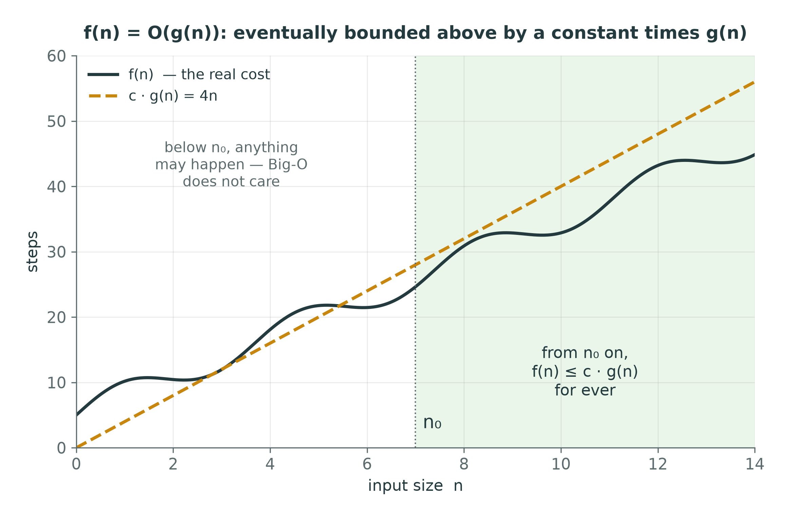
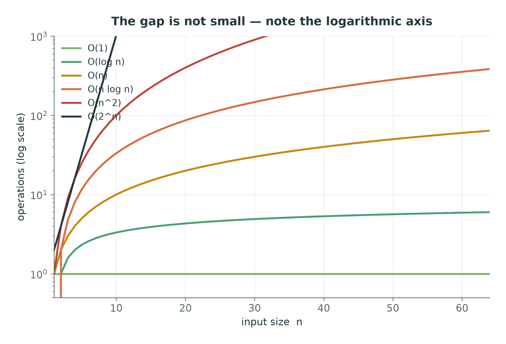
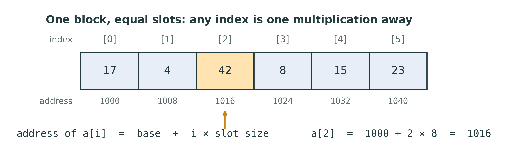
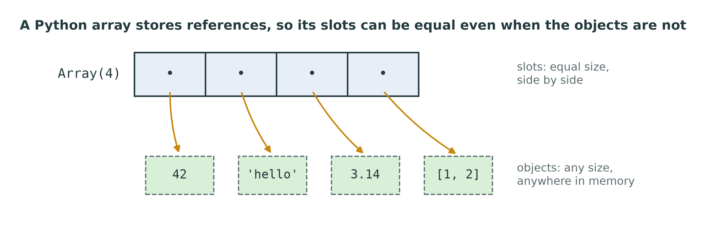
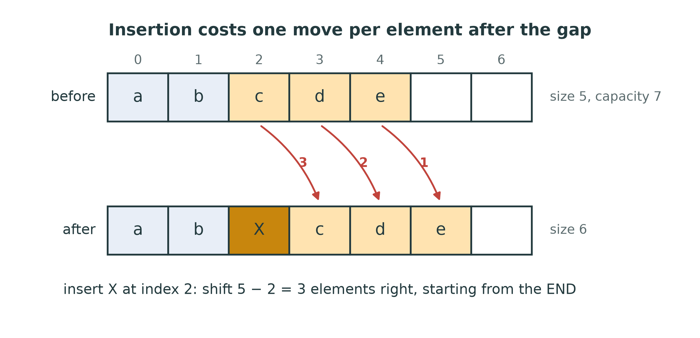
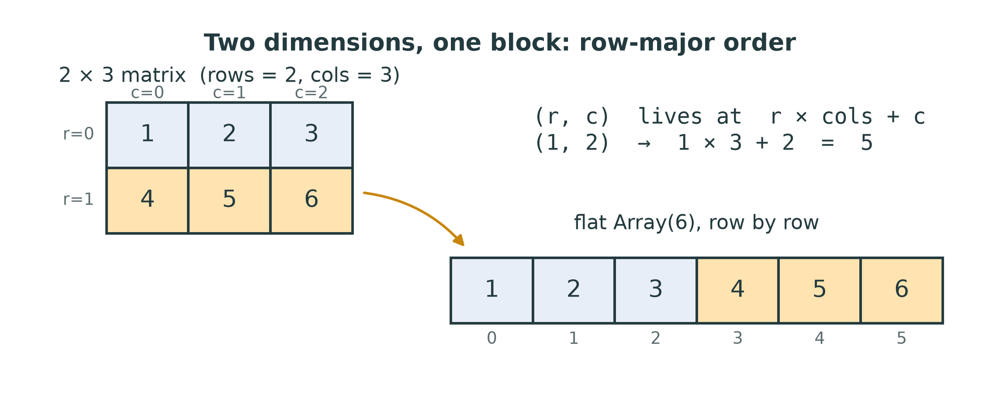

::: {.handout-only}

> **How to read this document.** This is the handout for Lecture 02. It holds
> everything on the slides, plus what I said out loud and the reasoning behind
> each claim. Two things are new this week and both matter for the rest of the
> term: the **language of cost** (Big-O and its relatives), and the **Array**,
> the one storage primitive every structure in this course will be built on.
>
> Slides: `DSA27-L02-slides.pdf` · Code: `dsa/array.py`, `dsa/array_ops.py` ·
> Tests: `tests/test_array.py`, `tests/test_array_ops.py`

:::

# Where We Are

## Last week, in one line

An **ADT** is a contract. A **data structure** keeps the contract. Choosing
between structures **is the engineering** — and you cannot choose without
knowing what each one **costs**.

Today: **how to state a cost**, and **the first structure whose costs we state**.

::: {.handout-only}

Lecture 01 ended with a promise: complexity comes before the structures,
because every choice of structure is a choice about cost. This lecture keeps
that promise twice over. The first half gives you the vocabulary — Big-O, Big-Ω,
Big-Θ, best, worst and average case, time and space. The second half applies it
to the simplest structure there is, the **array**, and introduces the rule that
governs every structure you write from now on.

:::

## Today

1. What we count, and why we throw most of it away
2. Big-O, Big-Ω, Big-Θ — the definitions, and one proof
3. Best, worst and average case; time and space
4. Rules for reading the cost off code
5. **The array**: what it is in memory, and what it costs
6. Arrays in Python — and **the course `Array`**
7. **The rule** from today on: no `list`, `dict` or `set` inside a structure

# What Do We Count?

## Two ways to answer "how fast?"

| **Measure** | **Count** |
|---|---|
| time it with a clock | count the basic steps |
| true for this machine, this input, today | true for every machine |
| gives you the constants | gives you the **shape** |
| `viz.complexity.measure` | pen and paper |

You need both. This lecture is mostly about counting — and ends by measuring.

::: {.handout-only}

A stopwatch answers "how long did it take?", which depends on the processor,
the Python version, what else was running, and the input you happened to pick.
A count answers "how does the work **grow** as the input grows?", which depends
only on the algorithm.

The count is what lets you predict. If an algorithm does n² steps and takes one
second at n = 10,000, it will take about a hundred seconds at n = 100,000 — on
any machine. The stopwatch cannot tell you that; the count can.

:::

## The model: basic steps

A **basic step** takes a constant amount of time, whatever the input size:

- arithmetic and comparison on small numbers: `a + b`, `x < y`
- assigning a variable: `x = y`
- reading or writing **one** array slot: `a[i]`, `a[i] = v`
- calling a function, returning from one (not what the function then does)

The cost of an algorithm is **the number of basic steps**, as a function of the
input size **n**.

::: {.handout-only}

This is the *RAM model* (random-access machine): memory is a long row of slots,
and reaching any slot costs the same. It is a simplification — real machines
have caches, and Lecture 01 warned that Python integers are not fixed-size —
but it is the right simplification, because it keeps what matters for large n
and throws away what does not.

Note the third bullet. **Reading one array slot is a basic step.** That is not an
assumption we get for free; it is a property of how arrays are laid out in
memory, and the second half of this lecture explains why it is true.

What is `n`? Whatever measures the size of the input: the number of elements in
an array, the number of characters in a string, the number of nodes in a graph.
Sometimes there are two: an n × m matrix, or a graph with V nodes and E edges.

:::

## Counting a loop

```python
def total(arr):
    result = 0                  # 1 step
    for i in range(len(arr)):   # the body runs n times
        result += arr[i]        #   2 steps: read, add-and-assign
    return result               # 1 step
```

$$T(n) = 2n + 2$$

::: {.handout-only}

Count it honestly and you get something like 2n + 2. Count it more pedantically
— the loop itself compares and increments a counter — and you get 4n + 3, or
5n + 2. Nobody agrees on the exact constants, and **it does not matter**, for a
reason the next slide makes precise: every one of those formulas is "a constant
times n, plus a constant", and they all grow the same way.

:::

## Counting a nested loop

```python
def count_pairs(arr):
    n, pairs = len(arr), 0
    for i in range(n):
        for j in range(i + 1, n):      # runs n-1, n-2, ..., 1, 0 times
            if arr[i] == arr[j]:
                pairs += 1
    return pairs
```

$$ (n-1) + (n-2) + \dots + 1 + 0 = \frac{n(n-1)}{2} = \tfrac12 n^2 - \tfrac12 n $$

::: {.handout-only}

This is exercise 7 from Lab 02, `count_pairs`, and now you can see where the
formula comes from. The inner loop runs n − 1 times for i = 0, n − 2 for
i = 1, and so on down to 0. Adding 1 + 2 + … + (n − 1) is the sum Gauss is
said to have done as a schoolboy: pair the first with the last, and you have
(n − 1)/2 pairs each summing to n.

The leading term is ½n². Double n and the work goes up about four times.

:::

## Throw away what does not matter

| n | $\tfrac12 n^2$ | $\tfrac12 n$ | share of the total from $\tfrac12 n^2$ |
|---|---|---|---|
| 10 | 50 | 5 | 91% |
| 1,000 | 500,000 | 500 | 99.9% |
| 1,000,000 | $5 \times 10^{11}$ | 500,000 | 99.9999% |

For large n, **the fastest-growing term is everything**. And the constant in
front of it (½) depends on the machine and on how you count. So we drop both:

$$\tfrac12 n^2 - \tfrac12 n \;\;\longrightarrow\;\; n^2$$

::: {.handout-only}

Two things are being thrown away, for two different reasons.

**Lower-order terms** go because they stop mattering. By n = 1,000 the ½n term
is a rounding error.

**Constant factors** go because they are not a property of the algorithm. The
same algorithm has a different constant in C and in Python, on a laptop and on a
server, counted by me and counted by you. What stays the same everywhere is the
*shape*: n², n, log n.

This is the deal Big-O offers. You give up the constants, and in return you get
a statement that is true on every machine and that tells you what happens when
n grows. It is a very good deal for large n and a misleading one for small n —
which is why we still measure.

:::

# Big-O, Big-Ω, Big-Θ

## Big-O: an upper bound

$$f(n) = O(g(n))$$

means: there are constants $c > 0$ and $n_0$ such that

$$f(n) \le c \cdot g(n) \quad \text{for every } n \ge n_0.$$

"From some point on, f never grows faster than a constant times g."

{width=78%}

::: {.handout-only}

Read the definition slowly, because every part of it is doing a job.

- **"There are constants c and n₀"** — you get to choose them. Proving
  f(n) = O(g(n)) means finding *one* pair that works.
- **"c · g(n)"** — the constant factor is allowed. That is how the definition
  throws constants away: 1000n is O(n), because c = 1000 works.
- **"for every n ≥ n₀"** — only large n counts. Below n₀, f may be as badly
  behaved as it likes. That is how lower-order terms disappear.
- **"≤"** — it is an **upper bound**. It says f grows *no faster* than g. It
  does not say f grows *as fast as* g.

That last point surprises people: n = O(n²) is **true**. It is just not very
informative, like saying "the lecture room holds fewer than a million people".
When we say "linear search is O(n)" we mean, informally, the *tightest* upper
bound we can prove — but the notation itself only promises "no worse than".

In Arabic you will see *رتبة التعقيد* (order of complexity) or simply *O الكبيرة*.

:::

## A proof, once

**Claim.** $3n + 5 = O(n)$.

**Proof.** Choose $c = 4$ and $n_0 = 5$. For every $n \ge 5$:

$$3n + 5 \;\le\; 3n + n \;=\; 4n.$$

So $3n + 5 \le 4 \cdot n$ for all $n \ge 5$. $\blacksquare$

::: {.handout-only}

The only step that needs thought is "5 ≤ n", which is true exactly because we
chose n₀ = 5. Other choices work too: c = 8 and n₀ = 1 (3n + 5 ≤ 3n + 5n = 8n for
n ≥ 1). The definition asks for *some* c and n₀, not the best ones.

The same idea shows that **any polynomial is Big-O of its highest power**:
aₖnᵏ + … + a₁n + a₀ = O(nᵏ). Replace every lower power by nᵏ (for n ≥ 1 each is
smaller), add up the coefficients, and that sum is your c.

And to show something is **not** O(g), show that no c can work: n² is not O(n),
because n² ≤ c·n would need n ≤ c for *every* large n, and no constant is
bigger than every n.

You will be asked to do one proof like this in the exam. You will be asked, far
more often, to *read off* the Big-O of a piece of code — which the rules later
in this lecture make mechanical.

:::

## Big-Ω and Big-Θ

| Notation | Means | Like |
|---|---|---|
| $f = O(g)$ | $f \le c \cdot g$ eventually | $\le$ — an **upper** bound |
| $f = \Omega(g)$ | $f \ge c \cdot g$ eventually | $\ge$ — a **lower** bound |
| $f = \Theta(g)$ | both: $c_1 g \le f \le c_2 g$ | $=$ — a **tight** bound |

$\tfrac12 n^2 - \tfrac12 n$ is $O(n^2)$, $\Omega(n^2)$ and therefore $\Theta(n^2)$.
It is also $O(n^3)$ — true, and useless.

::: {.handout-only}

**Ω (Omega)** is the mirror image of O: there are c > 0 and n₀ such that
f(n) ≥ c · g(n) for all n ≥ n₀. "f grows *at least* as fast as g."

**Θ (Theta)** is both at once. f = Θ(g) means f is sandwiched between two
constant multiples of g: it grows *exactly* like g, up to constants. That is
usually what people mean when they say "Big-O" in conversation.

In this course, and in most interviews, "the complexity is O(n)" is understood as
"Θ(n), and that is tight". In a proof or an exam answer, use the symbol you can
actually prove.

One more use of Ω that matters later: **a lower bound on a problem**, not an
algorithm. Any sorting algorithm that works only by comparing elements needs
Ω(n log n) comparisons in the worst case. No cleverness gets under it. In Week 9,
counting sort gets under it by *not comparing* — which is exactly the loophole
the bound leaves open.

:::

## The classes you will meet

| Big-O | Name | Example in this course | n = 1,000,000 |
|---|---|---|---|
| $O(1)$ | constant | `a[i]`; push onto a stack | 1 |
| $O(\log n)$ | logarithmic | binary search (Week 8) | 20 |
| $O(n)$ | linear | linear search; insert into an array | $10^6$ |
| $O(n \log n)$ | linearithmic | merge sort, heap sort (Week 10) | $2 \times 10^7$ |
| $O(n^2)$ | quadratic | bubble, selection, insertion sort | $10^{12}$ |
| $O(2^n)$ | exponential | all subsets (Week 3) | — |

::: {.handout-only}

{width=70%}

Learn this table. The right-hand column is the one to feel: at a billion simple
steps a second, 10⁶ steps is a millisecond, 2 × 10⁷ is a fiftieth of a second,
and 10¹² is **more than a quarter of an hour**. For 2ⁿ at n = 1,000,000 there is
no useful number — the universe is younger.

Where does log n come from? From **halving**. Lab 01's Checkpoint 4 halved 100
down to 1 in six steps; halving n down to 1 takes about log₂ n steps. Any
algorithm that throws away half of what is left at each step is O(log n).

:::

# Best, Worst, Average

## One algorithm, many costs

```python
def find(arr, target):
    for i in range(len(arr)):
        if arr[i] == target:
            return i
    return -1
```

| Case | When | Comparisons |
|---|---|---|
| **Best** | target is `arr[0]` | 1 — $O(1)$ |
| **Worst** | target is last, or absent | n — $O(n)$ |
| **Average** | present, every position equally likely | $\frac{n+1}{2}$ — $O(n)$ |

::: {.handout-only}

The cost of an algorithm is not one function of n; it depends on *which* input
of size n you give it. So we name three:

**Worst case** — the maximum over all inputs of size n. This is the default: when
someone says "linear search is O(n)" they mean the worst case. It is a
**guarantee**: no input can do worse.

**Best case** — the minimum. Rarely useful on its own. "My sort is O(n) in the
best case" usually means "on input that was already sorted", which is not a
reason to choose it.

**Average case** — the expected cost over some *distribution* of inputs. It needs
an assumption, and you must state it. For linear search, if the target is
present and equally likely to be in any of the n positions, the expected number
of comparisons is (1 + 2 + … + n)/n = (n + 1)/2. Still O(n): on average you
search half the array, and half is a constant.

Do not confuse these with O, Ω and Θ. "Worst case" says *which input*; "Big-O"
says *what kind of bound*. "The worst case of linear search is Θ(n)" is a
perfectly sensible sentence that uses both.

:::

## Measured: same n, different cost

{width=82%}

::: {.handout-only}

This is the cost of inserting one element into an array of 20,000, depending on
*where*. At index 0 every element must shift; at the end, none do. Same
operation, same n, a factor of thousands between best and worst. The straight
line is the cost being exactly proportional to the number of elements after the
insertion point, n − i. Averaged over every position that is n/2 — O(n).

You will produce the points on that line yourself, with your own `insert_at` from
`dsa/array_ops.py`.

:::

## Time and space

**Space complexity**: how the *extra* memory an algorithm needs grows with n.

| Function | Extra space | Why |
|---|---|---|
| `find(arr, x)` | $O(1)$ | two variables, whatever n is |
| `reverse_in_place(arr)` | $O(1)$ | swaps within the array |
| `resized(arr, 2n)` | $O(n)$ | a whole new array |
| `merge_sorted(a, b)` | $O(n + m)$ | the output array |
| recursive `total(values)` | $O(n)$ | one stack frame per element |

::: {.handout-only}

We usually count **auxiliary** space — memory beyond the input itself. Reversing
an array in place needs two indices and one temporary: O(1). Copying it needs n
new slots: O(n).

The last row is the one people forget. **Recursion uses space.** Every call that
has not yet returned holds a frame on the call stack (Lab 03, Part 10). A
recursive function n calls deep uses O(n) stack space even if it creates no
data at all — and Python stops it at about 1,000 frames.

Time and space often trade against each other. Merge sort (Week 10) buys its
O(n log n) time with O(n) extra space; heap sort gets the same time in O(1)
extra space and pays in other ways. Knowing which you are paying for is
know-why.

:::

# Reading the Cost Off the Code

## Five rules

1. **Sequence — add.** $O(f) \text{ then } O(g)$ is $O(f + g)$ = the bigger one.
2. **Loop — multiply.** A loop of n iterations with an $O(g)$ body is $O(n \cdot g)$.
3. **Nested loops — multiply again.** Two full nested loops over n: $O(n^2)$.
4. **Halving — logarithm.** A loop that halves what is left is $O(\log n)$.
5. **Function calls cost what the function costs** — including built-ins.

::: {.handout-only}

Rule 1: an O(n) loop followed by an O(n²) loop is O(n + n²) = O(n²). The bigger
term swallows the smaller.

Rule 2 needs care about *what the body costs*. A body of three basic steps is
O(1), so n iterations cost O(n). But a body that itself does O(n) work — see
rule 5 — makes the loop O(n²).

Rule 3 is rule 2 applied twice. The triangular loop (`j` from `i + 1`) is still
O(n²): it does half the work of the square loop, and half is a constant.

Rule 4 is where log n comes from:

```python
steps = 0
while n > 1:
    n //= 2
    steps += 1        # runs about log2(n) times
```

Rule 5 is the one that catches Python programmers, and it is why the second
half of this lecture exists.

:::

## Rule 5: the hidden loop

```python
def has_duplicate(values):
    for i in range(len(values)):
        if values[i] in values[i + 1:]:     # <- how much does this line cost?
            return True
    return False
```

One line, **two hidden O(n) loops**: the slice **copies** up to n elements, and
`in` **searches** them one by one. Inside an n-iteration loop: $O(n^2)$.

A call is only O(1) if you **know** it is O(1).

::: {.handout-only}

This is the most important slide for Python programmers, and the reason this
course is built the way it is.

`values[i + 1:]` looks like one step. It builds a new list and copies every
element after i into it — O(n). `x in some_list` looks like one step. It walks
the list comparing — O(n). `list.insert(0, x)` looks like one step. It shifts
every element — O(n). `list.pop(0)`, `list.remove(x)`, `list.index(x)`,
`sorted(xs)`: all look like one step, none is.

Python's built-ins are superbly engineered, and their costs are documented. But
they are *hidden* inside one short line, and a student who has never had to write
them does not see them. You cannot count the cost of code you cannot see.

So, from today, you are going to see it.

:::

# The Array

## What an array is

A **fixed number** of **equal-sized slots**, stored **side by side** in memory.

{width=92%}

$$\text{address of } a[i] = \text{base} + i \times \text{slot size}$$

One multiplication and one addition — **whatever i is, whatever n is.** That is
why `a[i]` is $O(1)$.

::: {.handout-only}

Everything about the array follows from that picture.

**O(1) indexing** comes from two properties together: the slots are
**contiguous** (no gaps, one block), and they are **equal-sized**. Then the
address of slot i is arithmetic, not a search. Take away either property and
indexing stops being O(1) — a linked list (Week 5) keeps its elements anywhere in
memory, so reaching element i means following i links.

**Fixed size** is the price. The block was reserved at a particular size, and the
memory right after it may already belong to something else. The array cannot
grow in place. To get a bigger one you must reserve a new block and copy —
O(n). That is the whole of Week 4.

**Why indices start at 0.** Because i is an *offset* from the base: element 0 is
zero slots from the start. Languages that start at 1 must subtract 1 somewhere.

*Array* in Arabic is المصفوفة. You will also hear *contiguous memory* as ذاكرة
متجاورة.

:::

## In C, the array is the machine

```c
int a[6] = {17, 4, 42, 8, 15, 23};   // 6 × 4 bytes, reserved once
a[2] = 99;                           // base + 2 × 4: one instruction
a[6] = 0;                            // no check — writes over whatever is next
```

- The size is part of the type, fixed at compile time
- Every slot holds an `int`, so every slot is 4 bytes
- **No bounds check**: an out-of-range index is not an error, it is a bug

::: {.handout-only}

C is the language that most directly exposes what an array is — which is why it
is worth two minutes, even though we write Python. (Kernighan and Ritchie, the
book Lecture 01 recommended, spends a chapter on it.)

The last line is famous. C does not check the index. `a[6]` computes base + 6 × 4
and writes there, over whatever variable happens to live next. This is the root
of a whole family of security holes, *buffer overflows*. Every array in this
course **does** check, and raises `IndexError` — the extra comparison is O(1)
and worth it.

:::

## Arrays in Python: four candidates

| | Grows? | Holds | Hides the cost? |
|---|---|---|---|
| `list` | yes — a dynamic array | references to any objects | **yes**: `append`, `insert`, `pop(0)`, `in`, slicing |
| `array.array` | yes | numbers only, one type, packed | yes: same methods as `list` |
| `numpy.ndarray` | no | numbers, one type, packed | yes: whole-array operations in C |
| `ctypes` array | **no** | C values, or references | **no** — index, assign, nothing else |

::: {.handout-only}

Python does not have a plain, C-style array as a built-in type. What it has:

**`list`** is itself a **dynamic array** — the structure you will build in
Week 4. Under the hood it is exactly a block of references plus a size and a
capacity. Every convenient method on it is an algorithm with a cost, already
written for you.

**`array.array`** (the standard-library `array` module) stores numbers packed
tightly — `array('i', [1, 2, 3])` uses 4 bytes per element instead of a reference
to an int object. It is compact, and useful for large numeric data. But it can
`append`, `insert` and `pop` just like a list: it is a dynamic array too.

**NumPy** arrays are fixed-size and packed, and the backbone of data science and
of most of what the AI program does with data. But their power is whole-array
operations — `a + b` adds a million numbers in one line, in C. Wonderful for
computation; useless for learning what one insertion costs.

**`ctypes`** arrays are real C arrays, reached from Python. They have a fixed
size, and you can index them and assign to them — nothing else. That is exactly
the primitive we want.

:::

## Python stores references

{width=92%}

A Python array slot does not hold `42`; it holds **a reference to** the object
`42`. Slots are equal-sized — one reference each — even when the objects are
not. That is how one array holds an int, a string and a list, and still indexes
in O(1).

::: {.handout-only}

This is the ladder from Lecture 01 again: a name is bound to an object, and a
collection is a collection of references. The slot size is the size of one
reference (8 bytes on a 64-bit machine), so the address arithmetic works.

The cost is a second hop: `a[i]` finds the reference in O(1), then follows it to
the object, which lives wherever Python put it. Packed arrays (`array.array`,
NumPy) avoid that hop by storing the numbers themselves, which is why they are
faster for numerical work — and why they can hold only one type.

:::

# The Course Array

## `dsa/array.py` — given to you

```python
from dsa.array import Array

a = Array(5)                  # 5 slots, all None. Fixed for ever.
a[0] = 42                     # O(1)
a[0]                          # O(1) -> 42
len(a)                        # 5: the capacity, not "how many are used"
list(a)                       # iterate: [42, None, None, None, None]

Array.from_values([3, 1, 2])  # a full array, for tests and the REPL
Array(3, fill=0)              # every slot starts as 0
```

A real C array of references (`ctypes`), wrapped so that it **checks its
bounds**.

::: {.handout-only}

`dsa/array.py` is infrastructure, like `viz/`: already written, read it, do not
change it. It is thirty lines, and every one is worth reading.

Three details:

- **`len(a)` is the capacity.** An `Array(5)` always has length 5, whether you
  have put anything in it or not. Tracking how many slots are *in use* — the
  **size** — is your job, in a separate variable. That split, capacity against
  size, is the heart of the dynamic array.
- **Every slot starts as `None`** (or the `fill` you give). A raw ctypes slot
  starts out NULL — reading it raises a confusing `ValueError` — so the class
  fills them.
- **`from_values`** copies an iterable into a new, exactly-full Array. It is for
  building test data and experimenting at the REPL. Do not use it inside a
  structure to dodge the rules — converting to a tuple and back is exactly the
  kind of hidden O(n) this lecture is about.

:::

## What it will **not** do

```python
>>> a = Array(3)
>>> a[3]
IndexError: Array index 3 out of range for length 3 ...
>>> a[-1]
IndexError: ...                      # no negative indices, as in C
>>> a[0:2]
TypeError: Array does not support slicing; copy with a loop
>>> a.append(1)
AttributeError: 'Array' object has no attribute 'append'
```

No growing. No shrinking. No inserting. No slicing. No searching methods.
**Every one of those is an algorithm — and you are going to write them.**

::: {.handout-only}

Each refusal is deliberate.

**No negative indices**, because an array index is an offset from the base, and
there is nothing before the base. When you build `DynamicArray` in Week 4 you
will *implement* negative indexing (`arr[-1]` is the last element), and you will
see that it is a translation, `i + size`, on top of an array that has none.

**No slicing**, because a slice is a copy — O(k) — dressed as one step. If you
want a copy, write the loop and see the cost.

**No `append`**, because an array cannot grow. That is the definition.

:::

## The operations, and what they cost

| Operation | How | Cost |
|---|---|---|
| read / write slot `i` | address arithmetic | $O(1)$ |
| find a value | check slots one by one | $O(n)$ |
| insert at `i` | shift `i .. size-1` **right**, then write | $O(n)$ |
| remove at `i` | shift `i+1 .. size-1` **left** | $O(n)$ |
| insert / remove at the **end** | nothing to shift | $O(1)$ |
| grow | new array, copy everything | $O(n)$ |

::: {.handout-only}

This table is the array's **contract** — its ADT, with costs. Every row is a
function in `dsa/array_ops.py` or a consequence of one, and every structure you
build this term inherits these costs from the array underneath it.

Look at the two rows about the end. Inserting and removing at the *end* is O(1),
because nothing has to move. That single fact decides:

- that a **stack** should keep its top at the *end* of an array (Week 6);
- that a **queue** cannot simply remove from the front of an array — which is why
  Week 7 needs a ring buffer;
- that a **heap** adds at the end and repairs upward (Week 12).

:::

## Insertion, slot by slot

{width=88%}

```python
def insert_at(arr, size, index, value):
    for i in range(size, index, -1):   # from the END, backwards
        arr[i] = arr[i - 1]
    arr[index] = value
    return size + 1
```

::: {.handout-only}

This is the core of `insert_at` from this week's exercise, without the error
checks (the full contract is in the docstring: `OverflowError` when full,
`IndexError` for a bad index).

**Why backwards?** Shift forwards — copy `arr[2]` into `arr[3]` first — and you
have overwritten `d` before moving it; every slot ends up holding `c`. Moving
right, you must start at the right. Moving left (removal), you start at the left.
Trace both on paper once; it is the most common bug in this week's exercises.

The loop runs size − index times. Index 0: size moves, the worst case. Index
size: zero moves, which is just writing at the end.

:::

## Measured, not asserted

{width=80%}

::: {.handout-only}

Three operations on the course `Array`, timed with `viz.complexity.measure` as n
doubles from 1,024 to 32,768. Both axes are logarithmic, so a straight line
climbing one grid step per doubling is O(n), and a flat line is O(1).

- **Indexing** stays at about a quarter of a microsecond whatever n is. (One
  access is too fast to time on its own, so the figure times 10,000 and divides —
  an honest measurement has to know its own limits.)
- **Linear search for a missing value** doubles when n doubles: O(n).
- **Inserting at index 0** also doubles: O(n) — and it sits *above* the search,
  because each step does a read *and* a write where search does a read and a
  comparison. Same Big-O, different constant: exactly the thing Big-O throws
  away, and exactly the thing a measurement shows you.

At n = 32,768, one index is roughly 25,000 times cheaper than one front
insertion. That is the difference between O(1) and O(n), in microseconds.

:::

## Two dimensions, one block

{width=88%}

A matrix is stored as **one** array, row after row:
element $(r, c)$ lives at index $r \times \text{cols} + c$.

::: {.handout-only}

Memory is one-dimensional, so a 2-D array has to be flattened. **Row-major**
order — row 0, then row 1, … — is what C and NumPy use by default; Fortran and
MATLAB use column-major. The formula is address arithmetic again, so (r, c) is
still O(1).

The alternative is an array of arrays: an `Array` of `rows` slots, each holding
an `Array` of `cols`. It works, costs an extra hop per access, and lets rows have
different lengths. `transpose_flat` in this week's exercises uses the flat
layout, so that you work the index arithmetic by hand.

:::

# The Rule, From Today

## No `list`, `dict` or `set` inside a structure

A data structure in `dsa/` keeps its data **only** in:

1. the course **`Array`** (`dsa/array.py`), or
2. **node objects** — `Node`, `TreeNode`, `Entry`, …, or
3. **another structure you have already built** in `dsa/`.

Never in a Python `list`, `dict`, `set` or `collections.deque`.

Lists remain the **interface**: functions may take a list and return a list, and
the tests use them freely.

::: {.handout-only}

This is the rule that governs the rest of the course. Here is exactly how the
repository applies it, so that you can see the structures stacking up week by
week:

| Week | Structure | Stores its data in |
|---|---|---|
| 4 | `DynamicArray` | an `Array`, replaced by a bigger one when full |
| 5 | `LinkedList` | `Node` objects |
| 6 | `Stack` | your `DynamicArray` — top at the end |
| 7 | `SlowQueue` / `CircularQueue` | your `DynamicArray` / an `Array` as a ring |
| 11 | `BinarySearchTree` | `TreeNode` objects |
| 12 | `MinHeap`, `PriorityQueue` | your `DynamicArray` / your `MinHeap` |
| 13 | `ChainingHashMap` / `OpenAddressingHashMap` | an `Array` of `Entry` chains / two `Array`s |
| 14 | `Graph` / `MatrixGraph` | your hash map and `DynamicArray`s |

Read down the right-hand column. By Week 14 your graph is built on your hash map,
which is built on your array; your breadth-first search runs on your queue, which
runs on your array. Nothing in the stack is borrowed. When something is slow, you
will know which line of *your* code made it slow.

**Why not lists?** Not because lists are bad — they are excellent, and you will
use them for the rest of your career. Because a list hides, behind one
convenient method, exactly the cost this course exists to teach. A stack built on
`list.append` teaches you nothing about why a stack is O(1). A stack built on an
array you had to grow yourself does.

**What is still allowed.** Python lists as *function inputs and return values*
— `bfs` returns a list of nodes, `sorting` functions take one — because that is
the convenient interface for tests and for you. Plain local variables. Tuples to
return two values. What is not allowed is a `list`, `dict` or `set` as the
*storage* of a structure, or as the working storage of an algorithm that has a
structure of yours available (use your `CircularQueue` for BFS, not a list).

The TAs will check this when they mark. A structure that passes every test by
hiding a `list` inside scores as not done.

:::

## The same idea, all term

```text
Array                         (given, O(1) index, fixed size)
 └── DynamicArray             (Week 4: grow by copying — amortised O(1) append)
      ├── Stack               (Week 6)
      ├── SlowQueue           (Week 7 — pop(0) is O(n), measure it)
      └── MinHeap             (Week 12)
           └── PriorityQueue
 ├── CircularQueue            (Week 7 — O(1) both ends, on a ring)
 └── hash maps                (Week 13)
      └── Graph               (Week 14, with DynamicArray)
```

::: {.handout-only}

Every arrow is "is built on". Linked lists and trees sit beside this tree, built
from nodes rather than arrays — and Week 5 exists to compare the two families
directly.

:::

# This Week

## Exercises: `dsa/array_ops.py`

| Function | Target |
|---|---|
| `find(arr, target, size=None)` | $O(n)$ worst, $O(1)$ best |
| `is_sorted(arr, size=None)` | $O(n)$, stop early |
| `insert_at(arr, size, index, value)` | $O(n)$ — shift right, from the end |
| `remove_at(arr, size, index)` | $O(n)$ — shift left |
| `reverse_in_place(arr)` | $O(n)$ time, $O(1)$ space |
| `rotate_left(arr, k)` | $O(n)$ time, $O(1)$ space — three reversals |
| `resized(arr, new_length)` | $O(n)$ — the dynamic array's one move |
| `merge_sorted(a, b)` | $O(n + m)$ — half of merge sort |
| `transpose_flat(arr, rows, cols)` | $O(rows \times cols)$ |

```powershell
pytest tests/test_array.py -v          # the Array itself — passes already
pytest tests/test_array_ops.py -v      # your exercises
```

::: {.handout-only}

Every function takes an `Array` and works with indices only: no slicing, no
converting to a list, no `list` scratch space. Where a function builds a new
array, it builds an `Array`.

Several of them take a `size`: the array is only partly filled, and the slots
from `size` on are free. That is how `insert_at` and `remove_at` can change "how
many elements there are" without the array changing length.

`rotate_left` is the one that needs an idea. Rotating [1 2 3 4 5] left by 2:
reverse the first 2 → [2 1 3 4 5]; reverse the rest → [2 1 5 4 3]; reverse the
whole → [3 4 5 1 2]. Three reversals, O(n) time, no second array. Convince
yourself on paper *why* it works before you write it.

:::

## Homework 2 — before Lecture 03

1. **Implement** `dsa/array_ops.py` until `pytest tests/test_array_ops.py` passes.
2. **Measure** your `insert_at` at index 0 and at the end, for
   n = 1,000 … 32,000, with `viz.complexity.measure`, and plot both with
   `plot_growth(..., reference=["1", "n"])`. One paragraph: do the curves match
   the table?
3. **Prove** $5n^2 + 3n + 7 = O(n^2)$: give $c$ and $n_0$ and show the inequality.
4. **Read off** the Big-O of the three snippets in the handout, and say which rule
   you used for each.
5. **Lab 02** exercises, if not finished in the lab.

::: {.handout-only}

For item 2, the Lecture 01 example shows the shape of the call. A starting
point:

```python
from dsa.array import Array
from dsa.array_ops import insert_at
from viz.complexity import measure, plot_growth

sizes = [1000, 2000, 4000, 8000, 16000, 32000]

def make(n):
    arr = Array(n + 1)
    for i in range(n):
        arr[i] = i
    return arr, n

front = measure(lambda a: insert_at(a[0], a[1], 0, -1), sizes, make)
end   = measure(lambda a: insert_at(a[0], a[1], a[1], -1), sizes, make)
plot_growth({"insert at 0": front, "insert at end": end}, reference=["1", "n"])
```

For item 4, the three snippets:

```python
# (a)
for i in range(n):
    for j in range(10):
        total += i * j

# (b)
i = n
while i > 0:
    for j in range(n):
        count += 1
    i //= 2

# (c)
for i in range(n):
    if find(arr, i) != -1:          # arr has n elements
        hits += 1
```

Hand in items 2–4 as one page (a PDF, or a notebook with the plot) through the
channel the TAs announce.

:::

# Summary

## Seven things to keep

1. Count **basic steps** as a function of n; keep the **shape**, drop the
   constants and the lower-order terms.
2. $f = O(g)$: **eventually** $f \le c \cdot g$. Ω is $\ge$; Θ is both.
3. **Worst case** is the guarantee. Say which case you mean.
4. **Sequence adds, loops multiply, halving is log n** — and a call costs what the
   function costs.
5. An array is **contiguous, equal-sized slots**: $O(1)$ index, **fixed size**,
   $O(n)$ insert and search.
6. The course **`Array`**: index, assign, length. Nothing else.
7. From today: structures store data in **`Array`, nodes, or your own
   structures** — never `list`, `dict` or `set`.

## Next

**Week 3 — Recursion.** Base case, recursive case, and the call stack — the
first place where *how* you solve a problem decides its complexity.

Lab 03 this week ends with a bridge into it.

::: {.handout-only}

---

## Sources and further reading

- **Python Software Foundation.** *TimeComplexity* — the documented costs of
  `list`, `collections.deque`, `set` and `dict` operations in CPython. The page
  to check before you believe any one-line Python operation is O(1).
- **Python Software Foundation.** *ctypes — A foreign function library for
  Python*, section "Arrays". The mechanism under `dsa/array.py`.
- **B. W. Kernighan and D. M. Ritchie.** *The C Programming Language*, 2nd ed.,
  Prentice Hall, 1988, chapter 5, "Pointers and Arrays" — the address arithmetic
  on the array slides, from the people who designed it.
- **T. H. Cormen, C. E. Leiserson, R. L. Rivest and C. Stein.** *Introduction to
  Algorithms*, 3rd ed., MIT Press, 2009, chapter 3, "Growth of Functions" — the
  formal definitions of O, Ω and Θ used here.
- **M. T. Goodrich, R. Tamassia and M. H. Goldwasser.** *Data Structures and
  Algorithms in Python*, Wiley, 2013, chapters 3 and 5 — algorithm analysis, and
  array-based sequences built on `ctypes`, which is the approach this course
  takes.

Every figure in this lecture is generated by `tools/figures_l02.py`; the two
timing figures are real measurements and will differ slightly on your machine.
Run the script and compare.

:::
