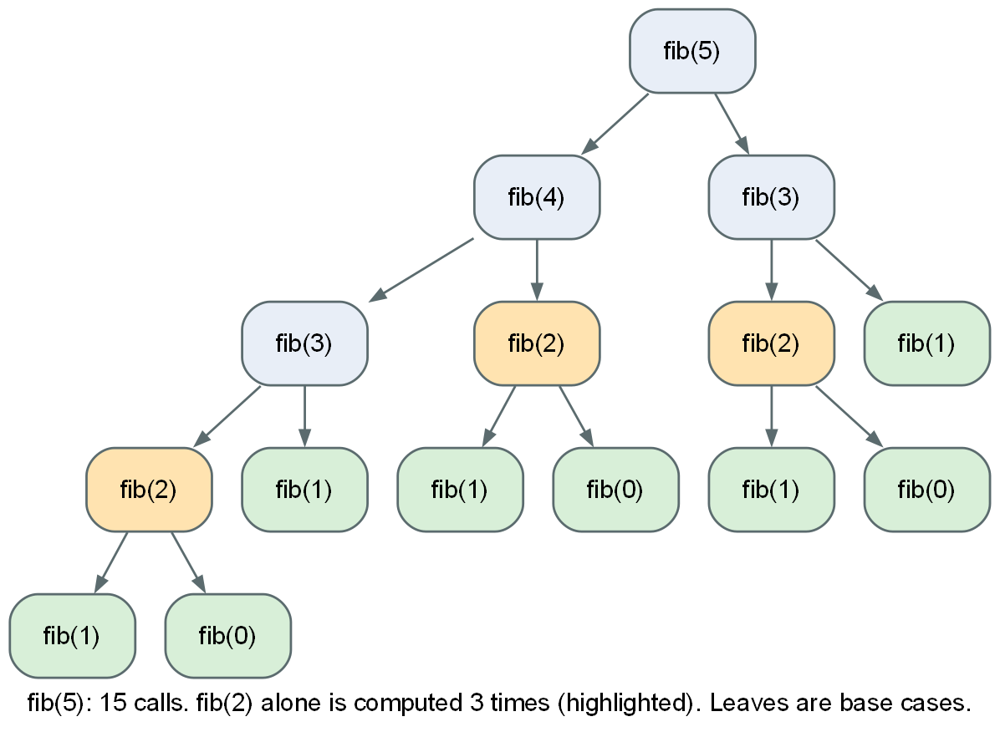
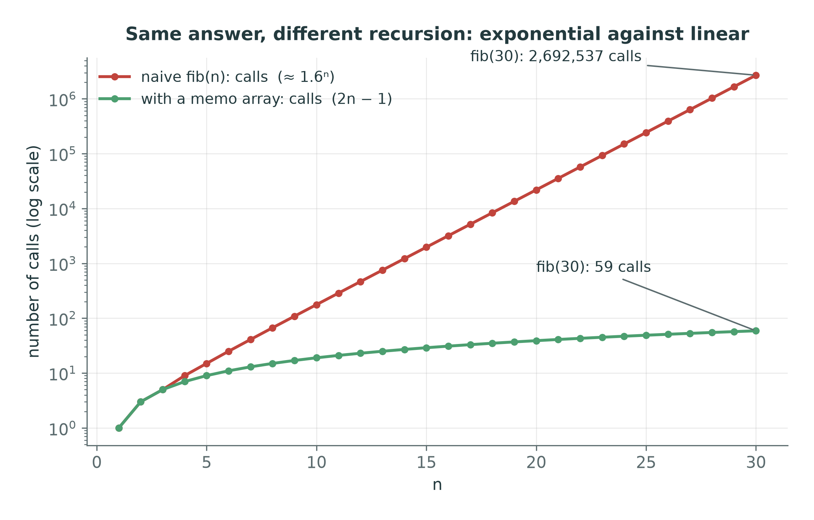
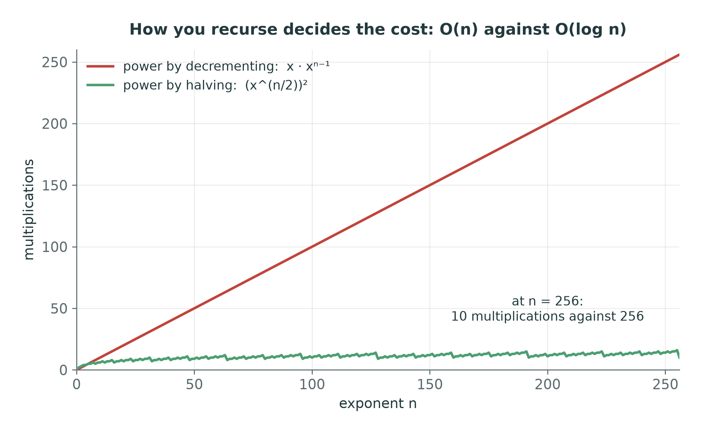
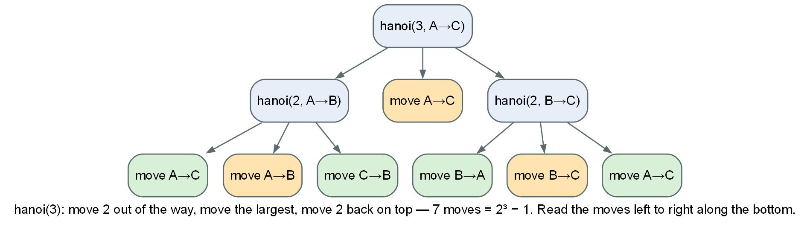
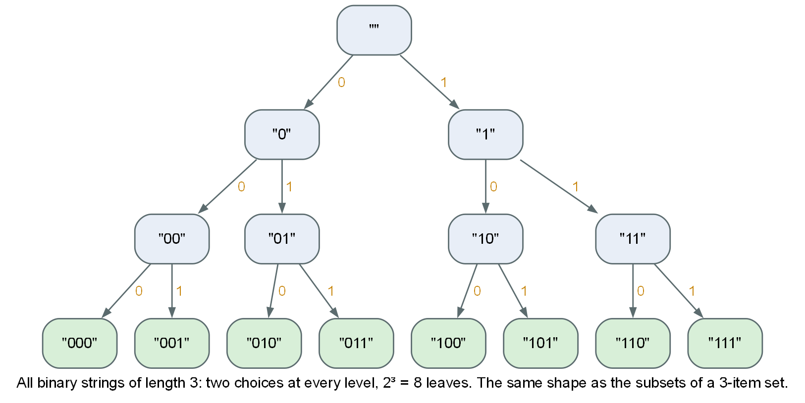

::: {.handout-only}

> **How to read this document.** This is the handout for Lecture 03. It holds
> everything on the slides, plus what I said out loud. Recursion is the first
> topic in this course where the *technique* is the lesson rather than a
> structure — and every later week leans on it: trees, merge sort and quicksort,
> depth-first search, and the parser in the final week.
>
> Slides: `DSA27-L03-slides.pdf` · Code: `dsa/recursion.py` ·
> Tests: `tests/test_recursion.py` · Lab: Lab 03, Part 10

:::

# Where We Are

## Last week, in one line

Cost is counted as a function of n, and the **array** is the first structure we
priced: $O(1)$ to index, $O(n)$ to insert or search.

Today: a way of **writing** algorithms — and a new way of **counting** what they
cost.

::: {.handout-only}

Lecture 02 gave you the vocabulary of cost and applied it to loops. Loops are
easy to count: multiply the iterations by the cost of the body. Today's
algorithms have no loops at all, or hardly any. They call themselves. Counting
them needs a new tool — the **recurrence** — and a new picture — the
**recursion tree**.

Recursion is declared first in the topic list of the 2013 and 2014 bylaws
("Topics include recursion…", SWE 2013 p. 38; Medical Informatics 2014 p. 35),
and none of the three programs teaches it before this course. So we start from
nothing.

:::

## Today

1. A function defined in terms of itself — the two rules
2. What really happens: **the call stack**
3. Recursion over numbers, over arrays, over nested data
4. The cost of recursion: **recurrences** and **recursion trees**
5. The same answer at very different costs: Fibonacci, and power
6. **Branching** recursion: Hanoi, and every choice
7. Recursion or a loop?

# The Idea

## A definition that uses itself

$$n! = \begin{cases} 1 & \text{if } n = 0 \\ n \times (n-1)! & \text{if } n > 0 \end{cases}$$

```python
def factorial(n):
    if n == 0:                        # base case: answer directly
        return 1
    return n * factorial(n - 1)       # recursive case: a SMALLER problem
```

A **recursive** function solves a problem by solving a **smaller instance of the
same problem**, and building its answer from that.

::: {.handout-only}

The mathematical definition and the Python are the same thing written twice.
That is the appeal of recursion: when a problem is naturally defined in terms of
a smaller version of itself, the code can say so directly.

*Recursion* in Arabic is الاستدعاء الذاتي — literally "self-calling".

(This `factorial` is the first function in `dsa/recursion.py`. The exercise also
asks it to reject negative n with a `ValueError` — which the version above does
not do. What *would* the version above do with `factorial(-1)`? Think about it
before the next slide.)

:::

## The two rules

Every recursive function needs:

1. **A base case** — an input small enough to answer **without** recursing.
2. **A recursive case that makes progress** — every call must move **closer to
   the base case**.

Break rule 1, or rule 2, and the calls never stop:

```python
>>> factorial(-1)          # -1, -2, -3, ... never reaches 0
RecursionError: maximum recursion depth exceeded
```

::: {.handout-only}

`factorial(-1)` calls `factorial(-2)`, which calls `factorial(-3)`, and so on
for ever — moving *away* from the base case, not towards it. Rule 2 is broken
for negative inputs. Python gives up after about a thousand calls with a
`RecursionError`.

"Closer" needs a measure: a number that gets smaller with every call and cannot
go below the base case. For `factorial` it is n itself. For a list it is the
length. For a tree it will be the height. When you write a recursive function,
**name the measure** — if you cannot, you probably have an infinite recursion.

:::

## Trust the recursion

To write the recursive case, **assume the recursive call already works** — for
the smaller input — and ask only:

> *Given the answer for the smaller problem, how do I build the answer for mine?*

For `factorial(n)`: "if I had `factorial(n - 1)`, I would multiply it by n."

Do **not** trace every call in your head. That is the computer's job.

::: {.handout-only}

This is the hardest habit and the most important one. Beginners try to follow
`factorial(5)` all the way down to `factorial(0)` and back, and get lost. You do
not need to. If the base case is right, and the recursive case is right
*assuming* the smaller call is right, then the whole function is right.

That argument has a name: **mathematical induction**. The base case is the
induction base; the recursive case is the inductive step. You met induction in
discrete mathematics (or you will); recursion is induction that runs. It is why
people call this the "recursive leap of faith" — except it is not faith, it is a
proof.

Trace by hand only to *debug*, or to answer an exam question that asks you to.
Which brings us to what actually happens.

:::

# The Call Stack

## Every call gets a frame

{width=100%}

Each call pushes a **frame** holding its own `n` and where to return. The base
case stops the growth; then each `return` pops a frame and hands its value down.

::: {.handout-only}

There is not "one `n`". Each call to `factorial` has **its own** local
variables in its own **frame** on the **call stack**. When `factorial(4)` calls
`factorial(3)`, the frame for `factorial(4)` is paused — it is waiting to do
`4 * (…)` — and a new frame is pushed on top.

Read the figure left to right:

- **Winding.** Five calls, five frames. Nothing has been multiplied yet; every
  frame is waiting.
- **The base case.** `factorial(0)` returns 1 without calling anything. The stack
  stops growing.
- **Unwinding.** Each return pops the top frame and gives its value to the frame
  below, which can now finish its multiplication: 1 × 1, then 2 × 1, 3 × 2,
  4 × 6. The last frame returns 24 to whoever called it.

This is exactly a **stack** — last in, first out — the ADT you build in Week 6.
The most recent call is the first to finish. The same machinery runs every
function call in every program you write; recursion only makes it visible.

**See it yourself.** Put `factorial` in a file, set a breakpoint on its first
line in VS Code, press F5 and step with F11. The *Call Stack* panel shows one
`factorial` frame per call, each with its own `n`. Lab 03, Part 10.4 walks you
through it.

:::

## Depth is space

The call stack is memory. A recursion that goes **d** calls deep holds **d**
frames at once:

| Function | Deepest point | Extra space |
|---|---|---|
| `factorial(n)` | n + 1 frames | $O(n)$ |
| `power(x, n)` by halving | about $\log_2 n$ frames | $O(\log n)$ |
| `hanoi(n)` | n frames | $O(n)$ — though it makes $2^n$ calls |

```python
>>> import sys
>>> sys.getrecursionlimit()
1000
```

::: {.handout-only}

Space is decided by the **deepest** point, not the total number of calls: frames
are popped as calls return, so they do not accumulate. `hanoi(20)` makes over a
million calls, but never more than 20 are on the stack at once.

**Python's limit.** CPython refuses to go deeper than about 1,000 frames, and
raises `RecursionError`. `sys.setrecursionlimit` can raise it, but the real
stack underneath is finite, and a big enough recursion then crashes the
interpreter outright. If a recursion needs to be 100,000 deep, the answer is not
a bigger limit; it is a loop, or a recursion that is only log n deep. That is
exactly what `tests/test_recursion.py::test_power_is_logarithmic` checks: an
O(n)-deep `power(2, 4096)` hits the limit; an O(log n)-deep one uses about a
dozen frames (13 or 14, depending on whether your base case is n = 0 or n = 1).

Many other languages eliminate the frame of a call made in *tail position*
(`return f(n - 1)` as the very last action) — *tail-call optimisation*. Python
deliberately does not, so in Python every recursive call costs a frame.

:::

# Recursion in Practice

## Over numbers: shrink the number

```python
def count_digits(n):
    """How many decimal digits in a non-negative int."""
    if n < 10:                       # one digit
        return 1
    return 1 + count_digits(n // 10) # drop the last digit
```

```python
def to_binary(n):
    """'101' for 5. n >= 0."""
    if n < 2:
        return str(n)
    return to_binary(n // 2) + str(n % 2)
```

The measure: **n itself**, divided by 10 or 2 each call — so these are
$O(\log n)$ deep.

::: {.handout-only}

Two patterns you will reuse: `n // 10` and `n % 10` take a decimal number apart
(the exercise `sum_digits` is a close relative of `count_digits`); `n // 2` and
`n % 2` take a binary number apart.

Notice where the work happens in `to_binary`: the recursive call builds the
*leading* digits, and the current call appends the *last* one. The order of the
digits comes out right because the concatenation happens on the way *back up* —
during unwinding.

`gcd` in the exercises is Euclid's algorithm: gcd(a, b) = gcd(b, a mod b), with
gcd(a, 0) = a. It is the oldest algorithm still in daily use, about 2,300 years
old, and it is naturally recursive. Its measure is b, which at least halves every
two steps — so it is O(log min(a, b)).

:::

## Over an array: shrink the range, not the array

```python
def array_max(arr, i=0):
    """Largest value in a non-empty Array, from index i on."""
    if i == len(arr) - 1:                  # one element left
        return arr[i]
    rest = array_max(arr, i + 1)           # the answer for the rest
    return arr[i] if arr[i] > rest else rest
```

The recursion moves an **index**; the array never changes. $O(n)$ time,
$O(n)$ stack.

::: {.handout-only}

This works on the course `Array` from Lecture 02 — which has no slicing — and
that is not a limitation, it is the right design. The tempting version on a
Python list is

```python
def list_max(values):
    if len(values) == 1:
        return values[0]
    rest = list_max(values[1:])            # a slice COPIES the rest: O(n)
    return values[0] if values[0] > rest else rest
```

and it is **O(n²)**, not O(n): each call copies everything after it, so the
copies add up to (n − 1) + (n − 2) + … + 1. It is Lecture 02's hidden-loop rule
again. Recursion over a sequence should pass **indices** (`i`, or `lo` and `hi`)
and leave the data where it is.

The exercises `reverse_string` and `is_palindrome` do allow slicing, because
there the recursion is the lesson; `test_power_is_logarithmic` is the one test
that punishes a careless design. Knowing that slicing costs O(n) is still part of
the answer when the exam asks for the complexity.

:::

## Over nested data: the data is recursive

```python
def depth(nested):
    """How deeply lists are nested. depth([1, [2, [3]]]) == 3."""
    if not isinstance(nested, list):
        return 0                           # a plain value: no list at all
    deepest = 0
    for item in nested:
        d = depth(item)
        if d > deepest:
            deepest = d
    return 1 + deepest
```

A list of lists of lists… is defined in terms of itself — so the function is too.

::: {.handout-only}

Some data is recursive by nature: a list whose items may be lists; a folder whose
entries may be folders; an expression whose operands may be expressions (Week
15); a tree whose children are trees (Week 11). For such data, recursion is not a
trick, it is the obvious shape — one call per nested piece.

Note that this function has a **loop and** recursion: it loops over the items at
one level and recurses into each. `flatten` in the exercises has exactly this
shape. The exercise's test `test_flatten_treats_a_string_as_a_value` exists
because a string is iterable too: "ab" contains "a", which contains "a", which
contains "a"… Check the type you mean to descend into — `list` — not "anything
iterable".

:::

# What Recursion Costs

## Recurrences

Write the cost **T(n)** in terms of the cost of the smaller calls:

| Code shape | Recurrence | Solution |
|---|---|---|
| one call on n − 1, O(1) work | $T(n) = T(n-1) + c$ | $O(n)$ |
| one call on n / 2, O(1) work | $T(n) = T(n/2) + c$ | $O(\log n)$ |
| one call on n − 1, **O(n) work** (a slice) | $T(n) = T(n-1) + cn$ | $O(n^2)$ |
| **two** calls on n − 1 | $T(n) = 2T(n-1) + c$ | $O(2^n)$ |
| two calls on n − 1 and n − 2 | $T(n) = T(n-1) + T(n-2) + c$ | $O(1.62^n)$ |
| two calls on n / 2, O(n) work | $T(n) = 2T(n/2) + cn$ | $O(n \log n)$ |

::: {.handout-only}

A **recurrence** is an equation that defines a function in terms of itself on
smaller inputs — recursion, applied to the cost. You read it straight off the
code: *how many* recursive calls, *on what size*, and *how much work* outside
them.

You should be able to write the recurrence for any function in
`dsa/recursion.py`, and know the six solutions in this table. The last row is
merge sort, in Week 10 — it is there so you recognise it when it arrives.

:::

## Solving one by unrolling

$$\begin{aligned}
T(n) &= T(n-1) + c \\
     &= T(n-2) + 2c \\
     &= T(n-3) + 3c \\
     &\;\;\vdots \\
     &= T(0) + nc \;=\; O(n)
\end{aligned}$$

$$\begin{aligned}
T(n) &= T(n/2) + c = T(n/4) + 2c = T(n/8) + 3c = \dots \\
     &= T(1) + c \log_2 n \;=\; O(\log n)
\end{aligned}$$

::: {.handout-only}

**Unrolling** (or *substitution*): replace T of the smaller input by its own
definition, again and again, until you see the pattern, then jump to the base
case.

In the first, each step peels off one c, and it takes n steps to reach T(0).

In the second, the input halves each step. Halving n down to 1 takes log₂ n
steps — the same count as Lab 01's Checkpoint 4 and Lecture 02's rule 4 — and
each step adds one c.

The O(n²) row unrolls the same way: T(n) = cn + c(n − 1) + … + c·1 = c·n(n+1)/2.

:::

## Solving one with a tree

{width=60%}

`fib(n) = fib(n-1) + fib(n-2)` — **two** calls, on inputs almost as big.

::: {.handout-only}

```python
def fib(n):
    if n < 2:
        return n
    return fib(n - 1) + fib(n - 2)
```

When a function makes **more than one** recursive call, draw the **recursion
tree**: one node per call, children for the calls it makes. The total cost is the
sum of the work in every node; with O(1) work per node, it is the **number of
nodes**.

`fib(5)` makes 15 calls. And look at the highlighted nodes: `fib(2)` is computed
**three separate times**, `fib(3)` twice. The tree roughly doubles in size each
time n grows by one — more precisely, it grows by a factor of about 1.618, the
golden ratio — because each node spawns two subtrees that are *almost* as big as
itself. `fib(n)` makes 2·fib(n+1) − 1 calls: exponential.

The code is correct. It is also **useless** for n above about 35. That is the
lesson: a correct recursion can be exponentially wasteful, and the recursion tree
is how you see it.

:::

## Same answer, one array: memoisation

```python
from dsa.array import Array

def fib_memo(n, memo=None):
    if memo is None:
        memo = Array(n + 1)               # memo[k] will hold fib(k)
    if n < 2:
        return n
    if memo[n] is None:                   # not computed yet
        memo[n] = fib_memo(n - 1, memo) + fib_memo(n - 2, memo)
    return memo[n]
```

Compute each `fib(k)` **once**, store it, look it up after that.

## Exponential against linear

{width=80%}

::: {.handout-only}

The waste in naive `fib` is recomputing the same subproblem. The cure is to
**remember** each answer the first time you compute it — *memoisation* — and
look it up after that. Each `fib(k)` is now computed once; the tree collapses to
a path, and the calls drop from 2,692,537 to 59 for n = 30. Exponential became
linear, at the price of O(n) extra space for the memo.

The memo is an `Array`, not a `dict` — the course rule from Lecture 02 — and an
`Array` is the right choice anyway: the keys are the integers 0..n, which is
exactly what array indices are.

This one idea — *overlapping subproblems, solved once and stored* — is the heart
of **dynamic programming**, which is enrichment in this course
(`dsa/dynamic_programming.py`). If you are in AI, you meet it properly in AI3001.
If you are in SWE or Bio, that file is your only structured route into it.

:::

## How you recurse decides the cost

$$x^n = x \cdot x^{n-1} \qquad\text{versus}\qquad x^n = \left(x^{n/2}\right)^2 \;\;(\times\, x \text{ if n is odd})$$

{width=56%}

$T(n) = T(n-1) + c = O(n)$ against $T(n) = T(n/2) + c = O(\log n)$.

::: {.handout-only}

Both definitions of xⁿ are correct. The first recurses on n − 1: n calls, n
multiplications, n frames — and `power(2, 4096)` hits Python's recursion limit.
The second recurses on n // 2, **once** — compute the half power one time and
square it: about log₂ n calls, a couple of multiplications each. At n = 256,
ten multiplications instead of 256; at n = 10⁹, about 60 instead of a billion.

The trap in the fast version: writing `power(x, n // 2) * power(x, n // 2)`.
That makes **two** calls on n/2 — T(n) = 2T(n/2) + c — which is O(n) again, and
you have gained nothing. Call once, keep the result in a variable, square the
variable.

`power` is exercise 4 in `dsa/recursion.py`. The docstring gives the identity;
the code is yours.

:::

# Branching Recursion

## Towers of Hanoi

Move n disks from peg A to peg C, one at a time, never a larger disk on a
smaller one.

1. Move the top **n − 1** disks from A to **B** (out of the way) — *recursively*
2. Move the **largest** disk from A to C — *one move*
3. Move the **n − 1** disks from B to **C**, on top of it — *recursively*

$$T(n) = 2T(n-1) + 1 \;\;\Rightarrow\;\; T(n) = 2^n - 1 \text{ moves}$$

{width=86%}

::: {.handout-only}

Hanoi is the classic example of a problem that is hard to solve directly and
almost trivial to solve recursively — *if* you trust the recursion. You never
think about moving 7 small disks; you think "move the pile of 7 somewhere else,
then move the big one". The recursive call handles the pile.

**The move count.** Unroll it: T(1) = 1, T(2) = 3, T(3) = 7, T(4) = 15 — each is
one less than a power of two, T(n) = 2ⁿ − 1, which you can prove by induction:
2(2ⁿ⁻¹ − 1) + 1 = 2ⁿ − 1. The legend says monks move 64 golden disks one per
second: 2⁶⁴ − 1 seconds is about 585 billion years.

And 2ⁿ − 1 is not the fault of the algorithm. It is the **minimum** possible —
the largest disk must move at least once, and before it can, all n − 1 others
must be on the spare peg. Some problems are exponential by nature, and that is a
lower bound on the problem, not a defect of your code (Lecture 02's Ω).

In the tree, the moves appear in order along the bottom: A→C, A→B, C→B, A→C,
B→A, B→C, A→C. The exercise `hanoi` returns exactly that list for n = 3. The
four lines of code are yours to write.

:::

## Every choice: two branches per decision

```python
def binary_strings(n):
    """Every string of n bits, e.g. n=2 -> ['00', '01', '10', '11']."""
    if n == 0:
        return [""]                       # one way to choose nothing
    shorter = binary_strings(n - 1)
    return ["0" + s for s in shorter] + ["1" + s for s in shorter]
```

{width=48%}

n decisions, 2 choices each: $2^n$ results, and at least $O(2^n)$ time just to
write them down.

::: {.handout-only}

Many problems ask for **every** combination: every subset, every ordering, every
path. The recursive pattern is always the same: make **one** decision, recurse
on the rest, combine.

For binary strings the decision is "is the first bit 0 or 1?". For **subsets**
(exercise `subsets`) it is "is the first item **out** or **in**?" — exactly the
same tree with "out/in" instead of "0/1", so there are 2ⁿ subsets. For
**permutations** (exercise `permutations`) it is "which item goes **first**?" —
n choices, then n − 1, then n − 2: n! results.

Look at the base case: there is exactly **one** binary string of length 0 — the
empty string — so the answer is `[""]`, not `[]`. Likewise `subsets([])` is
`[[]]` (one subset: the empty one) and `permutations([])` is `[[]]`. Getting that
base case wrong is the most common bug in these two exercises: return `[]` and
every result built from it is empty too.

These outputs are exponential or factorial in size, so no algorithm can be
faster than the output is long. When a problem needs all 2ⁿ or n! answers, the
cost is in the problem, not in the recursion. When it only needs *one good*
answer, exploring all of them is how programs become unusably slow — which is
what much of algorithm design is about.

:::

## Merging: recursion on two inputs

To merge two sorted lists:

- If either is empty, the answer is the other one.
- Otherwise, the **smaller head** comes first, followed by the merge of
  everything else.

Measure: `len(left) + len(right)`, one less each call — $O(n + m)$ calls.

::: {.handout-only}

`merge_sorted` in `dsa/recursion.py` is this idea. You wrote the iterative
version last week, on `Array`s, in `dsa/array_ops.py`; now write it recursively.
Two details the tests check:

- **Stability.** When the two heads are equal, take from `left` first. The test
  uses pairs like `(1, "L")` and `(1, "R")` to see which went first. Stability
  matters in Week 10, where merge sort's stability is one of its selling points.
- **Recursion depth.** The depth is n + m, so with Python's limit this version
  handles only short lists. That is fine for the exercise — and a good reason why
  merge sort's real merge step, in Week 10, is a loop.

:::

# Recursion or a Loop?

## Anything recursive can be a loop

- **Tail-shaped** recursion (one call, nothing done after it) is a loop in
  disguise:

```python
def gcd_loop(a, b):
    while b != 0:
        a, b = b, a % b
    return a
```

- **Branching** recursion becomes a loop **plus your own stack** — which is what
  the call stack was doing for you. (Week 14: `dfs` and `dfs_iterative`.)

::: {.handout-only}

Every recursive algorithm can be rewritten without recursion, because the
computer runs recursion using a stack, and you can keep that stack yourself.

For recursion with a single call as the very last action — gcd, or the recursive
`find` — the rewrite is a simple `while` loop, and in Python it is usually the
better choice: no frame per step, no recursion limit.

For recursion that branches — Hanoi, trees, graph search — the rewrite needs an
explicit stack, and the code gets longer and harder to read. Week 14 has you
write depth-first search both ways precisely so that you see what the call stack
was doing.

:::

## When to choose which

| Recursion, when… | A loop, when… |
|---|---|
| the data is recursive: trees, nested lists, grammars | the data is flat: arrays, ranges |
| the problem splits in halves: binary search, merge sort | the recursion would be one call deep per element |
| it branches: all subsets, Hanoi, backtracking | depth could exceed ~1,000 |
| clarity matters more than the last 20% of speed | you are in a hot loop in Python |

**Recursion is a way of thinking first, and a way of writing code second.**

::: {.handout-only}

Most algorithms in the second half of this course are recursive *in idea* —
split the problem, solve the parts, combine — whether or not the final code calls
itself. That idea, **divide and conquer**, is binary search (Week 8), merge sort
and quicksort (Week 10), and every tree operation (Week 11). Learning to think
recursively this week is what makes those weeks easy.

:::

# This Week

## Exercises: `dsa/recursion.py`

| Function | Idea | Target |
|---|---|---|
| `factorial(n)` | n · (n − 1)!; reject n < 0 | $O(n)$ |
| `sum_digits(n)` | last digit + the rest | $O(\log n)$ |
| `gcd(a, b)` | Euclid: gcd(b, a mod b) | $O(\log \min(a,b))$ |
| `power(x, n)` | halve the exponent — **once** | $O(\log n)$ |
| `reverse_string(s)` | last + reverse(rest) | — |
| `is_palindrome(s)` | ends match, recurse on the middle | — |
| `flatten(nested)` | recurse into lists only | — |
| `merge_sorted(l, r)` | smaller head first; stable | $O(n + m)$ |
| `hanoi(n, …)` | n − 1 away, largest, n − 1 back | $O(2^n)$ |
| `subsets(items)` | out, or in | $O(2^n)$ results |
| `permutations(items)` | which goes first? | $O(n!)$ results |

```powershell
pytest tests/test_recursion.py -v
```

::: {.handout-only}

Do them in order. The first four are one base case and one step; the next four
recurse over sequences; the last three branch.

The functions return Python lists — lists are the *interface* (Lecture 02), and
none of these functions is a data structure. What the rule still asks: no
`itertools`, no built-in that does the exercise for you, and think about what
each slice costs.

**Before you write each one, write down**: the base case, the measure that
shrinks, and the recurrence. If you cannot write the recurrence, you do not yet
know what your function does.

:::

## Homework 3 — before Lecture 04

1. **Implement** `dsa/recursion.py` until `pytest tests/test_recursion.py`
   passes.
2. **Trace** `hanoi(3, "A", "C", "B")` by hand: draw the call tree and list the
   moves in order. Check against your code.
3. **Recurrences.** For each of `sum_digits`, `power`, `hanoi` and
   `permutations`, write the recurrence and solve it.
4. **Measure** `fib` (naive) and `fib_memo` from the handout with
   `viz.complexity.measure` for n = 5, 10, 15, 20, 25, and plot both. At what n
   does the naive one take longer than a second on your machine?
5. **Lab 03** exercises, if not finished in the lab.

::: {.handout-only}

Items 2–4 go on one page, handed in the way the TAs announce. For item 4, `fib`
grows so fast that you should start small — n = 35 may already take several
seconds.

:::

# Summary

## Seven things to keep

1. Recursion = a **base case** + a recursive case that **makes progress**.
2. **Trust the recursion**: assume the smaller call works; build on it. That is
   induction.
3. Each call gets a **frame** on the **call stack**; stack space = the **deepest**
   point. Python stops at ~1,000.
4. The cost is a **recurrence**: how many calls, on what size, how much work
   outside them.
5. $T(n-1)+c \to O(n)$ · $T(n/2)+c \to O(\log n)$ · $2T(n-1)+c \to O(2^n)$.
6. **How** you recurse decides the cost: fast power, memoised Fibonacci. Slicing
   hides $O(n)$.
7. **Branching** recursion explores every choice — $2^n$ subsets, $n!$
   orderings.

## Next

**Week 4 — Dynamic arrays.** An array that grows: a fixed `Array`, replaced by a
bigger one when it fills — and why doubling makes `append` **amortised** $O(1)$.

::: {.handout-only}

---

## Sources and further reading

- **H. Abelson and G. J. Sussman.** *Structure and Interpretation of Computer
  Programs*, 2nd ed., MIT Press, 1996, section 1.2, "Procedures and the Processes
  They Generate" — linear recursion, iteration, and tree recursion, with
  Fibonacci as the example of wasted work.
- **T. H. Cormen, C. E. Leiserson, R. L. Rivest and C. Stein.** *Introduction to
  Algorithms*, 3rd ed., MIT Press, 2009, chapter 4, "Divide-and-Conquer" — the
  substitution and recursion-tree methods for solving recurrences.
- **M. T. Goodrich, R. Tamassia and M. H. Goldwasser.** *Data Structures and
  Algorithms in Python*, Wiley, 2013, chapter 4, "Recursion" — including
  Python's recursion limit and how to eliminate tail recursion.
- **D. E. Knuth.** *The Art of Computer Programming*, Vol. 2, 3rd ed.,
  Addison-Wesley, 1997, section 4.5.2 — Euclid's algorithm, its history, and
  why it takes O(log n) steps.
- **E. Lucas.** The Tower of Hanoi puzzle and its legend were published by the
  French mathematician Édouard Lucas in 1883.

Every figure in this lecture is generated by `tools/figures_l03.py`. The two
charts are counted, not timed, so they are identical on every machine.

:::
