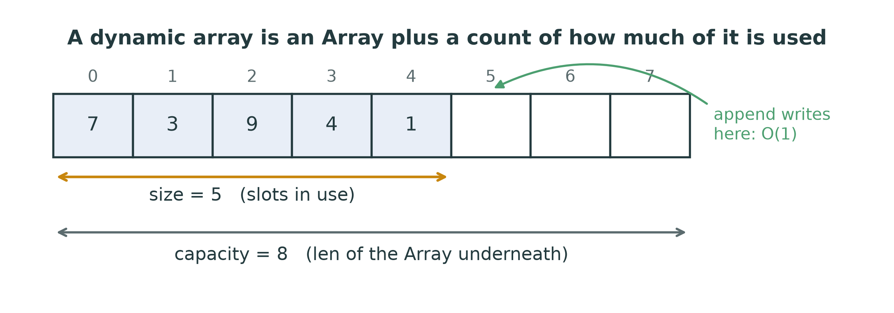
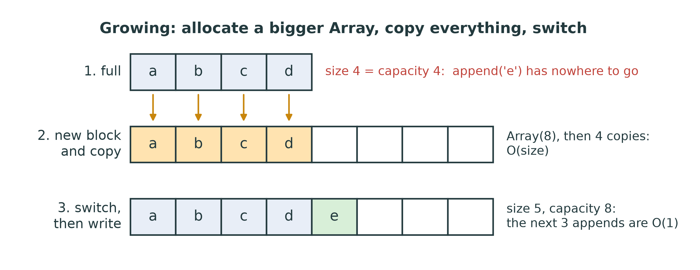
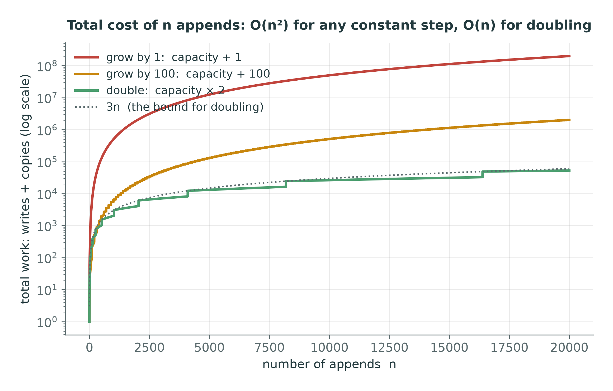
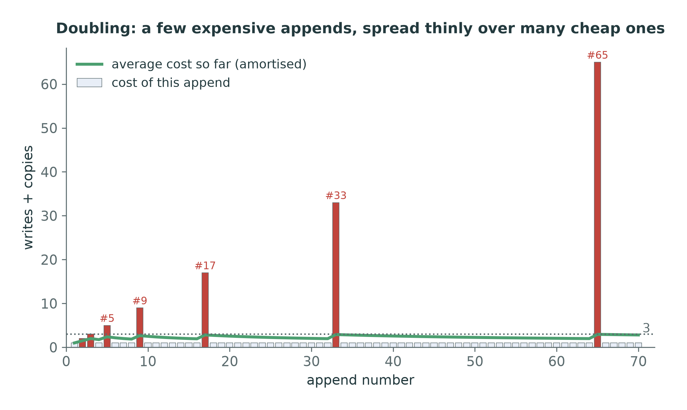
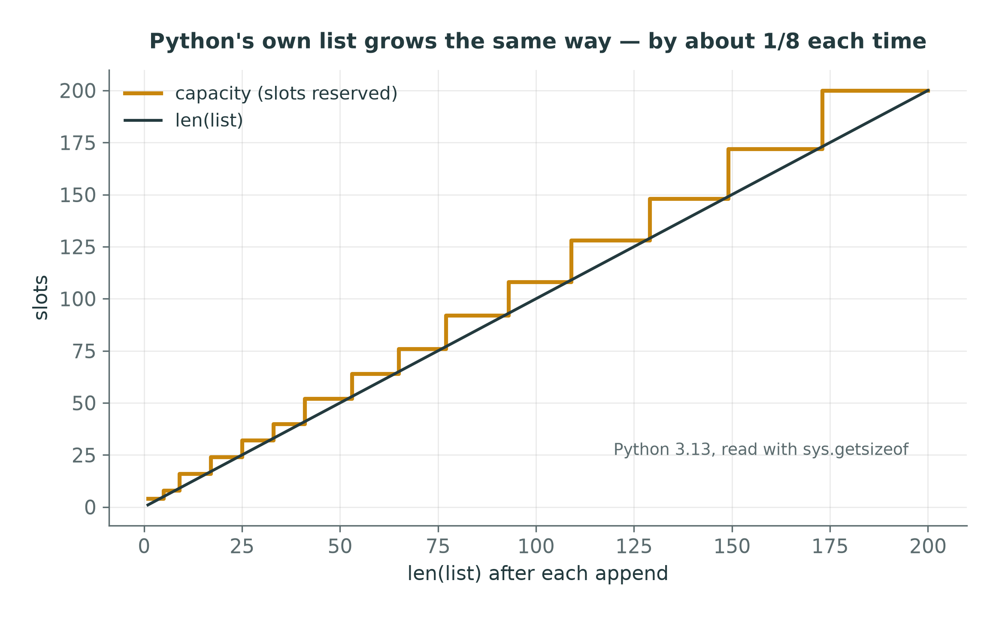

::: {.handout-only}

> **How to read this document.** This is the handout for Lecture 04. It holds
> everything on the slides, plus what I said out loud. This week you build the
> first real data structure of the course — the one Python's `list` already is —
> and meet the idea that makes it work: **amortised** cost.
>
> Slides: `DSA27-L04-slides.pdf` · Code: `dsa/dynamic_array.py` ·
> Tests: `tests/test_dynamic_array.py`

:::

# Where We Are

## Two weeks ago, one problem

The course `Array` gives $O(1)$ indexing — and a **fixed size**.

```python
a = Array(4)
a[4] = "e"          # IndexError: there is no slot 4, and there never will be
```

Python's `list` grows for ever, and `append` is fast. **How?**

::: {.handout-only}

Lecture 02 introduced the array and its one great limitation: the size is
decided when it is created. The memory right after the block may belong to
something else, so it cannot grow in place.

Yet you have used Python lists since your first week, appending millions of
items, and `append` never seemed slow. Today we build the structure that
explains it — the **dynamic array** — on nothing but the course `Array`, and we
prove why `append` is fast *on average* even though it is occasionally very
slow.

Lecture 03's recursion is not needed today; complexity from Lecture 02 is needed
throughout.

:::

## Today

1. Capacity and size: an Array plus a count
2. Growing: allocate, copy, switch
3. **How much** to grow — by 1, by 100, or × 2?
4. **Amortised** analysis: why `append` is $O(1)$ on average
5. Shrinking, and how not to thrash
6. Python's own `list`, measured
7. The rest of the operations, and their costs

# Capacity and Size

## An Array plus a count

{width=94%}

- **capacity** — how many slots the Array underneath has (`len(self._block)`)
- **size** — how many of them hold data (`self._size`, and what `len()` returns)
- Always $0 \le \text{size} \le \text{capacity}$

::: {.handout-only}

This is the split you already met in Lecture 02's `insert_at(arr, size, …)`:
the array has a length, and separately you track how much of it is in use. A
dynamic array simply keeps both inside one object.

```python
class DynamicArray:
    def __init__(self, values=(), growth=2):
        self._size = 0                    # slots in use
        self._capacity = 1                # slots reserved
        self._block = make_block(1)       # an Array(1)
        ...
```

That is the skeleton you are given in `dsa/dynamic_array.py`. `make_block` is
just `Array(capacity)`.

**While there is room**, appending is one write into the next free slot and one
increment: $O(1)$. The whole question of this lecture is what happens when there
is no room.

*Dynamic array* in Arabic: المصفوفة الديناميكية — the array whose size changes.

:::

## Reading and writing are still O(1)

```python
def __getitem__(self, index):
    if index < 0:
        index += self._size               # -1 means the last USED slot
    if not 0 <= index < self._size:
        raise IndexError(index)
    return self._block[index]
```

Negative indices are **translated**: the course `Array` has none, so the dynamic
array provides them — in $O(1)$.

::: {.handout-only}

Two details that the tests check:

- The bounds are **0 to size − 1**, not 0 to capacity − 1. Slots beyond `size`
  exist in the Array but hold nothing the user put there; reading one must be an
  `IndexError`, exactly as with a Python list.
- `arr[-1]` is the last *used* element, so the translation adds `size`, not
  `capacity`.

That is essentially the whole of `__getitem__` — it is here because the
translation is the idea worth seeing. `__setitem__` follows the same shape and is
yours to write, along with everything that follows.

:::

# Growing

## Allocate, copy, switch

{width=94%}

A full array cannot grow in place. So:

1. allocate a **new, bigger** `Array`
2. **copy** every element across — $O(\text{size})$
3. **switch** `self._block` to the new Array (the old one is garbage-collected)

::: {.handout-only}

That is `_resize(capacity)` in the exercise, and it is the one genuinely
expensive thing a dynamic array does:

```python
def _resize(self, capacity):
    block = make_block(capacity)          # 1. allocate
    for i in range(self._size):           # 2. copy — O(size)
        block[i] = self._block[i]
    self._block = block                   # 3. switch
    self._capacity = capacity
    self.resize_count += 1                # the tests and the notebook read this
```

(This one is shown in full because it is mechanical; deciding *when* to call it
and *with what capacity* is the exercise.)

Step 3 is where Python's garbage collection, from Lecture 01, quietly does work:
nothing refers to the old Array any more, so its memory is reclaimed. In C you
would call `free` on it yourself — and forgetting would leak memory.

`append` now reads: *if full, resize; then write at `size` and increment.* A
single append that triggers a resize costs $O(n)$. So is `append` $O(n)$? That
depends entirely on **how much bigger** the new Array is.

:::

# How Much to Grow?

## Option 1: one slot at a time

Capacity 1, 2, 3, 4, … — **every** append is a resize.

Copies for n appends:

$$0 + 1 + 2 + \dots + (n-1) = \frac{n(n-1)}{2} = \Theta(n^2)$$

**Every append is $O(n)$.** 100,000 appends ≈ 5 **billion** copies.

::: {.handout-only}

The most economical in memory — never a wasted slot — and hopeless in time. The
k-th append copies the k − 1 elements already there. It is the triangular sum
from Lecture 02 again.

:::

## Option 2: a constant step — say, 100 at a time

Resize only every 100 appends — surely much better?

Copies for n appends: $100 + 200 + 300 + \dots \approx \frac{n^2}{2 \times 100}$

**Still $\Theta(n^2)$** — just 100 times smaller. 100,000 appends ≈ 50 million
copies.

::: {.handout-only}

This is the trap that looks like a fix. Growing by a constant c divides the
number of resizes by c, but each resize still copies everything, and the
amounts copied still grow linearly: c, 2c, 3c, … A sum of n/c terms growing
linearly is quadratic. The constant c only changes the constant in front of the
$n^2$ — the part Big-O throws away.

Counted exactly for n = 100,000 appends starting from capacity 1: growing by 1
copies 4,999,950,000 elements; growing by 10 copies 499,960,000. The second is
ten times smaller, and still hopeless.

:::

## Option 3: double

Capacity 1, 2, 4, 8, 16, … — resize only when size reaches a power of two.

Copies for n appends:

$$1 + 2 + 4 + \dots + 2^k \;<\; 2n \qquad (2^k < n)$$

**$\Theta(n)$ in total.** 100,000 appends: 131,071 copies.

::: {.handout-only}

Resizes happen at sizes 1, 2, 4, 8, …, and each copies that many elements. The
copies form a **geometric** series, and a geometric series is dominated by its
last term: $1 + 2 + 4 + \dots + 2^k = 2^{k+1} - 1 < 2 \cdot 2^k$. The last resize
copied fewer than n elements, so all the copying together is fewer than 2n.

Counted exactly for n = 100,000: 131,071 copies — against 5 billion for growing
by one. That is the whole of this lecture in two numbers.

:::

## The three side by side

{width=86%}

::: {.handout-only}

Counted, not timed: the total number of writes and copies for n appends, for
each growth rule, on a logarithmic axis. Growing by 1 and growing by 100 are the
same shape — quadratic — shifted apart by a constant. Doubling is a different
shape: it stays under the dotted line 3n, for every n.

This is the plot your `resize_count` lets you draw in the notebook
`notebooks/04-dynamic-array.ipynb`.

:::

# Amortised Analysis

## One expensive append, many cheap ones

{width=68%}

The red bars are resizes: expensive, but **exponentially rare**. The green line
— the average so far — never rises above **3**.

::: {.handout-only}

Each bar is the cost of one append with doubling, counting one unit per write
and one per copied element. Most appends cost 1. Append number 2, 3, 5, 9, 17,
33, 65, … — one more than a power of two — pays for copying everything first.

The expensive appends are far apart, and they get further apart exactly as fast
as they get more expensive. That balance is the whole trick.

:::

## Amortised cost: the definition

The **amortised cost** of an operation is the **total cost of any sequence** of
n operations, **divided by n**.

For `append` with doubling: total $< 3n$, so the amortised cost is
$< 3 = O(1)$.

- One individual append can still cost $O(n)$ — the **worst case** is unchanged.
- But **no sequence** of n appends can cost more than $3n$ — a **guarantee**.

::: {.handout-only}

*Amortise* comes from finance: paying off a large cost in small instalments over
time. (In Arabic, الإطفاء or التكلفة المستهلكة.) The large cost here is a resize;
the instalments are the cheap appends that come before it.

**The proof — the aggregate method.** Take any n appends starting from an empty
array of capacity 1.

- Every append writes one element: **n** writes.
- Resizes happen when size reaches 1, 2, 4, …, $2^k$, with $2^k < n$, and copy
  that many elements: $1 + 2 + \dots + 2^k = 2^{k+1} - 1 < 2n$ copies.
- Total: fewer than $n + 2n = 3n$. Divided by n: fewer than 3 per append.
  $\blacksquare$

**The same proof, as a bank account.** Charge every append 3 coins. One pays for
its own write. The other two are saved *on the element just written*. When the
array doubles from capacity c to 2c, the c/2 elements written since the last
resize each hold 2 saved coins — c coins in all, exactly enough to copy the c
elements. The account never goes negative, so 3 coins per append always suffice.

:::

## Amortised is **not** "average case"

| | Average case (Lecture 02) | Amortised |
|---|---|---|
| Averages over | possible **inputs** | the operations in **one sequence** |
| Needs | an assumption about the inputs | nothing |
| Guarantee | "usually" | **always**, for every sequence |

`append` is **worst-case $O(n)$**, **amortised $O(1)$**. Both statements are true
and both are useful.

::: {.handout-only}

Average-case analysis says: if the inputs are random in a certain way, the
expected cost is this. It can be wrong for the inputs you actually get.

Amortised analysis makes no assumption at all. It says: whatever you do, any n
appends in a row cost at most 3n. There is no unlucky input that breaks it.

When would the worst case still matter? When *one* slow operation is a problem
in itself — a game that must draw a frame every 16 milliseconds, a controller
that must respond in real time. Then an occasional $O(n)$ pause is a bug even
though the average is excellent, and real-time systems reserve capacity in
advance. For almost everything else, amortised $O(1)$ is as good as $O(1)$.

:::

## Any constant **factor** works

| Growth rule | Total copies for n appends | Amortised append | Worst unused space |
|---|---|---|---|
| + 1 | $\approx n^2 / 2$ | $O(n)$ | none |
| + c (constant) | $\approx n^2 / 2c$ | $O(n)$ | c slots |
| × 2 | $< 2n$ | $O(1)$ | about half |
| × 1.5 | $< 3n$ (roughly) | $O(1)$ | about a third |

What makes it $O(1)$ is growing by a **factor** — a percentage of the current
size — not the particular factor.

::: {.handout-only}

For any factor r > 1 the copies form a geometric series with ratio r, whose sum
is at most about $n \cdot \frac{r}{r-1}$ — a constant times n. A smaller factor
copies a little more often but wastes less memory; a larger one wastes more
memory but copies less. That is a time–space trade-off with no single right
answer, which is why real implementations differ: many use 2, some 1.5, and
CPython uses about 1.125 (next slide).

(In the exercise the factor is `self.growth`, 2 by default. `Array` needs a whole
number of slots, so a factor like 1.5 needs rounding up — `int(capacity * 1.5) + 1`
— if you experiment with it.)

:::

# Shrinking

## Give memory back — carefully

Pop until the array is nearly empty, and most of the Array is wasted.
Shrink when size falls to **one quarter** of capacity — and then **halve**.

Why a quarter, not a half?

| Start: capacity 8, size 8 (full) | halve at ½ full | halve at ¼ full |
|---|---|---|
| `append` → size 9 | double to 16: copy 8 | double to 16: copy 8 |
| `pop` → size 8 | **halve** to 8: copy 8 | nothing (8 > 16/4) |
| `append` → size 9 | **double** to 16: copy 8 | nothing |
| `pop` → size 8 | **halve** to 8: copy 8 | nothing |
| repeat… | **every operation $O(n)$** | $O(1)$ |

::: {.handout-only}

Growing at "full" and shrinking at "half full" leaves no gap between the two
thresholds. An append that just crossed the growth boundary is immediately
followed by a pop that crosses the shrink boundary, and the array copies itself
back and forth on every single operation. That is **thrashing**, and it turns an
amortised $O(1)$ structure into an $O(n)$ one on a perfectly ordinary sequence.

Shrinking at a quarter leaves slack on both sides. After a halving, the array is
half full, so it needs about n/4 more pops, or n/4 more appends, before it
resizes again — and those operations have paid for the copy. Amortised $O(1)$ for
any mix of appends and pops.

The `DynamicArray` exercise does **not** require shrinking; the tests never
check capacity after `pop`. It is an extension for Homework 4 — and the
question bank has a practice problem on it.

:::

# Python's `list`

## Measured: CPython does exactly this

{width=62%}

Read straight from the interpreter with `sys.getsizeof`: capacity 4, 8, 16, 24,
32, 40, 52, 64, 76, 92, … — grow by about **one eighth**, plus a little.

::: {.handout-only}

A Python list's memory is a fixed header plus one 8-byte reference per slot of
capacity, so `sys.getsizeof` reveals the capacity:

```python
import sys
empty = sys.getsizeof([])
values = []
for i in range(20):
    values.append(i)
    print(len(values), (sys.getsizeof(values) - empty) // 8)
```

Run it on your machine. On Python 3.13 the capacity steps through 4, 8, 16, 24,
32, 40, 52, 64, … — slightly more than one eighth extra each time, rounded, with
bigger jumps while the list is small. CPython chooses a small factor to waste
little memory, because Python programs hold enormous numbers of lists. It is
still a *factor*, so `append` is still amortised $O(1)$ — the same argument as
this lecture, with a different constant.

That is Lecture 01's promise kept: the doubling that "happens in C, a few layers
below your code", now visible, and now yours.

:::

# All the Operations

## `DynamicArray`: the contract with costs

| Operation | Cost | Why |
|---|---|---|
| `a[i]`, `a[i] = x`, `len(a)` | $O(1)$ | address arithmetic; a stored count |
| `append(x)` | **amortised $O(1)$**, worst $O(n)$ | occasional resize, paid for by the rest |
| `pop()` from the end | $O(1)$ | nothing moves |
| `insert_at(i, x)` | $O(n)$ | shift `i .. size-1` right (and maybe resize) |
| `pop(i)` from the middle | $O(n)$ | shift `i+1 .. size-1` left |
| `x in a`, search | $O(n)$ | one by one |
| iterate | $O(n)$ | |

Exactly the costs of Python's `list` — because it **is** one.

::: {.handout-only}

Compare with Lab 03's table of list methods: every row matches. You now know
*why* each one costs what it does, because you have written the code that pays
it.

`insert_at` and `pop(i)` are Lecture 02's `insert_at` and `remove_at` from
`dsa/array_ops.py`, moved inside the class — with one addition: `insert_at` must
resize first if the array is full.

Remember the storage rule: `_block` is an `Array` and nothing else. No list
anywhere in the class, not even as scratch space during a resize.

:::

## What it is built for

From here on, the dynamic array is **storage** for other structures:

| Week | Structure | Uses the `DynamicArray` as |
|---|---|---|
| 6 | `Stack` | the items — top at the **end**, so push and pop are $O(1)$ |
| 7 | `SlowQueue` | the items — `pop(0)` from the front, $O(n)$: measure it |
| 12 | `MinHeap` | the complete binary tree, stored level by level |
| 14 | `Graph` | each node's list of neighbours |

A bug in your `DynamicArray` becomes a bug in all four. **Test it well now.**

::: {.handout-only}

This is the storage rule from Lecture 02 paying off. Because the stack, the slow
queue, the heap and the graph are all built on the structure you write this
week, their costs come straight from this lecture's table: a stack is $O(1)$
because append and pop at the end are; the slow queue is slow because `pop(0)`
shifts; a heap can add a leaf in amortised $O(1)$ before sifting it up.

:::

# This Week

## Exercises: `dsa/dynamic_array.py`

| Method | Target | Watch out for |
|---|---|---|
| `append(value)` | amortised $O(1)$ | resize **before** writing; grow by `self.growth` |
| `_resize(capacity)` | $O(n)$ | copy only `size` elements; count `resize_count` |
| `__getitem__`, `__setitem__` | $O(1)$ | bounds are `0 .. size-1`; translate negatives |
| `insert_at(index, value)` | $O(n)$ | resize if full; shift from the **end** |
| `pop(index=-1)` | $O(1)$ at the end, else $O(n)$ | `IndexError` when empty; clear the freed slot |

```powershell
pytest tests/test_dynamic_array.py -v
```

`test_doubling_keeps_resizes_logarithmic`: 1,000 appends must resize fewer than
20 times.

::: {.handout-only}

The constructor, `__len__`, `__iter__`, `__repr__` and `make_block` are given.
The resize test is the one that separates doubling from a constant step: with
doubling, 1,000 appends from capacity 1 resize exactly 10 times ($2^{10} = 1024$);
with "+ 1" they resize 999 times.

After this week, `pytest tests/test_stack_queue.py` will start to make sense: the
stack and the slow queue already use your `DynamicArray`, so they depend on it
being right.

:::

## Homework 4 — before Lecture 05

1. **Implement** `dsa/dynamic_array.py` until `pytest tests/test_dynamic_array.py`
   passes.
2. **Measure.** Make a copy of your class that grows by `+ 10` instead of
   `× growth`. Time 1,000 … 32,000 appends for both with
   `viz.complexity.measure`, and plot with `reference=["n", "n^2"]`. Plot
   `resize_count` against n for both as well.
3. **Prove.** With growth factor 3 (capacity 1, 3, 9, 27, …), show that n appends
   cost $O(n)$ in total.
4. **Extend.** Add shrinking to your class: halve the capacity when `pop` leaves
   the array one quarter full. Write a test that alternates append and pop at
   the boundary, and check with `resize_count` that it does not thrash.

::: {.handout-only}

For item 2, the starting point is the `measure` example in the Lecture 02
handout; `make` should return an empty array and the function should append n
items to it. Keep both classes in a scratch file or the notebook, not in
`dsa/dynamic_array.py`, so the tests keep checking the real one.

For item 3, follow the aggregate proof: where do the resizes happen, how much
does each one copy, and what does the geometric series sum to?

:::

# Summary

## Seven things to keep

1. A dynamic array is an **`Array` plus a size**; capacity ≥ size.
2. Full? **Allocate** a bigger Array, **copy** everything, **switch** — $O(n)$.
3. Grow by a **constant** → $\Theta(n^2)$ for n appends. Grow by a **factor** →
   $\Theta(n)$.
4. **Amortised $O(1)$**: any n appends cost < 3n. The worst single append is still
   $O(n)$.
5. Amortised is a **guarantee over a sequence**, not an average over inputs.
6. Shrink at **one quarter** full, not one half — or it **thrashes**.
7. Python's `list` is exactly this, growing by about **1/8**.

## Next

**Week 5 — Linked lists.** The opposite trade: no copying, ever, and $O(1)$
insertion at the front — paid for with $O(n)$ indexing.

::: {.handout-only}

---

## Sources and further reading

- **T. H. Cormen, C. E. Leiserson, R. L. Rivest and C. Stein.** *Introduction to
  Algorithms*, 3rd ed., MIT Press, 2009, chapter 17, "Amortized Analysis" — the
  aggregate, accounting and potential methods, with dynamic tables (section
  17.4) as the worked example, including the one-quarter shrinking rule.
- **M. T. Goodrich, R. Tamassia and M. H. Goldwasser.** *Data Structures and
  Algorithms in Python*, Wiley, 2013, section 5.3, "Dynamic Arrays and
  Amortization" — a dynamic array built on a `ctypes` array, the approach this
  course takes.
- **CPython source.** `Objects/listobject.c`, function `list_resize` — the
  over-allocation rule you measured with `sys.getsizeof`.
- **R. E. Tarjan.** "Amortized Computational Complexity", *SIAM Journal on
  Algebraic and Discrete Methods* 6(2), 1985 — the paper that named and
  formalised amortised analysis.

Every figure in this lecture is generated by `tools/figures_l04.py`. The cost
charts are counted; the CPython chart is read from your interpreter, so run the
script to see your own Python's growth pattern.

:::
