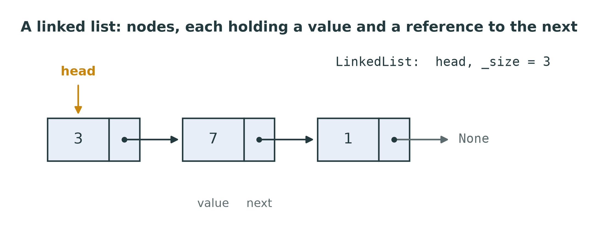
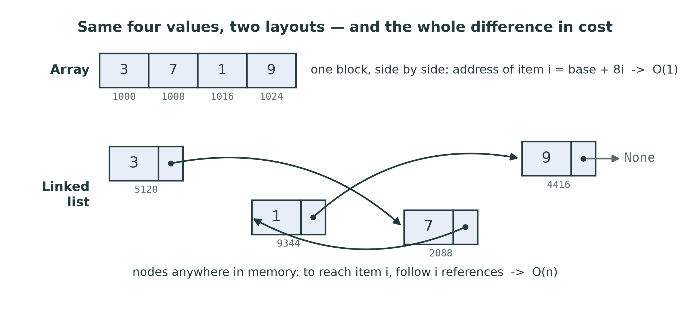
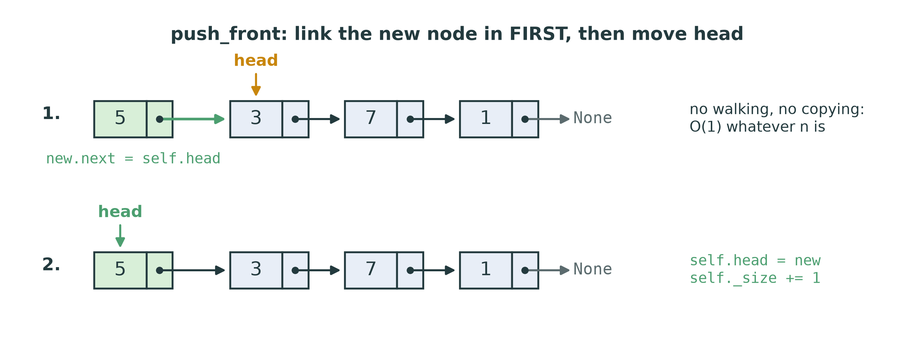
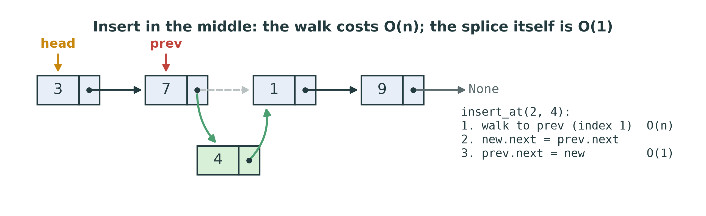
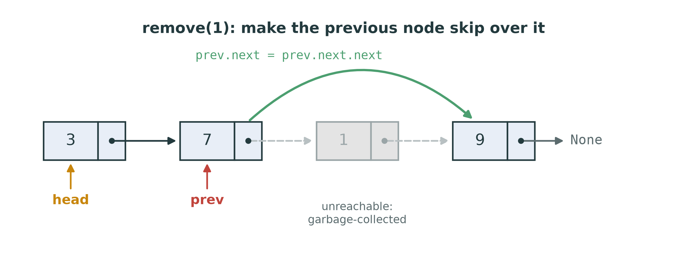
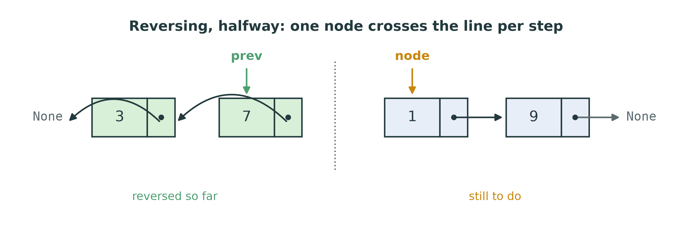

::: {.handout-only}

> **How to read this document.** This is the handout for Lecture 05. It holds
> everything on the slides, plus what I said out loud. The linked list is the
> exact mirror of the dynamic array: every operation that was cheap there is
> expensive here, and the other way round. It is also the first structure built
> from **nodes and references** rather than from an array — the building blocks
> of trees and graphs later.
>
> Slides: `DSA27-L05-slides.pdf` · Code: `dsa/linked_list.py` ·
> Tests: `tests/test_linked_list.py`

:::

# Where We Are

## Last week, one weakness

The dynamic array: $O(1)$ to index, amortised $O(1)$ to append —

and $O(n)$ to insert at the **front**, because **everything shifts**.

Today: a structure where nothing ever shifts, and nothing is ever copied.

::: {.handout-only}

Every array-based structure pays for contiguity. Keeping elements side by side
is what makes `a[i]` a single address calculation — and it is also why inserting
at position 0 moves every other element, and why growing means copying the
whole array.

A linked list gives up contiguity entirely. Each element lives in its own small
object, anywhere in memory, and knows only where the next one is. Insertion
becomes a matter of changing two references. Indexing becomes a walk.

*Linked list* in Arabic: القائمة المتصلة.

:::

## Today

1. Nodes and references
2. Walking a list — and why indexing is $O(n)$
3. Inserting: at the front, in the middle, at the end
4. Removing — and who frees the node
5. Reversing in place, with three references
6. Array against linked list: costs, memory, measured
7. Variants: tail pointer, doubly linked, sentinel

# Nodes and References

## A node: a value and a link

```python
class Node:
    __slots__ = ("value", "next")

    def __init__(self, value, next=None):
        self.value = value
        self.next = next          # another Node, or None at the end
```

{width=86%}

The list object keeps only **`head`** (the first node) and **`_size`**.

::: {.handout-only}

`Node` is given to you in `dsa/linked_list.py`, exactly as above. `__slots__`
tells Python that a node has only these two attributes, which saves memory — it
matters when a list has a million nodes.

The picture is the whole structure. There is no block, no capacity, no index
arithmetic: just a chain of references ending in `None`. The `LinkedList` object
holds the entry point, `head`, and a count, `_size`.

This is also the course storage rule from Lecture 02 at work: the linked list
stores its data in **node objects** — one of the three things a structure is
allowed to use. No `list` anywhere.

:::

## Build one by hand

```python
>>> from dsa.linked_list import Node
>>> c = Node(1)
>>> b = Node(7, c)
>>> a = Node(3, b)
>>> a.value, a.next.value, a.next.next.value
(3, 7, 1)
>>> a.next.next.next is None
True
```

A reference **is** the arrow in the picture. `a.next` *is* `b`.

::: {.handout-only}

Do this at the REPL before you write any of the exercise. Everything that follows
is only a matter of which reference you change, and in what order.

Lecture 01 said a Python variable is a name bound to an object, and Lab 01 made
you draw the arrows for `b = a`. A linked list is that idea turned into a data
structure: `node.next` is just another name bound to another object.

:::

## Two layouts, one difference

{width=96%}

::: {.handout-only}

The array's slots are contiguous, so the address of item i is arithmetic. The
nodes can be anywhere — they are created one at a time, wherever Python has
room — so the only way to find item i is to start at `head` and follow i
references.

The addresses in the figure are illustrative, but the point is real: this is why
indexing a linked list is $O(n)$, and it is also why a linked list is slower in
practice than its Big-O suggests. Modern processors fetch memory in blocks and
are fast at walking contiguous data (the *cache*); jumping from node to node
defeats that.

:::

# Walking the List

## The traversal loop

```python
node = self.head
while node is not None:
    # ... use node.value ...
    node = node.next
```

Every linked-list algorithm is this loop, plus a little bookkeeping.

- `node is not None` — stop **after** the last node
- `node = node.next` — the only way to move

::: {.handout-only}

Learn this loop until you write it without thinking. `__iter__` in the given code
is exactly this loop with `yield node.value` in the middle. `find(value)` is this
loop with an index counter and an early return. `__getitem__(index)` is this loop
stopped after `index` steps.

Two classic mistakes:

- `while node.next is not None:` stops **on** the last node instead of after it —
  right when you need the last node (appending), wrong when you need to visit
  every node.
- Forgetting `node = node.next` — an infinite loop. Press Ctrl+C.

**Watch it move.** Set a breakpoint inside this loop in `dsa/linked_list.py`,
press F5, choose *pytest: current test file*, and step with F10. In the Variables
panel, `node` jumps from object to object. `viz.draw.draw_linked_list(list(ll),
highlight=i)` draws the same thing.

:::

## Indexing is $O(n)$ — that is the lesson

| | `DynamicArray[i]` | `LinkedList[i]` |
|---|---|---|
| How | base + i × slot size | follow `next` i times from `head` |
| Cost | $O(1)$ | $O(i)$ — $O(n)$ worst case |

Same interface, `a[i]`. **Completely different cost.**

```python
for i in range(len(ll)):
    print(ll[i])          # O(n) each time: O(n²) for the whole loop!
```

Iterate with `for value in ll:` — one walk, $O(n)$ in total.

::: {.handout-only}

This is the most important slide for your own code. Python lets `LinkedList`
support `ll[i]` through `__getitem__`, and it looks exactly like array indexing.
But each `ll[i]` starts again from `head`. A loop that indexes 0, 1, 2, … does
$0 + 1 + 2 + \dots + (n-1)$ steps — the triangular sum again, $O(n^2)$.

An interface does not tell you the cost. The ADT does — and for a linked list,
positional access is $O(n)$ by contract.

`len(ll)` on the other hand is $O(1)$, because the list keeps `_size` up to
date. Without it, `len` would be a walk too. That is a design decision with a
price: every method that adds or removes a node must remember to update
`_size`.

:::

# Inserting

## At the front: $O(1)$

{width=96%}

```python
new = Node(value)
new.next = self.head      # 1. link the new node to the old first node
self.head = new           # 2. then make it the first node
```

::: {.handout-only}

Two references change, whatever the length of the list. No shifting: compare
Lecture 02's array insertion, which moved every element.

**Order matters.** Do step 2 first and `self.head` already points at the new
node, so step 1 sets `new.next = new` — a node pointing at itself, and the rest
of the list is lost (unreachable, then garbage-collected). With references, the
rule is: **link the new node in before you let go of the old one.**

Both steps also fit in one line — `self.head = Node(value, self.head)` — because
Python evaluates the right-hand side, including the old `self.head`, before
assigning. Then `self._size += 1`.

:::

## In the middle: walk, then splice

{width=96%}

To put a new node at index i, stop at the node **before** it (index i − 1), then:

```python
new.next = prev.next
prev.next = new
```

::: {.handout-only}

A singly linked list can only be changed from the node **before** the change,
because only that node holds the reference that must be redirected. So insertion
at index i walks i − 1 steps to find `prev`: $O(n)$ in the worst case. The splice
itself is two assignments, $O(1)$.

This is the honest comparison with an array: the array *finds* position i in
$O(1)$ and pays $O(n)$ to *make room*; the list pays $O(n)$ to *find* position i
and $O(1)$ to make room. If you already hold a reference to the right node —
which happens often, for example while walking — the list's insertion is $O(1)$
and the array's is still $O(n)$.

`insert_at(0, value)` has no `prev`; it is `push_front`. Handle it first, then
walk for index ≥ 1. The exercise must accept `index == len(self)` (insert at the
end) and raise `IndexError` otherwise out of range.

:::

## At the end: $O(n)$ — unless you keep a tail

`append` must find the last node: walk from `head` until `node.next is None` —
$O(n)$.

Keep a second reference, **`_tail`**, to the last node, and `append` becomes
$O(1)$:

```python
self._tail.next = new
self._tail = new
```

The price: **every** method that can change the last node must keep `_tail`
correct.

::: {.handout-only}

The exercise asks for `append` in $O(n)$, with the tail pointer as a challenge in
the docstring. If you add it, audit every method: `push_front` on an empty list
must set the tail too; `pop_front` of the only node must clear it; `remove` of the
last node must move it back — and in a **singly** linked list, "back" means
walking to find the new last node, $O(n)$. `reverse` swaps head and tail.

That is the general lesson of this lecture: every extra reference buys speed
somewhere and costs care everywhere.

:::

# Removing

## From the front: $O(1)$

```python
if self.head is None:
    raise IndexError("pop from empty list")
value = self.head.value
self.head = self.head.next
self._size -= 1
return value
```

The old first node is no longer referenced by anything — so it is **gone**.

::: {.handout-only}

Who frees the node? In C, you would call `free(old)`, and forgetting is a memory
leak while freeing too early is a crash. In Python, the garbage collector
reclaims any object nothing refers to — Lecture 01's memory models. You simply
stop pointing at it.

That is convenient and it hides the structure, which is why the debugger is worth
using this week: watch `self.head` change and the old node disappear from view.

:::

## By value: skip over it

{width=92%}

Find the node **before** the one to remove, then `prev.next = prev.next.next`.

The **head** is the special case: it has no `prev`.

::: {.handout-only}

`remove(value)` removes the **first** node holding `value` and returns `True`, or
returns `False` if there is none. The shape:

1. If the list is empty, return `False`.
2. If the head holds `value`, move `head` on, as in `pop_front`.
3. Otherwise walk with `prev`, checking `prev.next.value`, and when it matches,
   `prev.next = prev.next.next`.

Do not forget `_size`. And compare the cost with the array: finding the value is
$O(n)$ in both; removing it is $O(1)$ here and $O(n)$ there, because the array
must close the gap.

The special case for the head is annoying enough that there is a standard trick
to remove it — the sentinel node, at the end of this lecture.

:::

# Reversing in Place

## Three references

{width=92%}

Keep **`prev`** (the reversed part) and **`node`** (the rest). One step moves one
node across the line:

1. remember `node.next` — you are about to overwrite it
2. point `node.next` back at `prev`
3. advance: `prev` becomes `node`, `node` becomes the remembered next

At the end, `prev` is the new head. $O(n)$ time, $O(1)$ extra space.

::: {.handout-only}

This is the classic linked-list problem, and it appears in interviews for a
reason: it tests whether you can hold an **invariant** in your head. Before every
step, `prev` is the head of a correctly reversed list of the nodes already
visited, and `node` is the head of the part still to do. The step moves exactly
one node from the second to the first, and the invariant still holds.

Start: `prev = None` (nothing reversed yet), `node = self.head`. Stop when `node`
is `None`. Then `self.head = prev`.

Step 1 is the one people forget. Once you have set `node.next = prev`, the only
reference to the rest of the list is gone — unless you saved it first.

The test `test_reverse_relinks_rather_than_rebuilding` checks that you reversed
the **same** node objects. Building a new list of new nodes is $O(n)$ extra space
and fails the test — the point is to re-link, not to copy.

Draw three or four nodes on paper, and do the three moves by hand, before you
write a line.

:::

# Array Against Linked List

## The costs, side by side

| Operation | `DynamicArray` | `LinkedList` |
|---|---|---|
| read / write position i | $O(1)$ | $O(n)$ |
| insert or remove at the **front** | $O(n)$ | $O(1)$ |
| append at the **end** | amortised $O(1)$ | $O(n)$ — $O(1)$ with a tail |
| remove from the end | $O(1)$ | $O(n)$ singly linked |
| insert / remove **given the position's neighbour** | $O(n)$ | $O(1)$ |
| search for a value | $O(n)$ | $O(n)$ |
| `len` | $O(1)$ | $O(1)$ — because of `_size` |
| memory per element | one reference | a whole node |

::: {.handout-only}

Read the table as a set of trade-offs, not a ranking. Neither structure is
better. Each is $O(1)$ exactly where the other is $O(n)$ — which is why this
course builds both, and why Week 6 (stacks) and Week 7 (queues) will ask you to
choose between them.

"Remove from the end" is $O(n)$ for a singly linked list even with a tail
pointer: after removing the last node, you need the new last node, and only the
node before it knows where it is. A **doubly** linked list fixes that.

:::

## Measured, not asserted

{width=96%}

::: {.handout-only}

Both panels are log–log. At n = 32,768:

- inserting at the front of an Array took about 23,000 µs (every element
  shifted); `push_front` took about 0.15 µs — independent of n;
- reading the middle element of an Array took about 0.2 µs; walking to the middle
  of a linked list took about 370 µs.

The flat lines are averaged over 1,000 operations each, because a single $O(1)$
operation is too fast for the clock — the same caution as in Lecture 02.

:::

## Memory: a node is not free

```python
>>> import sys
>>> sys.getsizeof(Node(1))     # with __slots__, on 64-bit CPython 3.13
48
```

An array slot is **8 bytes** (one reference). A node is **48** — six times as
much, per element, **plus** the value object both of them point to.

::: {.handout-only}

Every node is a full Python object with a header, a type pointer and two
references. A dynamic array stores only the references, side by side, with some
unused capacity. For a million small values, that difference is tens of
megabytes.

Memory layout also matters for speed: an array's references are contiguous and
read efficiently in blocks; nodes are scattered, and every `node.next` may be a
jump to a different place in memory. That is why, in practice, arrays often beat
linked lists even for operations where the Big-O is equal.

**When is a linked list the right choice?** When you insert and remove at the
front a lot (a stack, Week 6); when you splice in and out at positions you
already hold (an LRU cache, a text editor's buffer); when you must never pay for
a big copy at an unlucky moment; and as the **chains** inside a hash table
(Week 13), where each bucket is a short linked list of `Entry` nodes.

:::

# Variants

## Doubly linked, and sentinels

**Doubly linked:** each node also holds `prev`.

- remove a node you hold in $O(1)$ — no need to find its predecessor
- walk both ways; remove from the end in $O(1)$
- costs one more reference per node, and twice the bookkeeping

**Sentinel (dummy) node:** a permanent, valueless node before the first real one.

- every real node now has a predecessor — **no special case for the head**

**Circular:** the last node points back to the first — useful for round-robin.

::: {.handout-only}

Python's `collections.deque` — the queue from Lab 03 — is a doubly linked list
of fixed-size blocks: $O(1)$ at both ends like a linked list, with less memory
overhead per element like an array. Real systems often combine the two ideas.

With a sentinel, `remove` has no special case:

```python
prev = self.sentinel                 # sentinel.next is the first real node
while prev.next is not None:
    if prev.next.value == value:
        prev.next = prev.next.next
        self._size -= 1
        return True
    prev = prev.next
return False
```

The exercise does **not** use a sentinel — `self.head` is the first real node,
as the tests check — so you will write the head case yourself. The trick is
worth knowing for the exam and for later structures.

:::

# This Week

## Exercises: `dsa/linked_list.py`

| Method | Target | The trap |
|---|---|---|
| `push_front(value)` | $O(1)$ | link first, then move `head` |
| `append(value)` | $O(n)$ (tail: $O(1)$ challenge) | the empty list has no last node |
| `insert_at(index, value)` | $O(n)$ | index 0 is `push_front`; stop at `index − 1` |
| `pop_front()` | $O(1)$ | `IndexError` when empty |
| `remove(value)` | $O(n)$ | the head has no `prev`; return `True`/`False` |
| `find(value)` | $O(n)$ | −1 when absent |
| `reverse()` | $O(n)$, $O(1)$ space | save `next` before you overwrite it |
| `__getitem__(index)` | $O(n)$ | `IndexError` out of range |

Every method that adds or removes a node: **update `_size`**.

```powershell
pytest tests/test_linked_list.py -v
```

::: {.handout-only}

`Node`, the constructor, `__len__`, `__iter__` and `__repr__` are given. Draw
before you code: for each method, sketch the nodes and references before and
after, and write the reference assignments in the order that never loses the
rest of the list.

Test the edge cases by hand: the empty list, a one-node list, the first node, the
last node. Almost every linked-list bug lives in one of those four.

:::

## Homework 5 — before Lecture 06

1. **Implement** `dsa/linked_list.py` until `pytest tests/test_linked_list.py`
   passes.
2. **Tail pointer.** Add `_tail` and make `append` $O(1)$. List every method you
   had to change, and why.
3. **Measure.** Time `push_front` against `DynamicArray.insert_at(0, x)`, and
   `ll[n // 2]` against `arr[n // 2]`, for n = 1,000 … 32,000. Do your curves
   match the figure in this handout?
4. **On paper.** Trace `reverse()` on `[1, 2, 3, 4]`: draw `prev`, `node` and all
   the links after each step.

::: {.handout-only}

For item 3, remember to average fast operations over many repetitions, as the
figure's legend says — a single $O(1)$ call is below the clock's resolution.

:::

# Summary

## Seven things to keep

1. A linked list is **nodes** — a value and a `next` reference — plus a `head`.
2. Every algorithm is the **traversal loop**: `while node is not None: … node = node.next`.
3. **Indexing is $O(n)$**; iterate instead of indexing in a loop.
4. Front insert and remove: **$O(1)$**. Link the new node in **before** moving `head`.
5. Changes happen **from the node before**; the head is the special case (or use a
   sentinel).
6. Reverse with **three references**; save `next` first.
7. Array and linked list are **mirror images**: each is $O(1)$ where the other is
   $O(n)$ — choose by the operations you need.

## Next

**Week 6 — Stacks.** One ADT, and the question this lecture prepares: array or
linked list underneath? Then the applications that make stacks essential.

::: {.handout-only}

---

## Sources and further reading

- **M. T. Goodrich, R. Tamassia and M. H. Goldwasser.** *Data Structures and
  Algorithms in Python*, Wiley, 2013, chapter 7, "Linked Lists" — singly, circular
  and doubly linked lists, with sentinels, and the comparison with array-based
  sequences.
- **T. H. Cormen, C. E. Leiserson, R. L. Rivest and C. Stein.** *Introduction to
  Algorithms*, 3rd ed., MIT Press, 2009, section 10.2, "Linked lists" — including
  sentinels.
- **B. W. Kernighan and D. M. Ritchie.** *The C Programming Language*, 2nd ed.,
  Prentice Hall, 1988, chapter 6, "Structures" — self-referential structures:
  the same node, with `malloc` and `free` visible.
- **CPython source.** `Modules/_collectionsmodule.c` — `deque` as a doubly linked
  list of fixed-size blocks.

Every figure in this lecture is generated by `tools/figures_l05.py`. The timing
figure is real measurement and will differ slightly on your machine.

:::
