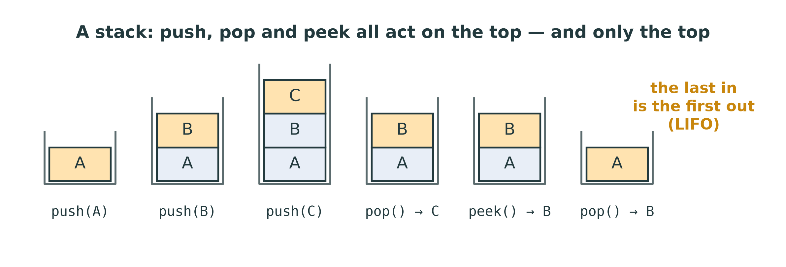
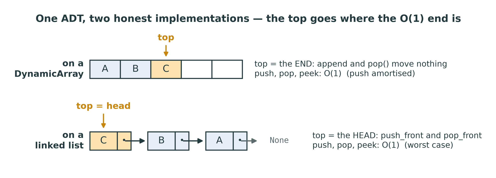
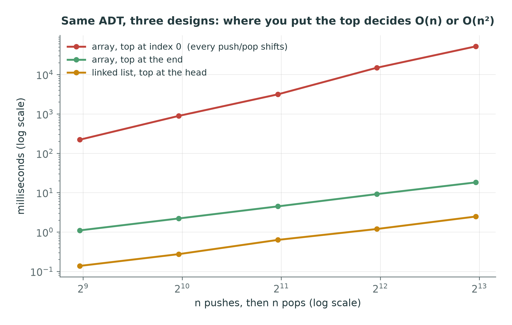
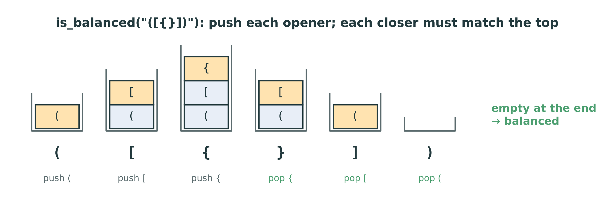
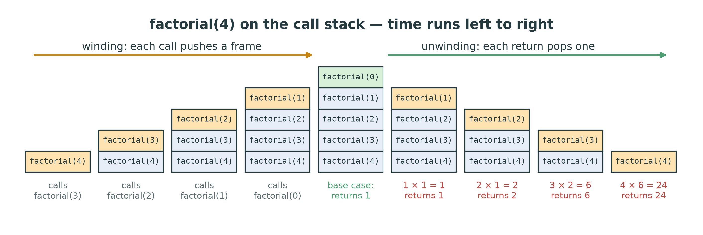

::: {.handout-only}

> **How to read this document.** This is the handout for Lecture 06. It holds
> everything on the slides, plus what I said out loud. The stack is the simplest
> ADT in the course, and one of the most useful: the structure is almost trivial,
> and the interesting part is what you *do* with it. It is also the first time
> you choose between the two structures of Weeks 4 and 5.
>
> Slides: `DSA27-L06-slides.pdf` · Code: `dsa/stack.py` ·
> Tests: `tests/test_stack_queue.py` (the stack half)

:::

# Where We Are

## Two structures, one question

Week 4: the **dynamic array** — cheap at the **end**.
Week 5: the **linked list** — cheap at the **front**.

Today: an ADT that only ever touches **one end** — so either structure can keep
its contract in $O(1)$. Which, and how?

::: {.handout-only}

Lecture 01 separated the **ADT** — the contract — from the **data structure**
that keeps it, and promised that choosing between structures is the engineering.
This is the first week you do that choice for real, with two structures you have
built yourself.

*Stack* in Arabic: المكدس.

:::

## Today

1. The Stack ADT: push, pop, peek — LIFO
2. Two honest implementations, and one dishonest one
3. Balanced brackets
4. Postfix: expressions without parentheses
5. Infix to postfix: the shunting-yard algorithm
6. The stack you have used all term: the call stack

# The Stack ADT

## Last in, first out

{width=70%}

| Operation | Meaning | Cost |
|---|---|---|
| `push(x)` | put x on top | $O(1)$ |
| `pop()` | remove and return the top — `IndexError` if empty | $O(1)$ |
| `peek()` | return the top without removing it — `IndexError` if empty | $O(1)$ |
| `is_empty()`, `len(s)` | | $O(1)$ |

::: {.handout-only}

That table **is** the ADT: operations, their meaning, their cost — and nothing
about storage. Everything a stack can do happens at one end, the **top**. There is
no indexing, no search, no access to the middle, by design: a restriction that
turns out to be exactly what a surprising number of problems need.

Everyday stacks: a pile of plates; the *Undo* history of an editor (the last edit
is the first undone); the *Back* button of a browser; and, most important for us,
the call stack of Lecture 03.

**Empty stacks.** Popping or peeking an empty stack is an error, and the
contract says which one: `IndexError`, like `list.pop()` on an empty list. The
tests check it. Returning `None` instead would be worse than an error: a `None`
can travel a long way through a program before anyone notices.

:::

# Two Honest Implementations

## The top goes where the $O(1)$ end is

{width=96%}

- On a **dynamic array**: top = the **end**. `append` and `pop()` — nothing moves.
- On a **linked list**: top = the **head**. `push_front` and `pop_front`.

::: {.handout-only}

Both are honest stacks: both keep every operation $O(1)$. They differ in the
details that Weeks 4 and 5 taught you to see:

| | Array, top at end | Linked list, top at head |
|---|---|---|
| push | **amortised** $O(1)$ — the occasional resize copies | $O(1)$ worst case |
| pop, peek | $O(1)$ | $O(1)$ |
| memory per item | one reference (+ spare capacity) | a whole node (48 bytes) |
| memory locality | contiguous | scattered |

`dsa/stack.py` uses the first: `self._items` is your own `DynamicArray` from
Week 4. That is the storage rule from Lecture 02 at work — a structure built on a
structure you built — and it means a bug in last week's `DynamicArray` shows up
in this week's `Stack`.

:::

## …and one dishonest one

Put the top at **index 0** of an array, and **every** push and pop shifts the
whole stack: $O(n)$ each.

{width=76%}

::: {.handout-only}

Real timings of n pushes followed by n pops, on reference implementations. The
two honest designs grow linearly — one unit of slope on the log–log plot, $O(n)$
for n operations, $O(1)$ each. The top-at-index-0 design has twice the slope:
$O(n^2)$ in total. At n = 8,192 that is roughly 50 seconds against a few
milliseconds.

The two honest lines are not on top of each other: here the linked version is
faster, because every access to the course `Array` goes through a Python-level
bounds check (`dsa/array.py`), while a node's `next` is a plain attribute. That is
a constant factor — the thing Big-O ignores and measurement shows. Python's own
`list`, whose checks run in C, would beat both.

Same ADT, same interface, same tests pass — and one design is quadratic. The
tests check *what* your stack does. Only you can check *how*.

:::

# Application 1: Balanced Brackets

## Every closer must match the most recent opener

{width=96%}

- **Opener** `( [ {`: push it.
- **Closer** `) ] }`: the stack must be **non-empty**, and the popped opener must
  be its **partner**.
- **End of text**: the stack must be **empty**.
- Anything else: ignore.

::: {.handout-only}

Why a stack? Because the rule is "the most recently opened bracket must close
first" — last in, first out. `([)]` fails exactly because `)` arrives while the
most recent opener is `[`.

The three ways to be unbalanced correspond to the three checks:

| Input | What happens | Which check |
|---|---|---|
| `([)]` | `)` pops `[` — not its partner | the partner check |
| `)` | a closer arrives with the stack empty | the non-empty check |
| `(` | the text ends with `(` still on the stack | the empty-at-the-end check |

Forgetting any one of them passes most tests and fails one. That is precisely
what `tests/test_stack_queue.py::test_is_balanced` is built to catch — read its
cases before you write the function.

The cost: every character is looked at once, and each push and pop is $O(1)$:
$O(n)$ time, and $O(n)$ space in the worst case (`((((…`).

This is how every compiler and editor checks brackets, and how an HTML or XML
parser checks that tags nest.

:::

# Application 2: Postfix

## Expressions with no parentheses

| Infix (usual) | Postfix (reverse Polish) |
|---|---|
| `3 + 4` | `3 4 +` |
| `3 + 4 * 2` | `3 4 2 * +` |
| `(3 + 4) * 2` | `3 4 + 2 *` |
| `8 - 3 - 2` | `8 3 - 2 -` |

In **postfix**, each operator comes **after** its operands. No parentheses, no
precedence rules — the order says everything.

::: {.handout-only}

Postfix notation was introduced by the Australian philosopher and computer
scientist Charles Hamblin in the 1950s, building on the prefix ("Polish")
notation of the logician Jan Łukasiewicz — hence *reverse Polish notation*, RPN.
Hewlett-Packard calculators used it for decades, and the Java and Python virtual
machines are essentially postfix machines: they run a stack of operands.

Compare the second and third rows. In infix, the parentheses change the meaning.
In postfix, the *order* of the tokens carries that meaning instead, so no
parentheses are needed at all.

:::

## Evaluating postfix with one stack

- **Number:** push it.
- **Operator:** pop **two** values, apply, push the result.
- **End:** exactly one value is left — the answer.

| Token | Action | Stack (top on the right) |
|---|---|---|
| `3` | push | 3 |
| `4` | push | 3 4 |
| `2` | push | 3 4 2 |
| `*` | pop 2 and 4, push 8 | 3 8 |
| `+` | pop 8 and 3, push 11 | 11 |

::: {.handout-only}

**The operand order trap.** For `8 3 -`, the first value popped is 3 and the second
is 8, and the answer is `8 - 3` — **second popped minus first popped**. Get it the
wrong way round and addition and multiplication still work (they commute), while
subtraction and division silently give wrong answers. A test with `-` or `/` is
the only thing that catches it.

**Malformed input.** If an operator finds fewer than two values, or more than one
value is left at the end, the input was not valid postfix. Raise `ValueError`.

This is `evaluate_postfix` in `dsa/translation.py` — an exercise for Week 15,
where the whole calculator comes together. You can write it now: it needs only
this week's stack. $O(n)$ time.

:::

# Application 3: Infix to Postfix

## The shunting-yard algorithm

Read the infix tokens left to right, with an **output list** and an **operator
stack**:

1. **Number** → output.
2. **Operator** → first pop to the output every operator on the stack with
   **higher or equal precedence**, stopping at a `(`; then push this one.
3. **`(`** → push.
4. **`)`** → pop to the output until the `(`; discard the `(`.
5. **End** → pop everything left to the output.

Precedence: `*` `/` above `+` `-`.

::: {.handout-only}

Edsger Dijkstra described this algorithm in 1961, and named it after a railway
shunting yard: numbers go straight through the junction, while operators wait on
a siding — the stack — until it is their turn.

The idea: an operator must wait until its right operand has been output. It can
leave the siding only when a *later* operator of lower or equal precedence
arrives (which means its operand is complete), or a `)` closes its group, or the
input ends.

**Equal precedence** pops too — that is what makes `-` and `/` **left
associative**: `8 - 3 - 2` means `(8 - 3) - 2`. When the second `-` arrives, the
first `-` (equal precedence) is popped to the output first, giving `8 3 - 2 -`.
(An operator like `**`, which is right associative, pops only on strictly higher
precedence. The exercise does not include it.)

:::

## Trace: `3 + 4 * 2`


| Token | Output | Stack |
|---|---|---|
| 3 | 3 | |
| + | 3 | + |
| 4 | 3 4 | + |
| * | 3 4 | + *  ← `+` is lower, so it stays |
| 2 | 3 4 2 | + * |
| end | **3 4 2 * +** | |

## Trace: `( 3 + 4 ) * 2`


| Token | Output | Stack |
|---|---|---|
| ( | | ( |
| 3, +, 4 | 3 4 | ( + |
| ) | 3 4 + | ← pop to `(` |
| *, 2 | 3 4 + 2 | * |
| end | **3 4 + 2 *** | |

::: {.handout-only}

These are exactly the two cases in `tests/test_stack_queue.py::test_infix_to_postfix`.
Trace `8 - 3 - 2` and `2 * 3 + 4` yourself before writing the function: one checks
the "equal precedence pops" rule, the other checks that a lower-precedence
operator empties the higher ones first.

**The whole calculator.** Infix → (shunting-yard) → postfix → (evaluation) → a
value: two passes, two stacks, $O(n)$, no tree and no recursion. Week 15 builds
the other route — a recursive parser and an expression tree — and compares them.
Declared in the 2013/2014 bylaws as "the principles of language translation", and
this is where it starts.

:::

# Application 4: The Call Stack

## You have been using a stack since Week 3

{width=94%}

Each call **pushes** a frame; each `return` **pops** one. Recursion **is** a stack.

::: {.handout-only}

Lecture 03's figure, seen again: the call stack is a stack of frames, managed by
Python for you. That is why any recursive algorithm can be rewritten with a loop
and an explicit stack — the stack you now know how to build. Week 14 does exactly
that for depth-first search: `dfs` recursive, and `dfs_iterative` with your own
`Stack`, visiting the nodes in the same order.

An example you can write now: summing a nested list without recursion.

```python
from dsa.stack import Stack

def nested_sum(nested):
    total, pending = 0, Stack([nested])
    while not pending.is_empty():
        item = pending.pop()
        if isinstance(item, list):
            for inner in item:
                pending.push(inner)        # "call" on every inner item
        else:
            total += item
    return total
```

Every `push` is a recursive call that has not happened yet; every `pop` is one
being made. And unlike the call stack, this one has no 1,000-frame limit.

**Undo and redo** use two stacks: doing an action pushes it on the undo stack;
*Undo* pops it and pushes it on the redo stack; *Redo* moves it back; any new
action clears the redo stack.

:::

# This Week

## Exercises: `dsa/stack.py`

| Function | Target | The trap |
|---|---|---|
| `Stack.push(value)` | $O(1)$ amortised | top at the **end** of `self._items` |
| `Stack.pop()` | $O(1)$ | `IndexError` when empty |
| `Stack.peek()` | $O(1)$ | `IndexError` when empty; do not remove |
| `is_balanced(text)` | $O(n)$ | three checks: partner, non-empty, empty at the end |
| `infix_to_postfix(tokens)` | $O(n)$ | pop on **higher or equal** precedence; `(` and `)` |

```powershell
pytest tests/test_stack_queue.py -v -k "lifo or peek or empty_behaviour or balanced or infix"
```

Your `Stack` stands on your `DynamicArray`: `tests/test_dynamic_array.py` must
pass first.

::: {.handout-only}

`__init__`, `is_empty`, `__len__` and `__repr__` are given. `is_balanced` and
`infix_to_postfix` should use your `Stack` — not a Python list as a stack, which
is what the storage rule forbids for working storage when a structure of yours is
available. Their **result** — the list of output tokens from
`infix_to_postfix` — is a Python list, because that is the interface the tests
use.

Both algorithms are $O(n)$: each token is pushed at most once and popped at most
once.

:::

## Homework 6 — before Lecture 07

1. **Implement** `dsa/stack.py` until the stack tests pass.
2. **Trace** `infix_to_postfix` on `8 - 3 - 2`, `2 * 3 + 4` and
   `( 1 + 2 ) * ( 3 - 4 ) / 5`, as tables. Then evaluate each result by hand
   with the postfix algorithm.
3. **Write** `evaluate_postfix` in `dsa/translation.py` (it only needs your
   `Stack`), and check it against your traces.
4. **Design.** Sketch an undo/redo system for a text editor with two stacks.
   What happens to the redo stack when the user types after undoing?

::: {.handout-only}

For item 3, `pytest tests/test_translation.py -v -k evaluate_postfix` runs just the
postfix tests; the rest of that file belongs to Week 15.

:::

# Summary

## Seven things to keep

1. A stack is **LIFO**: push, pop and peek act on the **top** only, all $O(1)$.
2. Empty `pop` and `peek` raise **`IndexError`**.
3. On an array the top is the **end**; on a linked list the **head**. Both honest.
4. Top at index 0 of an array: **$O(n)$** per operation — same tests pass, wrong
   design.
5. **Balanced brackets**: push openers; each closer must match the top; empty at
   the end.
6. **Postfix**: push numbers; an operator pops two — **second popped is the left
   operand**.
7. **Shunting-yard**: operators wait on a stack and leave on **higher or equal**
   precedence, or at `)`.

## Next

**Week 7 — Queues.** First in, first out: the ADT that needs **both** ends — and
the week your `DynamicArray` finally meets an operation it is bad at.

::: {.handout-only}

---

## Sources and further reading

- **E. W. Dijkstra.** "Algol 60 translation: An Algol 60 translator for the X1 and
  making a translator for Algol 60", Mathematisch Centrum report MR 35, 1961 —
  where the shunting-yard algorithm was first described.
- **C. L. Hamblin.** "Translation to and from Polish notation", *The Computer
  Journal* 5(3), 1962 — reverse Polish notation and its evaluation with a stack.
- **M. T. Goodrich, R. Tamassia and M. H. Goldwasser.** *Data Structures and
  Algorithms in Python*, Wiley, 2013, chapter 6, "Stacks, Queues, and Deques" —
  array-based stacks, and bracket and HTML tag matching.
- **T. H. Cormen, C. E. Leiserson, R. L. Rivest and C. Stein.** *Introduction to
  Algorithms*, 3rd ed., MIT Press, 2009, section 10.1, "Stacks and queues".

Every figure in this lecture is generated by `tools/figures_l06.py`; the call
stack figure is Lecture 03's. The timing figure is real measurement and will
differ slightly on your machine.

:::
