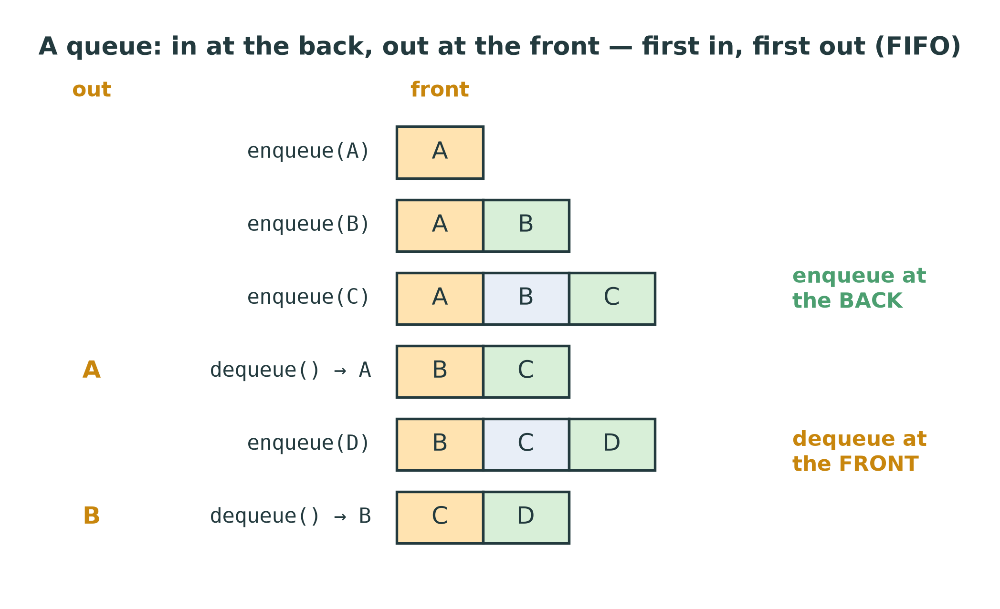
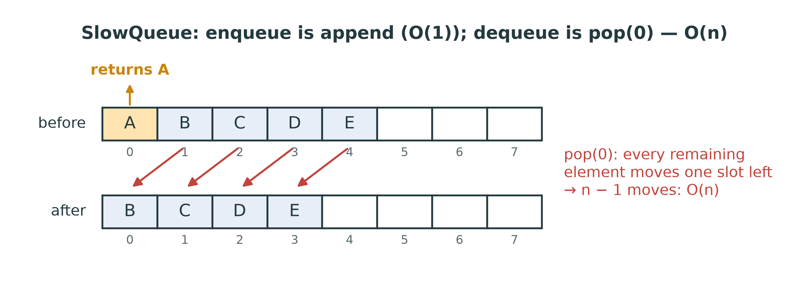
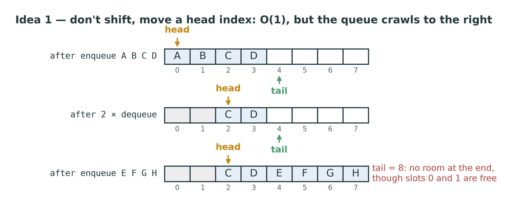
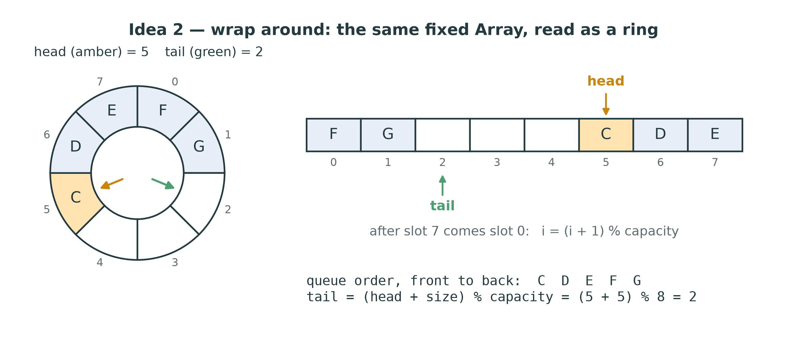
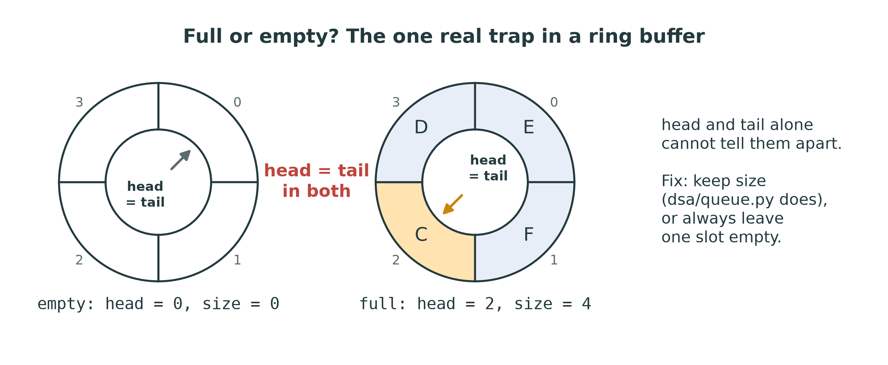
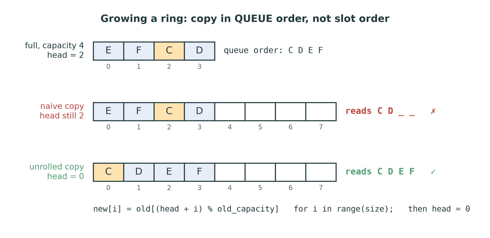
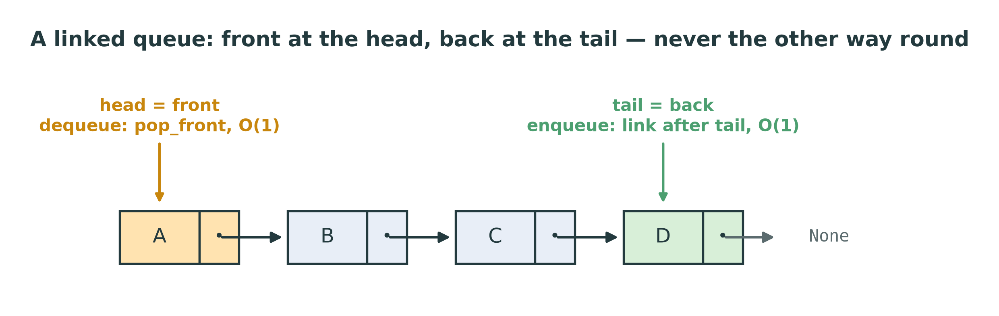
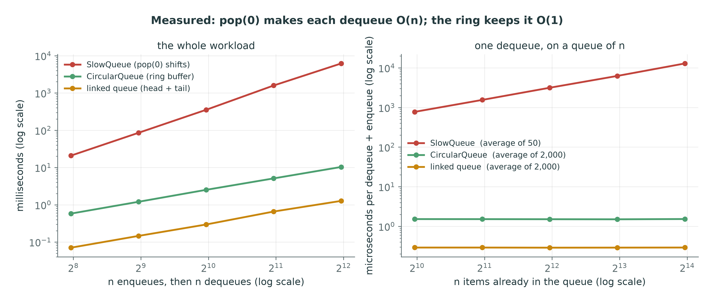

::: {.handout-only}

> **How to read this document.** This is the handout for Lecture 07. It holds
> everything on the slides, plus what I said out loud. A queue looks like a stack
> with one word changed, and that one word, *first* instead of *last*, is enough
> to break the obvious design. This week you measure that break yourself, then
> fix it with the ring buffer, the most useful trick in the course that fits in
> one line of arithmetic.
>
> Slides: `DSA27-L07-slides.pdf` · Code: `dsa/queue.py` ·
> Tests: `tests/test_stack_queue.py` (the queue half)

:::

# Where We Are

## One end was easy. Now we need both.

Week 6: the **stack** touches **one** end. Put the top at the cheap end, done.

Today: the **queue** adds at one end and removes at the **other**.

- A dynamic array is cheap at the **end** only.
- A singly linked list is cheap at the **head** (and, with a tail, for adding at the end).

So which end goes where, and what happens to the expensive end?

::: {.handout-only}

Lecture 06 closed with a promise: this is the week your `DynamicArray` finally
meets an operation it is bad at. A stack could hide the array's weak end simply
by never using it. A queue cannot: whatever you do, one of its two operations
lands on the front of the array.

*Queue* in Arabic: الطابور.

:::

## Today

1. The Queue ADT: enqueue, dequeue — FIFO
2. The obvious design, `SlowQueue`, and its $O(n)$ dequeue
3. The ring buffer: `CircularQueue`, every operation $O(1)$
4. Full or empty? — and growing a ring without scrambling it
5. The linked queue, and a queue made of two stacks
6. Measured: the gap is the lesson
7. Where queues are used — and the deque

# The Queue ADT

## First in, first out

{width=50%}

| Operation | Meaning | Cost |
|---|---|---|
| `enqueue(x)` | add x at the **back** | $O(1)$ |
| `dequeue()` | remove and return the **front** (`IndexError` if empty) | $O(1)$ |
| `is_empty()`, `len(q)` | | $O(1)$ |

::: {.handout-only}

That table is the ADT: operations, meaning, cost, and nothing about storage —
exactly as with the stack. Many textbooks add a `peek` (also called `front` or
`first`) that returns the front without removing it; the exercise does not need
it, but it is one line once the rest works.

Everyday queues: a line at a bank or a bakery, where the first to arrive is the
first served; a printer's job list; the messages waiting for a WhatsApp server
to deliver them; the keys you press while a program is busy, which arrive in the
order you pressed them. The rule is **fairness in order of arrival** — and that
is exactly what a stack does not give you (W6-M20).

**Empty queues.** Dequeuing an empty queue raises `IndexError`, like popping an
empty stack. `tests/test_stack_queue.py::test_dequeue_on_empty_raises` checks it
for both classes.

**Stack against queue**, in one line each:

| | Adds at | Removes at | Order out |
|---|---|---|---|
| Stack | the top | the **same** end | reversed (LIFO) |
| Queue | the back | the **other** end | preserved (FIFO) |

:::

# The Obvious Design

## `SlowQueue`: a `DynamicArray`, as it is

{width=86%}

- `enqueue` = `append` at the end: amortised $O(1)$.
- `dequeue` = `pop(0)`: every remaining element shifts left — **$O(n)$**.

::: {.handout-only}

This is `SlowQueue` in `dsa/queue.py`, and it is a correct queue: it passes
every test. The class is deliberately named for its flaw, because you are going
to measure it.

**Could we swap the ends?** Put the back at index 0 and the front at the end:
then dequeue is `pop()` at the end, $O(1)$, but enqueue becomes `insert_at(0, x)`,
which shifts everything — $O(n)$ again. With a plain array, **whichever** end is
the front, one of the two operations costs $O(n)$. That is the difference from
the stack, which could simply put all its work at the cheap end.

Python's own `list` has the same problem: `list.pop(0)` is $O(n)$. That is why
Lab 03 told you to use `collections.deque` for a queue, and promised you would
measure the difference this week.

:::

## Idea 1: don't shift — move the front

{width=86%}

Keep a `head` index. Dequeue reads `block[head]` and adds 1 to `head`: $O(1)$.

**But** the used part crawls right, and the slots it leaves behind are never
used again.

::: {.handout-only}

Dequeue is now $O(1)$ — nothing moves. The price is that dequeued slots at the
front are dead. In the figure, eight enqueues and two dequeues leave only six
items in an eight-slot block, yet there is no room for a ninth at the end. A
long-running queue with this design grows its block for ever, even if it never
holds more than three items at a time — a memory leak by design.

You could compact now and then — shift everything back to index 0 when the dead
space gets large — and that is a legitimate design with an amortised argument
like Lecture 04's. But there is a neater answer that never moves anything.

:::

# The Ring Buffer

## Idea 2: wrap around

{width=92%}

After the last slot comes slot 0 again:

- **front** at `head`; **back** at `(head + size) % capacity`
- every step forward is `(i + 1) % capacity`

::: {.handout-only}

The block is still a plain, fixed `Array`. What changes is how we **read** it:
index arithmetic *modulo the capacity* makes the end of the block join up with
the beginning, so the slots freed at the front are reused as soon as the back
reaches them. This is called a **ring buffer** or **circular buffer**, and it is
everywhere in systems programming: keyboard buffers, network cards, audio
streaming, logging the last N events. Wherever data arrives at one rate and
leaves at another, there is probably a ring buffer between them.

`dsa/queue.py` stores three things besides the block: `_capacity`, `_head` (the
index of the front item) and `_size` (how many items are in the queue). It
**does not** store the tail; the tail is computed:

$$\text{tail} = (\text{head} + \text{size}) \bmod \text{capacity}$$

In the figure, head = 5 and size = 5 in a block of 8, so the tail — the slot
the next enqueue writes to — is (5 + 5) mod 8 = 2. The queue, front to back, is
C D E F G: slots 5, 6, 7, then round to 0 and 1. `__iter__` in `dsa/queue.py` is
given to you and walks exactly this way: `(head + offset) % capacity` for each
offset from 0 to size − 1.

:::

## The two operations

**enqueue(x)**

1. full? — see the next slides
2. write x at `(head + size) % capacity`
3. `size += 1`

**dequeue()**

1. empty? — `IndexError`
2. read the value at `head`; clear that slot
3. `head = (head + 1) % capacity`; `size -= 1`

Nothing moves. Every step is a little arithmetic: **$O(1)$**.

::: {.handout-only}

Those six steps are the whole exercise, apart from the challenge; turning them
into Python is your job. Two details are worth saying out loud.

**Why clear the slot?** Setting the dequeued slot back to `None` is not needed
for the queue to be correct: that slot is outside the live part of the ring and
will be overwritten later. But until then the block would still hold a reference to
the dequeued object, and Python's garbage collector could not free it. Clearing
it is the same care as `DynamicArray.pop` setting the vacated slot to `None`.

**The modulo is the whole trick.** Without it, `head + 1` would walk off the end
of the `Array` and raise `IndexError`. `test_circular_queue_wraps_around` fills a
ring of capacity 3, dequeues once and enqueues again: the new value must land in
the slot at index 0, which only the `%` makes possible.

:::

## Trace: capacity 4

| Operation | Block | head | size | Returns |
|---|---|---|---|---|
| start | `_ _ _ _` | 0 | 0 | |
| enqueue A, B, C | `A B C _` | 0 | 3 | |
| dequeue | `_ B C _` | 1 | 2 | A |
| dequeue | `_ _ C _` | 2 | 1 | B |
| enqueue D | `_ _ C D` | 2 | 2 | |
| enqueue E | `E _ C D` | 2 | 3 | ← wrapped to slot 0 |
| enqueue F | `E F C D` | 2 | 4 | ← full |
| dequeue | `E F _ D` | 3 | 3 | C |

::: {.handout-only}

Read the block as a ring from `head`: after "enqueue F" it is C D E F — slots 2,
3, 0, 1. E and F were written into the slots that A and B vacated; no element
ever moved. This trace was produced by running a reference implementation, and
every row can be checked with `tail = (head + size) % 4`: before "enqueue E",
tail = (2 + 2) % 4 = 0.

:::

## Full or empty?

{width=84%}

When `head == tail`, the ring is **either** empty **or** full.
Head and tail alone cannot tell which.

::: {.handout-only}

Look at the start of the trace (head 0, size 0, tail 0) and after "enqueue F"
(head 2, size 4, tail (2 + 4) % 4 = 2). In both, the next write would go to the
slot `head` points at. A ring that stores only `head` and `tail` cannot tell
these two situations apart. There are three standard fixes:

1. **Keep a count** — `_size`. Empty is `size == 0`, full is
   `size == capacity`. This is what `dsa/queue.py` does, and why `is_empty` and
   `is_full` are given to you as one-liners.
2. **Leave one slot unused.** Full is defined as `(tail + 1) % capacity == head`,
   so `head == tail` can only mean empty. Costs one slot; common in hardware and
   in C, where a count shared between two threads is awkward.
3. **A flag** set on the enqueue that makes `head == tail`, cleared on the next
   dequeue.

Every one of them works. The bug is to have none, which is a classic exam
question (W7-B3).

:::

## When the ring is full

Two honest choices:

- **Refuse:** raise an error. A *bounded* queue — fixed memory, like a real
  buffer.
- **Grow** (the challenge): allocate a bigger `Array` and copy — as `DynamicArray`
  does, doubling so that enqueue stays amortised $O(1)$.

::: {.handout-only}

The docstring of `CircularQueue.enqueue` calls growing a **challenge**. The tests
never overfill a ring, so raising `IndexError("queue is full")` is enough to pass
them. But you should grow: Week 11's `level_order` and Week 14's `bfs` use your
`CircularQueue`, and neither knows in advance how many items it will hold.

Both choices are used in practice. An audio driver's buffer is bounded on
purpose: if the consumer falls behind, old data is dropped or the producer
waits, but memory never grows. A general-purpose queue, like Python's `deque`,
grows.

:::

## Growing: the trap

{width=84%}

Copying slot by slot keeps the wrapped order — so the queue reads **wrong**.
Copy in **queue order**, and restart `head` at 0.

::: {.handout-only}

This is the trap the docstring warns about ("a naive copy scrambles the order
once the data has wrapped around"). In the figure, the full ring of capacity 4
holds C D E F starting at slot 2. Copying `new[i] = old[i]` puts E and F at slots
0 and 1 of the new block and C D at 2 and 3; with head still 2 and a capacity of
8, the queue now reads C, D, then two empty slots — E and F are lost behind
the front. If the ring has not wrapped yet (head = 0), the naive copy happens to
work, which is exactly why this bug survives casual testing.

The fix **unrolls** the ring while copying: the i-th item of the queue, which
lives at `(head + i) % old_capacity`, goes to slot i of the new block, for i
from 0 to size − 1. Then `head` becomes 0, and `capacity` the new capacity (the
last is easy to forget, and then every `%` still wraps at the old size). The
front goes to slot 0, and the rest follow in order. Doubling the capacity
each time gives the same amortised $O(1)$ enqueue as Lecture 04: over n
enqueues, the copies total less than 2n.

:::

# Two More Honest Queues

## The linked queue

{width=84%}

Front at the **head**, back at the **tail**: both operations $O(1)$ worst case.

::: {.handout-only}

A singly linked list with a `tail` reference can add at either end in $O(1)$,
but can remove only at the head in $O(1)$: removing the last node needs the node
**before** it, which takes a walk (Lecture 05, W5-K3). So the queue's front must
be the head (where we remove) and its back the tail (where we add). The other
way round, every dequeue is $O(n)$.

- **enqueue:** make a node. If the queue is empty, it becomes both `head` and
  `tail`; otherwise link it after `tail`, and it becomes the new `tail`.
- **dequeue:** `IndexError` if empty; otherwise take the head's value and move
  `head` to the next node.

The one trap is the end of dequeue: when the queue becomes empty, `tail` must be
reset to `None` too, or it keeps pointing at a node that is no longer in the queue and
the next enqueue links onto it (W7-B4).

:::

## A queue from two stacks

- `inbox`: enqueue pushes here.
- `outbox`: dequeue pops here. When `outbox` is **empty**, first pour **all** of
  `inbox` into it.

Pouring reverses the order — and LIFO reversed is FIFO.

::: {.handout-only}

One `dequeue` may pour n items, so a single operation can cost $O(n)$. But each
item is pushed onto `inbox` once, moved to `outbox` once, and popped from
`outbox` once: three $O(1)$ steps over its whole life. So n operations cost
$O(n)$ in total, and each is **amortised $O(1)$** — the aggregate argument of
Lecture 04 again, and of `next_greater` in W6-C3.

The rule "pour only when `outbox` is empty" is essential. Pouring on every
dequeue is still correct, but each dequeue then moves everything twice, $O(n)$
each (W7-K3). It is W7-C1 in the question bank.

Why would anyone build a queue this way? In languages where the standard
structures are **immutable**, as in Haskell or Erlang, a stack is a linked list
that can be shared safely, and two of them make the standard functional queue.
It is also a favourite interview question, and a good test of whether you
understand amortised cost.

:::

# Measured

## The gap is the lesson

{width=96%}

::: {.handout-only}

Real timings on reference implementations built on the course `Array`, exactly
as your own will be. Left: n enqueues followed by n dequeues. The two honest
queues rise with slope 1 on the log–log plot, $O(n)$ for n operations; the
`SlowQueue` rises with slope 2, $O(n^2)$. At n = 4,096 that was about 6.3 seconds
against 10 milliseconds for the ring: more than 600 times slower, and the gap
doubles every time n doubles.

Right: the cost of **one** dequeue (paired with one enqueue, to keep the size at
n) on a queue already holding n items. The ring and the linked queue are flat
lines: $O(1)$, however long the queue. The `SlowQueue` line is a straight line
of slope 1: $O(n)$ per dequeue, about 13 milliseconds at n = 16,384 against
roughly 1.5 microseconds for the ring. (The $O(1)$ lines are averages over 2,000
operations, because one operation is too quick to time on its own.)

**Constant factors.** The linked queue beats the ring by about five times here,
because every ring operation does a `%` and goes through the Python-level
bounds check of `dsa/array.py`, while a node's `next` is a plain attribute. The
same effect as in Lecture 06. Big-O says both are $O(1)$; measurement says how
big the 1 is.

This is the demonstration the course plan promised in Week 7: the same tests
pass for both classes, and one of them is quadratic. Plot your own with the
`07-queues` notebook once `dsa/queue.py` works.

:::

## Four queues, compared

| | enqueue | dequeue | memory |
|---|---|---|---|
| `SlowQueue` — array, `pop(0)` | amortised $O(1)$ | **$O(n)$** | compact |
| Array, head index, no wrap | amortised $O(1)$ | $O(1)$ | **dead slots** grow for ever |
| `CircularQueue` — ring buffer | $O(1)$ (amortised if it grows) | $O(1)$ | compact, reuses slots |
| Linked, head + tail | $O(1)$ | $O(1)$ | a node per item |
| Two stacks | amortised $O(1)$ | amortised $O(1)$ | two arrays |

::: {.handout-only}

The ring buffer is the usual choice when the maximum size is known or growth is
rare: it is contiguous, it allocates nothing per item, and it never moves data
except while growing. The linked queue has the best worst case, one allocation
per item. Python's `collections.deque` combines the two: a doubly linked list
of fixed blocks of 64 slots, so it allocates rarely, like an array, and never
shifts, like a list of nodes.

:::

# Where Queues Are Used

## FIFO is fairness — and breadth

- **Scheduling:** print jobs, requests to a web server, processes sharing a CPU
  (round-robin).
- **Buffers:** keyboard input, network packets, audio — ring buffers between a
  producer and a consumer; "the last k values" for a moving average.
- **Breadth-first search** (Week 14): visit everything 1 step away, then 2 steps,
  … — the queue keeps the frontier in order.
- **Level-order traversal** of a tree (Week 11): the same idea on a tree.

::: {.handout-only}

**Round-robin.** An operating system gives each ready process a short time
slice. A process whose slice runs out goes to the back of the ready queue; the
next one is dequeued from the front. Everyone gets a turn, in order. The same
dequeue-then-enqueue step solves the Josephus problem — people in a circle, every
k-th one leaves — which is W7-C2: put everyone in a queue, then move k − 1
people from the front to the back and remove the k-th, until one is left.

**Breadth-first order.** A queue processes things in the order they were
*discovered*. Start from one node, enqueue its neighbours, then theirs: everything
one step away is dequeued before anything two steps away. That is why BFS finds
shortest paths (by number of edges), and why `level_order` in `dsa/tree.py`
visits a tree row by row. Replace the queue with a stack and the same loop
becomes depth-first — Week 14 puts them side by side.

A small example you can run now: the binary numbers 1 to n, in order, generated
breadth-first (W7-C5). Start with "1"; each time you dequeue a string s, enqueue
s + "0" and s + "1".

**The last k values.** A `CircularQueue(k)` that dequeues the oldest value
whenever a new one arrives always holds the latest k: the window of a moving
average, the last k log lines, the last k readings of a sensor. Keep a running
total beside it and each new average costs $O(1)$ instead of $O(k)$ — W7-C3.

:::

## The deque: both ends, both ways

A **deque** (double-ended queue, say "deck"): add and remove at **both** ends,
all $O(1)$.

- only one end used → a **stack**
- add at one end, remove at the other → a **queue**

In Python: `collections.deque` — `append`, `appendleft`, `pop`, `popleft`.

::: {.handout-only}

The name *deque* was coined by E. J. Schweppe, according to Knuth (*The Art of
Computer Programming*, vol. 1, §2.2.1). A ring buffer makes a deque with no new
ideas: adding at the front means moving `head` **back** one slot,
`head = (head - 1) % capacity`. Python's `%` always returns a non-negative
result for a positive capacity, so `(0 - 1) % 8` is 7: the step back from
slot 0 wraps round to the last slot, exactly as needed. (In C and Java, `-1 % 8`
is −1, and you must write `(head - 1 + capacity) % capacity` instead.) W7-S3
draws a deque on a ring, step by step.

**Where next.** Week 12 builds a **priority queue**: a queue that serves the
most **urgent** item rather than the oldest one. The ADT has the same two
operations, but a completely different structure underneath, the heap. Same
name, different contract.

:::

# This Week

## Exercises: `dsa/queue.py`

| Method | Target | The trap |
|---|---|---|
| `SlowQueue.enqueue` | amortised $O(1)$ | `append` on `self._items` |
| `SlowQueue.dequeue` | $O(n)$ — on purpose | `IndexError` when empty; `pop(0)` |
| `CircularQueue.enqueue` | $O(1)$ | tail = `(head + size) % capacity`; full? |
| `CircularQueue.dequeue` | $O(1)$ | `IndexError` when empty; head wraps |
| *challenge:* grow when full | amortised $O(1)$ | copy in queue order; head = 0 |

```powershell
pytest tests/test_stack_queue.py -v -k queue
```

::: {.handout-only}

`SlowQueue` stands on your `DynamicArray`, so `tests/test_dynamic_array.py` must
pass first. `CircularQueue` stands directly on the course `Array`: its
`__init__`, `is_empty`, `is_full`, `__len__`, `__iter__` and `__repr__` are given
to you — read `__iter__` first, since it already contains the ring arithmetic.

Four tests cover the queues: FIFO order and the empty `IndexError` for both
classes, a wrap-around at capacity 3, and ten interleaved operations that take
a capacity-4 ring round twice.

:::

## Homework 7 — before Lecture 08

1. **Implement** `dsa/queue.py` until the queue tests pass — then the challenge:
   grow instead of raising, and test it on a ring that has wrapped.
2. **Measure** `SlowQueue` against `CircularQueue` in `notebooks/07-queues.ipynb`
   and plot both. Estimate how long the `SlowQueue` would take for n = 10^6.
3. **Trace** a `CircularQueue(capacity=3)` through: enqueue 1, 2, 3; dequeue;
   enqueue 4; dequeue; dequeue; enqueue 5, 6. Show the block, head and size
   after each step.
4. **Design.** A queue from two stacks: write it, and explain why it is
   amortised $O(1)$ (W7-C1).

::: {.handout-only}

For item 2, a sensible range is n = 500 to 8,000; beyond that the `SlowQueue`
takes minutes. Fit the slope of your log–log line and extrapolate: slope 2 means
10 times more items cost 100 times more time.

For item 3, check your final answer with the given `__iter__`: `list(q)` should
read the queue front to back.

:::

# Summary

## Seven things to keep

1. A queue is **FIFO**: enqueue at the **back**, dequeue at the **front**, both
   $O(1)$.
2. Empty `dequeue` raises **`IndexError`**.
3. On a plain array, one end is always the front: `pop(0)` or `insert(0)` —
   **$O(n)$**.
4. The **ring buffer**: `head` moves, nothing shifts;
   tail = `(head + size) % capacity`.
5. `head == tail` means **full or empty**: keep `size` (or waste one slot).
6. Growing a ring: copy in **queue order**, then `head = 0`.
7. Linked queue: front at the **head**, back at the **tail**. Two stacks:
   **amortised** $O(1)$.

## Next

**Week 8 — Searching** *(midterm window)*. Seven ways to find a value, and what
a **sorted** array buys you: from $O(n)$ to $O(\log n)$.

::: {.handout-only}

---

## Sources and further reading

- **D. E. Knuth.** *The Art of Computer Programming*, vol. 1, *Fundamental
  Algorithms*, 3rd ed., Addison-Wesley, 1997, §2.2.1 "Stacks, queues, and
  deques" and §2.2.2 "Sequential allocation" — queues in a circular block, and
  the origin of the word *deque*.
- **M. T. Goodrich, R. Tamassia and M. H. Goldwasser.** *Data Structures and
  Algorithms in Python*, Wiley, 2013, chapter 6, "Stacks, Queues, and Deques" —
  an array-based circular queue that grows, written in Python.
- **T. H. Cormen, C. E. Leiserson, R. L. Rivest and C. Stein.** *Introduction to
  Algorithms*, 3rd ed., MIT Press, 2009, section 10.1, "Stacks and queues", and
  exercise 10.1-6, a queue from two stacks.
- **CPython source.** `Modules/_collectionsmodule.c` — `deque` as a doubly linked
  list of 64-slot blocks.

Every figure in this lecture is generated by `tools/figures_l07.py`. The timing
figure is real measurement and will differ slightly on your machine.

:::
