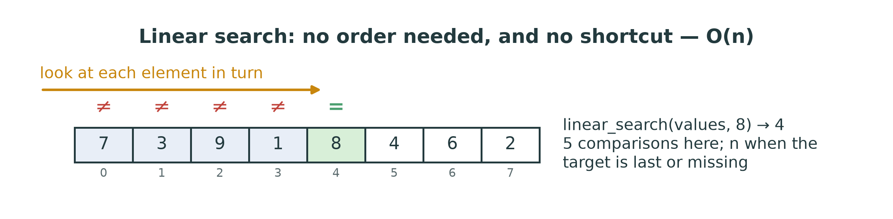
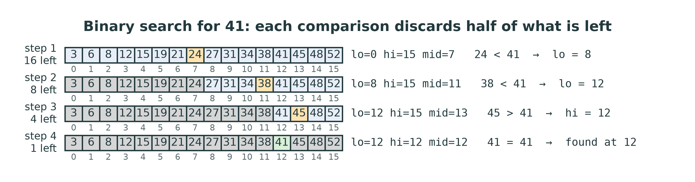
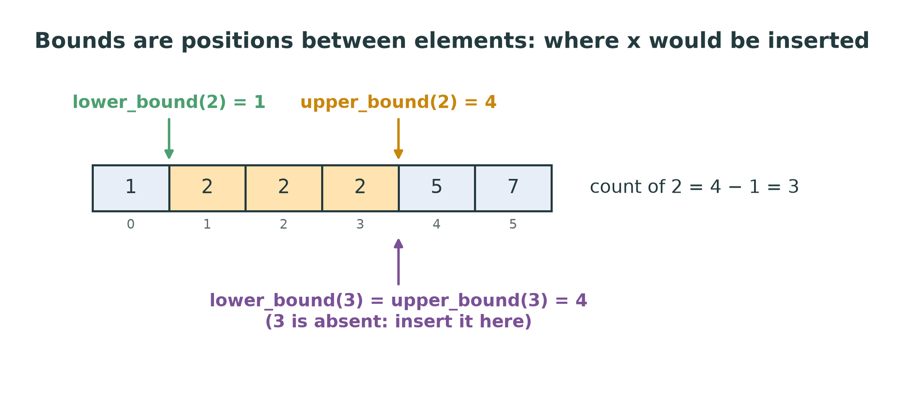
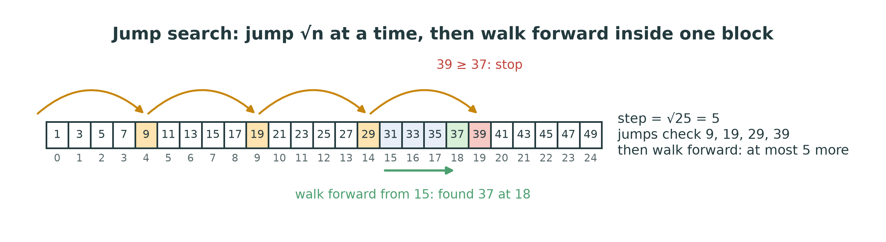
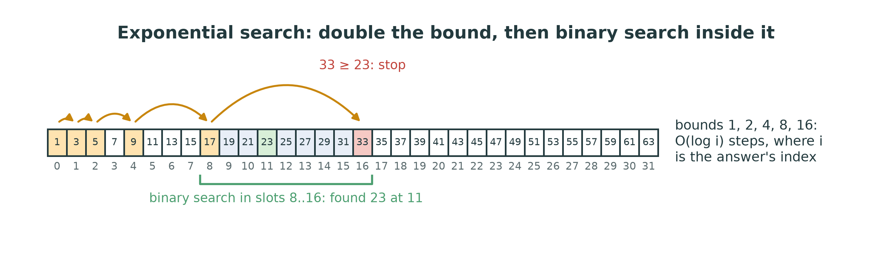
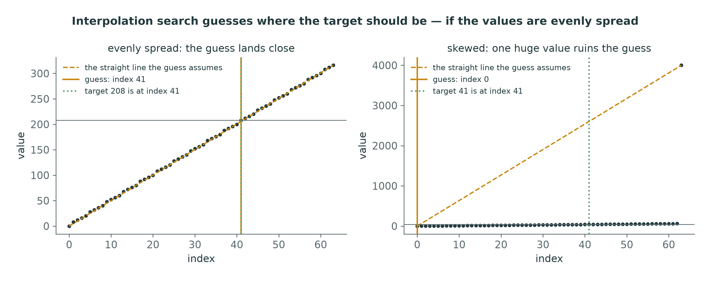
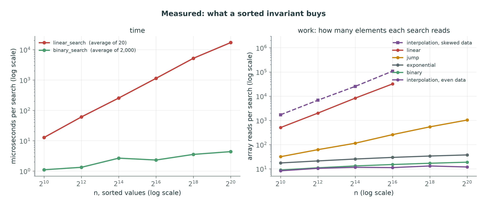

::: {.handout-only}

> **How to read this document.** This is the handout for Lecture 08. It holds
> everything on the slides, plus what I said out loud. Eight functions, one idea:
> an array that is kept **sorted** can be searched without looking at most of
> it. This week is also the midterm window, so the handout ends with a map of
> what weeks 1–7 expect of you.
>
> Slides: `DSA27-L08-slides.pdf` · Code: `dsa/searching.py` ·
> Tests: `tests/test_searching.py`

:::

# Where We Are

## From structures to algorithms

Weeks 4–7 built **structures**: dynamic array, linked list, stack, queue.

Weeks 8–10 are about **algorithms** on the simplest of them, the array:

- **Week 8:** find a value — **searching**
- **Weeks 9–10:** put the values in order — **sorting**

Today's question: **what does it buy you to keep an array sorted?**

::: {.handout-only}

Every structure so far had a `find` or an `in`, and every one of them was
$O(n)$: walk until you see the value. This week shows that the walk is
unavoidable only when you know **nothing** about where the value might be. An
array whose values are in increasing order tells you a great deal, and each
search below uses that knowledge in a different way.

*Search* in Arabic: البحث. *Binary search*: البحث الثنائي.

:::

## Today

1. Linear search: the baseline
2. Binary search: halving — and why it is so easy to get wrong
3. `lower_bound` and `upper_bound`: positions, duplicates, insertion
4. Jump, exponential and interpolation search
5. Measured: eight functions, one picture
6. When is sorting first worth it?

# Linear Search

## Look at everything

{width=86%}

- Works on **any** sequence, sorted or not.
- Found at index i: i + 1 comparisons. Missing: **n**. Worst case $O(n)$.

::: {.handout-only}

`linear_search` is the one function in `dsa/searching.py` that must work on
**unsorted** data (`test_linear_search_works_on_unsorted_data`). Return the
index of the **first** match, or −1 when there is none.

**Best, worst, average.** Best case: the target is first, 1 comparison. Worst
case: it is last or missing, n comparisons. Average, if the target is present
and equally likely to be at any position: $(1 + 2 + \dots + n)/n = (n+1)/2$
comparisons — still $\Theta(n)$. Halving the constant does not change the class
(Lecture 02).

**On sorted data** a linear search can stop early, as soon as it passes a value
larger than the target: a miss then costs, on average, half the array instead
of all of it. Still $O(n)$. To do fundamentally better, you must stop looking at
the elements **in order**.

Linear search is not a bad algorithm. For a few dozen elements it is often the
fastest search there is; it needs no sorting, no extra memory, and it is what
Python's `in` and `list.index` do.

:::

# Binary Search

## Halve what is left

{width=96%}

Compare the target with the **middle** element. Equal: found. Smaller: it can
only be on the left. Larger: only on the right.

::: {.handout-only}

This is how you look up a word in a paper dictionary: open it in the middle, see
whether your word comes before or after, and throw away the half it cannot be
in. Each comparison halves the part still in play. In the figure, 16 values
become 8, then 4, then 1: **four** comparisons find 41, where a linear search
would need 13.

It works **only** because the values are sorted. On unsorted data the
comparison with the middle tells you nothing about either half, and binary
search returns wrong answers without any error. Nothing checks that the input is
sorted — checking would itself cost $O(n)$ and defeat the purpose. The sorted
order is a **precondition**: the caller's promise.

:::

## The algorithm, and the promise it keeps

Keep two indices, `lo` and `hi`: the part still in play is `values[lo..hi]`,
both ends included.

1. `lo = 0`, `hi = n − 1`
2. while `lo <= hi`: `mid = (lo + hi) // 2`
   - `values[mid] == target` → return `mid`
   - `values[mid] < target` → `lo = mid + 1`
   - otherwise → `hi = mid − 1`
3. return −1

**Invariant:** if the target is anywhere, it is in `values[lo..hi]`.

::: {.handout-only}

An **invariant** is a statement that is true before the loop, stays true after
every step, and so is still true when the loop ends. Here: "if the target is in
the array at all, it is between `lo` and `hi`". At the start the range is the
whole array, so it is true. Each step discards only elements that cannot be the
target — everything up to `mid` when `values[mid]` is too small, everything from
`mid` when it is too large — so it stays true. When `lo > hi`, the range is
empty, and the invariant tells you the target is nowhere: return −1.

This is the whole of `binary_search`. The steps are written out here in words
on purpose: turning them into Python, and getting every `+ 1` and `<=` right, is
the exercise.

**A miss, traced.** Searching the same 16 values for 20:

| lo | hi | mid | values[mid] | Decision |
|---|---|---|---|---|
| 0 | 15 | 7 | 24 | 24 > 20 → hi = 6 |
| 0 | 6 | 3 | 12 | 12 < 20 → lo = 4 |
| 4 | 6 | 5 | 19 | 19 < 20 → lo = 6 |
| 6 | 6 | 6 | 21 | 21 > 20 → hi = 5 |
| 6 | 5 | | | lo > hi: return −1 |

Four comparisons, and the loop ends with `lo` = 6: the position where 20 **would
be** inserted. Remember that; it is the idea behind `lower_bound`.

:::

## How many comparisons?

Each comparison halves the range: after k comparisons at most $n / 2^k$ remain.

| n | at most $\lfloor \log_2 n \rfloor + 1$ comparisons |
|---|---|
| 1,000 | 10 |
| 1,000,000 | 20 |
| 1,000,000,000 | 30 |

Binary search is **$O(\log n)$** — a thousand times more data costs 10 more
comparisons.

::: {.handout-only}

Why $\lfloor \log_2 n \rfloor + 1$: the range starts with n elements, and a
comparison that does not find the target leaves at most half of them (rounded
down). After $\lfloor \log_2 n \rfloor$ such halvings one element is left, and
one more comparison settles it. For the 16 values above, $\log_2 16 = 4$, so at
most 5: searching for 52, the last value, takes exactly 5.

The recurrence, in the language of Lecture 03: $T(n) = T(n/2) + O(1)$, which
solves to $O(\log n)$. Space: $O(1)$ for the loop — just `lo`, `hi` and `mid`.

`test_binary_search_does_not_scan_linearly` searches a list of a million
integers. A correct binary search reads 20 of them. An accidental linear scan
somewhere in your function reads a million and the test becomes slow — which is
the point of the test.

:::

## Easy to state, hard to get right

- `while lo < hi` with an inclusive `hi` → **misses** the last candidate.
- `hi = mid` with an inclusive `hi` → can **loop for ever**.
- `lo = mid` → can **loop for ever** when `hi = lo + 1`.
- `mid = (lo + hi) / 2` in Java or C → **overflows** when `lo + hi` exceeds the
  largest `int`.

::: {.handout-only}

Binary search has a famous history of being wrong. Knuth records that the first
binary search was published in 1946, and the first that works correctly for
**every** n not until 1962 (*TAOCP* vol. 3, §6.2.1). Jon Bentley gave the
problem to professional programmers in courses at Bell Labs and IBM, with two
hours to write it: about ninety percent of the programs had bugs
(*Programming Pearls*, column 4). And in 2006 Joshua Bloch reported that the
binary search in Java's own library — `java.util.Arrays.binarySearch`, which
he had written himself — failed on arrays of more than about a billion
elements, because `(low + high) / 2` overflowed a 32-bit `int`. The fix is
`low + (high - low) / 2`. The bug had been in the library for nine years.

Python integers do not overflow, so the last bug cannot happen here — but you
will write binary search in C or Java one day, so name it now.

The other three bugs have one cure: **decide what `lo` and `hi` mean, and keep
every line faithful to it.** With `hi` inclusive (the range is `values[lo..hi]`),
the loop runs while the range is non-empty, `lo <= hi`, and both updates must
move past `mid`, because `mid` has just been ruled out. The infinite loops happen
when an update does not move: with `lo = 5`, `hi = 6`, `mid` is 5, and `lo = mid`
leaves everything as it was. Test the sizes 0, 1 and 2 by hand: nearly every
binary-search bug shows up on one of them. The tests check the empty list and
one element (`test_handles_empty_and_single_element`), and the first and last
positions (`test_finds_first_and_last_element`).

:::

## Recursive binary search

Same idea: search the half that can hold the target, **by a call**.

- $O(\log n)$ time, but also **$O(\log n)$ stack** — the loop is $O(1)$ space.
- Pass `lo` and `hi` down. **Never slice**: `values[mid + 1:]` copies — $O(n)$
  per call.

::: {.handout-only}

`binary_search_recursive(values, target, lo=0, hi=None)` keeps the same
contract. The base case is the empty range, `lo > hi`: return −1. `hi=None` is
the usual trick for a default that depends on another argument: the first call
replaces it with `len(values) - 1`.

**The slicing trap.** A recursive search that calls itself on
`values[:mid]` or `values[mid + 1:]` looks elegant and is wrong twice. It is
slow: each slice copies up to n/2 elements, so the total is
$n/2 + n/4 + \dots = O(n)$ — as slow as a linear search, while looking like a
binary one. And it loses the position: the index returned by a call on a slice
is an index into the slice, not into the original list, so every call on a right
half must add an offset. Passing `lo` and `hi` avoids both problems. (Lecture 03
made the same point about `list_max` on slices.)

The depth is at most about $\log_2 n$ frames — 20 for a million elements — so
Python's 1,000-frame limit is no concern here, unlike the linear recursions of
Lecture 03. The loop is still the better tool: same speed, no frames at all.

:::

# Bounds: Searching for Positions

## `lower_bound` and `upper_bound`

{width=78%}

- `lower_bound(v, x)`: the first index with `v[i] >= x`
- `upper_bound(v, x)`: the first index with `v[i] > x`
- Both may return **`len(v)`**. Neither returns −1.

::: {.handout-only}

`binary_search` answers "is it there, and where?", and with duplicates the
"where" is **any** of the matching positions. The bounds answer more useful
questions, and always with a position:

- **Where would x go?** `lower_bound(v, x)` is the index at which inserting x
  keeps the array sorted — the insertion point.
- **How many copies of x?** `upper_bound(v, x) - lower_bound(v, x)`. In the
  figure, 4 − 1 = 3 copies of 2, and 4 − 4 = 0 copies of 3
  (`test_bounds_count_duplicates`).
- **The first occurrence?** `i = lower_bound(v, x)`; it is x if
  `i < len(v) and v[i] == x`.
- **How many values lie in [a, b)?** `lower_bound(v, b) - lower_bound(v, a)`.
  A range query in $O(\log n)$ — which no hash table can answer (Week 13).

They are both binary searches that **never stop early**: they keep halving until
the range is empty and return where it closed. The usual way to write them uses
a **half-open** range `[lo, hi)` — `lo` included, `hi` excluded — starting from
`lo = 0, hi = len(v)`, so that `len(v)` is a possible answer. The loop runs
while `lo < hi`, and the only difference between the two functions is which
comparison sends the search right.

Python has them already, in the standard library: `bisect.bisect_left` is
`lower_bound`, `bisect.bisect_right` is `upper_bound`, and `bisect.insort`
inserts into a sorted list. C++ calls them `std::lower_bound` and
`std::upper_bound`, which is where the names in `dsa/searching.py` come from.
Write your own first; then use the library.

:::

# Three More Searches

## Jump search: $O(\sqrt{n})$

{width=96%}

Jump ahead **√n** at a time until you pass the target; then walk forward inside
that one block.

::: {.handout-only}

With blocks of size m, there are at most n/m jumps and then at most m steps
inside a block: about $n/m + m$ reads. That sum is smallest when $m = \sqrt{n}$,
giving $2\sqrt{n}$ — for a million elements, about 2,000 reads against 20 for
binary search. Slower. So why bother?

Because jump search only ever moves **forward**, in big steps and then small
ones. On storage where going back is expensive — a tape, or data arriving over a
network in order — that matters more than the number of comparisons. It is also
simple enough to be hard to get wrong.

In the figure, n = 25 and the step is $\sqrt{25} = 5$. The jumps check slots 4,
9, 14 and 19 — the last element of each block — and stop at 39, the first block
end that is not smaller than 37. The walk goes forward from slot 15 and finds 37
at slot 18. (`math.isqrt(n)` gives the integer square root.)

:::

## Exponential search: $O(\log i)$

{width=96%}

Check slots 1, 2, 4, 8, … until one passes the target; then binary search
between the last two bounds.

::: {.handout-only}

If the answer is at index i, the doubling stops after about $\log_2 i$ steps,
and the binary search that follows runs on a range of about i elements:
$O(\log i)$ in total. When the target is near the **front**, that beats a
binary search over the whole array; when it is near the end, it costs about
twice as much. In the figure, 23 is at index 11: the bounds 1, 2, 4 and 8 are
all smaller, 16 is not, so binary search runs on slots 8 to 16.

Its real use is on sequences whose **length you do not know** — a stream, an
unbounded function, a huge sorted file: you cannot pick a middle without an
end, but you can keep doubling until you have one. Bentley and Yao published it
in 1976 as "an almost optimal algorithm for unbounded searching". The doubling
is the same trick as the `DynamicArray`'s growth in Lecture 04: double until big
enough, and the total work stays proportional to the final size.

Watch the edge cases: check slot 0 first (the doubling starts at 1), and do not
let the bound run past `len(values) - 1`.

:::

## Interpolation search: guess, don't halve

{width=94%}

$$\text{pos} = \text{lo} + \frac{(\text{target} - v[\text{lo}])\,(\text{hi} - \text{lo})}{v[\text{hi}] - v[\text{lo}]}$$

Evenly spread values: $O(\log \log n)$ on average. Skewed: **$O(n)$**.

::: {.handout-only}

Looking up "Zaki" in a phone book, you do not open it in the middle: you open it
near the end, because Z is near the end of the alphabet. Interpolation search
does exactly that. It assumes the values rise in a straight line from `v[lo]` to
`v[hi]` and computes where the target would sit on that line. On evenly spread
values the guess is very close, and the range shrinks so fast that the expected
number of steps is $O(\log \log n)$ — about 4 or 5 for a million elements,
against 20 for binary search. (The idea is W. W. Peterson's, 1957; the
$\log \log n$ analysis is by Perl, Itai and Avni, 1978.)

The price is the **worst case**. In the right-hand panel, one huge value at the
end makes the straight line useless: every guess lands at the far left, the
range shrinks by one element per step, and the search becomes a slow linear
scan — $O(n)$. That is the docstring's warning: an average case that hides a bad
worst case.

Three traps in the code, all tested by the random-data test:

- **Division by zero** when `v[hi] == v[lo]`: handle that range separately.
- **A guess outside the range** when the target is smaller than `v[lo]` or
  larger than `v[hi]`: stop at once — it is not there.
- **Integer division**: the position must be an `int` index. Use `//`.

:::

# Measured

## Eight functions, one picture

{width=96%}

::: {.handout-only}

**Left: time.** On a million sorted integers, a linear search took about 17
milliseconds and a binary search about 4 **microseconds** — some four thousand
times faster, and the gap doubles every time n doubles. The binary line is not
perfectly smooth: at these tiny times, memory caches and timer noise show. Its
rise over the whole range, from 1 to about 4 µs while n grew a thousandfold, is
the logarithm.

**Right: work** — how many elements each search reads, on average, counted
exactly by passing the searches a sequence that counts every `values[i]`. The
counts come from the reference implementation, and yours may differ by a small
constant factor.

- **Linear:** about n/2 reads — slope 1 on the log–log plot.
- **Jump:** about √n reads — slope ½. 1,035 reads at n = 2^20^, where
  √n = 1,024.
- **Binary:** 18.8 reads at n = 2^20^, where $\log_2 n = 20$.
- **Exponential:** about twice binary, since it doubles up to the target and
  then binary searches a range as big again — 37.5 at n = 2^20^.
- **Interpolation, even data:** flat at about 12 reads — about four steps of
  three reads each ($v[\text{lo}]$, $v[\text{hi}]$ and the guess), at every size.
  $\log \log n$ is as close to constant as a growing function gets.
- **Interpolation, skewed data:** more than 100,000 reads at n = 65,536 —
  **three times worse than linear search**, because each of its roughly n/2
  one-slot steps reads three values.

The four searches on sorted data all pass the same tests. Measurement is what
tells them apart.

:::

## When is sorting first worth it?

Binary search needs sorted data, and sorting costs $O(n \log n)$ (Weeks 9–10).

| k searches on n values | Cost |
|---|---|
| linear search, k times | $O(kn)$ |
| sort once, then binary search k times | $O(n \log n + k \log n)$ |

Sorting wins once **k is larger than about $\log n$** — for a million values,
after a few dozen searches.

::: {.handout-only}

For n = 1,000,000: one linear search reads up to a million values; a good sort
does about $n \log_2 n \approx 20$ million comparisons. So after roughly twenty
searches the sort has paid for itself, and every search after that costs 20
reads instead of a million. That is the reasoning behind every database index:
pay once to keep data ordered, then answer questions fast for ever.

It is also why **keeping** an array sorted as it changes matters: inserting at
`lower_bound` keeps it sorted, but the insertion itself shifts elements —
$O(n)$ (Lecture 02). A sorted array is fast to search and slow to change. Weeks
11 and 13 give two answers: the binary search **tree** (fast to search and to
change, while it stays balanced) and the **hash table** ($O(1)$ average lookup,
but no order — no bounds, no ranges).

:::

## The eight functions

| Function | Needs | Time | Note |
|-----------------------------------|------------|----------------------|-------------------------|
| `linear_search` | nothing | $O(n)$ | first match |
| `binary_search` | sorted | $O(\log n)$ | loop, $O(1)$ space |
| `binary_search_recursive` | sorted | $O(\log n)$ | $O(\log n)$ stack; never slice |
| `lower_bound` | sorted | $O(\log n)$ | first `v[i] >= x`; may be `len` |
| `upper_bound` | sorted | $O(\log n)$ | first `v[i] > x`; may be `len` |
| `jump_search` | sorted | $O(\sqrt{n})$ | forward only |
| `exponential_search` | sorted | $O(\log i)$ | unknown length; near the front |
| `interpolation_search` | sorted, even | $O(\log \log n)$ avg, $O(n)$ worst | guesses |

# This Week

## Exercises: `dsa/searching.py`

| Function | The trap |
|---|---|
| `linear_search` | unsorted input; return the **first** match |
| `binary_search` | `lo <= hi`; `mid ± 1`; −1 when missing |
| `binary_search_recursive` | pass `lo`, `hi`; **no slices** |
| `lower_bound`, `upper_bound` | half-open `[lo, hi)`; `>=` against `>` |
| `jump_search` | `math.isqrt`; the last, partial block |
| `exponential_search` | slot 0 first; bound capped at `len − 1` |
| `interpolation_search` | equal ends; target outside `[v[lo], v[hi]]` |

```powershell
pytest tests/test_searching.py -v
```

::: {.handout-only}

Forty tests. The four searches on sorted data are run against the same cases —
found, missing, empty, one element, first, last — and against linear search on
30 random sorted lists (`test_agrees_with_linear_search_on_random_data`, with a
fixed seed so a failure is repeatable). The values in those tests are distinct,
so "any matching index" and "the first matching index" agree.

The functions take Python lists as **input**, which the storage rule allows:
they only read them and store nothing.

:::

## Homework 8 — before Lecture 09

1. **Implement** `dsa/searching.py` until all forty tests pass.
2. **Trace** `binary_search` on `[2, 5, 8, 12, 16, 23, 38, 56, 72, 91]` for 23
   and for 60, as tables of `lo`, `hi`, `mid`.
3. **Measure** linear against binary search in `notebooks/08-searching.ipynb`,
   and count reads with a counting sequence, as in the figure.
4. **Break it.** Change `lo <= hi` to `lo < hi` in your `binary_search`. Which
   tests fail, and why exactly those?

::: {.handout-only}

For item 3, the counting sequence is a class with `__len__` and a `__getitem__`
that adds 1 to a counter before returning `self.values[i]`; your searches cannot
tell it from a list. `tools/figures_l08.py` has one, `CountingReads`.

For item 4, predict before you run: which **positions** can a `lo < hi` search
never examine?

:::

## The midterm window

Weeks 1–7 are examinable. For each week, can you:

- **1–2:** define an ADT; give Θ of a loop; prove a Big-O bound?
- **3:** write a recurrence and trace a call stack?
- **4:** explain amortised $O(1)$ append?
- **5–7:** draw a linked list, stack, queue or ring **after every operation**?

The [mock exam for weeks 1–7](../../question-bank/mock-exam-weeks01-07.md) is in
the question bank.

::: {.handout-only}

The exact date and format of the midterm will be announced in the lecture and on
the WhatsApp channel. Until then, the safest preparation is the one the final
rewards: the weekly question banks, done **before** reading their answers, and
the mock exam under exam conditions — in one sitting, closed book, no computer.
Searching is not on the weeks 1–7 mock; it is on the final.

:::

# Summary

## Seven things to keep

1. Linear search needs no order and costs **$O(n)$**.
2. Binary search needs **sorted** data and costs **$O(\log n)$**: 20 comparisons
   for a million.
3. Its invariant: if the target is anywhere, it is in `values[lo..hi]`.
4. Get the boundaries right: `lo <= hi`, `mid ± 1` — test sizes 0, 1, 2.
5. Recursive: pass `lo` and `hi`; a slice turns $O(\log n)$ into $O(n)$.
6. `lower_bound`/`upper_bound` return **positions**: insertion points and
   counts of duplicates.
7. Jump $O(\sqrt{n})$, exponential $O(\log i)$, interpolation
   $O(\log \log n)$ average but **$O(n)$ worst**.

## Next

**Week 9 — Basic sorting.** Bubble, selection and insertion sort — and counting
sort, which beats $O(n \log n)$ by never comparing at all.

::: {.handout-only}

---

## Sources and further reading

- **D. E. Knuth.** *The Art of Computer Programming*, vol. 3, *Sorting and
  Searching*, 2nd ed., Addison-Wesley, 1998, §6.1 "Sequential searching" and
  §6.2.1 "Searching an ordered table" — binary search, its history, and
  interpolation search.
- **J. Bentley.** *Programming Pearls*, 2nd ed., Addison-Wesley, 1999, column 4,
  "Writing correct programs" — binary search, invariants, and the programmers
  who got it wrong.
- **J. Bloch.** "Extra, Extra — Read All About It: Nearly All Binary Searches
  and Mergesorts are Broken", Google Research Blog, 2 June 2006.
- **J. L. Bentley and A. C. Yao.** "An almost optimal algorithm for unbounded
  searching", *Information Processing Letters* 5(3), 1976 — exponential search.
- **Y. Perl, A. Itai and H. Avni.** "Interpolation search — a log log N search",
  *Communications of the ACM* 21(7), 1978.
- **Python documentation.** The `bisect` module — `bisect_left`, `bisect_right`
  and `insort`.

Every figure in this lecture is generated by `tools/figures_l08.py`. The
diagrams are fixed traces; the measured figure times a working
`dsa/searching.py` and will differ slightly on your machine.

:::
