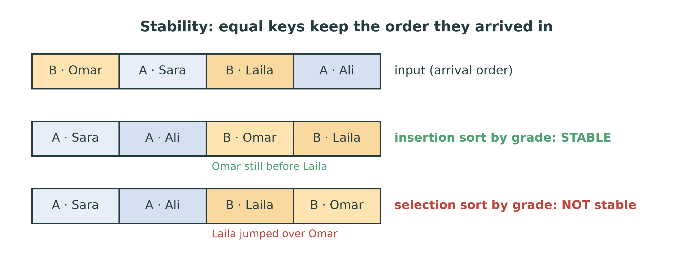
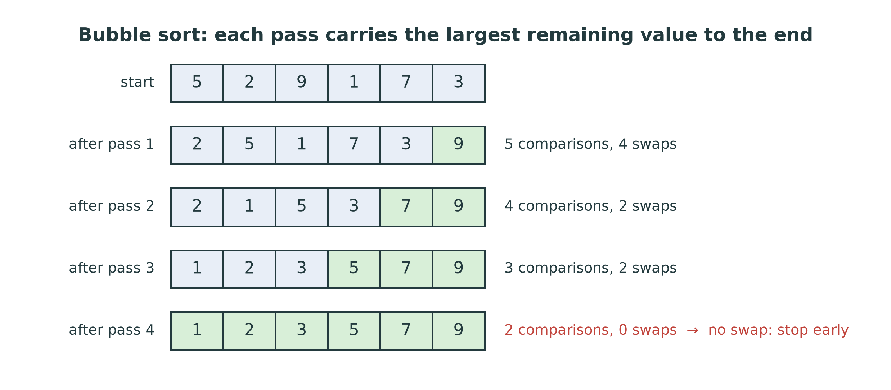
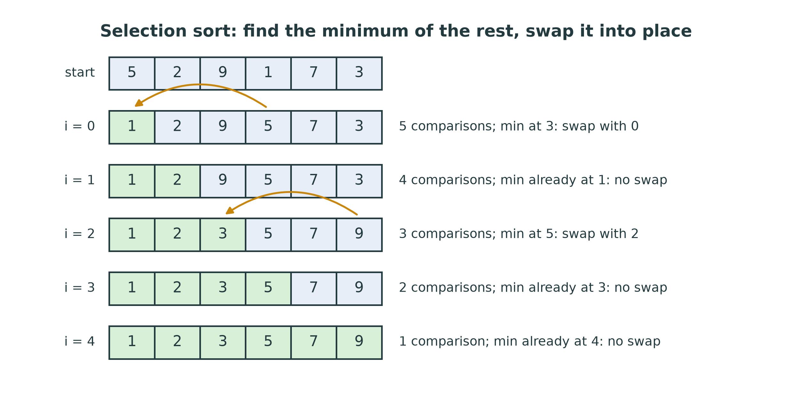
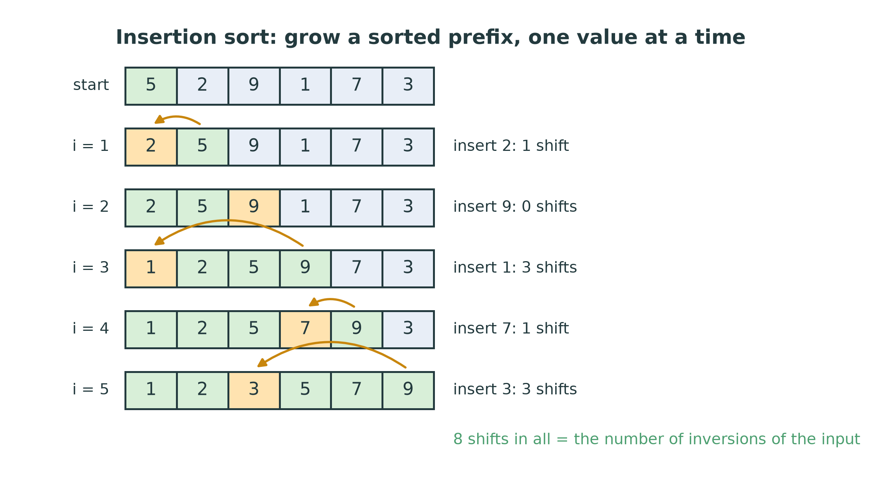
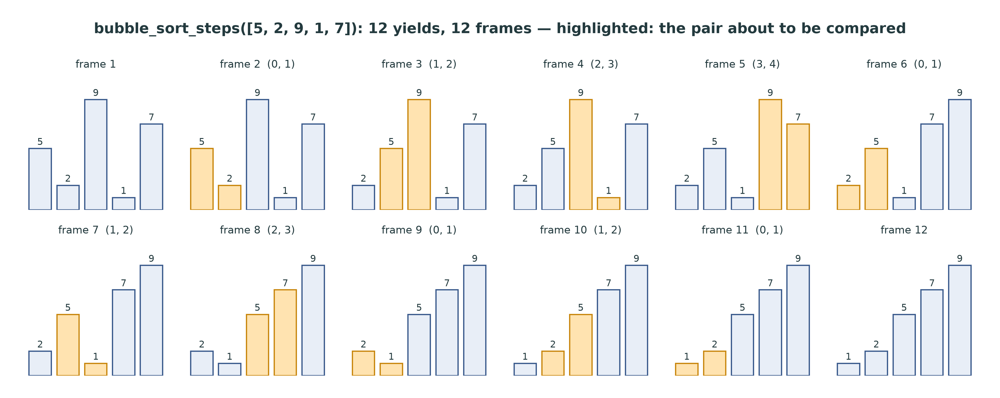
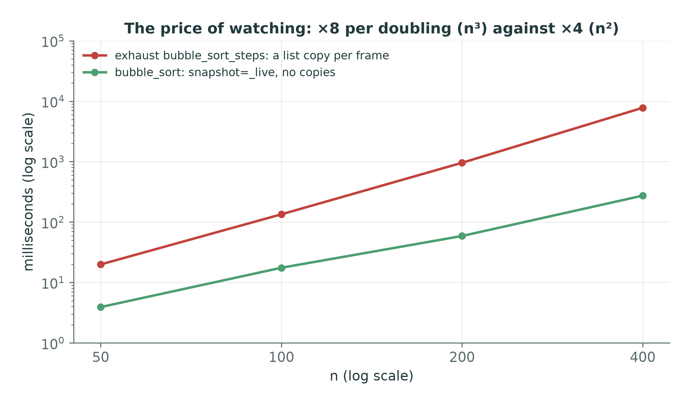
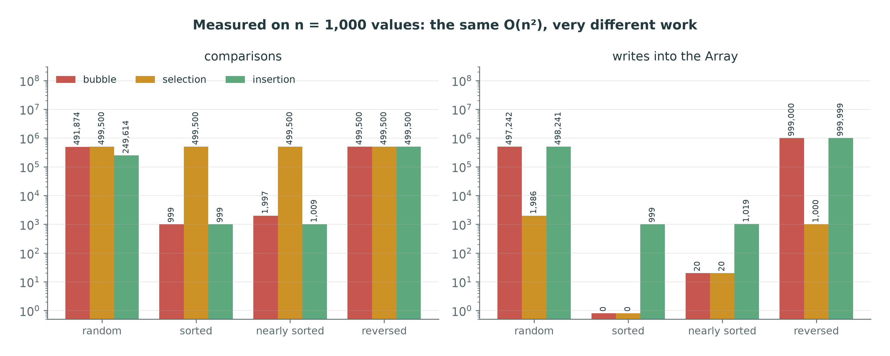
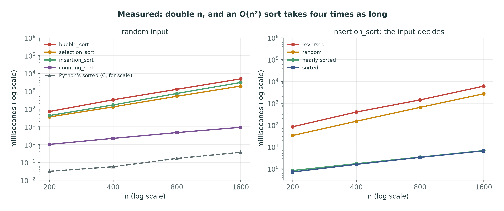
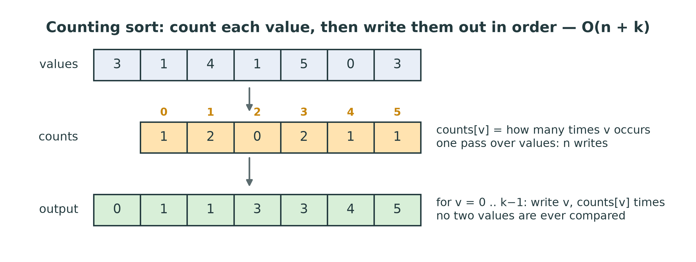
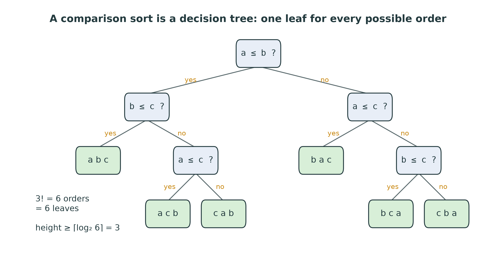

::: {.handout-only}

> **How to read this document.** This is the handout for Lecture 09. It holds
> everything on the slides, plus what I said out loud. Three simple sorts, each
> written once as a **generator** so that you can watch it work, one sort that
> never compares at all, and a proof that no comparison sort can beat
> $n \log n$. Every count and timing in it was measured on the course's own
> code.
>
> Slides: `DSA27-L09-slides.pdf` · Code: `dsa/sorting.py` ·
> Tests: `tests/test_sorting.py`

:::

# Where We Are

## Sorting buys searching

Week 8: on **sorted** data, a search reads 20 values out of a million.

| k searches on n values | Cost |
|---|---|
| linear search, k times | $O(kn)$ |
| sort once, then binary search k times | sort $+ O(k \log n)$ |

Today: **where the sorted data comes from — and what it costs.**

::: {.handout-only}

Lecture 08 ended with a promise it could not keep by itself: binary search,
`lower_bound`, jump and interpolation search all assume that the input is
sorted, and nothing in them makes it so. This week and next are about paying
that bill. The answer to "is sorting first worth it?" depends entirely on what
the sort costs. With the $O(n \log n)$ sorts of Week 10, sorting a million
values costs about 20 million comparisons, and pays for itself after about
twenty searches. With today's $O(n^2)$ sorts it costs about 500 **billion**
comparisons, and pays for itself after half a million searches. The same idea
— sort, then search — is either obviously right or obviously wrong, depending
on which sort you use.

*Sorting* in Arabic: الترتيب. *Sorting algorithm*: خوارزمية ترتيب.

:::

## Today

1. Two words first: **in place** and **stable**
2. Bubble, selection and insertion sort — $O(n^2)$ each, but not the same
3. Watching an algorithm: the `_steps` generator — and its price
4. Best, worst, average: comparisons and writes, **measured**
5. Counting sort: sorting without comparing
6. Why no comparison sort can beat $n \log n$

# Two Words Before Any Algorithm

## In place, and stable

- **In place:** only $O(1)$ extra memory besides the array being sorted.
- **Stable:** elements with **equal keys** keep the order they arrived in.

{width=90%}

::: {.handout-only}

*In place*: في المكان. *Stable*: مستقر. *Key*: المفتاح — the part of an
element the sort compares.

Both words describe **how** a sort arrives at the sorted order, not the order
itself. A sort of plain integers cannot show you whether it is stable: two 3s
look the same whichever came first. Stability only becomes visible when the
elements carry more than their key — records sorted by one field.

In the figure, four students are sorted by grade. Omar arrived before Laila and
both have a B. A stable sort promises Omar still comes before Laila; the
unstable one here swapped Laila over him. Both outputs are **sorted by
grade**. Only one kept the promise.

`dsa/sorting.py` works on a copy: the list you pass is copied into a course
`Array`, the sort rearranges the `Array`, and a new list comes back
(`test_does_not_mutate_the_input`). The rearranging itself uses $O(1)$ extra
slots in all three sorts of today — so we call them in place, even though the
function as a whole returns a new list. Python makes the same distinction:
`values.sort()` sorts in place and returns `None`; `sorted(values)` returns a
new list.

:::

## Why stability matters

Sort a class list **by name**, then **by grade** with a stable sort:

- the result is by grade, and **by name within each grade**, for free.

This is how spreadsheets sort by two columns, and how every database orders
`ORDER BY grade, name`.

::: {.handout-only}

Sorting by several keys with a stable sort works from the **least** important
key to the most important: first by name, then by grade. The second sort
reorders only students with different grades; students with the same grade
compare equal, so a stable sort leaves them in the name order the first sort
gave them. An unstable sort would scramble them.

Python's own `sorted` and `list.sort` are guaranteed stable, for exactly this
reason, and the documentation says so. Of today's three sorts, bubble and
insertion sort are stable and selection sort is not — the figure's unstable
output is what selection sort really does to those four records.

:::

# Three O(n²) Sorts

## Bubble sort

{width=92%}

Compare **neighbours**; swap them if they are out of order. Each pass carries
the largest remaining value to the end. A pass with **no swap** means sorted:
stop.

::: {.handout-only}

*Bubble sort*: ترتيب الفقاعات — the large values rise to the end like bubbles.

On the running example `[5, 2, 9, 1, 7, 3]`, pass 1 walks the whole array. The
9 is larger than everything it meets, so it is swapped at every step until it
reaches the end: after one pass, the largest value is **in its final place**
(green). Pass 2 does the same for the 7 — and need not look at the last slot,
because it already holds the largest value. Pass k needs only $n - k$
comparisons.

The **early exit** is what makes bubble sort worth studying at all. If a whole
pass makes no swap, every neighbour pair is in order, which means the whole
array is sorted: stop. Here pass 4 finds nothing to swap and the sort ends
after 14 comparisons instead of $5 + 4 + 3 + 2 + 1 = 15$. On input that is
already sorted, the first pass swaps nothing and the sort ends after $n - 1$
comparisons: the best case is $O(n)$.

The worst case is reversed input: every comparison swaps, and all $n - 1$
passes run — $n(n-1)/2$ comparisons and as many swaps. $O(n^2)$.

**Stable**, because it swaps only when `a[j] > a[j + 1]` — strictly greater.
Two equal neighbours are never swapped, so equal keys never pass each other.

:::

## The code, written as a generator

::: {.slides-only}

```python
def bubble_sort_steps(values, snapshot=list):
    a = _copy(values)
    n = len(a)
    yield snapshot(a), ()
    for end in range(n - 1, 0, -1):
        swapped = False
        for j in range(end):
            yield snapshot(a), (j, j + 1)
            if a[j] > a[j + 1]:
                a[j], a[j + 1] = a[j + 1], a[j]
                swapped = True
        if not swapped:
            break
    yield snapshot(a), ()


def bubble_sort(values):
    return _finish(bubble_sort_steps(values, snapshot=_live))
```

:::

::: {.handout-only}

```python
def bubble_sort_steps(values, snapshot=list):
    a = _copy(values)
    n = len(a)
    yield snapshot(a), ()
    for end in range(n - 1, 0, -1):          # a[end+1:] is already in place
        swapped = False
        for j in range(end):
            yield snapshot(a), (j, j + 1)      # about to compare
            if a[j] > a[j + 1]:
                a[j], a[j + 1] = a[j + 1], a[j]
                swapped = True
        if not swapped:
            break
    yield snapshot(a), ()


def bubble_sort(values):
    return _finish(bubble_sort_steps(values, snapshot=_live))
```

:::

::: {.handout-only}

This is the reference solution, exactly (`solutions/dsa/sorting.py`). Read it
as two things at once.

**The algorithm** is the loops and the `if`. `end` is the last slot the current
pass still has to look at; after the pass, `a[end]` holds the largest value of
`a[0..end]`, so the next pass stops one earlier. `swapped` records whether this
pass changed anything. `_copy(values)` copies the input into a fresh course
`Array`, so the caller's list is never touched.

**The film** is the `yield` lines. Before each comparison, the generator hands
out a picture of the array and the pair it is about to compare, `(j, j + 1)`,
and pauses. Whoever is iterating decides what to do with each picture: draw it,
count it, or ignore it. A generator (Lab 03, "Generators") runs only as far as
it is asked to — which is what makes a step-by-step animation possible.

**The plain sort** `bubble_sort` is not a second implementation. `_finish` runs
the generator to its end and returns the last state as a list. There is one
piece of code to keep correct, and the animation shows exactly the code the
tests grade. The `snapshot` parameter, and `_live`, are the subject of
"The price of watching" below.

:::

## Selection sort

{width=92%}

Find the **minimum** of the unsorted part; **swap** it into the next slot.
Always $n(n-1)/2$ comparisons — but at most $n - 1$ swaps.

::: {.handout-only}

*Selection sort*: الترتيب بالاختيار.

Round i scans `a[i..n-1]` for its smallest value and swaps it into slot i. After
round i, `a[0..i]` holds the i + 1 smallest values, in order, in their final
places. The scan in round i makes $n - 1 - i$ comparisons whatever the data, so
the total is always $(n-1) + (n-2) + \dots + 1 = n(n-1)/2$: selection sort has
**no** best case. Sorted input costs as much as reversed input.

Its virtue is the other count. There is at most one swap per round — none at
all when the minimum is already in place, as in rounds i = 1, 3 and 4 of the figure
— so at most $n - 1$ swaps in total. That is the fewest of any of today's sorts,
and it matters when a write is much more expensive than a read: moving large
records, or writing to flash memory, which wears out with every write.

**Not stable.** The swap moves `a[i]` a long way to the right, possibly over an
element equal to it. In the stability figure, round i = 1 swaps Omar (B) with
Ali (A), the minimum of the rest: Omar lands at the back, behind Laila, who had
arrived after him.

Two details in the reference: the scan compares with `a[smallest]`, the best
seen **so far** — not with `a[i]` — and the swap is skipped when
`smallest == i`.

:::

## Insertion sort

{width=92%}

Grow a **sorted prefix**. Take the next value; shift every larger value in the
prefix one slot right; drop the value into the hole.

::: {.handout-only}

*Insertion sort*: الترتيب بالإدراج.

This is how most people sort a hand of cards. At round i, `a[0..i-1]` is sorted
(green); `current = a[i]` is the next card. Walk left from `j = i - 1` while
`a[j] > current`, shifting each of those values one slot right; when the walk
stops — at a value not greater than `current`, or off the front of the array —
put `current` in the gap. The highlighted value in each row of the figure is the
one just inserted.

Lab 08's bridge did the same thing with `lower_bound` and `list.insert`. Here
the shifting is written out, and it is the shifting that costs: finding the
place faster would not help, because the elements still have to move.

**Stable**, because the walk stops at a value **equal** to `current` — the loop
condition is `a[j] > current`, strictly greater — so `current` never passes an
equal key. Write `>=` there and the sort still sorts, but loses stability;
`test_insertion_sort_is_stable` catches it.

**Watch the order of the condition**: `j >= 0 and a[j] > current`. The other
way round, `a[j]` is read when `j` is -1. On a Python list that silently reads
the **last** element; the course `Array` refuses negative indices and raises
`IndexError` — one more bug the `Array` catches for you.

The reference's `insertion_sort_steps` writes `current` into the hole after
every shift, not only at the end, so that every frame of the animation is a real
permutation of the input — no value duplicated, none missing. That costs a
second write per shift; the textbook version writes `current` once, after the
loop. The comparisons are the same.

:::

## Insertion sort counts inversions

An **inversion** is a pair $i < j$ with $a[i] > a[j]$ — a pair in the wrong
order.

- Each shift fixes **exactly one** inversion.
- So insertion sort does **one shift per inversion**: 8 for the example.
- Sorted: 0 inversions. Reversed: $n(n-1)/2$. Random: about $n(n-1)/4$.

::: {.handout-only}

*Inversion*: انعكاس.

The inversions of `[5, 2, 9, 1, 7, 3]` are (5,2), (5,1), (5,3), (2,1), (9,1),
(9,7), (9,3) and (7,3): eight, and the figure counts eight shifts. When
`current` moves past a larger value, that pair was inverted and now is not; no
other pair changes its order. So the number of shifts is exactly the number of
inversions, and insertion sort runs in $O(n + I)$ time, where I is the number
of inversions.

That one formula explains its best, worst and average case. Sorted input has no
inversions: $n - 1$ comparisons and no shifts — $O(n)$. Reversed input has every
pair inverted: $n(n-1)/2$ shifts — $O(n^2)$. In a random permutation each pair
is inverted with probability ½, so the average is $n(n-1)/4$ — still
$\Theta(n^2)$, but half the worst case. Bubble sort's swaps obey the same law:
each swap of neighbours also fixes exactly one inversion, so bubble sort makes
exactly I swaps too.

:::

# Watching an Algorithm

## One yield, one frame

{width=100%}

```python
from viz.animate import step_slider, animate_bars
step_slider(bubble_sort_steps([5, 2, 9, 1, 7]))     # scrub by hand
animate_bars(bubble_sort_steps([5, 2, 9, 1, 7]))    # play it
```

::: {.handout-only}

Each `yield` of `bubble_sort_steps` becomes one frame: the values as bars, the
pair about to be compared in amber. Twelve yields for five values — the first
state, ten comparisons, the last state — and twelve frames. `viz/animate.py`
does not know which algorithm it is showing; it only needs a generator that
yields `(values, highlight)` pairs. That is the contract of every `_steps`
function in `dsa/sorting.py`, and it is what lets you watch **your own** code
in the notebook, not a video of someone else's.

`step_slider` is the better tool for learning: you go at your pace, you can go
back, and you can stop on the frame you do not understand. In a notebook,
display an animation with `HTML(animate_bars(...).to_jshtml())`.

Two rules make the frames right, and the tests check both:

- **Each frame must be its own list.** Yield `list(a)`, a fresh copy, not the
  working `Array`. The animation keeps every frame; if they were all the same
  object, they would all show its final state
  (`test_step_frames_are_independent_snapshots`).
- **The last frame must be sorted.** Yield once more after the loops
  (`test_step_form_is_a_generator_ending_sorted`).

:::

## The price of watching

{width=74%}

A copy per frame is $O(n)$. Copy before each of $n^2/2$ comparisons:
**$O(n^3)$**.

The plain sort passes `snapshot=_live` — no copies — and is $O(n^2)$ again.

::: {.handout-only}

The first reference version of `dsa/sorting.py` built `bubble_sort` by running
`bubble_sort_steps` to the end — with a `list(a)` copy at every one of its
$n(n-1)/2$ yields. Each copy costs $n$, so the plain sort cost $\Theta(n^3)$.
The tests could not notice: their largest list has 40 values. Measurement did:
the red line rises **eight** times per doubling of n, the signature of $n^3$
(Lecture 02), and sorting 800 values took over a minute.

The fix keeps one implementation. `snapshot` is the function that turns the
working `Array` into the frame to yield. The default, `list`, makes a copy —
right for an animation. The plain sort passes `_live`:

```python
def _live(a):
    """The working Array itself — no copy. For the plain sorts only."""
    return a
```

Now each yield costs $O(1)$, and `_finish` makes one copy at the very end. The
green line rises four times per doubling: $O(n^2)$, as promised. The lesson is
not about sorting. **Instrumenting code changes its cost**, and only measuring
tells you by how much. A print statement inside a loop, a log line, an
assertion that checks `is_sorted` at every step: each one is an $O(n)$ that can
hide inside your $O(n^2)$.

:::

# Best, Worst, Average

## Counting comparisons and writes

{width=100%}

::: {.handout-only}

Time depends on your machine; **counts** do not. The figure counts, for n = 1,000
values, every comparison — by sorting objects whose `<` and `>` add 1 to a
counter — and every write into the course `Array`, by counting calls to its
`__setitem__`. `tools/figures_l09.py` does both; the lab asks you to write the
comparison counter yourself.

What to read off it:

- **Selection sort compares 499,500 times on every input** — $n(n-1)/2$ — even
  on sorted data. But it writes at most 1,998 times: two writes per swap, at
  most $n - 1$ swaps. On reversed input it swaps only 500 times: each swap
  fixes both ends.
- **Bubble and insertion sort** do $n - 1 = 999$ comparisons on sorted input and
  about 1,000–2,000 on nearly sorted input (1% of neighbours swapped): **the
  early exit and the stopping walk pay off.**
- **Writes follow the inversions.** On the random input, with 248,621
  inversions, bubble sort writes 2 × 248,621 = 497,242 times — two writes per
  swap. Insertion sort writes 498,241: two per shift in the reference (see
  "Insertion sort"), plus one final write per value.
- **Random input:** insertion sort makes about half the comparisons of bubble
  sort (249,614 against 491,874). Bubble sort's early exit rarely fires on
  random data, so it does nearly all $n(n-1)/2$.

All three are $O(n^2)$ in the worst case. The counts show that the same class
can hide a factor of two, or of a thousand, in the cases you actually meet.

:::

## The table

| | best | average | worst | writes | stable | in place |
|------------------|--------------|--------------|--------------|-----------------|-----|-----|
| bubble (early exit) | $n$ | $n^2$ | $n^2$ | I swaps | yes | yes |
| selection | $n^2$ | $n^2$ | $n^2$ | $\le n - 1$ swaps | **no** | yes |
| insertion | $n$ | $n^2$ | $n^2$ | I shifts | yes | yes |
| counting | $n + k$ | $n + k$ | $n + k$ | $2n$ | — | **no**, $O(n + k)$ |

**I** = the number of inversions: 0 when sorted, $n(n-1)/2$ when reversed.

::: {.handout-only}

Best, worst and average are about **inputs of the same size**: the best case is
the kindest input of size n, the worst case the cruellest, and the average case
the expected cost over all $n!$ orders, each equally likely. They are three
different functions of n, and each can be given its own $O$ — which is why
"insertion sort is $O(n^2)$" and "insertion sort is $O(n)$ on sorted input" are
both true.

Exact comparison counts: bubble sort with the early exit makes $n - 1$ at best
and $n(n-1)/2$ at worst; selection sort exactly $n(n-1)/2$ always; insertion
sort between $n - 1$ and $n(n-1)/2$, and $I + n - 1$ at most. The "stable"
column for counting sort is a dash because `counting_sort` rebuilds integers
from counts: equal integers are indistinguishable, so there is nothing to keep
in order. The stable version, which moves whole records, is a practice
problem (W9-C5).

:::

## Measured time

{width=100%}

::: {.handout-only}

**Left: random input.** Each doubling of n multiplies the time of the three
$O(n^2)$ sorts by about four: bubble sort went from 72 ms at n = 200 to 4.9 s at
n = 1,600 — 8 times the data, 68 times the time. Selection sort is the fastest
of the three here, although it compares the most: in Python, a comparison is
cheap next to the reads and writes of a swap, and selection sort writes almost
nothing. Counting sort is a straight line of slope 1 — $O(n)$, 9 ms at
n = 1,600. The dashed line is Python's built-in `sorted`, written in C:
0.36 ms. That gap is the language, not the algorithm — Week 10's sorts, in
Python, will not reach it either.

**Right: the same insertion sort on four inputs of the same size.** At
n = 1,600, reversed input took 6.0 s, random 2.7 s — half, as the inversion
count predicts — and nearly sorted input **6.7 ms**, about 400 times faster than
random, and no slower than sorted input. Nearly sorted is its best case in
practice, not only in theory.

Your times will differ from these; the ratios will not.

:::

## Insertion sort on nearly sorted input

$O(n + I)$: if every value is at most **k** places from home, $I \le nk$ —
**linear** for small k.

Real sorts use it:

- **Timsort** (Python, Java): insertion sort on short runs.
- **Introsort** (C++): quicksort, then insertion sort on small pieces.

::: {.handout-only}

Data in real programs is often nearly sorted: a sorted list with a few new
records appended, a log whose timestamps are a little out of order, last
week's ranking with a few changes. Insertion sort handles all of these in close
to linear time, with no extra memory, and it is stable. It is also fastest of
all sorts on **tiny** arrays, because its loop does so little per step.

That is why the $O(n \log n)$ sorts you will meet next week are rarely used
alone. Python's `sorted` is **Timsort** (Tim Peters, 2002), a merge sort that
first finds the runs already in order and extends short ones with (binary)
insertion sort. C++'s `std::sort` is usually **introsort** (David Musser,
1997): quicksort that switches to heap sort if the recursion goes too deep, and
finishes small pieces with insertion sort. The "slow" sort of today is inside
the fast sorts of the real world.

If each value is at most k places from its sorted position, each has at most
k larger values before it, so $I \le nk$ and insertion sort is $O(nk)$ — a
practice problem (W9-C4).

:::

# Beyond Comparisons

## Counting sort

{width=92%}

Values are small non-negative integers, below k: **count** them, then write
each value out as many times as it was counted. $O(n + k)$. **No comparisons.**

::: {.handout-only}

*Counting sort*: الترتيب بالعد.

`counting_sort(values, max_value=None)` works in three steps:

1. **k.** With no `max_value`, find the largest value; `k = max + 1` slots,
   one per possible value 0 .. max. An empty list is sorted already — return
   `[]` before `max` sees it.
2. **Count.** A course `Array` of k zeros; for each value v, add 1 to
   `counts[v]`. The value **is** the index — that is the whole trick.
3. **Write out.** For v from 0 to k - 1, write v into the output `counts[v]`
   times.

Time: one pass over the n values, one over the k counts, and n writes: $O(n + k)$.
Extra space: $O(n + k)$ — not in place.

**The catch is k.** Sorting ten exam marks out of 100 is quick; sorting ten
phone numbers means an `Array` of ten billion counters. Counting sort is fast
exactly when the **range** of the values is not much larger than their
**number**. It also needs keys that can be used as indices: non-negative
integers, or things that map to them (letters, grades, ages). The reference
raises `ValueError` for anything else.

:::

## No comparison sort can beat $n \log n$

{width=88%}

n values have **n!** possible orders; the sort must tell them all apart.
Each comparison has 2 outcomes. So the worst case needs at least
$\log_2 n! \approx n \log_2 n$ comparisons.

::: {.handout-only}

*Lower bound*: الحد الأدنى. *Decision tree*: شجرة القرار.

The argument, intuitively. Take any sort that learns about its input **only**
by comparing two elements. Draw every comparison it might make as a node, with
two branches for the two answers: that is its **decision tree**. The figure is
insertion sort's tree for three values a, b and c. A run of the sort on one
input is a path from the root to a leaf, and the number of comparisons is the
length of the path.

Each leaf must correspond to **one** order of the input. If two different orders
reached the same leaf, the sort would do the same moves on both and get one of
them wrong. There are $n!$ orders, so the tree needs at least $n!$ leaves. A
binary tree of height h has at most $2^h$ leaves, so
$2^h \ge n!$, that is $h \ge \log_2 n!$. The height is the worst-case number of
comparisons.

How big is $\log_2 n!$? For 3 values, $\log_2 6 \approx 2.6$: at least **3**
comparisons in the worst case, and the tree in the figure achieves it. For 10
values, $\log_2 3{,}628{,}800 \approx 21.8$: at least 22. For a thousand, about
8,530 — against 499,500 for today's sorts. In general
$\log_2 n! = \Theta(n \log n)$: half the factors of $n!$ are at least $n/2$, so
$n! \ge (n/2)^{n/2}$, and $\log_2 n! \ge \frac{n}{2} \log_2 \frac{n}{2}$.

So $n \log n$ is a floor for **every** comparison sort, including ones nobody has
invented yet. Week 10's merge sort and heap sort reach it; nothing that only
compares can go below it. (The same argument also bounds the average case — a
stronger result, and beyond this course.)

:::

## How counting sort escapes

The lower bound assumes the sort learns **only by comparing**.

Counting sort never compares: `counts[v] += 1` uses the value **as an address**
— one step with k possible outcomes, not 2.

::: {.handout-only}

This is the honest reading of the lower bound: it is not a law about sorting,
it is a law about **comparison** sorting. Counting sort gets more information
per step because it assumes more about the data — that the keys are small
integers — and uses the key to choose one of k slots at once. The price is the
$O(k)$ memory and the restriction on the keys.

Radix sort (not examined in this course) pushes the same idea further: it sorts
large integers digit by digit, with a **stable** counting sort per digit,
in $O(d(n + b))$ time for d digits in base b. That is why the stable version of
counting sort matters, and why W9-C5 asks you to write it.

:::

# This Week

## Exercises: `dsa/sorting.py`

| Function | The trap |
|---|---|
| `bubble_sort_steps` | yield `list(a)`, not `a`; `range(end)`; reset `swapped` each pass |
| `selection_sort_steps` | compare with `a[smallest]`, not `a[i]`; one swap per round |
| `insertion_sort_steps` | `j >= 0` **first**; `>` not `>=` (stability) |
| `bubble_sort`, `selection_sort`, `insertion_sort` | exhaust the generator; copy nothing per step |
| `counting_sort` | `k = max + 1`; the empty list; the value is the index |

```powershell
pytest tests/test_sorting.py -v `
    -k "bubble or selection or insertion or counting or is_sorted"
```

::: {.handout-only}

Thirty-nine tests (`is_sorted` is given, and its one test already passes).
Every sort is held to the same contract by parametrised tests: eight fixed
cases (empty, one value, two, duplicates, sorted, reversed, negatives), twenty
random lists, "does not mutate the input", and the two tests on the `_steps`
form. Merge, quick and heap sort share the file and are Week 10's — the `-k`
filter leaves them out.

Store the working copy in a course `Array` (`Array.from_values(values)`), as
the storage rule requires; return a list. Do not call `sorted`, `list.sort` or
`min` inside `dsa/sorting.py` — the point is to write the sort, not to call one.

:::

## Homework 9 — before Lecture 10

1. **Implement** the four sorts until the 39 tests pass.
2. **Trace** each of the three sorts on `[4, 1, 3, 9, 7, 2]`, one row per
   pass or round, counting comparisons and swaps or shifts.
3. **Count.** Write a class whose `<` and `>` count, sort 1,000 of them
   sorted, reversed and random, and compare with the figure.
4. **Break it.** Change `>` to `>=` in your insertion sort. Which tests fail?
   Now sort `[(1, 'a'), (1, 'b')]` — why can a list of tuples not show the
   bug?

::: {.handout-only}

For item 3, the class needs `__init__`, `__lt__` and `__gt__` (Lab 03,
"Special methods"), and a counter they share — a class attribute. The
lab walks you through it.

For item 4, look at how tuples compare: `(1, 'a') < (1, 'b')` is `True`. Two
tuples that are "equal by their first item" are not equal to Python, so the
sort orders them by their second item — which happens to be their arrival
order. `test_insertion_sort_is_stable` uses cards that compare by key **only**
for exactly this reason.

:::

# Summary

## Seven things to keep

1. Sorting is what makes Week 8's searches possible — **and its cost decides**
   whether sort-then-search is worth it.
2. **Stable:** equal keys keep their order. Bubble and insertion are; selection
   is not.
3. Bubble and insertion sort: **$O(n)$ best, $O(n^2)$ worst**. Selection sort:
   $n(n-1)/2$ comparisons always, but at most $n - 1$ swaps.
4. Insertion sort does one shift per **inversion**: $O(n + I)$ — near-linear on
   nearly sorted data, which is why real sorts use it.
5. A `_steps` generator lets you watch your own code — and a copy per frame
   turns $O(n^2)$ into **$O(n^3)$**.
6. Counting sort is $O(n + k)$ with **no comparisons** — fast only when k is
   small.
7. Every comparison sort needs **$\log_2 n! = \Theta(n \log n)$** comparisons in
   the worst case.

## Next

**Week 10 — Advanced sorting.** Merge sort, quicksort and heap sort: three ways
to reach the $n \log n$ floor — and why quicksort's pivot decides between
$n \log n$ and $n^2$.

::: {.handout-only}

---

## Sources and further reading

- **D. E. Knuth.** *The Art of Computer Programming*, vol. 3, *Sorting and
  Searching*, 2nd ed., Addison-Wesley, 1998, §5.1.1 (inversions), §5.2.1
  (insertion sort), §5.2.2 (bubble sort), §5.2.3 (selection sort), §5.3.1
  (the comparison lower bound).
- **T. H. Cormen, C. E. Leiserson, R. L. Rivest and C. Stein.** *Introduction to
  Algorithms*, 4th ed., MIT Press, 2022, §2.1 (insertion sort), §8.1 (lower
  bounds for sorting), §8.2 (counting sort).
- **O. Astrachan.** "Bubble Sort: An Archaeological Algorithmic Analysis",
  *SIGCSE Bulletin* 35(1), 2003 — where the name and the algorithm came from,
  and why it survives in teaching.
- **T. Peters.** "listsort.txt", in the CPython source tree — the design of
  Timsort, including its use of binary insertion sort on short runs.
- **D. R. Musser.** "Introspective Sorting and Selection Algorithms",
  *Software: Practice and Experience* 27(8), 1997.
- **Python documentation.** "Sorting Techniques" (the Sorting HOW TO) — stability
  and sorting by several keys.

Every figure in this lecture is generated by `tools/figures_l09.py`. The
diagrams are traces computed and checked by the script; the counts and timings
are measured on the reference `dsa/sorting.py`, and your timings will differ.

:::
