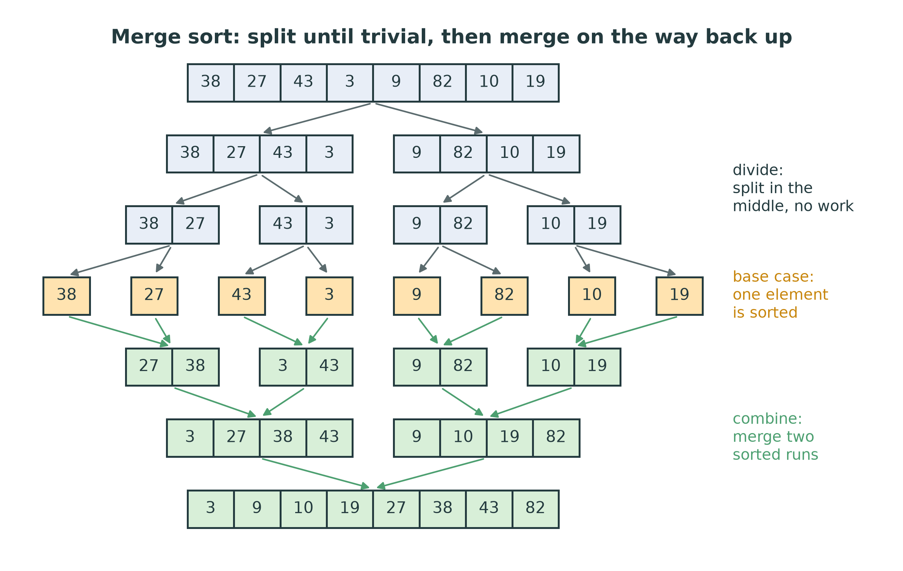
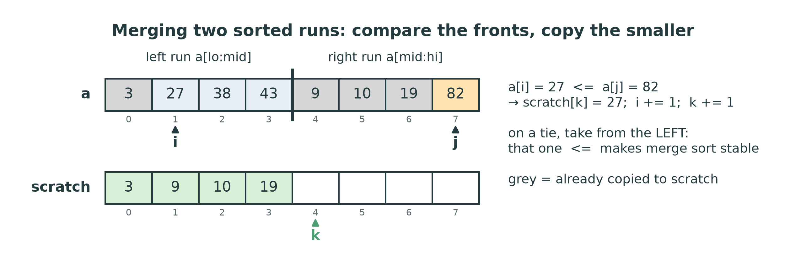
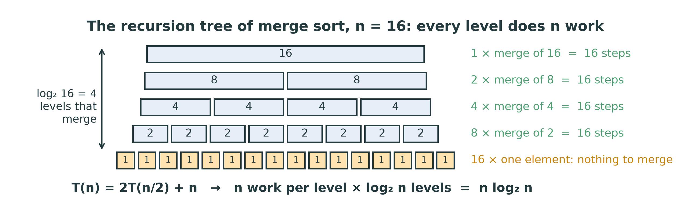
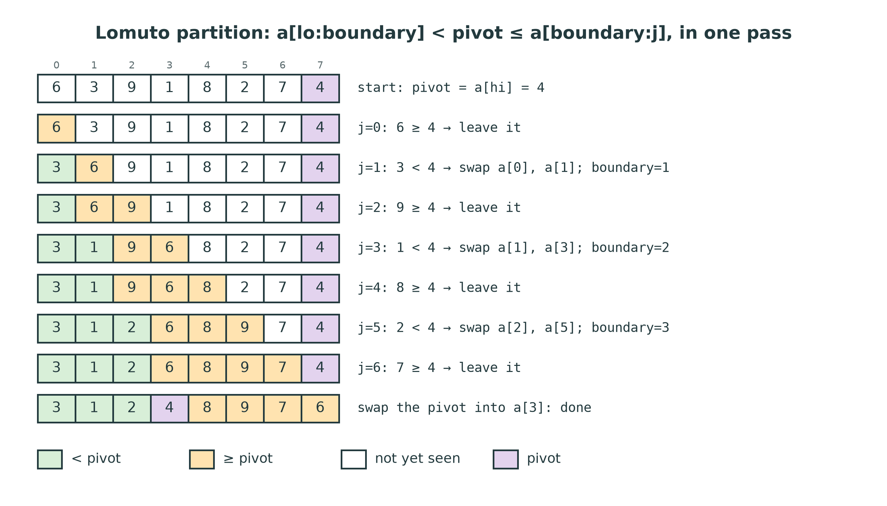
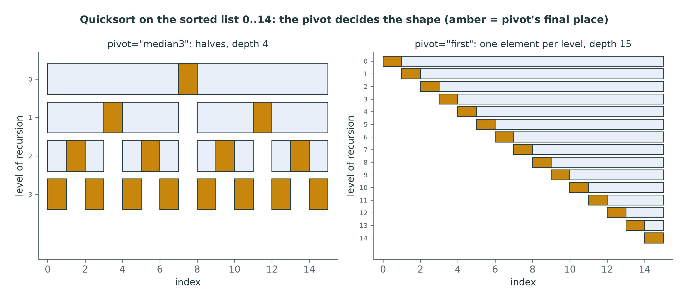
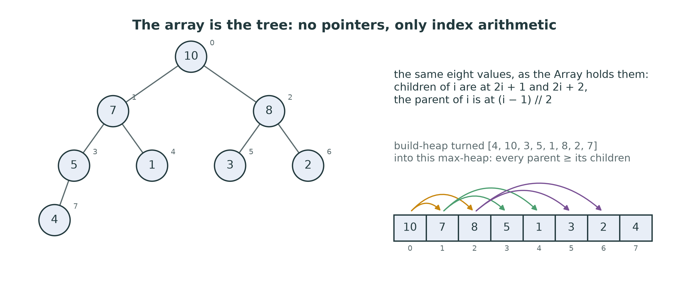
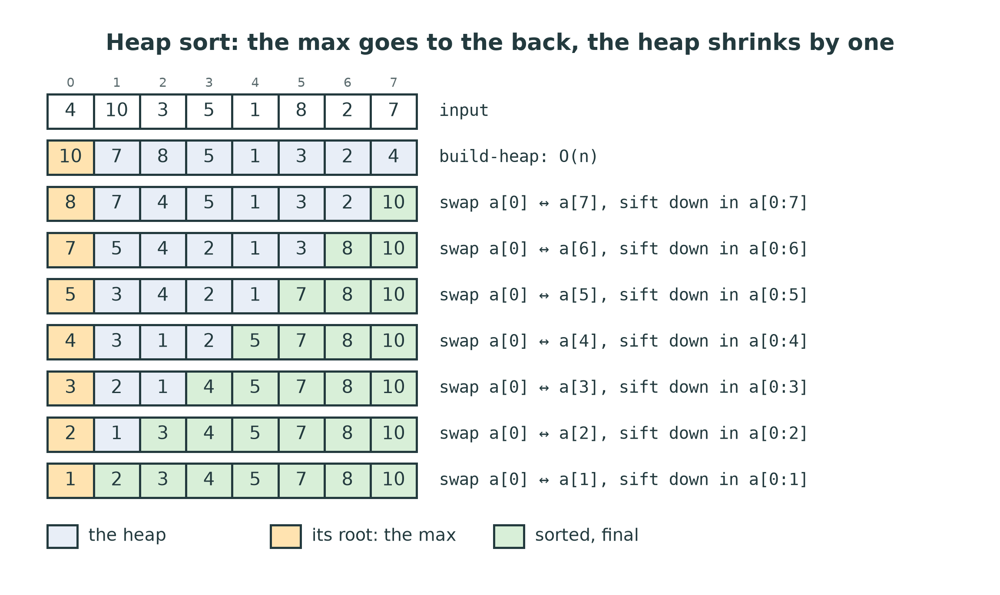
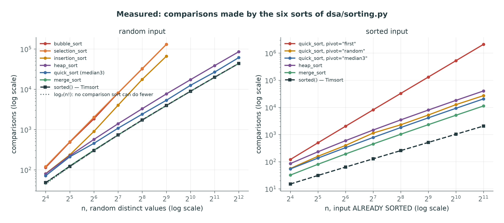
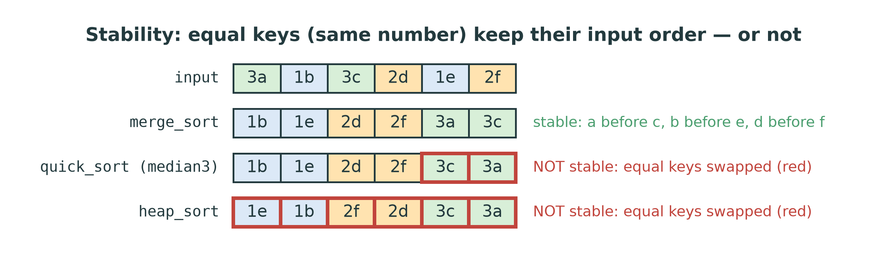

::: {.handout-only}

> **How to read this document.** This is the handout for Lecture 10. It holds
> everything on the slides, plus what I said out loud. Last week's three sorts
> all cost $O(n^2)$. This week, three sorts that cost $O(n \log n)$ — merge
> sort, quicksort and heap sort — and one idea behind the first two: **divide
> and conquer**. Every trace in this handout was produced by running the
> reference code, and every number in the measured section was counted, not
> estimated.
>
> Slides: `DSA27-L10-slides.pdf` · Code: `dsa/sorting.py` (the second half) ·
> Tests: `tests/test_sorting.py -k "merge or quick or heap"`

:::

# Where We Are

## From $n^2$ to $n \log n$

Week 9: bubble, selection, insertion — **$O(n^2)$** comparisons.

| n | $n^2 / 2$ | $n \log_2 n$ |
|---|---|---|
| 1,000 | 500,000 | 10,000 |
| 1,000,000 | 500,000,000,000 | 20,000,000 |

Today: three sorts on the right-hand column — and the price each one pays.

::: {.handout-only}

At a million values, an $O(n^2)$ sort does about 25,000 times more work than
an $O(n \log n)$ one. Nothing you can do to the constant closes a gap like
that; only a different algorithm does. Week 9's sorts all move an element by
**one** place per comparison, or compare every pair; this week's sorts each
find a way to let one comparison settle the order of many elements at once.

*Sorting* in Arabic: الترتيب. *Merge sort*: الترتيب بالدمج. *Quicksort*:
الترتيب السريع. *Heap sort*: الترتيب بالكومة.

:::

## Today

1. Divide and conquer
2. Merge sort: $T(n) = 2T(n/2) + n$, stable, $O(n)$ extra space
3. Quicksort: partition, pivots, and a worst case you will **measure**
4. Heap sort: the array is the tree — Week 12 arriving early
5. Measured: all six sorts, one picture
6. What Python's `sorted()` actually does
7. Stability, and the table to remember

# Divide and Conquer

## Three steps

1. **Divide** the problem into smaller problems of the same kind.
2. **Conquer** each one — recursively, until it is trivial.
3. **Combine** their answers into the answer.

Merge sort: divide is free, **combine** does the work.
Quicksort: **divide** does the work, combine is free.

::: {.handout-only}

*Divide and conquer* in Arabic: فرق تسد. You have met the pattern twice.
Lecture 03's recursions split a problem and trusted the recursive call to
solve the smaller part; Lecture 08's binary search is divide and conquer with
only **one** of the two halves kept, which is why it costs $\log n$ and not
$n$. This week both halves are kept, and each has to be sorted.

The two sorts in this lecture are mirror images, and that is worth saying out
loud before any code. Merge sort splits the array in the middle without
looking at it, and does all its thinking when it **merges** two sorted halves.
Quicksort thinks first — it **partitions** the array into "small" and "large"
around a pivot — and then there is nothing left to combine: small, pivot,
large is already in order.

:::

# Merge Sort

## Split until trivial, merge on the way up

{width=66%}

::: {.handout-only}

The figure is `merge_sort([38, 27, 43, 3, 9, 82, 10, 19])`. Going down, each
range is cut at `mid = (lo + hi) // 2` — no comparisons, no moves. At the
bottom, every range holds one element, and **a one-element list is sorted**:
that is the base case. Going up, each pair of neighbouring sorted runs is
merged into one sorted run, until the whole array is one run. The merged rows
are the real states yielded by `merge_sort_steps`, taken from the reference
code; the order of the seven merges is

```text
a[0:2]  a[2:4]  a[0:4]  a[4:6]  a[6:8]  a[4:8]  a[0:8]
```

— left half first, completely, then the right half, then the two together:
the order of a recursive call tree (Lecture 03).

:::

## Merging two sorted runs

{width=92%}

Compare the two **fronts**; copy the smaller to `scratch`; advance that side.
When one run is empty, copy the rest of the other.

::: {.handout-only}

You have written this twice already. In Week 2, `merge_sorted(a, b)` in
`dsa/array_ops.py` merged two `Array`s into a new one with a loop; in Week 3,
`merge_sorted(left, right)` in `dsa/recursion.py` did it recursively, and its
docstring promised: *"This is the merge step of merge sort."* (Lecture 03,
"Merging: recursion on two inputs"). Lecture 03 also warned that the recursive
version is `n + m` frames deep, too deep for Python on long lists — and "a good
reason why merge sort's real merge step, in Week 10, is a loop". Here it is.

Two runs of lengths $n_1$ and $n_2$ merge in at most $n_1 + n_2 - 1$
comparisons, because each comparison sends exactly one element to `scratch`,
and the last element needs no comparison at all. In the figure, the left run
is 3 27 38 43 and the right run is 9 10 19 82. Four elements have gone
(3, 9, 10, 19); now 27 is compared with 82, and 27 goes.

:::

## `_merge`: the code

::: {.slides-only}

```{=latex}
\scriptsize
```

:::

```python
def _merge(a, lo, mid, hi, scratch):
    i, j, k = lo, mid, lo
    while i < mid and j < hi:
        if a[i] <= a[j]:
            scratch[k] = a[i]
            i += 1
        else:
            scratch[k] = a[j]
            j += 1
        k += 1
    while i < mid:
        scratch[k] = a[i]
        i += 1
        k += 1
    while j < hi:
        scratch[k] = a[j]
        j += 1
        k += 1
    for k in range(lo, hi):
        a[k] = scratch[k]
```

::: {.handout-only}

This is `_merge` from the reference solution, exactly (without its
docstring). The runs are `a[lo:mid]` and `a[mid:hi]` — half-open ranges, as in
Lecture 08's bounds. `i` walks the left run, `j` the right run, and `k` the
next free slot of `scratch`. After the main loop, **one** of the two runs is
exhausted and the other still has a sorted tail; only one of the two
"leftover" loops does anything. The last loop copies the merged range back
into `a`, because the next merge up the tree reads from `a`.

**The `<=` is the whole of stability.** When `a[i]` and `a[j]` are equal, `<=`
takes from the **left** run — the element that came first in the input. Write
`<` and the sort is still correct, and every test that compares numbers still
passes; but equal keys come out in the wrong order. See "Stability" below.

:::

## `merge_sort_steps`: divide, conquer, combine

::: {.slides-only}

```{=latex}
\footnotesize
```

:::

```python
a = _copy(values)
scratch = Array(len(a))
yield list(a), ()

def sort(lo, hi):
    if hi - lo <= 1:
        return
    mid = (lo + hi) // 2
    yield from sort(lo, mid)
    yield from sort(mid, hi)
    _merge(a, lo, mid, hi, scratch)
    yield list(a), tuple(range(lo, hi))

yield from sort(0, len(a))
yield list(a), ()
```

::: {.handout-only}

The body of `merge_sort_steps` in the reference. `sort(lo, hi)` sorts
`a[lo:hi]`; ranges of 0 or 1 elements are the base case. The three steps of
divide and conquer are the three lines in the middle: compute `mid`, sort both
halves, merge.

**Why `yield from`?** `sort` is itself a generator — it yields a snapshot
after each merge — so calling `sort(lo, mid)` only **creates** a generator and
runs nothing. `yield from` runs it and passes each of its snapshots up to
whoever is iterating `merge_sort_steps`. Forget it, write `sort(lo, mid)` on
its own line, and nothing below the top level is ever sorted: the sort returns
the input barely changed, and the tests fail.

**One scratch `Array`, shared by every merge.** Allocating a new scratch array
in every call would also be correct, but $n$ calls each allocating up to $n$
slots is a lot of memory churn. One `Array(len(a))`, made once, is enough,
because a merge of `a[lo:hi]` only ever uses `scratch[lo:hi]`. The extra space
is therefore exactly $n$ slots, plus the call stack, which is only
$\log_2 n$ frames deep because the ranges halve.

The plain form, `merge_sort(values)`, runs this generator to the end and
returns the last state — one implementation for the tests and the animation.

:::

## How much work? $T(n) = 2T(n/2) + n$

{width=94%}

$\log_2 n$ levels, $n$ work per level: **$O(n \log n)$** — best, average and
worst case alike.

::: {.handout-only}

A **recurrence** (Lecture 03) states the cost of a recursive function in terms
of its own cost on smaller inputs. For merge sort on n elements: two sorts of
n/2 elements, plus a merge that touches all n. So $T(n) = 2T(n/2) + cn$ for some
constant c, with $T(1) = c$.

**The recursion tree** solves it by picture. The top call merges n elements.
Its two children merge n/2 each — n in total. The four grandchildren merge n/4
each — n again. Every level adds up to n, because the ranges on one level
partition the array. The ranges halve at each level, so after $\log_2 n$
levels they have one element and the recursion stops. Total:
$n \cdot \log_2 n$. *Recursion tree* in Arabic: شجرة الاستدعاءات.

**By unrolling**, if you prefer algebra: $T(n) = 2T(n/2) + n = 4T(n/4) + 2n =
8T(n/8) + 3n = \dots = 2^k T(n/2^k) + kn$. Stop when $n/2^k = 1$, that is
$k = \log_2 n$: $T(n) = n T(1) + n \log_2 n = O(n \log n)$.

**Always** $n \log n$: merge sort splits in the middle whatever the values
are, so no input is bad for it. Sorted input only saves comparisons inside each
merge — the left run empties first, after $n/2$ comparisons instead of about
$n$ — measured: 5,120 comparisons for 1,024 sorted values against 8,935 for
random ones. The **moves** are the same either way: every level copies all n
elements to `scratch` and back.

:::

## The price: $O(n)$ extra space

- Merge sort is **not in place**: `scratch` holds n slots.
- The call stack adds $O(\log n)$.
- Fine for n = 10^6^ numbers; a real cost on a small device, or for data
  that barely fits in memory.

::: {.handout-only}

Merging two runs in place, without a second array, is possible but
complicated and slower in practice; nobody teaches it in a first course, and
the standard libraries do not do it. The honest summary is: merge sort buys a
guaranteed $O(n \log n)$ and stability with $n$ extra slots. Quicksort and heap
sort, next, work inside the array itself.

The same merge is also how you sort data **too big for memory**: sort chunks
that fit, write each sorted run to disk, then merge the runs, reading each one
front to back. That is *external sorting*, and it is still merge sort — only
the runs live in files.

:::

# Quicksort

## Partition, then recurse

Pick a **pivot**. Rearrange so that

$$\underbrace{\;< \text{pivot}\;}_{\text{left part}} \quad \text{pivot} \quad \underbrace{\;\geq \text{pivot}\;}_{\text{right part}}$$

The pivot is now in its **final place**. Sort the two parts; nothing to
combine.

::: {.handout-only}

C. A. R. Hoare invented quicksort in 1959 and published it in 1961 ("Algorithm
64: Quicksort", *Communications of the ACM* 4(7)). *Pivot* in Arabic: المحور.
*Partition*: التقسيم.

After a partition, the pivot never moves again: everything smaller is to its
left and everything larger or equal is to its right, and sorting those two
parts cannot change that. So each partition fixes **one** element for good and
splits the rest into two smaller, independent problems. How much smaller
depends entirely on the pivot — and that is the story of quicksort.

:::

## Lomuto's partition

{width=62%}

::: {.handout-only}

There are two classic partition schemes. Hoare's original moves two indices
towards each other; the one in `dsa/sorting.py` is **Lomuto's**, popularised by
Jon Bentley in *Programming Pearls* because it is the easier of the two to get
right. It uses the **last** element as the pivot, one index `j` that scans
left to right, and one `boundary`:

- `a[lo:boundary]` holds values **< pivot** (green in the figure);
- `a[boundary:j]` holds values **$\geq$ pivot** (amber);
- `a[j:hi]` has not been looked at yet (white);
- `a[hi]` is the pivot.

Each step looks at `a[j]`. If it is at least the pivot, the amber region simply
grows by one: nothing moves. If it is smaller, it is swapped with the first
amber value, `a[boundary]`, and `boundary` moves right: the green region grows
by one and the amber region shifts along. At the end, one last swap puts the
pivot between the two regions, at `boundary`.

The figure traces `Q = [6, 3, 9, 1, 8, 2, 7, 4]`. The pivot is 4; the values
3, 1 and 2 are smaller and end up in `a[0:3]`; the pivot lands at index 3. The
partition made 7 comparisons, one per non-pivot element: $n - 1$, always.

:::

## `_partition`: the code

```python
def _partition(a, lo, hi):
    pivot = a[hi]
    boundary = lo
    for j in range(lo, hi):
        if a[j] < pivot:
            a[boundary], a[j] = a[j], a[boundary]
            boundary += 1
    a[boundary], a[hi] = a[hi], a[boundary]
    return boundary
```

**Invariant:** `a[lo:boundary] < pivot <= a[boundary:j]`.

::: {.handout-only}

Note the ranges: `lo` and `hi` here are **inclusive**, `a[lo..hi]`, with the
pivot at `hi` — unlike `_merge`, whose `hi` is excluded. Both are fine; what is
not fine is mixing them up within one function. The invariant is true before
the loop (both regions are empty), each step keeps it true, and at the end
`j == hi`, so the whole range except the pivot has been sorted into the two
regions. The final swap moves the first amber value to the end — which keeps it
amber — and puts the pivot at `boundary`.

`a[j] < pivot` is strict: values **equal** to the pivot go right. With many
equal values that is a weakness — a list of a thousand equal values partitions
into 0 and 999, the worst case again. Industrial quicksorts use a three-way
partition (< , =, >) for this reason; it is not required here.

:::

## Choosing the pivot

::: {.slides-only}

```{=latex}
\footnotesize
```

:::

```python
def _choose_pivot(a, lo, hi, strategy, rng):
    if strategy == "first":
        return lo
    if strategy == "last":
        return hi
    if strategy == "random":
        return rng.randint(lo, hi)
    if strategy == "median3":
        mid = (lo + hi) // 2
        first, middle, last = a[lo], a[mid], a[hi]
        if first <= middle <= last or last <= middle <= first:
            return mid
        if middle <= first <= last or last <= first <= middle:
            return lo
        return hi
    raise ValueError(...)
```

The chosen pivot is swapped to `a[hi]`; then `_partition` runs as before.

::: {.handout-only}

`quick_sort(values, pivot="median3")` takes the strategy by name, and the
reference passes it to this function (its `raise` line is shortened here). The
index it returns is swapped with `a[hi]`, so that `_partition` never needs to
know how the pivot was chosen:

```python
p = _choose_pivot(a, lo, hi, pivot, rng)
a[p], a[hi] = a[hi], a[p]
q = _partition(a, lo, hi)
```

- **first / last**: free, and fine on random data. On sorted data, a disaster —
  next slide.
- **random**: a random index in `lo..hi`. No fixed input is bad for it; a bad
  run needs bad luck at every level. The reference seeds its generator
  (`random.Random(27)`) so that the animation is the same every time.
- **median3**: the median of the first, middle and last values — R. C.
  Singleton's suggestion (1969). Up to three extra comparisons per partition
  buy a pivot that is never the smallest or largest of those three; on sorted
  input it is the exact middle.

The median-of-three is written with comparisons, not with `sorted()`:
`dsa/sorting.py` does not call the library's sort to write its own.

:::

## The worst case, measured

{width=90%}

Sorted input, `pivot="first"`: every partition peels off **one** element.
$(n-1) + (n-2) + \dots + 1 = n(n-1)/2$ comparisons: **$O(n^2)$**.

::: {.handout-only}

On `[0, 1, ..., 14]` with `pivot="first"`, the pivot is the smallest value in
its range every time. The "small" part is empty, the "large" part has all the
rest, and the next partition is only one element shorter. Fifteen levels for
fifteen elements, against four for `median3`, which picks the exact middle of
each sorted range and halves it.

**Counted, not guessed.** The reference `quick_sort(list(range(n)),
pivot="first")` makes exactly $n(n-1)/2$ comparisons: 523,776 for n = 1,024,
and 2,096,128 for n = 2,048 — four times as many for twice the input, the
signature of $n^2$. With `pivot="median3"` the same inputs cost 9,228 and
20,493 comparisons. `pivot="last"` is just as bad as "first" on sorted input
(and on reversed input, "first" and "last" swap roles).

This is not a curiosity. Sorted and nearly sorted data are the **most common**
inputs a real sort receives — a list sorted yesterday with a few new entries
today. A quicksort that picks the first element is at its worst on exactly the
data it sees most. That is the single best argument for randomisation in this
course: a random pivot makes the running time depend on the coin, not on the
input.

:::

## Why the average is $O(n \log n)$

- A pivot anywhere in the **middle half** splits no worse than 1/4 : 3/4.
- Then the largest part shrinks by 3/4 per level: about $\log_{4/3} n$ levels
  of $O(n)$ work.
- Half of all pivots are in the middle half. **Random pivots: expected
  $O(n \log n)$**, about $1.39\, n \log_2 n$ comparisons.

::: {.handout-only}

The intuition, not the proof. Call a pivot *good* if it lands in the middle half
of its range, so that neither part holds more than three quarters of it. After a
good pivot, the larger part has at most $\tfrac34$ of the elements, so a chain
of good pivots reaches size 1 after $\log_{4/3} n \approx 2.4 \log_2 n$ steps.
A random pivot is good half the time, so on average it takes about two
partitions to get one good one: about $2 \times 2.4 \log_2 n$ levels, each
doing at most n comparisons. That is still $O(n \log n)$ — a bigger constant,
not a bigger class. The exact analysis (Hoare's; see Sedgewick and Wayne,
*Algorithms*, §2.3) gives $2n \ln n \approx 1.39\, n \log_2 n$ expected
comparisons.

In practice quicksort is often the **fastest** of the three: its inner loop
is one comparison and at most one swap, it works in place, and it scans memory
in order, which caches love. That is why it is called quick, despite a worst
case that is worse than merge sort's.

:::

## Stack depth: recurse on the smaller side

::: {.slides-only}

```{=latex}
\footnotesize
```

:::

```python
def sort(lo, hi):
    while lo < hi:
        p = _choose_pivot(a, lo, hi, pivot, rng)
        a[p], a[hi] = a[hi], a[p]
        q = _partition(a, lo, hi)
        yield list(a), (q,)
        if q - lo < hi - q:
            yield from sort(lo, q - 1)
            lo = q + 1
        else:
            yield from sort(q + 1, hi)
            hi = q - 1
```

The **smaller** part is a call; the **larger** part is the next turn of the
loop. Stack depth: **$O(\log n)$**, even in the worst case.

::: {.handout-only}

The inner function of `quick_sort_steps`, exactly. The obvious version —
partition, then two recursive calls — has a hidden cost. On sorted input with
`pivot="first"` its recursion is n deep, one frame per peeled-off element, and
Python stops at 1,000 frames: the obvious quicksort crashes with
`RecursionError` on a sorted list of a few thousand elements, which is exactly
when it is also at its slowest. `test_quick_sort_survives_its_worst_case_input`
sorts `list(range(200))`, but with the default pivot and well under the limit,
so it cannot catch this; Lab 10 has you try `pivot="first"` on 1,000 values.

The fix is a classic (it is in Sedgewick's *Algorithms*): make a recursive call
only for the **smaller** part, and handle the larger part by updating `lo` or
`hi` and going round the `while` loop again — the tail call turned into a loop,
as in Lecture 03. Each call is on a range at most half the size of its
caller's, so the stack is at most $\log_2 n$ frames deep, whatever the pivots.
On sorted input with `pivot="first"` the smaller part is always **empty**, so
the stack never grows at all. The time is still $O(n^2)$ on that input; only
the space is fixed.

**Extra space**, then: $O(\log n)$ for the stack, nothing else. Quicksort is in
place.

:::

## Quicksort is not stable

The partition swaps across long distances: an element can jump over its equal.

`quick_sort` on `[3a, 1b, 3c, 2d, 1e, 2f]` (sorted by number) gives
`[1b, 1e, 2d, 2f, 3c, 3a]` — **3c before 3a**.

::: {.handout-only}

The letters are there only to tell equal numbers apart: the sort compares the
numbers alone. The first partition picks the median of 3a, 3c and 2f, which
is 3c (the middle one), and swaps it to the end: `[3a, 1b, 2f, 2d, 1e, 3c]`.
The four smaller values are swapped to the front one by one, pushing 3a along,
and the final swap puts the pivot 3c at index 4 — and 3a at index 5, behind its
equal. Nothing in the rest of the algorithm puts them back. The stability figure
below shows the whole comparison.

:::

# Heap Sort

## The array is the tree

{width=92%}

A **max-heap**: every parent $\geq$ its children. So the maximum is at `a[0]`.

::: {.handout-only}

This is Week 12 arriving early; there it becomes a priority queue. Any array
can be **read** as a complete binary tree: `a[0]` is the root, and the children
of `a[i]` are `a[2i + 1]` and `a[2i + 2]`. The tree is not stored anywhere —
there are no nodes and no pointers, only index arithmetic. `viz.draw.draw_array_as_tree`
draws any list this way. *Heap* in Arabic: الكومة.

A **max-heap** is an array whose tree has the heap property: every parent is at
least as large as each of its children. That does **not** make it sorted — in
the figure, 5 is below 7 but 8 is not below 7 — but it does put the maximum at
the root, where it can be read in $O(1)$.

The tree is **complete**: every level full except possibly the last, which
fills from the left. So its height is $\lfloor \log_2 n \rfloor$, and anything
that walks from the root to a leaf costs $O(\log n)$.

:::

## Sift down: repair one parent

::: {.slides-only}

```{=latex}
\footnotesize
```

:::

```python
def _sift_down(a, index, size):
    while True:
        largest = index
        left, right = 2 * index + 1, 2 * index + 2
        if left < size and a[left] > a[largest]:
            largest = left
        if right < size and a[right] > a[largest]:
            largest = right
        if largest == index:
            return
        a[index], a[largest] = a[largest], a[index]
        index = largest
```

::: {.handout-only}

`_sift_down(a, index, size)` assumes that both subtrees of `index` are already
heaps, and only `a[index]` may be too small. It swaps `a[index]` with its
larger child until it is at least as large as both children, or has none.
**The larger child**, not just any larger one: otherwise the child that moves
up could be smaller than its new sibling. `size` says where the heap ends, so
that the sorted part at the back of the array is never touched. Each swap goes
one level down: at most $\log_2 n$ swaps, $O(\log n)$.

:::

## Build-heap in $O(n)$, then sort

::: {.slides-only}

```{=latex}
\footnotesize
```

:::

```python
for index in range(n // 2 - 1, -1, -1):        # build the heap: O(n)
    _sift_down(a, index, n)
for end in range(n - 1, 0, -1):
    a[0], a[end] = a[end], a[0]                 # the max goes to the back
    _sift_down(a, 0, end)                       # restore the heap in a[:end]
```

1. **Build** a max-heap: sift down every parent, last to first.
2. **Sort**: swap the max to the back; the heap shrinks by one; sift down.

## Heap sort, traced

{width=66%}

::: {.handout-only}

The two loops of `heap_sort_steps` (the reference also yields a snapshot after
the first loop and after each turn of the second).

**Build-heap.** The leaves — the last $\lceil n/2 \rceil$ slots — are one-element
heaps already. Sift down every parent, from the last one, `n // 2 - 1`, back to
the root: when a node is sifted, its subtrees are already heaps, which is
exactly what `_sift_down` needs. On `H = [4, 10, 3, 5, 1, 8, 2, 7]`, the
sifts at indices 3, 2, 1 and 0 give `[10, 7, 8, 5, 1, 3, 2, 4]` — the heap in
the previous figure.

**Why $O(n)$ and not $O(n \log n)$?** n/2 sifts, each up to $\log n$ deep,
suggests $O(n \log n)$ — true, but not tight. Most nodes are near the bottom,
where a sift is short: about n/4 nodes can sink 1 level, n/8 can sink 2, n/16
can sink 3, and only the root can sink $\log_2 n$. The total is at most
$n\,(1/4 + 2/8 + 3/16 + \dots) = n$ swaps. This is R. W. Floyd's improvement
(1964) on J. W. J. Williams's original heapsort of the same year, and you will
prove it properly in Week 12.

**Sort.** The maximum is at `a[0]`. Swap it with the last slot of the heap,
`a[end]`, where it belongs for good; the heap is now one shorter, and only its
new root may break the heap property — one `_sift_down`, $O(\log n)$. Repeat
n – 1 times: $O(n \log n)$. The sorted part grows from the back, like
selection sort's — heap sort **is** selection sort, with a heap to find the
maximum in $O(\log n)$ instead of $O(n)$.

:::

## Heap sort: the trade-offs

- **$O(n \log n)$ always** — no bad input, like merge sort.
- **$O(1)$ extra space** — in place, like quicksort; no recursion at all.
- **Not stable**: the swap to the back jumps over equals.
- Slower in practice: it jumps around memory ($i \to 2i + 1$).

::: {.handout-only}

On paper heap sort has the best of both: merge sort's guarantee and quicksort's
memory. In practice it is usually the slowest of the three, because its sift
reads `a[i]` and then `a[2i + 1]`, far away for large i, so the processor's
caches help it little; and it makes more comparisons (measured below: about
1.7 n log₂ n on random data). Its real job is as a **safety net**: C++'s
`std::sort` is *introsort* (Musser, 1997), a quicksort that switches to heap
sort when its recursion gets suspiciously deep, so the worst case stays
$O(n \log n)$.

:::

# Measured

## Six sorts, one picture

{width=96%}

::: {.handout-only}

Each point is a **count** of comparisons, made by the reference
`dsa/sorting.py` on values wrapped in a small class that adds 1 to a counter
inside `__lt__`, `__le__`, `__gt__` and `__ge__` — the same trick as
`CountingReads` in Lab 08. Counts do not depend on your machine.

**Left, random input.** The three $O(n^2)$ sorts climb with slope 2 on the
log–log plot; the three $O(n \log n)$ sorts climb with slope just over 1. At
n = 512, bubble sort made 130,680 comparisons and merge sort 3,945 — 33 times
fewer — and the gap doubles each time n doubles. Among the fast three, at
n = 4,096: merge sort 43,943, quicksort (median of three) 61,330, heap sort
85,710. The dotted line is $\log_2(n!)$, the fewest comparisons **any**
comparison sort can guarantee (see "Can anything beat $n \log n$?" below), and
merge sort sits almost on it. So does `sorted()`: 43,939.

**Right, sorted input.** `pivot="first"` is the red line with slope 2 —
$n(n-1)/2$ exactly. `random` and `median3` stay with the $n \log n$ group.
Merge sort needs only $\tfrac12 n \log_2 n$ here (5,120 at n = 1,024), and heap
sort does not care: it makes a little more than on random data. And Python's
`sorted()` makes **n – 1** comparisons — 1,023 at n = 1,024 — because it
notices that the input is one sorted run and stops. That is the next section.

**Why count instead of time?** Because timing the course code would measure
something else. `merge_sort` is `merge_sort_steps` run to the end, and every
`yield list(a)` copies the whole array: after each of the n – 1 merges, n
values — $O(n^2)$ copying in total, more than the sort itself. Timed on this
machine, `merge_sort` took 0.36, 1.29 and 4.7 seconds for 1,000, 2,000 and
4,000 values: four times as long for twice the input, which is what $n^2$ looks
like. The snapshots, not the merges, are what those seconds measure. The cure
is to let the plain form take a snapshot that copies nothing — Lab 10, Part 7,
makes you find it. (Python's `sorted()`, written in C, sorts 4,000 values in
under a millisecond.)

:::

## Can anything beat $n \log n$?

A comparison sort must tell apart all **n!** orders of its input.
Each comparison has two outcomes, so it needs at least
$\log_2(n!) \approx n \log_2 n - 1.44\,n$ comparisons in the worst case.

**Merge sort and heap sort are optimal** — up to a constant.

::: {.handout-only}

Think of any comparison sort as a game of twenty questions: each comparison is
a yes/no question about the input, and the sort must ask enough to know which of
the $n!$ possible orders it has been given — otherwise two different inputs get
the same treatment and one of them comes out unsorted. k yes/no answers can
tell apart at most $2^k$ cases, so $2^k \ge n!$, i.e. $k \ge \log_2(n!)$. By
Stirling's formula that is about $n \log_2 n - 1.44n$. For n = 1,024:
$\log_2(1024!) \approx 8{,}769$, and merge sort used 8,935 on random input.

The bound is about **comparison** sorts only. Counting sort (Week 9) never
compares two elements — it uses the values as indices — and runs in
$O(n + k)$. That is not a contradiction; it is a different game.

:::

# What Python Actually Uses

## `sorted()` and `list.sort()`: Timsort

*Enrichment — not examinable.*

1. Find the **runs** already in the data (reversing descending ones).
2. Extend short runs to 32–64 elements with **insertion sort**.
3. **Merge** the runs, like merge sort — stable, $O(n)$ extra space.

Sorted input: one run, **n – 1 comparisons**. Worst case: $O(n \log n)$.

::: {.handout-only}

Python's sort is not quicksort. It is **Timsort**, written by Tim Peters for
Python 2.3 in 2002 and described in his notes `listsort.txt` in the CPython
source. It is a merge sort that takes the data's existing order seriously:

- It scans for **natural runs** — stretches that are already ascending, or
  strictly descending (which it reverses in place). Real data is full of them.
- A run shorter than a minimum length (between 32 and 64, chosen from n) is
  extended with **binary insertion sort** — Week 9's insertion sort, which is the
  fastest thing there is on short or nearly sorted ranges.
- The runs are **merged** in an order that keeps the merges balanced, using a
  temporary array — merge sort's price. During a merge, when one run keeps
  winning, it switches to **galloping**: an exponential search (Lecture 08) for
  how far that run can be copied at once.

It is **stable** — Python guarantees it — and it is what you measured on the
right-hand side of the figure: n – 1 comparisons on sorted input, because the
whole list is one run and there is nothing to merge. Since Python 3.11 the
order in which runs are merged follows the *powersort* rule of Munro and Wild
(2018). Java uses Timsort to sort objects, and a dual-pivot quicksort for
primitive types, where stability cannot be observed. Even Timsort had a bug in
its run-merging invariant, found in 2015 by a team **formally verifying** it
(de Gouw et al.) — the binary-search story of Lecture 08 again: correct-looking
code, broken on an input nobody had tried.

What this means for you: in your own programs, use `sorted()` or
`list.sort()`, and `key=` for anything but plain values. In `dsa/sorting.py`,
the point is that you can write the algorithms it is made of.

:::

# Stability

## Equal keys, input order

{width=86%}

A sort is **stable** if equal keys keep their input order.

::: {.handout-only}

*Stable* in Arabic: مستقر. Stability matters as soon as you sort **records by
one field**. Sort students by name, then **stably** by grade: within each grade
they are still in name order — two stable sorts give a sort by grade, then name.
With an unstable second sort the name order within a grade is lost.

The figure sorts six cards compared by their **number only**; the letters are
there so you can see the order. Merge sort keeps a before c, b before e and d
before f, because its merge takes from the left run on a tie. Quicksort's
partition and heap sort's swap-to-the-back both move elements across long
distances, and swap equal pairs (red). Heap sort, here, reversed all three.

**Testing stability needs the right values.** Sorting `(key, tag)` **tuples**
proves nothing, because Python compares tuples by the tag too when the keys are
equal — any correct sort puts `(1, "a")` before `(1, "c")`. To see stability,
compare by the key alone: a small class whose `__lt__`, `__le__`, `__gt__` and
`__ge__` look only at the key, as in `tools/figures_l10.py` (`Card`), in
`test_insertion_sort_is_stable`, and in Lab 10.

:::

## The table to remember

| Sort | Best | Average | Worst | Extra space | Stable |
|--------------|-----------|-----------|-----------|--------------|-----|
| bubble | $n$ | $n^2$ | $n^2$ | $O(1)$ | yes |
| selection | $n^2$ | $n^2$ | $n^2$ | $O(1)$ | no |
| insertion | $n$ | $n^2$ | $n^2$ | $O(1)$ | yes |
| **merge** | $n \log n$ | $n \log n$ | $n \log n$ | $O(n)$ | **yes** |
| **quick** | $n \log n$ | $n \log n$ | $n^2$ | $O(\log n)$ | no |
| **heap** | $n \log n$ | $n \log n$ | $n \log n$ | $O(1)$ | no |
| counting | $n + k$ | $n + k$ | $n + k$ | $O(n + k)$ | — |
| Timsort | $n$ | $n \log n$ | $n \log n$ | $O(n)$ | yes |

::: {.handout-only}

Times are in comparisons (counting sort: steps), all $O(\cdot)$. Notes on the
rows:

- **bubble** best case $n$: with the early exit of the reference — one pass
  with no swap on sorted input.
- **quick** extra space $O(\log n)$: with the smaller-side recursion. The naive
  version needs $O(n)$ stack in the worst case. Its worst case is $n^2$ for
  every fixed pivot rule; with `random`, it is $n^2$ only with vanishing
  probability.
- **heap** best case: with distinct keys; if every key is equal each sift stops
  at once and it is $O(n)$.
- **counting**: k is the largest value plus one. The course's
  `counting_sort` rebuilds the integers from their counts, so stability does
  not apply to it; the textbook version that moves whole records is stable.

Which to use? **Guarantee and stability:** merge sort (or Timsort). **Speed in
place, on average:** quicksort with a random or median-of-three pivot. **Worst
case and no extra memory:** heap sort. **Tiny or nearly sorted arrays:**
insertion sort — which is why Timsort and introsort both use it at the bottom.

:::

# This Week

## Exercises: `dsa/sorting.py`, second half

| Function | The trap |
|---|---|
| `merge_sort_steps` | `yield from` the recursive calls; `<=` in the merge; one scratch `Array` |
| `quick_sort_steps` | Lomuto's invariant; swap the pivot to `hi`; smaller side first |
| `heap_sort_steps` | build from `n // 2 - 1` **down** to 0; sift with `size = end` |

```powershell
pytest tests/test_sorting.py -v -k "merge or quick or heap"
```

::: {.handout-only}

37 tests: each sort on the eight fixed cases (empty, one, two, five mixed
values, duplicates, sorted, reversed, negatives), 20 random lists, "does not mutate the input",
the two generator tests, and quicksort on sorted input. The plain forms are one
line each once the `_steps` forms work. Write private helpers — `_merge`,
`_partition`, `_choose_pivot`, `_sift_down` — as the lecture does; the tests
only call the public names.

Two things the tests do **not** check, and the lab does: stability (sort cards
compared by key only) and the pivot strategies (`pivot="first"` against
`"median3"` on sorted input, counted).

The storage rule holds: copy the input into an `Array`, sort the `Array`, and
return a list. No `sorted()`, `list.sort()` or `heapq` inside `dsa/sorting.py`.

:::

## Homework 10 — before Lecture 11

1. **Implement** merge, quick and heap sort until the 37 tests pass.
2. **Trace** `_partition` on `[5, 8, 1, 9, 3, 7, 2, 6]` as a table of `j`,
   `a[j]`, `boundary` and the array.
3. **Draw** the merge tree of `merge_sort([6, 5, 3, 1, 8, 7, 2, 4])`.
4. **Count** comparisons for `quick_sort(list(range(n)), pivot)` with
   `"first"` and `"median3"`, n = 100, 200, 400. Predict first.
5. **Break it:** change `<=` to `<` in `_merge`. Which tests fail? What else
   changes?

::: {.handout-only}

For item 4, reuse the idea of Lab 08's `CountingReads`: a class whose
comparison methods add to a counter (Lab 10, Part 6). Before you run it:
$n(n-1)/2$ for `"first"`; for `"median3"`, a little over $n \log_2 n$.

For item 5, predict before you run. (A hint: which of the tests compares
values that are equal **but distinguishable**?)

:::

# Summary

## Seven things to keep

1. **Divide and conquer:** split, solve the parts recursively, combine.
2. **Merge sort:** $T(n) = 2T(n/2) + n = O(n \log n)$ always; $O(n)$ extra;
   stable because of one `<=`.
3. **Quicksort:** partition around a pivot; the pivot lands in its final place.
4. `pivot="first"` on sorted input: $n(n-1)/2$ comparisons — **measured**.
   Random or median-of-three: $O(n \log n)$ on average.
5. Recurse on the **smaller** part: $O(\log n)$ stack, always.
6. **Heap sort:** the array is the tree; build-heap $O(n)$; $O(n \log n)$
   always, $O(1)$ extra, not stable.
7. No comparison sort beats $\log_2(n!) \approx n \log_2 n$. Python's
   `sorted()` is **Timsort**: merge sort that exploits existing runs.

## Next

**Week 11 — Trees.** Binary search trees: the sorted array's fast search,
without its $O(n)$ insert. And an in-order traversal gives the values
**sorted** — one more sort, for free.

::: {.handout-only}

Keep the pivot story in mind. A binary search tree built by inserting sorted
values is exactly quicksort with `pivot="first"`: every new value goes to the
right of all the others, and the "tree" becomes a linked list, $n$ deep. The
same bad input, the same cure (balance), in a different structure.

---

## Sources and further reading

- **C. A. R. Hoare.** "Algorithm 64: Quicksort", *Communications of the ACM*
  4(7), 1961; and "Quicksort", *The Computer Journal* 5(1), 1962.
- **J. W. J. Williams.** "Algorithm 232: Heapsort", *Communications of the ACM*
  7(6), 1964; **R. W. Floyd.** "Algorithm 245: Treesort 3", *Communications of
  the ACM* 7(12), 1964 — build-heap in linear time.
- **R. C. Singleton.** "Algorithm 347: An efficient algorithm for sorting with
  minimal storage", *Communications of the ACM* 12(3), 1969 — median of three.
- **D. E. Knuth.** *The Art of Computer Programming*, vol. 3, *Sorting and
  Searching*, 2nd ed., Addison-Wesley, 1998, §5.2 and §5.3.1 — merge sort
  (which Knuth traces to John von Neumann, 1945), quicksort, heapsort, and the
  $\log_2(n!)$ lower bound.
- **J. Bentley.** *Programming Pearls*, 2nd ed., Addison-Wesley, 1999, column
  11, "Sorting" — Lomuto's partition.
- **R. Sedgewick and K. Wayne.** *Algorithms*, 4th ed., Addison-Wesley, 2011,
  §2.2–2.4 — mergesort, quicksort (with the average-case analysis), heapsort.
- **D. R. Musser.** "Introspective sorting and selection algorithms",
  *Software: Practice and Experience* 27(8), 1997 — introsort.
- **T. Peters.** `Objects/listsort.txt` in the CPython source — Timsort,
  explained by its author.
- **J. I. Munro and S. Wild.** "Nearly-optimal mergesorts: fast, practical
  sorting methods that optimally adapt to existing runs", ESA 2018 — powersort.
- **S. de Gouw, J. Rot, F. S. de Boer, R. Bubel and R. Hähnle.** "OpenJDK's
  java.utils.Collection.sort() is broken: the good, the bad and the worst
  case", CAV 2015.

Every figure in this lecture is generated by `tools/figures_l10.py` from the
states and counts of a working `dsa/sorting.py` (run it with
`python tools/with_solutions.py tools/figures_l10.py` to use the reference).

:::
