::: {.handout-only}

> **How to read this document.** This is the handout for Lecture 11. It holds
> everything on the slides, plus what I said out loud. Until now every structure
> was a **line**: each element had one next element. A tree lets each element
> have **two**. That one change gives you a structure that is fast to search
> *and* fast to change — the thing Lecture 08 said a sorted array could not be —
> provided it stays short. This week you build the binary search tree, walk it
> four ways, and measure what happens when it stops being short.
>
> Slides: `DSA27-L11-slides.pdf` · Code: `dsa/tree.py` ·
> Tests: `tests/test_tree.py`

:::

# Where We Are

## From lines to branches

Every structure so far was **linear**: array, linked list, stack, queue.

- A sorted array: search $O(\log n)$, but insert **$O(n)$** — everything shifts.
- A linked list: insert $O(1)$ once you are there, but search **$O(n)$**.

Today: a structure where search **and** insert cost $O(\log n)$ — **while it
stays balanced**.

::: {.handout-only}

Lecture 08 ended with a trade-off. A sorted array is wonderful to search —
twenty comparisons for a million values — and miserable to change, because an
insertion in the middle shifts every element after it. A linked list is the
opposite: splicing in a node is two assignments, but finding the place is a
walk. The **binary search tree** combines the two ideas. It is a linked
structure, so an insertion changes a couple of references and moves nothing.
And its links are arranged so that every comparison discards a whole branch,
the way binary search discards half an array.

The small print, which is the second half of this lecture: the tree is only
fast while it is **short**. Feed it sorted data and it grows into a linked list,
and every operation is $O(n)$ again. You will measure exactly that.

*Tree* in Arabic: شجرة. *Binary search tree*: شجرة البحث الثنائية.

:::

## Today

1. Vocabulary: root, leaf, depth, height, subtree
2. Binary trees, and the `TreeNode`
3. The BST property — and why checking parents is not enough
4. Search, insert, min and max: one path down
5. Delete: three cases, and the in-order successor
6. The four traversals — and what each one is **for**
7. When the tree is a linked list: measured

# The Vocabulary

## A tree, and its words

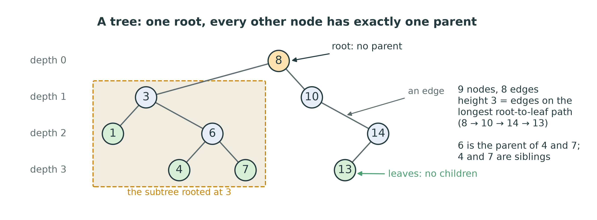{width=94%}

::: {.handout-only}

A **tree** is a set of **nodes** joined by **edges**, with one special node,
the **root**, such that every other node has **exactly one parent** and there
is exactly one path from the root to it. *Node* in Arabic: عقدة, plural عُقَد.
*Edge*: حافة, plural حواف. Computer scientists draw trees upside down: the root at the top,
the leaves at the bottom.

| Term | Meaning | Arabic |
|---|---|---|
| root | the one node with no parent | الجذر |
| parent, child | an edge goes from a parent down to a child | الأب، الابن |
| siblings | children of the same parent | الإخوة |
| leaf | a node with **no** children | ورقة |
| internal node | a node with at least one child | عقدة داخلية |
| subtree of x | x and everything below it | شجرة فرعية |
| ancestor, descendant | anything on the path above x; anything below x | سلف، خَلَف |

The figure's tree has 9 nodes and 8 edges. That is always so: every node except
the root has exactly one edge coming down into it, so **n nodes have $n - 1$
edges**. The **subtree** idea is what makes trees recursive: the left child of
the root is itself the root of a tree, and so is its left child, and so on,
down to the empty tree. Every algorithm this week uses that fact.

:::

## Depth and height

- **Depth** of a node: edges from the **root** down to it. The root has depth 0.
- **Height** of a node: edges on the longest path from it **down** to a leaf.
  A leaf has height 0.
- **Height of the tree** = height of the root. Empty tree: **$-1$**.

| | depth — العمق | height — الارتفاع |
|---|---|---|
| measured from | the root, down | the leaves, up |
| the root | 0 | the tree's height |
| a leaf | its level | 0 |

::: {.handout-only}

In the figure, 6 has depth 2 (8 $\rightarrow$ 3 $\rightarrow$ 6) and height 1 (6 $\rightarrow$ 4). The tree's height
is 3, along 8 $\rightarrow$ 10 $\rightarrow$ 14 $\rightarrow$ 13. The nodes of the same depth form a **level**,
in Arabic مستوى. Level 0 is `8`, level 1 is `3, 10`, level 2 is `1, 6, 14`.

**Why $-1$ for the empty tree?** Because the recursive definition then works
without a special case: the height of a node is $1 + \max(\text{height of left},
\text{height of right})$, and a leaf, whose two subtrees are empty, gets
$1 + \max(-1, -1) = 0$. `dsa/tree.py` uses this convention — its docstring says
"height is always *how many edges*, never *how many nodes*" — and
`tests/test_tree.py` checks both `height() == -1` for an empty tree and `0` for
a single node. Some books count nodes instead, so the same tree is one taller
there. In an exam, say which you mean.

Height matters more than anything else this week, because it is the cost of a
search: a search walks one path from the root down, and no path is longer than
the height.

:::

## Trees are everywhere

- your **file system**: folders inside folders
- a web page: the HTML **DOM**
- an **expression** — `(3 + 4) * 2` — as your compiler sees it
- a **decision** tree; a tournament bracket; a family tree
- the **recursion tree** of `fib(n)` (Lecture 03)

::: {.handout-only}

All of these are hierarchies: each thing belongs to exactly one parent thing.
A folder is inside one folder; an HTML element is inside one element; in
`(3 + 4) * 2` the `+` is an operand of the `*`. When a structure lets an element
belong to **several** parents, or lets paths go round in a circle, it is no
longer a tree but a **graph** — Week 14. A tree is the special graph with no
cycles and one root.

You have already drawn trees without calling them that: the call tree of
`fib(5)` in Lecture 03 is one, with a call at each node and its recursive calls
as its children. That is no accident. Recursion and trees are two views of the
same shape, which is why every tree algorithm below is a short recursive
function.

:::

# Binary Trees

## At most two children

A **binary tree**: every node has at most two children, a **left** and a
**right**. In Arabic: شجرة ثنائية.

```python
class TreeNode:
    __slots__ = ("value", "left", "right")

    def __init__(self, value, left=None, right=None):
        self.value = value
        self.left = left
        self.right = right
```

Lecture 05's `Node` had one link, `next`. This one has two.

::: {.handout-only}

`TreeNode` is **given** in `dsa/tree.py`, exactly as above: the docstring says
"the structure is the lesson, not the box". An empty subtree is simply `None`,
as the end of a linked list was. The tree object itself keeps one reference,
`self.root`, as `LinkedList` kept `self.head`. Nothing else is stored — not a
size, not a list of values. That is the storage rule of Lecture 02: a structure
keeps its data in node objects, and a Python list may appear only as input or
output.

Left and right are different positions. A node with only a left child and a
node with only a right child are different binary trees — and for a binary
search tree the difference is the whole point.

`dsa/tree.py` also gives you `to_edges(node)`, which collects the
`(parent, child)` pairs that `viz.draw.draw_tree` needs, so you can **see** your
tree before any traversal works:

```python
from viz.draw import draw_tree
from dsa.tree import BinarySearchTree, to_edges
bst = BinarySearchTree([8, 3, 10, 1, 6, 14, 4, 7, 13])
draw_tree(to_edges(bst.root), highlight={"6"})
```

:::

## How tall must a tree be?

- Level d holds **at most $2^d$** nodes: 1, 2, 4, 8, …
- A tree of height h holds **at most $2^{h+1} - 1$** nodes.
- So n nodes need height **at least $\lfloor \log_2 n \rfloor$** — and may have
  height up to **$n - 1$**.

| n | shortest possible height | tallest possible height |
|---|---|---|
| 7 | 2 | 6 |
| 1,000 | 9 | 999 |
| 1,000,000 | 19 | 999,999 |

::: {.handout-only}

Each node has at most two children, so each level can hold at most twice as many
nodes as the one above it: $2^0, 2^1, 2^2, \dots$ Summing the levels 0 to h
gives $1 + 2 + \dots + 2^h = 2^{h+1} - 1$, the same doubling sum as
`DynamicArray` growth in Lecture 04. Turn it round: to hold n nodes, you need
$2^{h+1} - 1 \ge n$, so $h \ge \log_2(n+1) - 1$, which for whole numbers is
$h \ge \lfloor \log_2 n \rfloor$.

That lower bound is the promise: a million values can live in a tree of height
19, and then a search needs at most 20 comparisons — exactly binary search. The
upper bound is the threat: the same million values can also form a single chain
of height 999,999, where every node has only one child. Both are legal binary
trees. Which one you get depends — for the tree you build this week — on the
**order in which the values arrive**.

Three shapes have names, and the next lecture needs one of them:

- **full**: every node has 0 or 2 children;
- **perfect**: every level is completely filled — $2^{h+1} - 1$ nodes;
- **complete**: every level is full except possibly the last, which is filled
  from the left. The **heap** of Week 12 is a complete binary tree, and that is
  what lets it live in a plain `Array` with no links at all.

:::

# Binary Search Trees

## The BST property

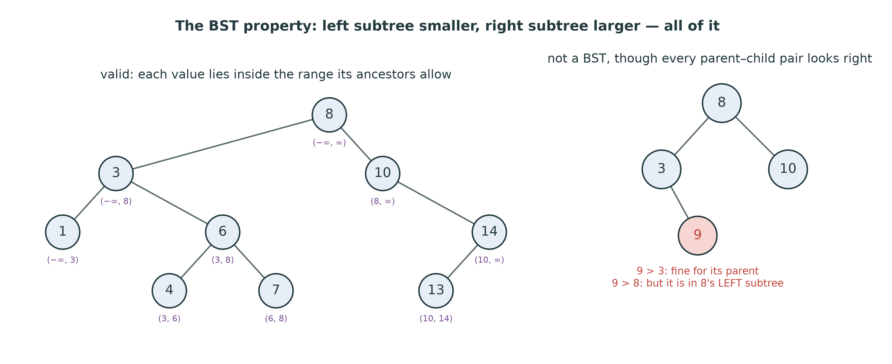{width=96%}

For **every** node x: everything in x's **left subtree** is smaller than x, and
everything in its **right subtree** is larger.

::: {.handout-only}

That is the invariant of a **binary search tree** (BST). Note the words
*subtree* and *everything*. It is **not** enough that the left child is smaller
and the right child larger. In the right-hand tree of the figure, every
parent–child pair looks fine: 3 < 8, 10 > 8, and 9 > 3. But 9 sits in 8's
**left** subtree, where nothing may be larger than 8. Search that tree for 9 and
you go right at 8 — and never find it. That tree is
`test_is_valid_catches_a_hand_built_broken_tree`.

The purple ranges in the left-hand tree show the correct way to think about it.
Each node inherits an allowed range from its ancestors: going left from 8
promises "less than 8"; going right from 3 then adds "greater than 3". So 6 must
lie in (3, 8), and 7, below it on the right, in (6, 8). A value is legal if it
lies inside the range of **all** its ancestors — and the tightest range is
always set by the nearest ancestor on each side.

**Duplicates.** `dsa/tree.py` keeps values unique: inserting a value already in
the tree leaves the tree unchanged (`test_duplicates_are_ignored`). Other
designs send equal values to the right, or store a count in each node. Pick
one, and state it — "smaller" and "larger" must be strict for the searches to
be exact.

:::

## `is_valid`: carry the range down

The wrong check, at each node: `left.value < node.value < right.value`.

The right check: pass an allowed range **(low, high)** down the recursion.

- going **left** from x: the new high is x
- going **right** from x: the new low is x
- the empty tree is valid

::: {.handout-only}

`is_valid` is the exercise that proves you understand the invariant. The
recursive helper takes a node and the range its ancestors allow, starting with
no limits at all at the root (`None` for "no bound" works well). At each node:
if the value is outside the range, return `False`; otherwise both subtrees must
be valid, the left one with the range narrowed from above by the node's value,
the right one narrowed from below. Each node is checked once: $O(n)$.

An alternative is to use the in-order traversal of later in this lecture: a tree
is a BST exactly when its in-order walk is strictly increasing. That is also
$O(n)$, and a good check of your understanding — but the range version is the
one that shows **why**.

:::

## Search: one path down

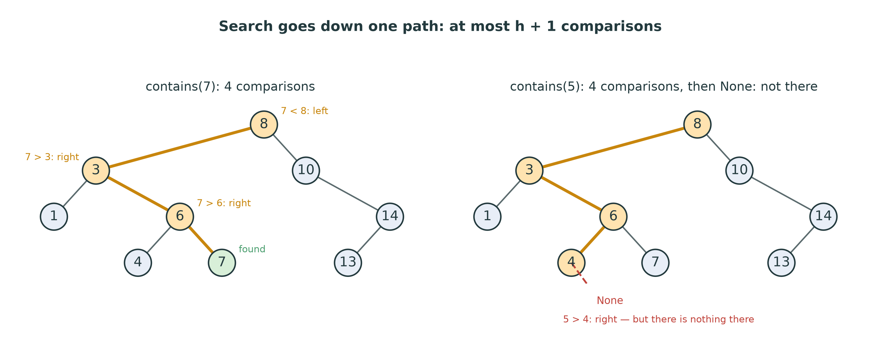{width=68%}

```python
node = self.root
while node is not None:
    if value == node.value:
        return True
    node = node.left if value < node.value else node.right
return False
```

::: {.handout-only}

That is the body of `contains` from the reference solution. It is the linked
list's traversal loop from Lecture 05 with one change: at each node there are
two ways on, and the comparison chooses. Every comparison rules out a whole
subtree — the one not taken — the way each comparison of binary search rules out
half the array. The invariant makes it safe: if 7 is anywhere, and 7 < 8, it can
only be in 8's left subtree.

The loop ends in one of two ways: it finds the value, or it steps onto `None`,
the empty subtree where the value **would** have been. In the right-hand panel,
the search for 5 goes 8, 3, 6, 4, and then to the right of 4, which is empty.
That place matters: it is exactly where `insert(5)` will put the new node.

**Cost.** One comparison per level, at most h + 1 levels: $O(h)$. No recursion
is needed, so no call stack either — $O(1)$ extra space. You can write it
recursively too; it is a nice two-line exercise, but on a tall tree it can hit
Python's recursion limit (see the end of this lecture), so the loop is the form
in `dsa/tree.py`.

:::

## Insert: a search that fails

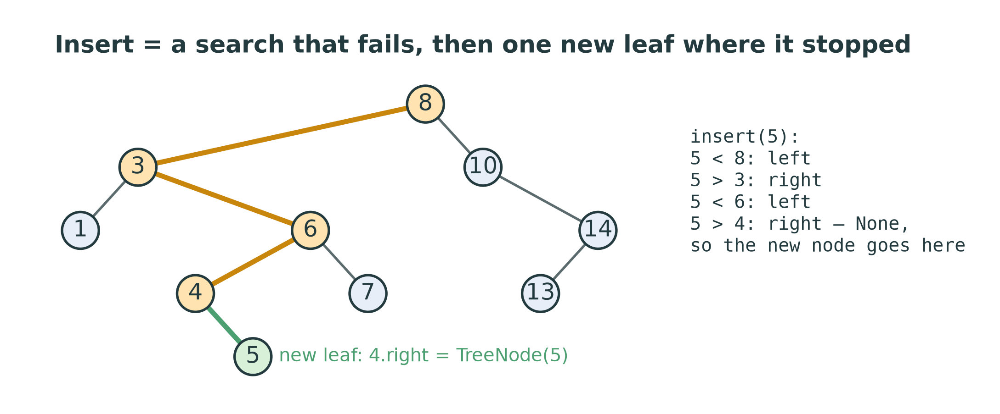{width=72%}

1. Empty tree $\rightarrow$ the new node **is** the root.
2. Otherwise walk down as in search. Equal $\rightarrow$ already there: do nothing.
3. When the way on is `None`, hang the new node **there**.

A new value always becomes a **leaf**. Nothing moves: $O(h)$.

::: {.handout-only}

Compare with Lecture 02's sorted array: finding the place was $O(\log n)$, but
making room shifted everything after it, $O(n)$. Here the place is found with the
same halving idea, and making room costs nothing at all — one reference,
`parent.left` or `parent.right`, changes from `None` to the new node.

The one trap: you must stop **at the parent**, while you can still set its
`left` or `right`. If you walk until `node is None`, you have lost the parent,
and assigning `node = TreeNode(value)` only rebinds a local variable — the tree
never sees it. Either look one step ahead (is the child I am about to take
`None`?) or keep a `parent` variable as you walk. Both are fine.

`test_structure_is_actually_a_bst` checks the **shape** after inserting 8, 3,
10: `root.value == 8`, `root.left.value == 3`, `root.right.value == 10`. An
implementation that kept a sorted Python list and pretended to be a tree would
pass `in_order` and fail this.

:::

## Min and max: no comparisons at all

- **min**: from the root, go **left** until there is no left child.
- **max**: from the root, go **right** until there is no right child.
- Empty tree $\rightarrow$ `ValueError`.

$O(h)$, and not a single comparison of values.

::: {.handout-only}

Everything smaller than a node is to its left, so the smallest value is the node
you reach by going left for as long as you can. The last node on that path has
no left child — nothing is smaller — so it is the minimum. The invariant has
already done the comparing, when the values were inserted. In the sample tree,
min is 8 $\rightarrow$ 3 $\rightarrow$ 1, and max is 8 $\rightarrow$ 10 $\rightarrow$ 14.

That same walk, started not at the root but at a node's **right child**, finds
the smallest value larger than that node: its **in-order successor**. Delete
needs exactly that, in a moment.

:::

# Delete: Three Cases

## Find it, then look at its children

Find the node, **remembering its parent**. Then:

| The node has… | Do this |
|---|---|
| no children (a **leaf**) | the parent's link becomes `None` |
| **one** child | the parent's link points at that child |
| **two** children | copy in the **in-order successor**, then delete the successor |

Deleting a value that is not there does nothing.

::: {.handout-only}

Deleting is the hard operation of the week, because removing a node must leave
a tree that is still a BST — and a node with two children cannot simply vanish,
because two subtrees would be left hanging from one link.

Like insert, delete must hold on to the **parent** of the node it removes: it
is the parent's `left` or `right` that changes. And the parent may not exist,
when the node to delete is the root; then `self.root` itself changes. That root
case is the one most often forgotten, which is why the tests delete the root
(`test_delete_the_root`) and delete every node in turn until the tree is empty
(`test_delete_everything`).

:::

## The easy cases

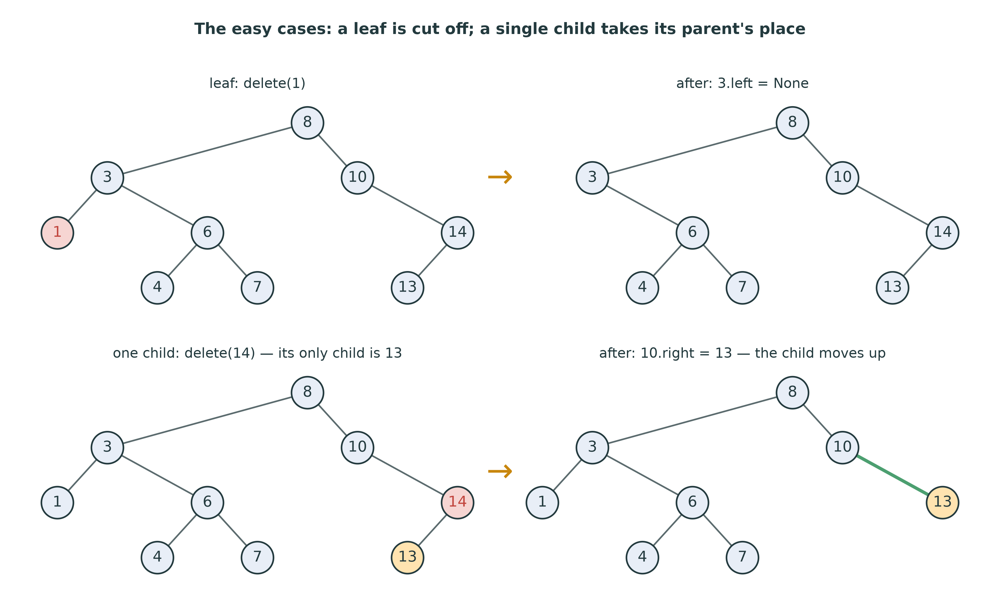{width=76%}

::: {.handout-only}

**A leaf** (delete 1): 1 is the left child of 3, so `3.left = None`. Nothing
else changes.

**One child** (delete 14): 14's only child is 13. Point 14's parent, 10, straight
at 13: `10.right = 13`. The whole subtree below 14 moves up one level, still in
order — everything in it was larger than 10 before (it was in 10's right
subtree), and it still is.

Notice that the leaf case is the one-child case with a child of `None`: "point
the parent at the child" works for both. The reference solution uses that to
handle the two with one assignment.

:::

## Two children: the in-order successor

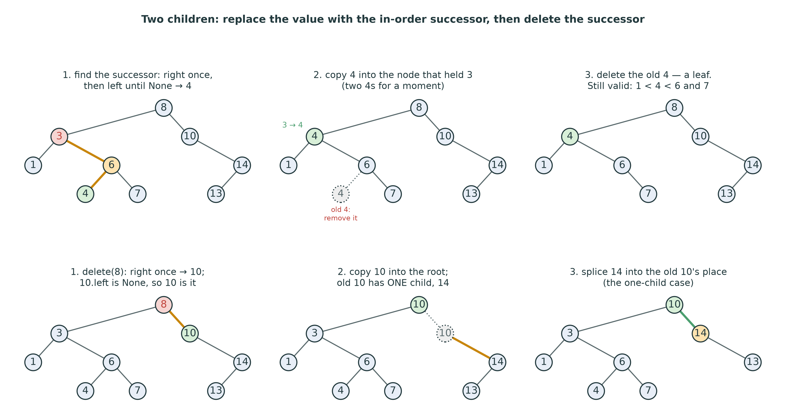{width=100%}

::: {.handout-only}

A node with two children cannot be removed, so we remove a **different** node
instead, and move its value up. Which value can take x's place and keep the BST
property? One that is larger than everything left of x and smaller than
everything right of x. There are exactly two candidates:

- the **in-order successor**: the **smallest** value in x's right subtree —
  go right once, then left until there is no left child;
- or the **in-order predecessor**: the largest value in x's left subtree.

`dsa/tree.py` uses the successor, the convention of Hibbard's 1962 paper and of
most textbooks. The three steps, top row of the figure, deleting 3:

1. **Find the successor.** Right once, to 6; then left for as long as possible,
   to 4. 4 is the smallest value larger than 3.
2. **Copy** 4 into the node that held 3. For a moment the tree holds two 4s.
3. **Delete the old 4**, the node where the successor was.

Why is the result a BST? The new value 4 is larger than everything in the left
subtree (those were smaller than 3, and 3 < 4), and smaller than everything left
in the right subtree (4 was the smallest of them). Check the figure: 1 < 4 < 6
and 7.

**Why step 3 is always easy.** The successor was reached by going left until
there was no left child — so it **has no left child**. It is either a leaf (the
top row: 4) or has one child, on the right. Step 3 is always one of the two easy
cases, and never recurses into a third.

The bottom row is the other shape, and the one students trip on. Deleting the
root 8: go right once, to 10; 10 has no left child, so **10 itself** is the
successor — the "go left" loop runs zero times. Copy 10 into the root. The old
10 has a right child, 14, so step 3 is the one-child case: 14 moves up into the
old 10's place. The parent whose link changes in step 3 is then the node being
deleted itself (its `right`), not a node further down (whose `left` changed in
the top row). A delete that always writes `successor_parent.left = ...` passes
the top row and corrupts the bottom one — `test_delete_the_root` is exactly this
case.

Everything costs one walk down: to find x, then on down to the successor.
$O(h)$ in total.

:::

## The three cases collapse into two

1. Find the node and its parent. Not found $\rightarrow$ return.
2. **Two children?** Walk to the successor (keeping *its* parent), copy its
   value up — and from now on, delete **the successor node** instead.
3. Now the node has **at most one** child, `child` (possibly `None`):
   - no parent $\rightarrow$ `self.root = child`
   - node was its parent's left $\rightarrow$ `parent.left = child`
   - otherwise $\rightarrow$ `parent.right = child`

::: {.handout-only}

That is the shape of `delete` in the reference solution: the two-children case
does its copy and then **hands over** to the easy case, by moving the "node to
remove" and "its parent" variables down to the successor. Step 3 is written
once and serves all three cases.

To decide which link of the parent to change, compare **identities**:
`parent.left is node`. Comparing values would work too, but `is` says what you
mean — the question is "which reference points at this node?", not "which
value is smaller".

Writing it recursively is the other classic form: a helper `_delete(node,
value)` that returns the new root of the subtree, so that the caller writes
`node.left = self._delete(node.left, value)`. It is elegant and it is correct —
and it recurses h deep, which the loop does not. Either is accepted in the lab.

:::

# The Four Traversals

## Recursion on trees

A **traversal** visits **every** node once — in Arabic, اجتياز الشجرة. For a binary tree, every
recursive walk has the same skeleton:

- **base case:** the empty tree — do nothing
- **recursive case:** do something with the node, and walk the left and right
  subtrees

*Where* you put "do something" gives three different orders.

::: {.handout-only}

This is the structure of every recursive function on trees, and it is worth
saying why it is correct, in the language of Lecture 03. The base case, `None`,
needs no recursion. Each recursive call is on a **subtree**, which is strictly
smaller than the tree — so the recursion always reaches the base case. And if
the calls on the two subtrees do their job, adding the node itself completes
the job for the whole tree. That is induction on the size of the tree.

The three recursive traversals differ only in the position of one line:

| Name | Order | Mnemonic |
|---|---|---|
| **pre-order** | node, left, right | node **before** its subtrees |
| **in-order** | left, node, right | node **in between** |
| **post-order** | left, right, node | node **after** its subtrees |

The fourth, **level-order**, is a different kind of walk and needs a queue.

:::

## In-order: the code

```python
def in_order(self):
    out = []
    self._in_order(self.root, out)
    return out

def _in_order(self, node, out):
    if node is not None:
        self._in_order(node.left, out)
        out.append(node.value)
        self._in_order(node.right, out)
```

Move `out.append` **up** one line $\rightarrow$ pre-order. **Down** one line $\rightarrow$ post-order.

::: {.handout-only}

This is the reference `in_order` exactly. The public method makes the output
list and starts the recursion at the root; the private helper does the walk.
The list `out` is passed down so that every call appends to the **same** list —
one list for the whole walk, $O(n)$ appends in total.

Two design points. First, the traversals **return a new list**: the list is
output, created for the caller; the tree never keeps it
(`test_traversals_return_a_fresh_list` clears the list it was given and checks
that the next walk still works). Second, the helper builds one list rather than
each call returning its own list and the caller concatenating them:
`left_list + [node.value] + right_list` copies at every level, and on a tall
tree that is $O(n^2)$ — the slicing trap of Lectures 03 and 08 in a new form.

The helper's name starts with `_`, the Python convention for "private: not part
of the interface" (Lab 03).

:::

## Four walks of one tree

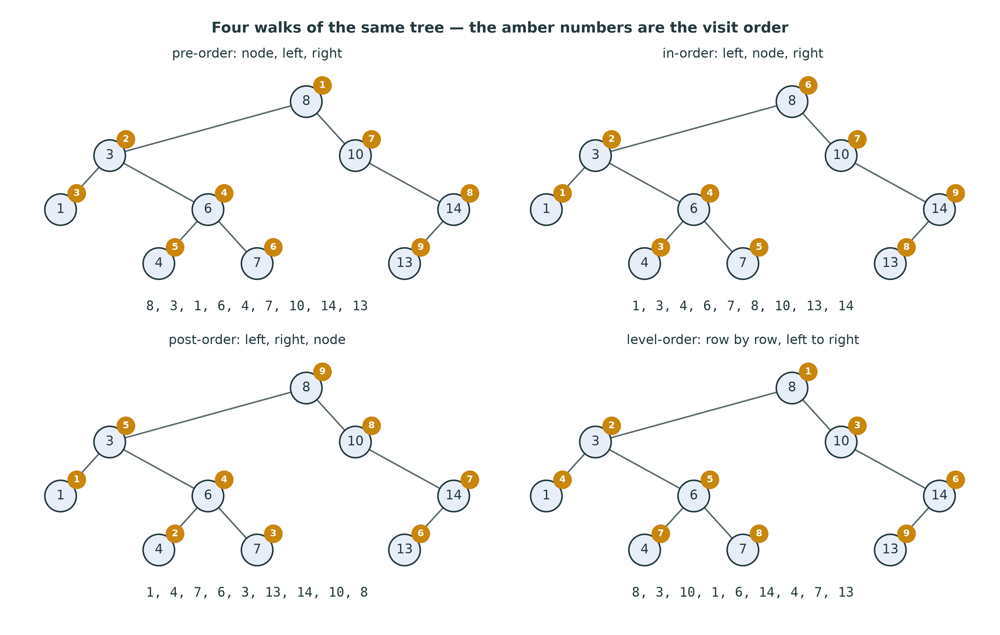{width=88%}

::: {.handout-only}

Check each walk against its rule by hand before you trust the picture. Pre-order
starts at the root, then does the **whole** left subtree (3, 1, 6, 4, 7) before
touching the right. Post-order finishes both subtrees of a node before the node:
the root comes **last**. In-order comes out **sorted**: 1, 3, 4, 6, 7, 8, 10, 13,
14. Level-order reads the drawing row by row. These four lists are the four
traversal tests in `tests/test_tree.py`.

Every traversal visits each node once and does $O(1)$ work there: **$O(n)$
time**. The recursive three use the call stack, one frame per level of the
current path: **$O(h)$ space** — about $\log_2 n$ frames on a short tree, n on a
chain.

:::

## What each one is FOR

| Walk | Gives you | Used for |
|---|---|---|
| **in-order** | a BST's values **sorted** | listing, range queries, `is_valid` |
| **pre-order** | parents before children | **copying** / saving a tree: re-inserting it **rebuilds** the same shape |
| **post-order** | children before parents | **freeing** a tree; **evaluating** an expression; sizes and heights |
| **level-order** | nearest to the root first | printing by level; shortest distances (BFS, Week 14) |

::: {.handout-only}

**In-order is sorted** — for a BST, and only for a BST. Everything left of a
node is smaller and is written first; everything right is larger and is written
after. This is the single most useful property a BST has: a sorted listing in
$O(n)$ with no sorting at all. (Insert n values, then walk in-order, and you
have sorted them: that is **tree sort**, $O(n \log n)$ when the tree stays short
— and $O(n^2)$ when it does not.)

**Pre-order rebuilds.** Insert the pre-order list of a BST into an empty BST, and
you get the same shape back: each node arrives after its parent, so it follows
the same path and lands in the same place
(`test_pre_order_rebuilds_the_same_tree`). That makes pre-order the natural way
to **save** a tree to a file. The in-order list would not do — it is sorted, and
inserting sorted values builds a chain.

**Post-order frees and evaluates.** A node is visited only after both of its
subtrees are done. In C, where you free memory yourself, that is the only safe
order: free the children, then the parent — free the parent first and you have
lost the links to its children. It is also how anything that **depends on the
children** is computed: the size of a tree is the sizes of its subtrees plus
one; its height is one more than the taller subtree. `size` and `height` in
`dsa/tree.py` are post-order walks.

:::

## Post-order evaluates: expression trees

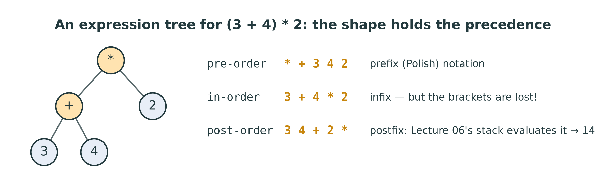{width=88%}

::: {.handout-only}

An **expression tree** has an operator at each internal node and a number at
each leaf. The tree for `(3 + 4) * 2` has `*` at the root, because `*` is done
**last**: the shape records the precedence, and the tree needs no brackets.

Walk it three ways and you get the three notations of Lecture 06:

- **post-order**, `3 4 + 2 *`, is **postfix** — exactly what `evaluate_postfix`
  evaluated with a stack. Evaluating the tree itself is also post-order: evaluate
  the left operand, then the right, then apply the operator — 7, then 14.
- **pre-order**, `* + 3 4 2`, is **prefix** (Polish) notation.
- **in-order**, `3 + 4 * 2`, is the familiar **infix** — and it is **wrong**: it
  reads as 11. In-order loses the brackets; to print infix correctly you must
  add a pair around each operator node.

Week 15 builds these trees from text with a recursive parser, in
`dsa/translation.py`, and evaluates them in post-order.

:::

## Level-order needs a queue

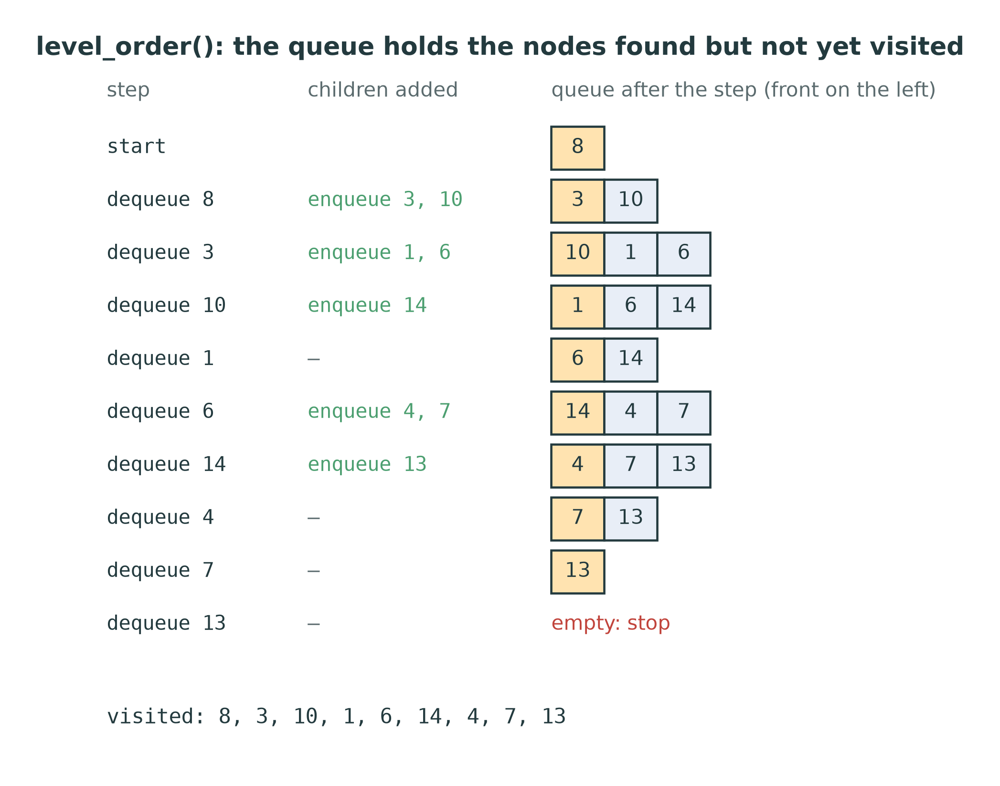{width=40%}

1. Enqueue the root.
2. While the queue is not empty: **dequeue** a node, visit it, **enqueue** its
   children (left, then right).

::: {.handout-only}

Level-order (also called **breadth-first**) is the odd one out. It cannot be
written with the simple recursive skeleton, because it does not finish one
subtree before starting the other: after visiting 3, it must visit 10 — in the
**other** subtree — before 3's children. Recursion follows the call stack, which
is **last in, first out**: it always goes deeper into the most recent node. To
visit in order of **distance from the root**, you need the nodes in the order
they were **found**: **first in, first out**. A queue.

The queue holds the nodes that have been discovered but not yet visited — the
"frontier". The figure shows it after every step. Children are enqueued behind
everything already waiting, so all of level 1 is dequeued before any of level 2.

In `dsa/tree.py` the queue must be **your** `CircularQueue` from Week 7, not a
Python list: the course rule, and the reason Lecture 07 asked you to make the
ring **grow**. A tree's widest level can hold about half its nodes — a perfect
tree of 31 nodes has 16 leaves — and the default capacity is 8.
`test_level_order_on_a_wide_tree` is that tree. A list with `pop(0)` would also
give the right answer — in $O(n)$ per dequeue, and $O(n^2)$ for the walk:
Lecture 07's `SlowQueue` again.

**Cost.** Each node is enqueued once and dequeued once: $O(n)$ time. The queue
holds at most one level and a bit of the next: $O(w)$ space, where w is the
widest level — up to about n/2 for a short tree, but only 1 for a chain. The
recursive walks are the opposite: $O(h)$ space, small for a short tree, n for a
chain.

Replace the queue by a **stack** in this same loop, and the walk becomes
depth-first — pre-order, if you push the right child before the left. Week 14
puts the two side by side on graphs, as BFS and DFS.

:::

## Height and size: post-order in one line

```python
def _height(self, node):
    if node is None:
        return -1
    return 1 + max(self._height(node.left), self._height(node.right))
```

`size` is the same shape: 0 for `None`, else $1 +$ left size $+$ right size.

::: {.handout-only}

This is the reference `_height`, called by `height()` on the root. Both calls
must finish before the `max` can be taken — the node is handled **after** its
children, which makes it a post-order walk, $O(n)$. The base case returns $-1$, as
the slide on depth and height promised, so a leaf comes out as 0 without a
special case.

`size` is not stored in `dsa/tree.py`; it is counted, $O(n)$. You could keep a
`_size` counter up to date in `insert` and `delete`, as `LinkedList` did, and
make it $O(1)$ — but then `delete` must be careful to decrement only when it
really removed something. The skeleton keeps it simple.

:::

# When the Tree Is a Linked List

## Same values, same code, different height

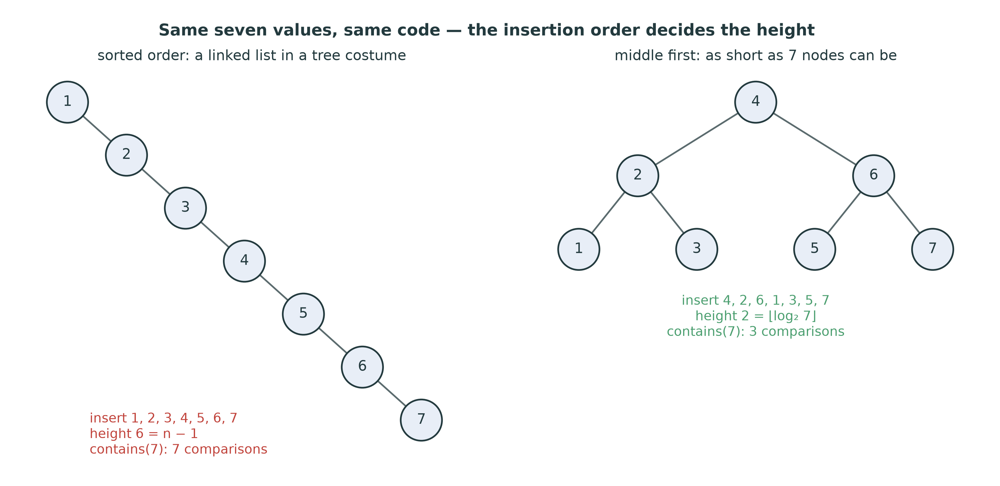{width=84%}

Insert **sorted** values and each new one is the largest so far: it always goes
**right**. Height $n - 1$. Every operation: **$O(n)$**.

::: {.handout-only}

This is the catch in the module docstring: "insert 1, 2, 3, 4, 5 in order and
you build a linked list wearing a tree costume". Nothing in the code is wrong;
the BST property holds (`test_degenerate_tree_is_a_linked_list` checks height 4
and an empty left side). But the tree has one node per level, and a search for
the largest value visits every node — a linear search through a linked list,
with extra comparisons.

Sorted input is not an exotic worst case. Data often arrives sorted, or nearly:
dates in a log, student IDs in registration order, a file that was saved sorted
last time. The same values inserted middle-first — 4, then 2 and 6, then the
rest — give the shortest tree 7 nodes can make.

**Random order is kind.** If the values arrive in a random order, the tree is
short **on average**: the average depth of a node is about
$2 \ln n \approx 1.39 \log_2 n$ (Hibbard, 1962; Knuth vol. 3, §6.2.2). But
"random" is a promise about your data that you usually cannot make.

:::

## Measured

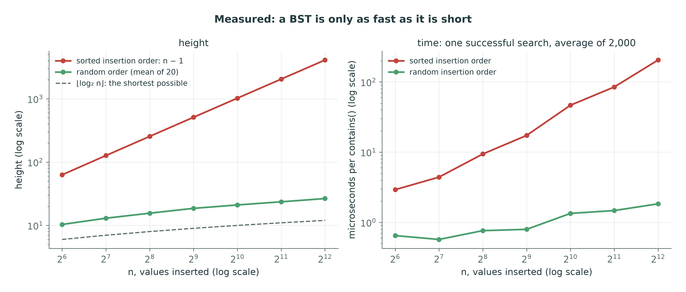{width=96%}

::: {.handout-only}

Real measurement of the reference `dsa/tree.py`, for n = 64 to 4,096 values
(`tools/figures_l11.py`).

**Left: height.** Sorted insertion gives exactly $n - 1$: 4,095 for 4,096 values.
Random insertion order (the mean over 20 shuffles) gives 26.6 at n = 4,096 —
more than the 12 of a perfect tree, but a **logarithm**: it grows by 2 to 3 each
time n doubles, while the sorted line doubles. The tallest of the twenty random
trees at that size was 32.

**Right: time** for one successful `contains`, averaged over 2,000 searches. At
n = 4,096: about 205 microseconds on the chain against 1.8 on the random tree —
more than a hundred times slower, and the gap doubles every time n doubles.
The chain is a straight line of slope 1: $O(n)$ per search. The random tree's
line is almost flat: $O(\log n)$.

**A second failure: recursion.** Your recursive `height`, `size` and traversals
go one call deeper per level. On the 4,096-node chain that is 4,096 frames, and
Python's default limit is 1,000: `BinarySearchTree(range(1000)).height()` raises
`RecursionError`. (The figure script raises the limit with
`sys.setrecursionlimit` to measure the chain at all.) The loops — `contains`,
`insert`, `delete`, `min`, `max` — and the queue-based `level_order` do not
care. A tall tree is not only slow; it breaks recursive code.

:::

## The cure: keep it balanced — beyond this course

**Balanced** trees re-shape themselves on every insert and delete, so that
h stays **$O(\log n)$** whatever the input order:

- **AVL trees** (Adelson-Velsky and Landis, 1962)
- **red-black trees** (Guibas and Sedgewick, 1978)

Both are **beyond the bylaw**: named here, not examined.

::: {.handout-only}

A balanced search tree — in Arabic, شجرة متوازنة — keeps a little extra information in each
node — a height, or a colour — and after an insertion or deletion repairs the
shape with **rotations**, local rearrangements of two or three nodes that keep
the BST property and change the heights. An AVL tree keeps the two subtrees of
every node within one level of each other; a red-black tree allows a little
more slack in exchange for fewer repairs. Both guarantee height $O(\log n)$, so
search, insert and delete are $O(\log n)$ in the **worst** case.

None of the three bylaws that define this course asks for them
(`docs/course/02-coverage.md`), so they are not in `dsa/tree.py` and not in the
exam. You will meet them in the courses that follow, and in libraries: Java's
`TreeMap` and C++'s `std::map` are red-black trees. Python has no balanced tree
in its standard library at all; its `dict` and `set` are **hash tables** — Week 13
— which are faster on average but keep no order.

What you **can** do with this week's tree: if you have all the values up front,
sort them and insert the middle first, then the middles of each half — the
"middle first" tree of the figure, of height $\lfloor \log_2 n \rfloor$. That is
W11-C4 in the question bank.

:::

## What each operation costs

| Operation | Cost | Short tree | Chain |
|---|---|---|---|
| `contains`, `insert`, `delete` | $O(h)$ | $O(\log n)$ | $O(n)$ |
| `min`, `max` | $O(h)$ | $O(\log n)$ | $O(n)$ |
| `height`, `size`, `is_valid` | $O(n)$ | | |
| the four traversals | $O(n)$ | | |
| extra space, recursive walks | $O(h)$ | $O(\log n)$ | $O(n)$ |
| extra space, `level_order` | $O(w)$ | up to $O(n)$ | $O(1)$ |

::: {.handout-only}

h is the height and w the width of the widest level. Against the structures of
the earlier weeks, a **short** BST is the first to give $O(\log n)$ for search
**and** insert **and** delete, and it keeps the values in order — so min, max,
the sorted listing and range queries come for free. A hash table (Week 13) will
beat it on plain lookups, $O(1)$ on average, but cannot list its keys in order
or answer "all values between 20 and 40".

:::

# This Week

## Exercises: `dsa/tree.py`

| Method | Target | The trap |
|---|---|---|
| `insert` | $O(h)$ | stop **at the parent**; ignore duplicates |
| `contains`, `min`, `max` | $O(h)$ | a loop; `ValueError` on empty |
| `delete` | $O(h)$ | keep the parent; the **root**; successor = right child |
| `height`, `size` | $O(n)$ | empty tree is $-1$ and 0 |
| `is_valid` | $O(n)$ | carry **(low, high)** down, not just the parent |
| the four traversals | $O(n)$ | return a **new list**; level-order uses **your** queue |

```powershell
pytest tests/test_tree.py -v
```

::: {.handout-only}

Twenty-six tests. `TreeNode`, `to_edges`, `__init__` and the dunders (`len`,
`in`, `iter`, `repr`) are given; the dunders call your methods, so they start
working as soon as those do. Write `insert` and `contains` first — every other
test builds its tree with `insert`. Then draw your tree with `to_edges` and
`draw_tree` before going further.

`level_order` imports `CircularQueue` from `dsa/queue.py`: your Week 7 queue,
and it must grow when full (`tests/test_stack_queue.py` must pass, and your
growth challenge must work on a wrapped ring).

Do not filter with `-k tree`: `-k` matches the file name `test_tree.py`, so it
selects all 26. Filter by the method instead: `-k delete`, `-k order`.

:::

## Homework 11 — before Lecture 12

1. **Implement** `dsa/tree.py` until all 26 tests pass.
2. **Draw** the BST built by inserting 50, 30, 70, 20, 40, 60, 80, 35, 45, 65,
   then delete 20, 30 and 50 — the tree after each delete.
3. **Walk** your tree of item 2 (before the deletes) in all four orders, by hand.
   Check with your code.
4. **Measure** the height of a BST built from `range(n)` and from a shuffled
   `range(n)`, for n up to 900, in `notebooks/11-trees.ipynb`. Why stop at 900?

::: {.handout-only}

For item 2, the three deletes are one of each case: 20 is a leaf, 30 then has
one child, and 50 is the root with two children. Draw the successor search for
50 before you move anything.

For item 4, the answer to "why 900" is the recursion limit — try 1,000 and read
the error. Then explain why `contains` would still work on that tree.

:::

# Summary

## Seven things to keep

1. A tree: one root; every other node has **one parent**; n nodes, $n - 1$ edges.
2. **Height** counts edges down to the deepest leaf; empty tree $-1$, leaf 0.
3. BST: **left subtree smaller, right subtree larger** — for the whole subtree.
4. Search, insert, min, max: **one path down**, $O(h)$.
5. Delete with two children: copy the **in-order successor**, delete it instead.
6. In-order is **sorted**; pre-order **rebuilds**; post-order **frees and
   evaluates**; level-order needs a **queue**.
7. Sorted input gives height **$n - 1$**: $O(n)$. Balanced trees fix it — beyond
   this course.

## Next

**Week 12 — Heaps and priority queues.** A tree with no links at all: a
**complete** binary tree stored in an `Array`, where the children of slot i are
slots 2i + 1 and 2i + 2.

::: {.handout-only}

A BST keeps **everything** in order, and pays for it with a height that the
input order controls. A heap keeps only a weaker order — every parent is smaller
than its children — and in exchange its shape is always complete, so its height
is always $\lfloor \log_2 n \rfloor$, whatever the input. It cannot search for an
arbitrary value quickly, but it always knows its minimum: exactly what a
priority queue needs.

---

## Sources and further reading

- **D. E. Knuth.** *The Art of Computer Programming*, vol. 1, *Fundamental
  Algorithms*, 3rd ed., Addison-Wesley, 1997, §2.3 "Trees" — the vocabulary,
  and traversals; vol. 3, *Sorting and Searching*, 2nd ed., 1998, §6.2.2
  "Binary tree searching" — insertion, deletion, and the average depth of a
  random BST.
- **T. N. Hibbard.** "Some combinatorial properties of certain trees with
  applications to searching and sorting", *Journal of the ACM* 9(1), 1962 —
  deletion by the successor, and the analysis of random BSTs.
- **T. H. Cormen, C. E. Leiserson, R. L. Rivest and C. Stein.** *Introduction to
  Algorithms*, 3rd ed., MIT Press, 2009, chapter 12, "Binary search trees".
- **M. T. Goodrich, R. Tamassia and M. H. Goldwasser.** *Data Structures and
  Algorithms in Python*, Wiley, 2013, chapters 8 "Trees" and 11 "Search trees".
- **G. M. Adelson-Velsky and E. M. Landis.** "An algorithm for the organization
  of information", *Soviet Mathematics Doklady* 3, 1962 — AVL trees.
- **L. J. Guibas and R. Sedgewick.** "A dichromatic framework for balanced
  trees", *Proceedings of the 19th FOCS*, 1978 — red-black trees.

Every figure in this lecture is generated by `tools/figures_l11.py`. The
diagrams are fixed trees, checked against the reference solution; the measured
figure times a working `dsa/tree.py` and will differ slightly on your machine.

:::
