::: {.handout-only}

> **How to read this document.** This is the handout for Lecture 12. It holds
> everything on the slides, plus what I said out loud. Last week's tree was made
> of nodes and references. This week's tree has neither: it lives in a flat
> array, and the links between parent and child are two lines of arithmetic.
> On top of it sits the structure behind every "most urgent first" system you
> will ever use — the priority queue.
>
> Slides: `DSA27-L12-slides.pdf` · Code: `dsa/heap.py` ·
> Tests: `tests/test_heap.py`

:::

# Where We Are

## A queue that does not wait its turn

Week 7's queue is **fair**: first in, first out.

An emergency department is not fair, on purpose:

- a patient with chest pain is seen **before** one with a sprained ankle
- who arrived first matters only between equally urgent patients

We need a queue that serves the **most urgent** item: a **priority queue**.

::: {.handout-only}

Lecture 07 ended with this promise: same two operations, *add* and *remove*,
but a different rule for which item leaves. A FIFO queue answers "who has
waited longest?". A priority queue answers "who matters most right now?" — and
that small change of contract needs a completely different structure
underneath.

*Priority queue* in Arabic: طابور الأولويات. *Heap*: الكومة. *Complete binary
tree*: شجرة ثنائية كاملة.

A word of warning about the name. The **heap** of this lecture has nothing to do
with "the heap" in memory management, where `new` objects and Python's objects
live. The two words collided in the 1960s and have been confusing students ever
since. Here, a heap is a tree with an order.

:::

## Today

1. The priority queue ADT, and three ways to build it badly
2. The heap: a **shape** and an **order**
3. The array **is** the tree: `2i + 1`, `2i + 2`, `(i − 1) // 2`
4. Sift up (`push`) and sift down (`pop`): $O(\log n)$
5. Build-heap in $O(n)$ — the summation, and a measurement
6. The priority queue on top; top-k; heap sort revisited

# The Priority Queue ADT

## Serve the most urgent

| Operation | Meaning |
|---|---|
| `enqueue(item, priority)` | add an item with a priority |
| `dequeue()` | remove and return the item with the **lowest** priority number |
| `peek()` | look at that item without removing it |
| `is_empty()`, `len(pq)` | |

"Priority 1" means "most urgent" — as in triage, and in `dsa/heap.py`.

::: {.handout-only}

As with the stack and the queue, this table is the ADT: operations and meaning,
nothing about storage. Two conventions exist and both are common. In
`dsa/heap.py`, as in hospital triage and in Python's `heapq`, the **smallest**
number is served first. Some books use the largest; the structure is the same
with the comparison reversed — which is exactly the difference between the
`MinHeap` and `MaxHeap` classes below.

Empty behaves as it did for the stack and the queue: `dequeue()` and `peek()`
on an empty priority queue raise `IndexError`
(`test_priority_queue_empty`).

:::

## Three obvious designs, and what each costs

| Storage | `enqueue` | `dequeue` | Why |
|---|---|---|---|
| unsorted array | $O(1)$ | $O(n)$ | append; then **search** for the minimum |
| sorted array | $O(n)$ | $O(1)$ | **shift** to insert in order; take from the end |
| sorted linked list | $O(n)$ | $O(1)$ | **walk** to the insertion point |
| **binary heap** | $O(\log n)$ | $O(\log n)$ | today |

::: {.handout-only}

Each naive design makes one operation cheap by making the other expensive. For
a workload of n enqueues and n dequeues — which is what every real priority
queue sees — all three cost $O(n^2)$ in total. The heap makes **both**
operations $O(\log n)$, so the same workload costs $O(n \log n)$. For a million
items, that is the difference between about $10^{12}$ steps and about
$2 \times 10^7$.

The sorted array is worth a second look. It keeps the items in **complete**
order, when the priority queue only ever asks for the **first** item. That
wasted order is what we pay for with $O(n)$ insertion. The heap's trick is to
keep **just enough** order to know the first item, and not a comparison more.

A balanced binary search tree (Week 11) would also give $O(\log n)$ for both —
but it needs nodes, references, and a balancing scheme this course does not
build. The heap needs none of that.

:::

# The Heap

## Shape: a complete binary tree

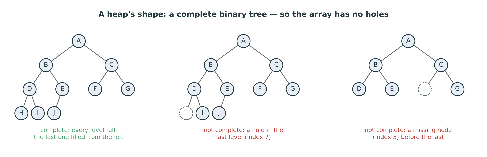{width=96%}

**Complete:** every level is full, except perhaps the last, which is filled
**from the left**, with no gaps.

::: {.handout-only}

A binary heap has two rules. The first is about **shape** and says nothing about
values: the tree is **complete**. Read the tree level by level, left to right,
and you meet no gap until the very end. The left-hand tree in the figure is
complete. The middle one is not — there is a hole where H should be. Neither is
the right-hand one: F is missing while G is present.

Two things follow from the shape, and both matter.

- **The height is $\lfloor \log_2 n \rfloor$.** A complete tree with n nodes is
  as short as a binary tree can be: level k holds up to $2^k$ nodes, so ten
  levels hold over a thousand nodes and twenty levels over a million. Every
  operation below walks one path from the root to a leaf, or back, so every
  operation is $O(\log n)$. Compare Week 11's binary search tree, which can
  degrade into a linked list of height n: a heap never can, because its shape
  is **forced**.
- **The tree fits in an array with no holes.** That is the next slide, and the
  reason the whole structure is two pages of code.

:::

## Order: the heap property

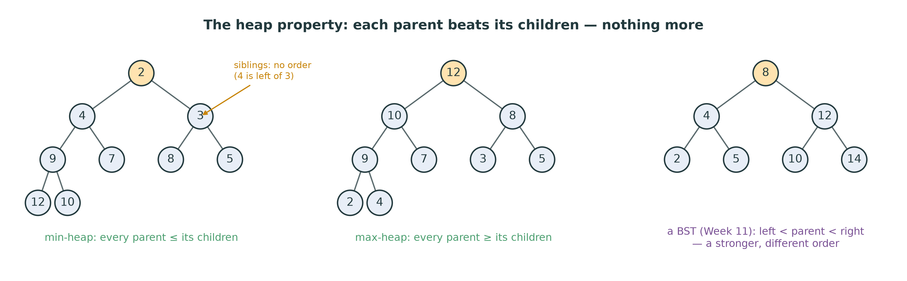{width=96%}

**Min-heap:** every parent $\le$ its children. **Max-heap:** every parent $\ge$
its children.

So the best item is at the **root**. Siblings are **not** ordered.

::: {.handout-only}

The second rule is about **order**. In a min-heap, each parent is no larger than
its children. Follow any path downwards and the values never decrease; so the
smallest value in the whole heap is at the root, which is all a priority queue
needs.

What the property does **not** say is just as important. In the left tree, 4 is
the left child and 3 the right: the property says nothing about siblings, or
about cousins in different subtrees — 9 sits on level 2 while 5, smaller, sits
on the same level elsewhere. A heap is **not sorted**. Reading its array from
left to right gives `2, 4, 3, 9, 7, 8, 5, 12, 10`, which is not in order, and
that is correct.

Compare the binary search tree of Week 11 (right). Its order is **stronger** —
left subtree < node < right subtree — which is why it can **search** for any
value in $O(\log n)$. A heap cannot search; finding an arbitrary value in a heap
is $O(n)$. What it can do is keep its **best** value at the top, cheaply, while
values come and go. Weaker order is cheaper to maintain.

In `dsa/heap.py`, the rule is one method:

```python
def _beats(self, child, parent):
    """True when `child` must move above `parent`."""
    return child < parent
```

`MaxHeap` overrides only this method, with `>`. Everything else — sifting,
`push`, `pop`, `heapify`, `is_valid` — is written once, in `MinHeap`, in terms of
`_beats`. Write a single `<` anywhere else in your class and `MaxHeap` breaks
while `MinHeap` passes: `test_max_heap_differs_from_min_heap` is there to catch
it.

:::

## The array is the tree

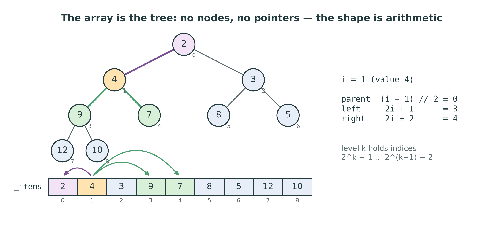{width=84%}

Node `i`: children at **`2*i + 1`** and **`2*i + 2`**; parent at
**`(i - 1) // 2`**.

::: {.handout-only}

Number the nodes level by level, left to right, starting at 0 — the order in
which you would read them. Store node i in slot i of an array. Because the tree
is complete, the slots are filled from 0 to n – 1 **with no gaps**, and the
numbering gives every node its family by arithmetic:

- level k starts at index $2^k - 1$ (0, 1, 3, 7, 15, …);
- the children of i are **2i + 1** and **2i + 2**;
- the parent of i is **(i – 1) // 2**, for i > 0.

Check it on the figure: node 1 (value 4) has children 3 and 4 (values 9 and 7)
and parent 0. Node 4 (value 7) has children 9 and 10 — both past the end of a
nine-element array, so it is a leaf. In general, i is a leaf exactly when
`2 * i + 1 >= n`, so the leaves are the second half of the array, from index
`n // 2` on, and the **last parent** is at `n // 2 - 1`. That index will start
`heapify`.

No `TreeNode`, no `left` or `right` attributes, no `None` checks: the shape is
entirely in the index. This is why `dsa/heap.py` stores the heap in your Week 4
`DynamicArray` — `self._items` — and nothing else. `push` appends at the end,
`pop` removes from the end, and both are the $O(1)$ operations of the dynamic
array. The storage rule is kept with no effort at all.

Why 0-based arithmetic looks slightly odd: many textbooks, including CLRS, start
the array at index 1, where the formulas are the prettier `2i`, `2i + 1` and
`i // 2`. Python counts from 0, so we shift everything by one.

:::

## See it: `draw_array_as_tree`

```python
from viz.draw import draw_array_as_tree
draw_array_as_tree([2, 4, 3, 9, 7, 8, 5, 12, 10], highlight=0)
```

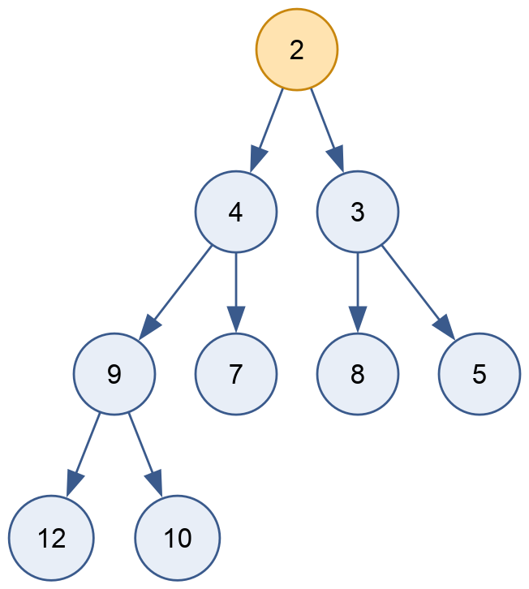{width=30%}

A plain list, drawn as the tree it already is. No conversion.

::: {.handout-only}

`viz.draw.draw_array_as_tree` takes any list and draws edges from i to 2i + 1
and 2i + 2. It knows nothing about heaps: it does not check the heap property,
and it will happily draw an unsorted list as a tree that is not a heap. That
makes it the best debugging tool of the week. When a test fails, draw
`list(heap._items)` and look for a parent that is larger than a child.

In the notebook `notebooks/12-heaps.ipynb` it renders inline. In a script,
`.render("heap", format="png")` writes a file.

:::

# Sift Up: `push`

## Append, then sift up

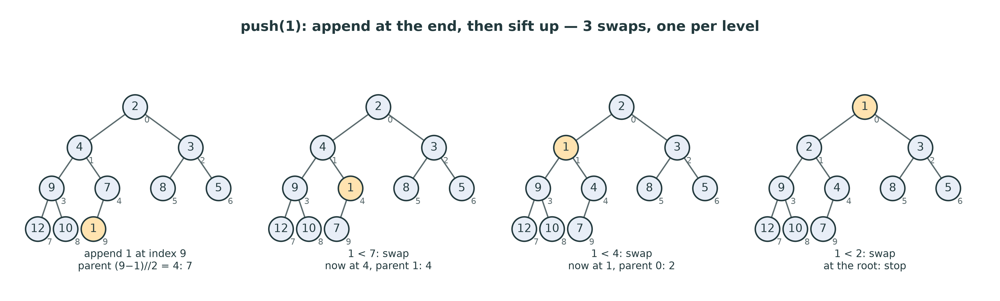{width=100%}

1. **Append** the new value at the end — the shape stays complete.
2. While it beats its **parent**, swap it with the parent.

::: {.handout-only}

Adding a value must keep both rules. The **shape** has only one legal new
position: the next free slot, index n, which in the tree is the next place on
the last level. So `push` begins with `self._items.append(value)`.

Now the **order** may be broken, but only in one place: between the new value
and its parent. Everything else was a heap before and is untouched. If the new
value beats its parent, swap them. The value is now one level higher, and the
only possible violation is again between it and its (new) parent. Repeat until
it does not beat its parent, or it reaches the root. This is **sift up** (also
called *bubble up*, *swim* or *percolate up*).

Why does a swap never break anything below? When the new value x replaces its
parent p, p moves down into x's old place. p was at most every value in its old
subtree (the heap property held there), so p is still at most x's old children,
which were p's grandchildren. And x, now above p's other child, beats p, which
beat that child. Nothing below is disturbed.

:::

## Trace: `push(1)`

| Step | `1` at | parent index | parent value | Decision |
|---|---|---|---|---|
| append | 9 | (9 – 1) // 2 = 4 | 7 | 1 < 7 $\rightarrow$ swap |
| | 4 | (4 – 1) // 2 = 1 | 4 | 1 < 4 $\rightarrow$ swap |
| | 1 | (1 – 1) // 2 = 0 | 2 | 1 < 2 $\rightarrow$ swap |
| | 0 | — | — | root: stop |

Result: `[1, 2, 3, 9, 4, 8, 5, 12, 10, 7]`. Three swaps: one per level.

::: {.handout-only}

The figure and this table were produced by running the reference `push` on the
heap `[2, 4, 3, 9, 7, 8, 5, 12, 10]` — every state is checked against the code by
`tools/figures_l12.py`. The new value climbs from index 9 to the root through
the indices 9, 4, 1, 0. That path is the chain of parents, and it has at most
height + 1 nodes, so **push is $O(\log n)$** in the worst case — the worst case
being a new value smaller than everything, which climbs all the way.

Most pushes stop much earlier. Half the nodes of a heap are leaves, so a random
new value is quite likely to belong near the bottom. On random input a push
makes, on average, **about two comparisons**, whatever n is. The measured figure
later in this lecture shows both cases: $\log_2 n$ comparisons per push on
descending input, and a flat line on random input.

In words, the method you write is: start at the last index; while the index is
not 0, compute the parent; if the item does not beat the parent, stop; otherwise
swap the two and continue from the parent. Every comparison goes through
`self._beats(child, parent)`, with the child first.

:::

# Sift Down: `pop`

## Remove the root, fill the hole from the end

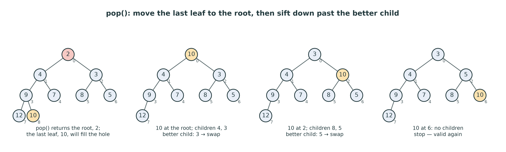{width=100%}

1. Keep the root — it is the answer.
2. Move the **last** item into the root; shrink the array by one.
3. While it is beaten by its **better child**, swap with that child.

::: {.handout-only}

The best item is at index 0, so reading it is easy. Removing it leaves a hole at
the root, and the shape must stay complete. The only slot that can disappear
without making a gap is the **last** one. So take the last item, remove it from
the end of the array ($O(1)$ — `self._items.pop()` with no argument), and put it
in the root.

That item was a leaf, so it is probably large, and the root is the wrong place
for it. It **sifts down**: compare it with its children; if one of them beats
it, swap with the better of the two, and continue from there. Stop when neither
child beats it, or when it has no children. In the figure, 10 moves from the
root to index 2 and then to index 6, a leaf; the heap is valid again, and `pop`
returns 2.

Two special cases, both in the tests:

- **Empty heap:** `pop` raises `IndexError` (`test_empty_heap`).
- **One item:** after removing the last item, the heap is empty, and there is
  no root to write into. Return that item directly
  (`test_single_element`). A `pop` that always writes `self._items[0] = last`
  fails here with an `IndexError` from your own `DynamicArray`.

:::

## The trap: swap with the **better** child

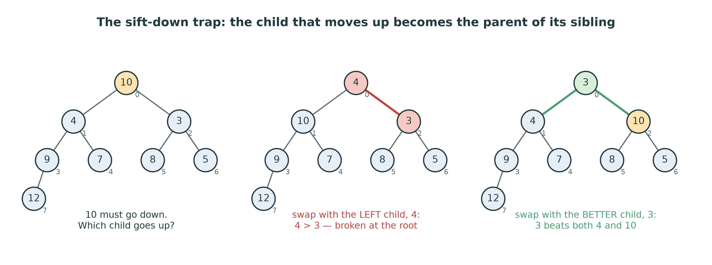{width=92%}

The child that moves up becomes the **parent of its sibling** — so it must beat
the sibling too.

::: {.handout-only}

This is the bug of the week, and the skeleton's docstring warns about it:
"swapping with the wrong one silently breaks the invariant". A sift-down that
always swaps with the **left** child, or with the first child it finds smaller
than the moving item, works on many inputs and fails on others. In the middle
panel, 4 moves up above 3 — and 4 > 3 at the root of a min-heap. Nothing
crashes; `pop` returns a wrong value some time later.

The fix is to compare three items, not two: the item, its left child (if it
exists), and its right child (if it exists), and to find the **best of the
three**. If the best is the item itself, stop. Otherwise swap with the best
child and continue. The two "if it exists" checks are where the other bugs
live: a node near the end of the array may have a left child but no right
child, so each child index must be compared with `len(self._items)` before it is
read.

`test_invariant_holds_after_every_pop` pops a 40-element heap to the end and
calls `is_valid()` after every pop, so a wrong-child bug cannot hide there —
provided `is_valid` really inspects the whole array
(`test_is_valid_rejects_a_broken_array` plants a violation to make sure it does).

:::

## Both sifts are $O(\log n)$

| Operation | Walks | Comparisons per level | Worst case |
|---|---|---|---|
| `push` $\rightarrow$ sift up | leaf to root | 1 | $\lfloor \log_2 n \rfloor$ swaps |
| `pop` $\rightarrow$ sift down | root to leaf | 2 | $2\lfloor \log_2 n \rfloor$ comparisons |
| `peek` | — | — | $O(1)$ |

A heap of a million items: at most **20** levels.

::: {.handout-only}

Sift up makes one comparison per level (the item against its parent). Sift down
makes up to two (left child against the best so far, then right child). Both
walk at most the height of the tree, which is $\lfloor \log_2 n \rfloor$, so
both operations are $O(\log n)$. The space is $O(1)$ beyond the array: the loop
keeps one index.

Could sift down be done with recursion? Yes — "sift down from the child" is a
tail call. Write it as a loop anyway: Python does not remove tail calls
(Lecture 03), and the loop is the same length.

:::

# Build-Heap in $O(n)$

## Two ways to make a heap from n values

**Way 1 — n pushes.** Start empty; push each value.
$n \times O(\log n) = O(n \log n)$.

**Way 2 — `heapify`, bottom up.** Leave the values where they are. Sift **down**
every parent, from the **last** parent back to the root.

Way 2 is **$O(n)$**.

::: {.handout-only}

`MinHeap(values)` copies the values into the `DynamicArray` in their given order
and calls `heapify`. The array then has the right shape — every array does —
and possibly no order at all. `heapify` fixes the order **in place**.

The idea: a leaf is already a heap of one. The last parent, at `n // 2 - 1`, has
only leaves below it, so a single sift-down makes its subtree a valid heap.
Work backwards: by the time you sift down node i, both of its subtrees are
already heaps, so the sift-down of i makes the subtree rooted at i a heap. When
you reach index 0, the whole array is a heap. In the language of Lecture 08,
the loop invariant is: *every subtree rooted at an index greater than i is a
heap.*

Doing it **top down**, from index 0 forwards, does not work: sifting down the
root first compares it with children that are not yet heaps, and the result is
not a heap. The direction matters.

This bottom-up construction is Robert W. Floyd's, from 1964 ("Algorithm 245:
Treesort 3"). The heap itself was introduced earlier the same year by J. W. J.
Williams, as the data structure behind heap sort.

:::

## Trace: `heapify([9, 4, 7, 1, 8, 2, 6, 3, 5])`

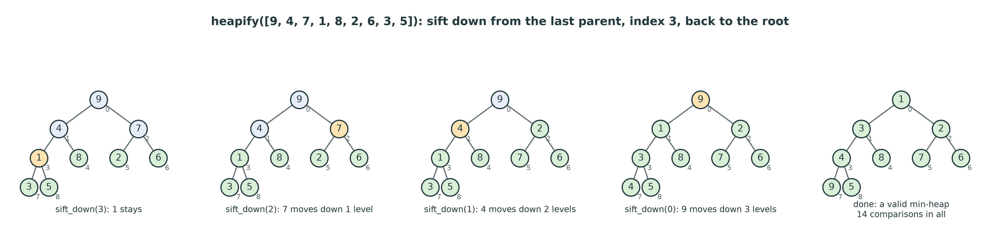{width=100%}

n = 9, last parent = 9 // 2 – 1 = **3**. Sift down 3, 2, 1, 0.

::: {.handout-only}

These are the values of `test_heapify_from_arbitrary_order`. Green nodes are
subtrees that are already heaps; the amber node is the one being sifted down.

| `sift_down(i)` | Before | Moves | After |
|---|---|---|---|
| 3 (value 1) | children 3, 5 | none — 1 beats both | `[9, 4, 7, 1, 8, 2, 6, 3, 5]` |
| 2 (value 7) | children 2, 6 | swap with 2 | `[9, 4, 2, 1, 8, 7, 6, 3, 5]` |
| 1 (value 4) | children 1, 8 | swap with 1, then with 3 | `[9, 1, 2, 3, 8, 7, 6, 4, 5]` |
| 0 (value 9) | children 1, 2 | swap with 1, then 3, then 4 | `[1, 3, 2, 4, 8, 7, 6, 9, 5]` |

Six swaps and 14 comparisons (counted by running the code). Notice who moved
furthest: the item at the **root**, which is the only node that can travel three
levels. The five leaves moved on their own account not at all.

:::

## Why heapify is $O(n)$: count the work level by level

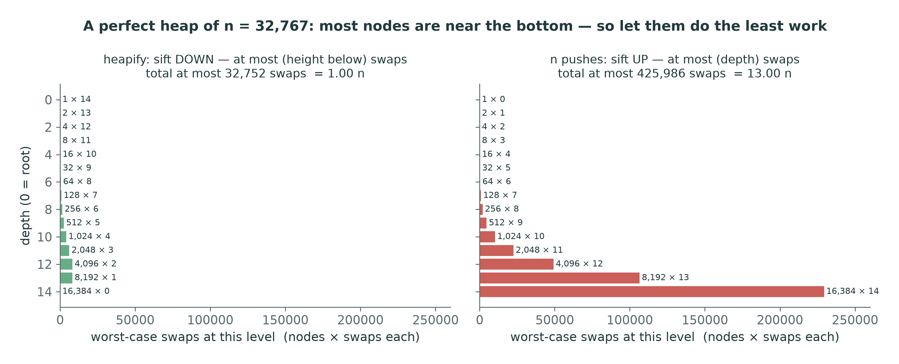{width=72%}

About $n / 2^{h+1}$ nodes sit at **height h**; each sifts down at most h levels:

$$\sum_{h \ge 0} \frac{n}{2^{h+1}} \cdot h \;=\; \frac{n}{2} \sum_{h \ge 0} \frac{h}{2^h} \;=\; \frac{n}{2} \cdot 2 \;=\; n$$

::: {.handout-only}

A first, lazy estimate says: n/2 sift-downs, each $O(\log n)$, so
$O(n \log n)$. That bound is true but not tight, because it charges every node
the full height of the tree, and almost no node has it.

Count properly. In a complete tree, **half** the nodes are leaves (height 0) and
do no work. A quarter are just above the leaves (height 1) and move at most one
level. An eighth move at most two, and so on; only the root can move
$\lfloor \log_2 n \rfloor$ levels. The total number of swaps is at most

$$0 \cdot \frac{n}{2} + 1 \cdot \frac{n}{4} + 2 \cdot \frac{n}{8} + 3 \cdot \frac{n}{16} + \dots
= \frac{n}{2}\left(\frac{1}{2} + \frac{2}{4} + \frac{3}{8} + \dots\right).$$

The series $\sum h / 2^h = 1/2 + 2/4 + 3/8 + 4/16 + \dots$ converges to **2**
(a standard result; one way to see it is to write each term $h/2^h$ as h copies
of $1/2^h$ and sum the geometric series column by column). So the total is at
most n swaps, and at most 2n comparisons: **$O(n)$**.

The figure makes it concrete for a perfect heap of $n = 32{,}767$ (15 levels).
Left: heapify. The widest bar, the 16,384 leaves, is zero; the tallest cost per
node, 14, belongs to one node. The worst-case total is 32,752 swaps —
$n - \log_2(n+1)$, just under n. Right: n pushes, where the cost is the
**depth**, not the height, and so the many nodes at the bottom pay the most.
Worst case 425,986 swaps, 13 n. The same nodes, the same tree, and the opposite
end of it doing the work.

That asymmetry is the whole trick: sift **down** costs what is **below** a node,
and most nodes have little below them; sift **up** costs what is **above**, and
most nodes have a lot above them.

:::

## Measured: heapify against n pushes

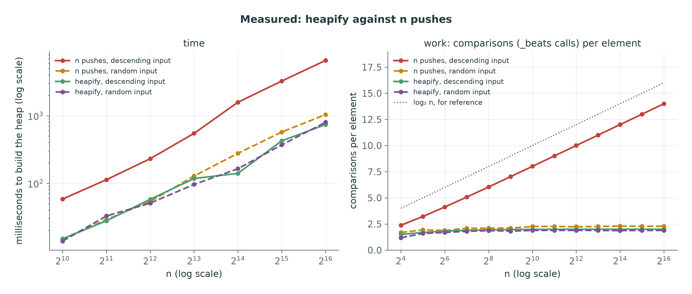{width=100%}

::: {.handout-only}

Real timings of the reference `dsa/heap.py`, built on the course `DynamicArray`
exactly as yours will be.

**Right: work** — the number of calls to `_beats` per element, counted exactly.
Heapify stays **flat**, at most 2 comparisons per element at every size (1.88
on random input, 2.00 on descending input at n = 2^16^): $O(n)$ in total, as
the summation promised. n pushes of **descending** values — the worst case for
a min-heap, since every new value is the smallest so far and climbs to the
root — run parallel to the dotted $\log_2 n$ line, about $\log_2 n - 2$: 14 per element at
n = 2^16^: $O(n \log n)$ in total. And n pushes of **random** values are flat
too, at about 2.3 per element: the average push stops near the bottom, as the
sift-up section said.

That last line is an honest complication. For **random** input, n pushes are
also $O(n)$ on average; heapify's advantage is that it is $O(n)$ **in the worst
case**, whatever the input. Big-O of the worst case and the typical cost are
different questions, and both are worth asking (Lecture 02).

**Left: time.** On descending input, n pushes are slower than heapify by a
factor that grows with n — about 4 times at n = 2^10^ and about 9 times at
n = 2^16^ (6.6 seconds against 0.74). On random input the two are close, with
heapify slightly ahead at the larger sizes: their comparison counts differ only
by 2.3 against 1.9 per element. The kinks in the heapify lines are timer and
machine noise — the comparison counts on the right have none. The slopes are
what matter; the exact milliseconds will differ on your machine.

:::

# The Priority Queue on Top

## `PriorityQueue`: a `MinHeap` of triples

`enqueue(item, priority)` pushes the triple

$$(\text{priority},\ \text{counter},\ \text{item})$$

and adds 1 to `counter`. `dequeue()` pops a triple and returns its **item**.

- Python compares tuples **left to right**: priority first.
- `counter` is unique, so the comparison **never reaches** `item`.

::: {.handout-only}

The skeleton says: build it **on top of** `MinHeap` rather than re-implementing
the sifting. `PriorityQueue.__init__` is given, and creates `self._heap`, a
`MinHeap`, and `self._counter = 0`. The heap does not know it is holding tasks;
it compares whatever you push with `<`, and Python compares tuples
**lexicographically** — the first elements, and only if they are equal, the
second, and so on.

**Why not the pair (priority, item)?** Because two items with the same priority
make Python compare the items themselves. For strings that silently orders
equal-priority tasks alphabetically. For dictionaries, or most objects, it
raises

```text
TypeError: '<' not supported between instances of 'dict' and 'dict'
```

which is exactly what `test_priority_queue_handles_unorderable_items` provokes.
The counter sits between the priority and the item as a **tie-breaker**. No two
entries share a counter, so any two triples are decided by their first two
elements, and the item is never compared.

**A bonus: fairness among equals.** The counter grows with every enqueue, so
between two items of equal priority, the one enqueued **first** has the smaller
counter and is dequeued first. The contract of `dsa/heap.py` only promises that
ties "may break in any order", but a counter gives you **first come, first
served among equals** at no cost. A bare heap does not: it is **not stable**
(the heap sort of Week 10 is not stable for the same reason).

The tuple is not storage in the sense of the storage rule: it is one **value**,
a small record, and the records live in your `DynamicArray`. This is the design
of Python's own `heapq` documentation, which recommends exactly this triple.

:::

## Trace: triage

| Operation | Heap array: `(priority, counter, item)` | Returns |
|:--------------|:-----------------------------------|:------------|
| enqueue A, 2 | `(2,0,A)` | |
| enqueue C, 1 | `(1,1,C) (2,0,A)` | |
| enqueue K, 3 | `(1,1,C) (2,0,A) (3,2,K)` | |
| enqueue L, 1 | `(1,1,C) (1,3,L) (3,2,K) (2,0,A)` | |
| dequeue | `(1,3,L) (2,0,A) (3,2,K)` | C |
| dequeue | `(2,0,A) (3,2,K)` | L |

A broken arm · C chest pain · K sprained ankle · L allergic reaction

::: {.handout-only}

Produced by running the reference `PriorityQueue`. Chest pain and the allergic
reaction share priority 1; the chest pain arrived first (counter 1 against 3),
so it is served first. The broken arm arrived before both and waits, which is
the point of a priority queue. When "allergic reaction" is pushed, it enters at
index 3 under `(2,0,arm)` at index 1 and sifts up one level, pushing the arm
down: `(1, 3, …) < (2, 0, …)` because 1 < 2, and the counters are not looked at.

:::

## Where priority queues are used

- **Scheduling:** an operating system runs the highest-priority ready process;
  a print server, a build server, a job queue.
- **Triage:** emergency departments; bug trackers ("P1 before P3").
- **Event simulation:** the next event is the one with the smallest time.
- **Top-k:** the k largest of n values, in $O(n \log k)$.
- **Graph algorithms:** Dijkstra's shortest paths, Prim's spanning tree,
  Huffman coding — *beyond this course's bylaw*.

::: {.handout-only}

**Simulation.** A bank or network simulator keeps future events — "customer 17
arrives at t = 4.2", "server 3 finishes at t = 5.0" — in a priority queue keyed
by time. The main loop is: dequeue the earliest event, handle it, enqueue the
events it causes. The clock jumps from event to event rather than ticking.

**Beyond the bylaw.** The course's bylaw lists heaps and priority queues, and
graph *searches* (Week 14), but not shortest paths. Still, you should know the
names. **Dijkstra's algorithm** (1959) finds shortest paths in a weighted graph
by repeatedly taking the unvisited vertex with the smallest known distance —
from a priority queue. **Prim's algorithm** grows a minimum spanning tree the
same way, and **Huffman coding** (1952), which compresses the files in every ZIP
archive, repeatedly merges the two least frequent symbols — two `pop`s and a
`push`. In each of them the priority queue is the engine, and its
$O(\log n)$ operations are what make the algorithm fast. Week 14's BFS is
Dijkstra with a FIFO queue in place of the priority queue, for graphs whose
edges all weigh the same.

**In Python** the library version is the `heapq` module: functions
`heappush`, `heappop` and `heapify` that treat an ordinary list as a min-heap,
with exactly the index arithmetic of this lecture. There is no max-heap in
`heapq`; the usual trick is to push `-x`. Write your own first; then use the
library.

:::

## Top-k: keep a small heap, not a big one

The k **largest** of n values:

1. Keep a **min**-heap of at most k values.
2. For each value: if the heap has fewer than k, push it. Otherwise, if the
   value beats the heap's **smallest** (its root), pop the root and push the
   value.
3. The heap now holds the k largest.

$O(n \log k)$ time, $O(k)$ space. Sorting everything: $O(n \log n)$ and $O(n)$.

::: {.handout-only}

It feels backwards — a **min**-heap to find the **largest** values — until you
see what the root is for. The heap holds the best k seen so far, and its root is
the **weakest** of them: the one to throw out when something better arrives. A
new value that does not beat the root cannot be among the top k, and costs one
`peek`, $O(1)$.

For the 10 largest of a million values, the heap never holds more than 10
items: each step is $O(\log 10)$, a handful of comparisons, and the memory is 10
slots — so it works on a stream that does not fit in memory, such as a log file
of a billion lines. Sorting the million needs all of them in memory and about
20 million comparisons. This is W12-C2 in the question bank.

The dual problem — the k **smallest** — uses a **max**-heap of size k.

:::

# Heap Sort, Revisited

## Week 10 was a heap in disguise

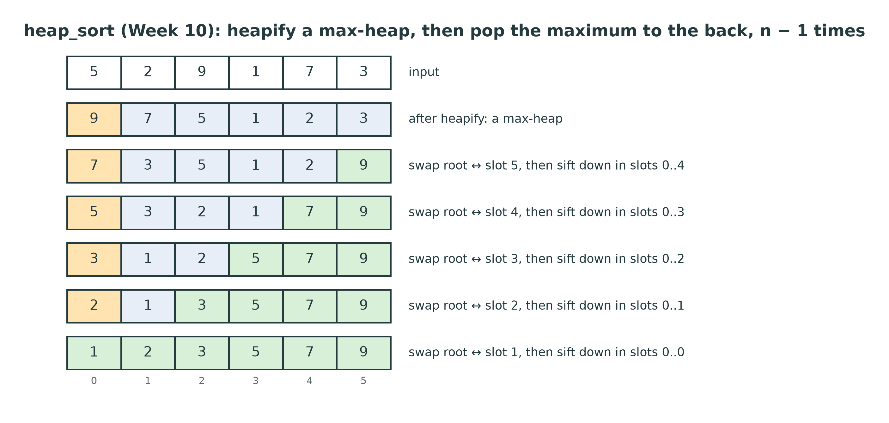{width=62%}

1. `heapify` the array as a **max**-heap: $O(n)$.
2. Repeat n – 1 times: swap the root (the maximum) with the **last** item of the
   heap; the heap shrinks by one; sift the new root down: $O(\log n)$.

$O(n \log n)$ always, $O(1)$ extra space, **not stable**.

::: {.handout-only}

The study plan called Week 10's heap sort "week 12 arriving early". Here is the
whole of `heap_sort_steps` from `solutions/dsa/sorting.py`, with the snapshots
removed:

```python
def _sift_down(a, index, size):
    """Max-heap sift-down of a[index] within a[0:size]."""
    while True:
        largest = index
        left, right = 2 * index + 1, 2 * index + 2
        if left < size and a[left] > a[largest]:
            largest = left
        if right < size and a[right] > a[largest]:
            largest = right
        if largest == index:
            return
        a[index], a[largest] = a[largest], a[index]
        index = largest

for index in range(n // 2 - 1, -1, -1):        # build the heap: O(n)
    _sift_down(a, index, n)
for end in range(n - 1, 0, -1):
    a[0], a[end] = a[end], a[0]                 # the max goes to the back
    _sift_down(a, 0, end)                       # restore the heap in a[:end]
```

Recognise every line. The index arithmetic is `2 * index + 1` and
`2 * index + 2`. The sift-down finds the **better** of three — here "better"
means larger, because it is a max-heap. The first loop is `heapify`, from the
last parent `n // 2 - 1` back to 0. The second loop is `pop` done in place: the
root is swapped to the back of the array rather than returned, and the heap is
told it is one smaller through the `size` argument rather than by shrinking the
array.

**Why a max-heap for an ascending sort?** Each extraction puts the current
maximum at the **end** of the shrinking heap, which is exactly where the
largest remaining value belongs in the sorted output. The sorted part grows from
the right while the heap shrinks from the right: one array, two regions, no
extra memory. (The green cells in the figure are the sorted region.)

**Why not stable?** The swap of the root with the last item jumps an element
across the whole array, over any equal values in between. Week 10 measured it.

The difference between the week-10 function and this week's class is only
packaging: the class keeps the heap alive between operations, so items can
arrive and leave in any order. That is what a priority queue needs, and what
sorting does not.

:::

# This Week

## Exercises: `dsa/heap.py`

| Method | Target | The trap |
|---|---|---|
| `_sift_up` | $O(\log n)$ | parent is `(i - 1) // 2`; stop at the root |
| `_sift_down` | $O(\log n)$ | the **better** child; a missing right child |
| `push`, `peek` | $O(\log n)$, $O(1)$ | `IndexError` on an empty `peek` |
| `pop` | $O(\log n)$ | last item to the root; the one-item heap |
| `heapify` | **$O(n)$** | from `n // 2 - 1` **down** to 0 — not n pushes |
| `is_valid` | $O(n)$ | check **every** child against its parent |
| `PriorityQueue` | $O(\log n)$ | the triple; return the **item** |

```powershell
pytest tests/test_heap.py -v
```

::: {.handout-only}

Twenty-eight tests. Eleven of them run twice, once for `MinHeap` and once for
`MaxHeap` — with `[MinHeap]` or `[MaxHeap]` in their names — so a `<` written
outside `_beats` shows up as a set of `[MaxHeap]` failures. Five test the
priority queue.

**Write `heapify` early.** Any test that builds a heap from a list —
`cls([5, 3, 8, ...])` — goes through `__init__`, which calls `heapify`. So does
the `heapify`-free-looking `test_pop_returns_sorted_order`. The lab orders the
methods so that each part's tests can pass.

**Use `_beats` for every comparison, and nothing else.** Not `<`, not `min`.

:::

## Homework 12 — before Lecture 13

1. **Implement** `dsa/heap.py` until all 28 tests pass.
2. **Trace** by hand, as trees and as arrays: push 6, 2, 8, 1, 5, 3 into an
   empty `MinHeap`; then pop twice.
3. **Heapify** `[3, 9, 2, 1, 4, 5, 8, 7, 6, 0]` by hand. Count the swaps.
4. **Measure** heapify against n pushes on descending input in
   `notebooks/12-heaps.ipynb`, and count `_beats` calls with a subclass.

::: {.handout-only}

For item 2, check yourself with the real object: `list(h._items)` after each
step, and `draw_array_as_tree` to see it. For item 3, predict the last parent
first. For item 4, a subclass of `MinHeap` whose `_beats` adds 1 to a counter
and then returns `super()._beats(child, parent)` counts every comparison your
code makes — the method of the measured figure. Lab 12 walks you through it.

:::

# Summary

## Seven things to keep

1. A priority queue serves the **most urgent** item; a heap gives $O(\log n)$
   enqueue **and** dequeue.
2. **Shape:** a complete binary tree — height $\lfloor \log_2 n \rfloor$.
3. **Order:** every parent beats its children; siblings are unordered.
4. The array **is** the tree: children `2i + 1`, `2i + 2`; parent `(i − 1) // 2`.
5. `push` = append + **sift up**; `pop` = last to root + **sift down** past the
   **better** child.
6. `heapify` sifts down from `n // 2 − 1` to 0: **$O(n)$**, because most nodes
   are near the bottom.
7. `PriorityQueue` pushes `(priority, counter, item)`: the counter breaks ties —
   first come, first served.

## Next

**Week 13 — Hash tables.** From $O(\log n)$ to $O(1)$ — **on average**. What
"average" promises, and what breaks it.

::: {.handout-only}

A heap finds the **best** item fast, and nothing else; a binary search tree
finds **any** item in $O(\log n)$ while it stays balanced. Week 13 asks for less
than both — no order at all — and in exchange finds any item in $O(1)$ on
average, by computing where it lives instead of searching for it.

---

## Sources and further reading

- **J. W. J. Williams.** "Algorithm 232: Heapsort", *Communications of the ACM*
  7(6), 1964 — the binary heap, introduced for sorting.
- **R. W. Floyd.** "Algorithm 245: Treesort 3", *Communications of the ACM*
  7(12), 1964 — building the heap bottom up, in linear time.
- **T. H. Cormen, C. E. Leiserson, R. L. Rivest and C. Stein.** *Introduction to
  Algorithms*, 3rd ed., MIT Press, 2009, chapter 6, "Heapsort" — heaps,
  `BUILD-MAX-HEAP` and its $O(n)$ bound, and priority queues (1-based indices).
- **R. Sedgewick and K. Wayne.** *Algorithms*, 4th ed., Addison-Wesley, 2011,
  §2.4 "Priority Queues" — *swim* and *sink*, and top-k on a stream.
- **D. E. Knuth.** *The Art of Computer Programming*, vol. 3, *Sorting and
  Searching*, 2nd ed., Addison-Wesley, 1998, §5.2.3 — heapsort and its analysis.
- **Python documentation.** The `heapq` module — including the
  `(priority, count, task)` recipe for a priority queue.

Every figure in this lecture is generated by `tools/figures_l12.py`. The trace
figures are drawn from states recorded by running the reference solution; the
measured figure is real measurement and will differ slightly on your machine.

:::
