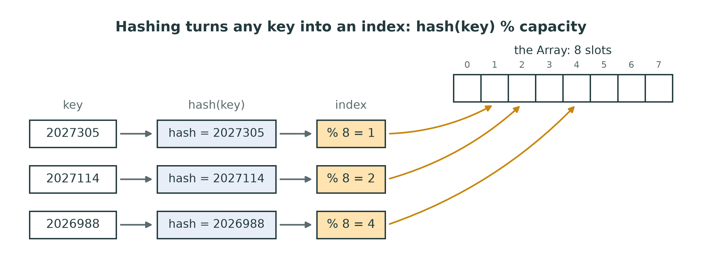
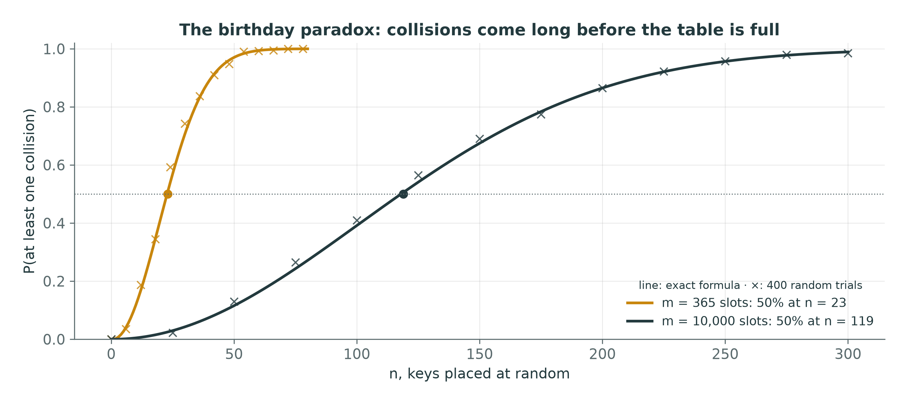
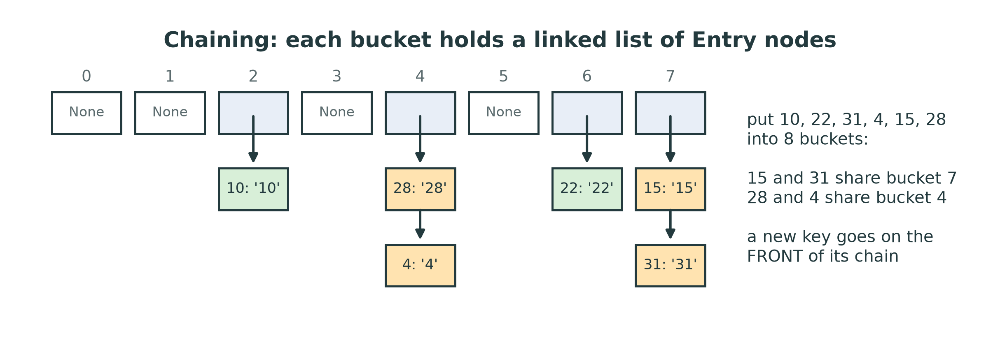
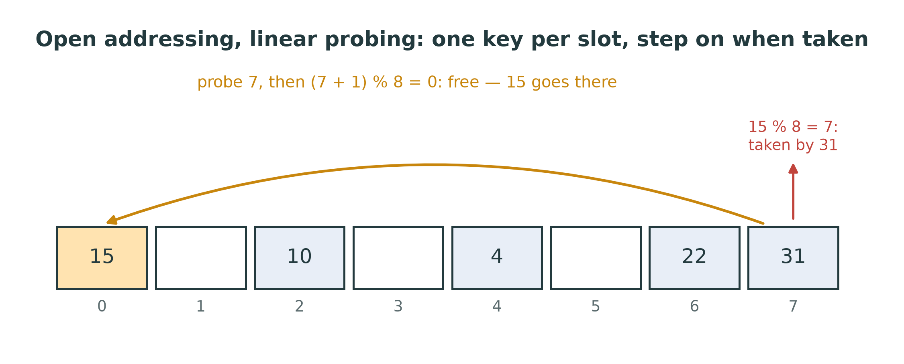
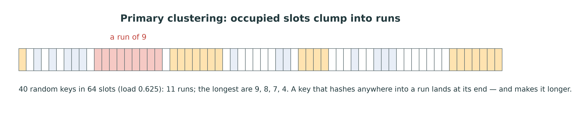
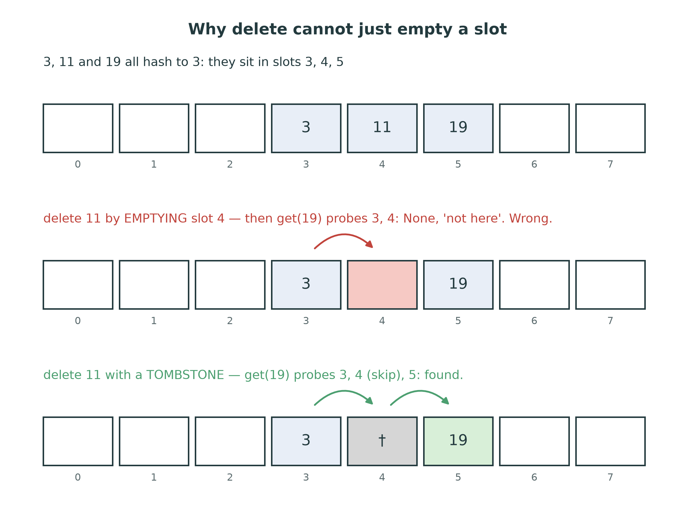
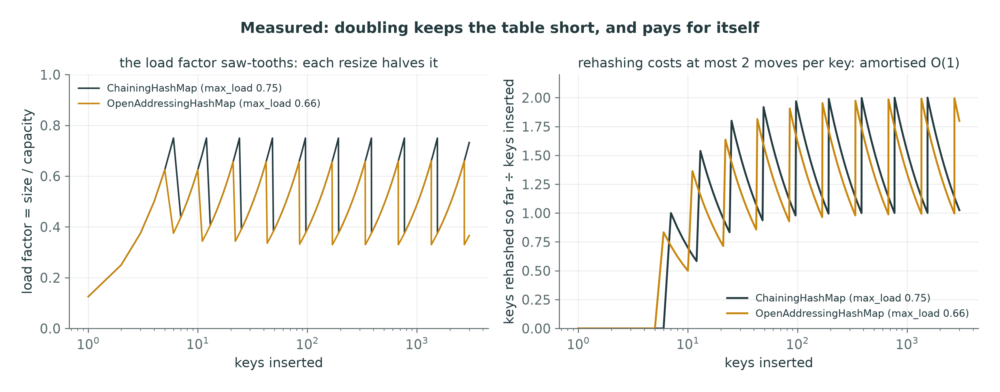
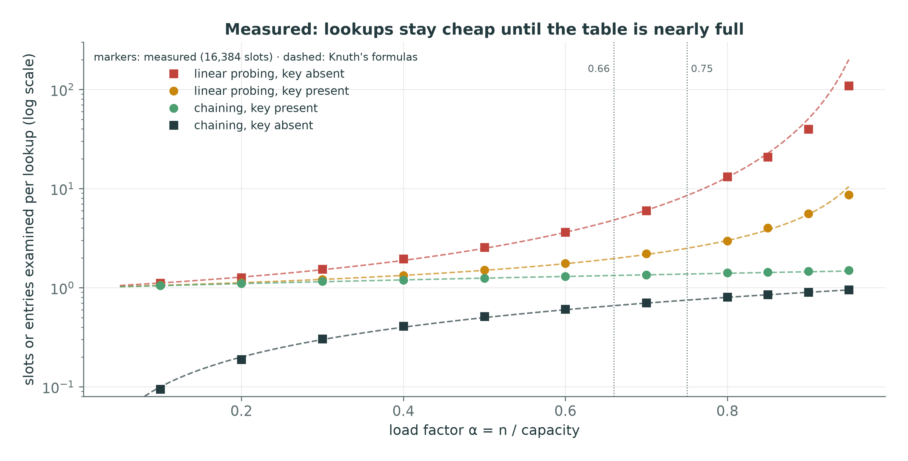
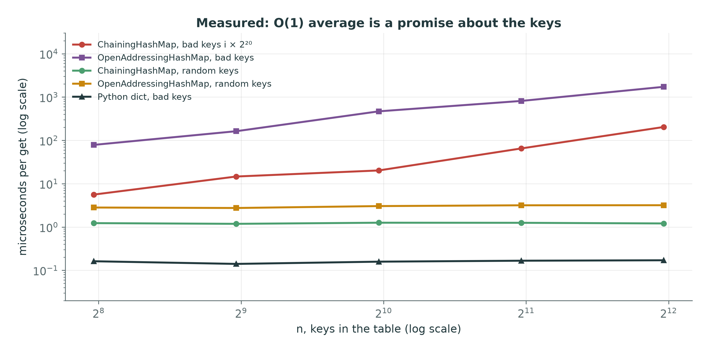

::: {.handout-only}

> **How to read this document.** This is the handout for Lecture 13. It holds
> everything on the slides, plus what I said out loud. Every structure so far
> finds a value by walking or by halving. This week you build one that finds it
> by **computing where it is** — the structure behind Python's `dict` and `set`,
> and behind nearly every "look it up by name" in software. You will build it
> twice, measure it, and then break it on purpose, because its famous $O(1)$ is a
> promise about the **average**, and you should know exactly who can break it.
>
> Slides: `DSA27-L13-slides.pdf` · Code: `dsa/hashmap.py` ·
> Tests: `tests/test_hashmap.py`

:::

# Where We Are

## Finding a value by its key

| Structure | Find a key | Needs |
|---|---|---|
| unsorted array, linked list | $O(n)$ | nothing |
| sorted array (Week 8) | $O(\log n)$ | sorted order |
| binary search tree (Week 11) | $O(\log n)$ if balanced | order, balance |
| **hash table (today)** | **$O(1)$ on average** | a good hash function |

Today's question: **can we find a key without comparing it to other keys at all?**

::: {.handout-only}

Every search in this course so far worked by **comparison**: is this the key?
Is the key smaller or larger? Comparison-based search cannot beat
$O(\log n)$ in the worst case — each comparison gives at most one bit of
information, and telling n positions apart takes about $\log_2 n$ bits. A hash
table escapes that bound the same way counting sort (Week 9) escaped
$O(n \log n)$: it does not compare keys, it **computes** with them.

*Hash table* in Arabic: جدول التجزئة. *Hash function*: دالة التجزئة. *Key*:
المفتاح.

:::

## Today

1. The dream: the key **is** the index
2. Hash functions: what `hash()` does, and what is and is not reproducible
3. Collisions, and the birthday paradox
4. Chaining: a linked list in every bucket
5. Open addressing: linear probing, clustering, **tombstones**
6. Load factor and resizing — amortised again
7. Measured: probes against load factor; and the keys that break it
8. Python's `dict` and `set`: the real thing, which you now understand

# The Dream

## Direct addressing: the key is the index

Keys are student numbers 0 to 999? Use an `Array(1000)`:

- `put(k, v)`: `a[k] = v` — **$O(1)$**
- `get(k)`: `a[k]` — **$O(1)$**

No search at all. **But:** the space is the size of the **key range**, not the
number of keys.

::: {.handout-only}

This is the best possible dictionary, and you have had it since Lecture 02:
indexing an `Array` is $O(1)$, so if the key **is** an index, there is nothing
to search. Counting sort used exactly this in Week 9 — one counter per possible
value.

It fails as soon as the keys are not small integers. Mansoura student numbers
have seven digits: an `Array` indexed by them needs ten million slots to hold a
class of two hundred. A name, a URL or a tuple is not an index at all. We need
a function that squeezes **any** key into a **small** range of indices — and we
must then live with what that squeezing costs.

:::

## Hashing: squeeze the key into the table

{width=92%}

$$\text{index} = \text{hash}(\text{key}) \bmod \text{capacity}$$

::: {.handout-only}

Two steps, and it pays to keep them apart:

1. **`hash(key)`** turns the key into an integer. That is Python's job: every
   hashable object has a `__hash__`, and `hash()` calls it. You do not write a
   hash function this week; the docstring of `_index` says so.
2. **`% capacity`** folds that integer into the table: a number from 0 to
   capacity - 1, an index into the `Array`. That is the table's job, and it is
   one line of `dsa/hashmap.py`, given to you:

```python
def _index(self, key):
    return hash(key) % len(self._buckets)
```

Python's `%` always returns a non-negative result for a positive capacity, even
for a negative hash: `-5 % 8` is 3. (In C and Java, `-5 % 8` is -5, and a
negative index is a crash — the same trap as the ring buffer's step back in
Lecture 07.)

The figure uses three seven-digit student numbers. For an `int`, `hash(n)` is
just `n`, so the index is simply the last three bits of the number: 2027305,
2027114 and 2026988 land in slots 1, 2 and 4 of an 8-slot table. Ten million
possible keys, eight slots. Something has to give — and it is the next section.

:::

# Hash Functions

## Python's `hash()`

| Expression | Value | Every run? |
|--------------------------|----------------------------------------|-----------|
| `hash(42)` | `42` | yes |
| `hash(-1)` | `-2` | yes |
| `hash(1.0)`, `hash(True)` | `1` | yes |
| `hash((1, 2))` | `-3550055125485641917` | yes |
| `hash("abc")` | a different number **each run** | **no** |
| `hash([1, 2])` | `TypeError: unhashable type: 'list'` | — |

::: {.handout-only}

Every value in that table was printed by Python 3.14 on a 64-bit machine; the
course's 3.13 gives the same. Three of them deserve a sentence.

- **`hash(n)` is `n`** for every integer you will meet in this course. (The
  exact rule is `n` reduced modulo the prime $2^{61} - 1$, so `hash(2**61 - 1)`
  is 0.) The one oddity is **`hash(-1)` is -2**: inside CPython, -1 is the
  return value that means "an error happened", so no object may hash to it.
- **`hash(1.0) == hash(1) == hash(True)`.** Because `1 == 1.0 == True` in
  Python, and the one rule every hash function must keep is: **equal keys must
  have equal hashes.** Otherwise `d[1.0]` would look in a different bucket from
  `d[1]` and miss a key that is, by `==`, the same one.
- **A list is unhashable.** A list can change after it is put in a table; its
  hash would change with it, and the table would look for it in the wrong
  bucket. So Python refuses. Tuples of hashable things, strings, numbers and
  frozensets are hashable; lists, dicts and sets are not. Your `put` inherits
  this for free: `hash(key)` raises the same `TypeError`.

:::

## Same run, same hash. Next run — maybe not.

```powershell
python -c "print(hash('abc'))"      # -60919065288970757
python -c "print(hash('abc'))"      # 2138548942786055565
python -c "print(hash(12345))"      # 12345, every time
```

- **Deterministic within one run:** always — a table depends on it.
- **Across runs:** `int`, `float`, tuples of them — yes. **`str` and `bytes` —
  no**: randomised on purpose.
- `PYTHONHASHSEED=0` fixes the seed, for reproducing a bug.

::: {.handout-only}

Since Python 3.3, the hash of a `str` (and of `bytes`) is **randomised**: it is
computed with a secret key chosen when the interpreter starts. Since Python 3.4
the function is SipHash, a keyed hash designed for exactly this job (PEP 456),
and since 3.11 its faster SipHash-1-3 variant (`sys.hash_info.algorithm` prints
`siphash13`). So:

- **Inside one run**, `hash("abc")` is the same every time you ask. A table
  could not work otherwise.
- **In the next run** it is almost certainly different. So the order in which
  your `ChainingHashMap` iterates string keys can change from one run to the
  next, and so can which bucket a string key lands in. A bug that depends on
  where keys land — the lab has one — can pass on one run and fail on the next.
- **Integers are not randomised.** Nor are floats, or tuples made of ints and
  floats. That is why every trace in this lecture, the lab and the question
  bank uses **integer keys**: `hash(n) = n`, and anyone can check them by hand.

Why randomise at all? Section 7 answers that: an attacker who can predict your
hashes can choose keys that all collide. To make string hashes reproducible —
to chase a bug that only shows on some runs — fix the seed before Python starts:
`$env:PYTHONHASHSEED = "0"` in PowerShell, `PYTHONHASHSEED=0` in a Linux shell.
Unset it afterwards.

(Objects of your own classes hash by **identity** unless you define
`__hash__` — based on where the object lives in memory, so that is not
reproducible across runs either.)

:::

## What makes a good hash function

1. **Consistent:** `a == b` $\Rightarrow$ `hash(a) == hash(b)`. Non-negotiable.
2. **Spreads keys evenly** over the indices — similar keys, different slots.
3. **Uses the whole key**, not just part of it.
4. **Fast** — it runs on every single operation.

A bad one: **sum of the character codes**. `"listen"`, `"silent"` and
`"enlist"` all hash to 655.

::: {.handout-only}

Rule 1 is about correctness; the other three are about speed. A hash function
that returns 0 for everything is **correct** — every table built on it still
finds every key — it is just $O(n)$, because every key lands in one bucket.
Hold on to that: a bad hash never makes a table *wrong*, only *slow*. (W13-E2
asks you to argue it.)

The sum of character codes breaks rule 3 in a subtle way: it uses every
character but ignores their **order**, so every anagram collides. Here is a toy
hash you can compute by hand, with the fix:

```python
def sum_hash(s):                 # bad: order-blind
    return sum(ord(c) for c in s)

def poly_hash(s):                # better: position matters
    h = 0
    for c in s:
        h = 31 * h + ord(c)
    return h
```

`sum_hash` gives 655 for all three anagrams; `poly_hash` gives
`"listen"` 3192458695, `"silent"` 3392640085 and `"enlist"` 2996453575 (these
numbers are deterministic — no randomisation here, you can check them).
`poly_hash` is the scheme Java's `String.hashCode` uses (Java then keeps only
32 bits). It is a polynomial in 31, evaluated by Horner's rule: each character
is multiplied by a different power of 31 according to its position.

**Why `%` with a power of two is risky.** `dsa/hashmap.py` starts at capacity 8
and doubles: the capacity is always a power of two, and `h % 2**k` keeps only
the **last k bits** of the hash. If the keys differ only in their high bits —
multiples of 1,024, say — they all land in slot 0. Choosing a **prime** capacity
spreads such keys; CPython and Java keep powers of two (so `%` is a fast bit
mask) and instead **mix the high bits in**: Java's `HashMap` uses
`h ^ (h >>> 16)`, and CPython's probe sequence folds in the high bits as it
goes. Section 7 measures what happens when nobody does.

:::

# Collisions

## Collisions are certain

- **Pigeonhole:** more possible keys than slots $\Rightarrow$ some keys **must** share.
- **Birthday paradox:** it happens **early**.

{width=80%}

::: {.handout-only}

A **collision** is two different keys with the same index. They are not
a sign of a bad hash function — with ten million student numbers and eight
slots, they are forced. The question is only how early they come.

Much earlier than intuition says. With 23 people in a room, the chance that two
share a birthday is 50.7%, although there are 365 days. The exact probability
that n keys placed at random in m slots all miss each other is

$$P(\text{no collision}) = \frac{m}{m} \cdot \frac{m-1}{m} \cdots \frac{m-n+1}{m}$$

and it drops below one half at about $n \approx 1.18\sqrt{m}$. For m = 10,000
slots, that is n = 119: a table **one percent full** has probably already had
a collision. The crosses in the figure are 400 random trials at each n, and
they sit on the formula.

*Collision* in Arabic: تصادم.

The lesson for the design: **every hash table needs a collision strategy**, not
as a rare fallback but as a normal path that runs all the time. There are two
families.

:::

## Two ways to live with collisions

| | **Chaining** | **Open addressing** |
|---|---|---|
| a slot holds | a **list** of entries | **one** entry |
| on collision | add to the list | **probe** another slot |
| load factor | may exceed 1 | must stay **< 1** |
| delete | unlink a node | leave a **tombstone** |
| used by | Java `HashMap` | Python `dict`, `set` |

::: {.handout-only}

*Chaining* in Arabic: التسلسل. *Open addressing*: العنونة المفتوحة.

You build both. `ChainingHashMap` reuses what you learnt in Week 5 — every
bucket is a small linked list of `Entry` nodes. `OpenAddressingHashMap` keeps
everything in the `Array` itself and needs one genuinely new idea, the
tombstone. Their tests are the same eight, run on each class, plus one test
that only open addressing needs.

:::

# Chaining

## A linked list in every bucket

{width=86%}

`self._buckets` is an `Array`; each slot is `None` or the **first** `Entry` of
a chain.

::: {.handout-only}

`Entry` is given to you, and it is a Week 5 node with one extra field:

```python
class Entry:
    __slots__ = ("key", "value", "next")

    def __init__(self, key, value, next=None):
        self.key = key
        self.value = value
        self.next = next
```

The figure is the real state of a `ChainingHashMap(capacity=8)` after
`put(10, '10')`, `put(22, '22')`, `put(31, '31')`, `put(4, '4')`,
`put(15, '15')` and `put(28, '28')`, read back out of its buckets by
`tools/figures_l13.py`. The indices are just the keys mod 8: 10 $\to$ 2, 22 $\to$ 6,
31 $\to$ 7, 4 $\to$ 4, 15 $\to$ 7, 28 $\to$ 4. Two collisions, two chains of two.

**Why the front?** A new key is linked in at the **head** of its chain —
`push_front`, $O(1)$, with no walk to the tail. But `put` has to walk the chain
anyway, to find out whether the key is already there (then it overwrites
rather than adding a duplicate). Adding at the front is simply the shortest
code once the walk has found nothing.

The storage rule holds: the buckets are an `Array`, the chains are node
objects. No Python `list` or `dict` anywhere — which would, after all, be
cheating on a hash table.

:::

## The three operations, in words

**get(key)**: walk the chain at `_index(key)`; return the value of the entry
whose key `== key`; at the end of the chain: `default`, or **`KeyError`**.

**put(key, value)**: walk the same chain; if the key is there, **overwrite** and
return. Otherwise push a new `Entry` on the front; `size += 1`; if
`size / capacity > max_load`, **resize** to twice the capacity.

**delete(key)**: walk with **two** references, `prev` and `entry`; unlink the
match — the head of the chain is the special case; `size -= 1`. Not found:
**`KeyError`**.

::: {.handout-only}

Those are the exercises; turning them into Python is your job. Three details.

- **Compare keys with `==`, not `is`.** Two equal strings may be two different
  objects. `hash` found the bucket; `==` finds the entry in it.
- **`get` has a sentinel default.** `get(key)` with no default raises `KeyError`;
  `get(key, "fallback")` returns the fallback — and so must `get(key, None)`.
  The skeleton uses a private object, `_MISSING`, as the "no default given"
  marker, because `None` is a value a caller may legitimately pass (and store).
  The given `__contains__` calls `get(key)` and catches `KeyError` for the same
  reason: a key whose value is `None` is still **in** the table.
- **`delete` is Week 5's `remove`**, on a list whose head lives in an `Array`
  slot instead of a `head` field. When the match is the first entry, the
  bucket slot itself must change; otherwise `prev.next` skips over the match.

:::

## Trace: chaining, capacity 8, `max_load` 0.75

| Operation | Index | Buckets (non-empty) | size | load |
|---|---|---|---|---|
| put 10, 22, 31, 4 | 2, 6, 7, 4 | 2:10 · 4:4 · 6:22 · 7:31 | 4 | 0.5 |
| put 15 | 7 | … 7: **15 $\to$ 31** | 5 | 0.625 |
| put 28 | 4 | 4: **28 $\to$ 4** … | 6 | 0.75 |
| put 7 | 7 | 7 > 0.75·8: **resize to 16** | 7 | 0.4375 |
| | | 4:4 · 6:22 · 7:7 · 10:10 · 12:28 · 15: 31 $\to$ 15 | | |
| delete 31 | 15 | 15: 15 | 6 | 0.375 |

::: {.handout-only}

Produced by running the reference solution and printing its buckets. Three
things to see.

- **0.75 is allowed; above it is not.** After `put 28` the load is exactly
  0.75, and the test is `>`: no resize. `put 7` makes it 7/8 = 0.875, and the
  table doubles.
- **After the resize, every key has a new index**, because the index is
  `key % 16` now: 10 moves from bucket 2 to bucket 10, 28 from 4 to 12, 31 from
  7 to 15. 15 and 31 still collide — they differ by 16. The chain order came out
  reversed (31 $\to$ 15), because `_resize` pushes each moved entry on the front of
  its new chain; order within a chain means nothing.
- **Delete unlinks the head.** 31 was first in bucket 15, so the bucket slot
  itself now points at 15.

:::

## Cost: $1 + \alpha$

**Load factor:** $\alpha = n / \text{capacity}$ — the average
chain length.

- successful `get`: about $1 + \alpha/2$ entries examined
- unsuccessful `get`: about $\alpha$ entries — the whole chain
- keep $\alpha \le 0.75$ $\Rightarrow$ **$O(1)$ on average**

Worst case: every key in **one** chain — **$O(n)$**.

::: {.handout-only}

*Load factor* in Arabic: معامل التحميل.

Assume the hash spreads keys as if at random (the "simple uniform hashing"
assumption of the textbooks). Then a chain has, on average, $\alpha$ entries.
An unsuccessful search walks the whole chain of its bucket: $\alpha$ entries,
plus the $O(1)$ cost of hashing. A successful one stops, on average, halfway
along the chain of a key that is there: $1 + \alpha/2$. (CLRS, theorems 11.1 and
11.2.) Section 7 shows both formulas holding in measurement, within a percent.

So a hash table is $O(1)$ **only while $\alpha$ is bounded by a constant.** That
is the whole reason for the resize: without it, $\alpha = n / 8$ and every
operation is $O(n)$ — a linked list with an array of eight heads in front.
`test_load_factor_stays_bounded` puts 500 keys and checks that the load factor
is not above `max_load + 0.05`; a table that never resizes shows 62.5.

The worst case does not go away: $O(n)$ happens when many keys share a bucket,
and **no** resize fixes it, because keys with equal hashes collide at every
capacity. That is Section 7.

:::

# Open Addressing

## Linear probing: one key per slot

{width=86%}

Two `Array`s, `_keys` and `_values`. Start at `hash(key) % capacity`; if that
slot is taken by another key, try the **next**: `(i + 1) % capacity`.

::: {.handout-only}

No nodes, no chains: the table **is** the array. A collision is resolved by
walking forward to the next free slot, wrapping round the end with `%` exactly
like the ring buffer of Lecture 07. The sequence of slots a key tries is its
**probe sequence**; with linear probing it is

$$h,\; h+1,\; h+2,\; \dots \pmod{\text{capacity}}, \qquad h = \text{hash}(\text{key}) \bmod \text{capacity}$$

In `dsa/hashmap.py`, `_probe(key)` is a **generator** (Lab 03) that yields those
indices, capacity of them at most — every slot once. `put`, `get` and `delete`
then all loop `for i in self._probe(key):`, and only the loop body differs. If
you later want quadratic probing (the docstring's challenge), you change
`_probe` and nothing else.

The figure is the real state after `put` 10, 22, 31, 4 and 15 into 8 slots.
15 hashes to 7, which 31 holds; the probe moves to `(7 + 1) % 8 = 0`, which is
free. Note what that means for **`get(15)`**: it must follow the **same** probe
sequence, and it cannot stop at slot 7 just because slot 7 holds something
else.

**When does a search stop?** At the key (found), or at a **never-used** slot,
`None` — because `put` would have put the key there. `get(23)` on this table:
23 % 8 = 7 holds 31, slot 0 holds 15, slot 1 is `None` — 23 is not in the
table, after 3 probes.

:::

## Trace: open addressing, capacity 8, `max_load` 0.66

| Operation | Home | Probes | Slots 0–7 | size |
|--------------|------|----------------------|--------------------------|------|
| put 10, 22, 31, 4 | 2, 6, 7, 4 | 1 each | `_ _ 10 _ 4 _ 22 31` | 4 |
| put 15 | 7 | 7, **0** | `15 _ 10 _ 4 _ 22 31` | 5 |
| delete 31 | 7 | 7 | `15 _ 10 _ 4 _ 22 †` | 4 |
| get 15 | 7 | 7 (†, go on), **0** | unchanged | 4 |
| put 23 | 7 | *load check: rebuild first* | `23 _ 10 _ 4 _ 22 15` | 5 |

† is the tombstone.

::: {.handout-only}

Produced by the reference solution. The first two rows are the figure. The
interesting rows are the last three.

- **delete 31** does not empty slot 7. It leaves a **tombstone** there — the
  module's `TOMBSTONE` object — and the reason is the next row.
- **get 15** starts at 7, as it must. Slot 7 holds a tombstone: "something was
  here once; keys may have probed past it". So the search goes on, to slot 0,
  and finds 15. Had delete emptied slot 7, `get(15)` would have stopped there
  and said "not in the table" — wrong.
- **put 23** runs the load check first, and **counts the tombstone as used**:
  (4 live + 1 tombstone + 1 new) / 8 = 0.75 > 0.66. But the live keys alone,
  (4 + 1) / 8 = 0.625, are within the limit, so the table does not grow: it
  **rebuilds at the same capacity**, dropping the tombstone. 15 moves back to
  its home slot 7, and 23 probes 7, then 0. Why count tombstones at all? See the
  next slide but one.

:::

## Primary clustering

{width=96%}

A key that hashes **anywhere** into a run lands at its **end** — and the run
grows. Long runs get longer faster.

::: {.handout-only}

This is the price of linear probing's simplicity, and it has a name: **primary
clustering**. The figure is a real `OpenAddressingHashMap` with 64 slots and 40
random integer keys: at a load of only 0.625, the occupied slots are not spread
out but clumped into runs, the longest 9 slots long (and the table is a ring,
so the run that ends at slot 63 carries on at slot 0).

Why runs feed themselves: a run of length L is hit by any key whose home is in
it, or just before it — L + 1 homes out of the capacity. So a long run is a
bigger target than a short one, and every hit makes it longer still. A search
that starts in a run must walk to its end. Knuth's analysis of linear probing
(1963, and *TAOCP* vol. 3, §6.4) gives, for a random hash:

$$\text{hit} \approx \tfrac12\Bigl(1 + \tfrac{1}{1-\alpha}\Bigr), \qquad
\text{miss} \approx \tfrac12\Bigl(1 + \tfrac{1}{(1-\alpha)^2}\Bigr)$$

At $\alpha = 0.5$: 1.5 and 2.5 probes. At $\alpha = 0.9$: 5.5 and 50.5. The
square in the miss formula is clustering. **Quadratic probing**
($h, h+1, h+4, h+9, \dots$) and **double hashing** (a step size taken from a
second hash) break up the runs; they are the docstring's challenge. And yet
linear probing is widely used, because consecutive slots are next to each other
in memory, and on real hardware a few extra probes in the same cache line cost
less than one jump elsewhere.

:::

## Delete: why not just empty the slot?

{width=82%}

::: {.handout-only}

This is the one subtle idea of the week, and the one the tests check on its own
(`test_open_addressing_delete_preserves_probe_chain`). Keys 3, 11 and 19 all
hash to 3, so they fill slots 3, 4, 5. A probe for 19 **passes through** slots 3
and 4. Empty slot 4 when 11 is deleted, and 19 becomes unreachable: `get(19)`
stops at the `None` in slot 4, because `None` means "no key ever probed past
here". The table has not lost 19 — it is still in slot 5 — it has lost the
**path** to it.

A tombstone — "deleted, but something lay here" — keeps the path open:

| Operation | Meets `None` | Meets `TOMBSTONE` |
|---|---|---|
| `get`, `delete` | stop: not found | **skip it**, keep probing |
| `put` | stop: insert here — or at the first tombstone passed | remember the first one; **keep probing** in case the key is further on |
| `_resize` | — | **drop it**: only live keys are re-inserted |

The `put` row hides a bug worth naming. A put may **reuse** a tombstone's slot —
that is the point of reusing space — but it must not stop at the first
tombstone, because the key may already be further along the probe sequence.
Insert at the first tombstone without looking further, and the table holds the
same key **twice** (W13-B3).

**Why count tombstones in the load check.** Tombstones are not keys, so
`len()` and `load_factor` ignore them. But they are not `None` either, and only
`None` stops a probe. A table that sees many puts and deletes fills up with
tombstones; if the load check counts only live keys, the table never rebuilds,
and eventually there is **no** `None` left: every unsuccessful search walks the
whole table, $O(n)$, and a probe loop that only stops at `None` never stops at
all. So `put` checks (size + tombstones + 1) / capacity. When the live keys
alone are within `max_load`, it rebuilds at the **same** capacity — a sweep that
throws the tombstones away; otherwise it doubles.

*Tombstone* in Arabic: شاهد القبر — literally, a gravestone.

**The alternative, without tombstones.** For linear probing only, a delete can
instead **shift back** the keys after the hole that would otherwise be cut off
("backward-shift deletion"; Knuth's Algorithm R, §6.4). It leaves no
tombstones, at the price of a trickier loop. It is an honest option; the course
uses tombstones because they work for every probe sequence.

:::

# Load Factor and Resizing

## Resize: every key moves

$$\alpha = \frac{\text{size}}{\text{capacity}} \qquad
\text{chaining: } \alpha \le 0.75 \qquad \text{open addressing: } \alpha \le 0.66$$

When a `put` would pass the limit: allocate **twice** the buckets and
**re-insert every key**.

You **cannot copy the buckets across**: the index is `hash % capacity`, and the
capacity just changed.

::: {.handout-only}

This is `_resize(capacity)`, the last method of each class. Its docstring says
it in one line: "Every key must be rehashed". A key in bucket 2 of 8 — say 10 —
belongs in bucket 10 of 16. Copy `old[i]` to `new[i]` and the table *looks*
fine: all 7 keys are there, `len` is right. But `get(10)` now looks in bucket 10,
finds nothing, and raises `KeyError`. The lab makes you watch it happen.

Resizing a chaining table **re-links the existing `Entry` nodes** into the new
buckets instead of creating new ones: walk each old chain, and for each entry
compute its new index and push it on the front of that chain. Save
`entry.next` **before** you relink the entry — relinking overwrites it, and the
rest of the old chain is lost (W13-B2 in the question bank).

For open addressing, `_resize` makes two new `Array`s, resets `size` and the
tombstone count to 0, and re-inserts every **live** key — skipping `None` and
`TOMBSTONE`. In the new table there are no tombstones and no duplicates, so each
key can simply go into the first `None` of its probe sequence.

**Why different limits?** A chain can be longer than 1, so a chaining table
still works at $\alpha = 1$ or 2 — only slower. An open-addressing table cannot
exceed $\alpha = 1$ at all, and by the formulas above its misses cost 5
probes at 0.7 and 50 at 0.9. Java's `HashMap` resizes at 0.75; CPython's `dict`
at about two-thirds.

:::

## Amortised $O(1)$ — Week 4 again

{width=96%}

::: {.handout-only}

**Left:** the load factor of each table after every one of 3,000 puts, measured.
It climbs to the limit, halves at the resize, and climbs again — a saw-tooth
that never leaves the band between about 0.33 and 0.75.

**Right:** the total number of keys rehashed so far, divided by the number of
keys inserted. One resize is expensive — the chaining table's last one moved 1,537 keys at
once — but it never rises above 2 per key. The argument is Lecture 04's
exactly: resizes happen at sizes s, s/2, s/4, …, so the total moved is at most
$s + s/2 + s/4 + \dots < 2s$. Over n puts, the rehashing costs $O(n)$ in total:
**amortised $O(1)$ per put**. Over the 3,000 puts, the chaining table rehashed
3,075 keys in all and the open-addressing table 5,396.

The `DynamicArray` copied **values**; a hash table must **rehash** them — call
`hash()` again and recompute every index. CPython's `dict` avoids the repeated
`hash()` by storing each key's hash beside it; `Entry` here does not, which
keeps it simple and is fine for `int` keys, whose hash is free. Python's `str`
caches its own hash inside the string object for the same reason.

Should a table also **shrink** when keys are deleted? Ours never does. Shrinking
at a quarter full keeps the memory proportional to the size with the same
amortised bound — the same answer as for a `DynamicArray` that shrinks (Lecture 04). CPython's
`dict` does not shrink on delete either.

:::

# Measured

## Probes against load factor

{width=90%}

::: {.handout-only}

Every marker is measured on the reference `dsa/hashmap.py`: tables of 16,384
slots, filled with random integer keys to each load factor without resizing,
then searched for keys that are there and for keys that are not. For open
addressing the count is the number of slots `_probe` yielded; for chaining, the
number of entries compared. The dashed lines are the formulas of the previous
sections. They agree to within a few percent everywhere.

| α | linear probing, hit | linear probing, miss | chaining, hit | chaining, miss |
|---|---|---|---|---|
| 0.5 | 1.51 | 2.56 | 1.25 | 0.52 |
| 0.7 | 2.21 | 6.01 | 1.35 | 0.70 |
| 0.9 | 5.58 | 39.74 | 1.47 | 0.90 |
| 0.95 | 8.67 | 108.83 | 1.49 | 0.96 |

Read two things off it. First, **below about 0.7 everything is a handful of
probes** — that is what $O(1)$ looks like, and why the limits sit where they
do. Second, **open addressing falls off a cliff** as $\alpha \to 1$, while
chaining degrades gently: the miss curve of linear probing grows like
$1/(1-\alpha)^2$. A chaining miss can cost less than one comparison, because
many buckets are empty.

:::

## What breaks $O(1)$

{width=86%}

Keys `i × 2**20` all end in twenty zero bits: in **every** table of $2^k \le 2^{20}$
slots they share **one** bucket. Each `get` becomes **$O(n)$**.

::: {.handout-only}

"O(1) on average" hides an assumption: the keys spread over the buckets. The
figure times one `get` on tables of n keys, for two kinds of keys.

- **Random keys** (the flat lines): about 1.3 µs per `get` for chaining and 3 µs
  for open addressing, whatever n is — $O(1)$. (Open addressing is slower here
  only by a constant: a generator call per probe and two `Array`s to read.)
- **Keys $i \times 2^{20}$** (the rising lines): every one is a multiple of
  $2^{20}$, so `key % capacity` is 0 for any power-of-two capacity up to $2^{20}$,
  and resizing never helps. Every key lands in one chain, or one cluster, and
  each `get` costs $O(n)$: about 190 µs per `get` at n = 4,000 for chaining,
  150 times slower than random keys, and the gap doubles with n. Building the
  table is $O(n^2)$.
- **Python's `dict` with the same bad keys** stays at about 0.15 µs. Its probe
  sequence mixes the high bits of the hash in (next slide), so keys that agree
  in their low bits do not stay together.

**Adversarial keys.** A bad hash is an accident; an attacker is not. In 2003
Crosby and Wallach showed that anyone who can predict a program's hash function
can send it keys that all collide — a denial of service from a few kilobytes of
input. In December 2011 Klink and Wälde showed it working against the web
frameworks of the day: one HTTP POST with thousands of colliding form-field
names kept a server's CPU busy for minutes, because the framework stored the
fields in a hash table. The fix in Python was the **hash randomisation** of
Section 2 — optional from 3.2.3, on by default since 3.3, with SipHash since 3.4
(PEP 456): if the attacker cannot predict `hash("…")`, they cannot choose
colliding strings. Integers were left unrandomised, as you have just seen, and
Java took another route: since Java 8, a `HashMap` chain longer than 8 turns
into a balanced tree, so even a total collision costs $O(\log n)$, not $O(n)$.

So when someone says a hash table is $O(1)$, the honest version is: **$O(1)$
expected, if the hash function spreads the keys; $O(n)$ worst case, and the
worst case can be forced by whoever chooses the keys.**

:::

# The Real Thing

## Python's `dict` and `set` — which you now understand

- **Open addressing**, capacity a power of two, **8** slots to start.
- Grows at about **⅔** full (your `max_load = 0.66`).
- A deleted key leaves a **dummy** — a tombstone.
- Probes `i = (5·i + 1 + perturb) mod 2^k`, with `perturb` feeding in the high
  bits of the hash.
- Since Python 3.7, a `dict` keeps **insertion order**. A `set` does not.

::: {.handout-only}

Everything on that slide is in `Objects/dictobject.c` of CPython, and every
idea in it is one you have now built.

- **Compact dict (3.6).** A `dict` keeps two arrays: a small sparse
  **index table** — the hash table proper, probed exactly like yours — and a
  dense **entries array** of (hash, key, value) in insertion order. The index
  table holds only positions in the entries array. Iterating a `dict` walks the
  entries array, so it comes out in insertion order, and the language has
  guaranteed that since 3.7. Your `ChainingHashMap` iterates in bucket order,
  which depends on the hashes — for string keys, a different order every run.
- **Perturbation.** Instead of `i + 1`, CPython steps with
  `i = (5*i + 1 + perturb) % 2**k` and shifts `perturb` right by 5 bits each
  time; `perturb` starts as the full hash. The first probes use the high bits
  that `%` threw away, which is why the bad keys above did not hurt it — and
  once `perturb` reaches 0, `5*i + 1` still visits every slot.
- **Dummy entries** are CPython's tombstones, for the same reason as yours; and
  a resize drops them, as yours does.
- **Each entry stores its hash**, so a resize never calls `hash()` again, and
  two keys are compared with `==` only when their full hashes are equal.
- A **`set`** is a separate hash table of keys only, with the same ideas; it
  probes a few neighbouring slots linearly before perturbing, and it has no
  insertion order.

`in` on a `list` is $O(n)$; `in` on a `set` or a `dict` is $O(1)$ on average.
Lab 03 told you that `set` membership is "O(1) average"; now you know where the
"average" comes from.

:::

## Hash table, sorted array or tree?

| | Hash table | Sorted array | Balanced BST |
|---|---|---|---|
| find by key | **$O(1)$** avg | $O(\log n)$ | $O(\log n)$ |
| insert, delete | **$O(1)$** avg, amortised | $O(n)$ | $O(\log n)$ |
| min, max, in order | $O(n)$ — **no order** | $O(1)$, $O(n)$ | $O(\log n)$, $O(n)$ |
| range `[a, b)`, next larger | **no** | $O(\log n)$ | $O(\log n)$ |
| worst case | $O(n)$ | guaranteed | guaranteed |

::: {.handout-only}

The hash table wins at exactly one thing — "is this key here, and what is its
value?" — and that one thing is the most common question in software. It loses
everything that depends on **order**. `lower_bound` (Week 8) can answer "how many
values lie in [a, b)?" in $O(\log n)$; a hash table must look at every key,
because hashing deliberately destroys order: 2027114 and 2027115 land far apart
on purpose. So a database keeps both: a hash index for equality lookups, a tree
(a B-tree) for ranges and sorting.

Choose by the questions you will ask. "Have I seen this before?", "count each
word", "the value for this ID": hash table. "Everything between these two
dates", "the next appointment after 10:00", "the smallest": sorted array or tree.

:::

# This Week

## Exercises: `dsa/hashmap.py`

| Class | Method | The trap |
|------------|----------------|--------------------------------------------------|
| Chaining | `get` | `==` not `is`; `KeyError` only without a default |
| Chaining | `put` | overwrite, never duplicate; resize above 0.75 |
| Chaining | `delete` | the head of a chain; `size -= 1` |
| Chaining | `_resize` | **rehash** every key; save `next` first |
| Open addr. | `_probe` | `% capacity`; every slot once |
| Open addr. | `put`, `get` | stop at `None`, **not** at a tombstone |
| Open addr. | `delete` | leave `TOMBSTONE` |
| Open addr. | `_resize` | drop tombstones; reset both counts |

```powershell
pytest tests/test_hashmap.py -v
```

::: {.handout-only}

Every method is $O(1)$ on average except the two `_resize`s, which are $O(n)$
and make `put` amortised $O(1)$. Seventeen tests: eight run on each class (`-k Chaining` or `-k OpenAddressing`
selects them), and one, `test_open_addressing_delete_preserves_probe_chain`,
only for open addressing. `-k` matches case-insensitively, but the underscore
matters: `-k OpenAddressing` does **not** select the tombstone test; use
`-k "OpenAddressing or open_addressing"` for all nine.

Given to you, and worth reading first: `Entry`, both `__init__`s, `_index`,
`load_factor`, `__len__`, `__contains__` and `__iter__`. `__iter__` of the
chaining table walks every chain, the loop you will write in `_resize`.

**Next week needs this.** Week 14's `Graph` stores its adjacency list in **your**
`ChainingHashMap` (node $\to$ neighbours), and BFS and DFS keep their visited set in
one. A hash map that loses a key after a resize breaks graph search too.

:::

## Homework 13 — before Lecture 14

1. **Implement** `dsa/hashmap.py` until all 17 tests pass.
2. **Trace** a `ChainingHashMap(capacity=4)` through put 5, 9, 13, 2, then
   delete 9: the chains after each step, and when it resizes.
3. **Trace** an `OpenAddressingHashMap(capacity=8)` through put 3, 11, 19,
   delete 11, get 19, put 27. Show every probe.
4. **Break it.** Replace `TOMBSTONE` with `None` in your `delete`. Which test
   fails, and exactly why?
5. **Measure** probes against load factor in `notebooks/13-hash-tables.ipynb`.

::: {.handout-only}

For item 2: `max_load` is 0.75, so the fourth put makes 4/4 = 1.0 and the
table doubles to 8 — then every index changes.

For item 5, count probes by subclassing: a class that inherits from
`OpenAddressingHashMap`, overrides `_probe`, and adds 1 to a counter for every
index it passes on from `super()._probe(key)`. `tools/figures_l13.py` does
exactly that, in `figure_probes`.

:::

# Summary

## Seven things to keep

1. **index = hash(key) % capacity** — computed, not searched.
2. Equal keys **must** hash equal. `str` hashes change **between runs**; `int`
   hashes do not.
3. Collisions are certain and early: ~$1.18\sqrt{m}$ keys (birthday paradox).
4. **Chaining:** a linked list per bucket; cost about $1 + \alpha$.
5. **Linear probing:** next free slot; clustering; delete leaves a
   **tombstone**.
6. Keep $\alpha$ bounded: **double and rehash every key** — amortised $O(1)$.
7. $O(1)$ is the **average** for well-spread keys; the worst case is **$O(n)$**,
   and an adversary can force it.

## Next

**Week 14 — Graphs.** The most general structure in the course — stored in the
hash map you just built — and the two searches that walk it: breadth-first and
depth-first.

::: {.handout-only}

---

## Sources and further reading

- **D. E. Knuth.** *The Art of Computer Programming*, vol. 3, *Sorting and
  Searching*, 2nd ed., Addison-Wesley, 1998, §6.4 "Hashing" — chaining, open
  addressing, the analysis of linear probing, and deletion without tombstones
  (Algorithm R).
- **T. H. Cormen, C. E. Leiserson, R. L. Rivest and C. Stein.** *Introduction to
  Algorithms*, 3rd ed., MIT Press, 2009, chapter 11, "Hash Tables" — theorems
  11.1–11.2 (chaining) and 11.6–11.8 (open addressing).
- **S. A. Crosby and D. S. Wallach.** "Denial of Service via Algorithmic
  Complexity Attacks", *12th USENIX Security Symposium*, 2003.
- **A. Klink and J. Wälde.** "Efficient Denial of Service Attacks on Web
  Application Platforms", 28th Chaos Communication Congress (28C3), 2011.
- **C. Heimes.** PEP 456, "Secure and interchangeable hash algorithm", 2013 —
  SipHash for `str` and `bytes` in Python 3.4.
- **CPython source.** `Objects/dictobject.c` — the long comment at the top
  explains the compact layout, the perturbation probe and the dummy entries;
  `Objects/setobject.c` for `set`.

Every figure in this lecture is generated by `tools/figures_l13.py`. The
tables drawn are real states of a working `dsa/hashmap.py`, read back from its
slots; the three measured figures will differ slightly on your machine.

:::
