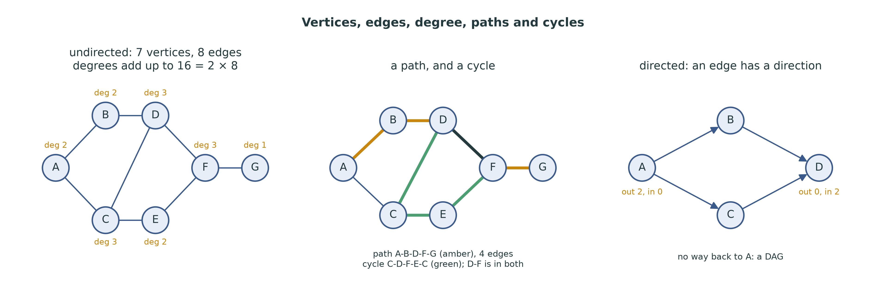
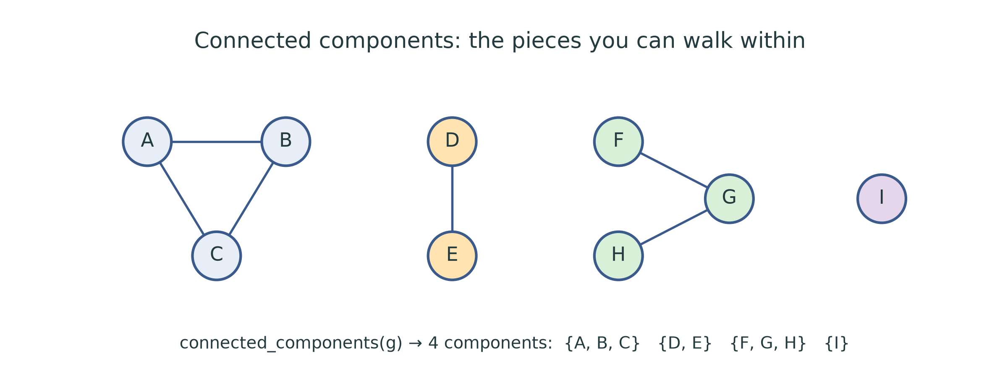
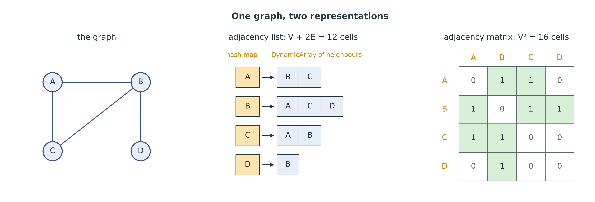
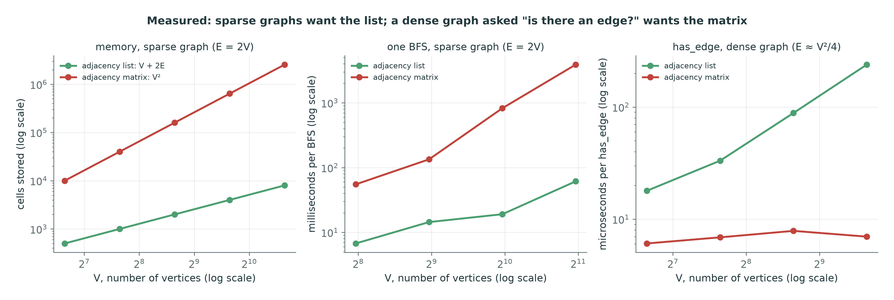
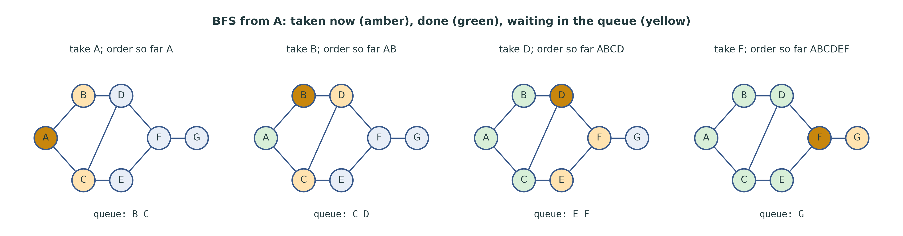
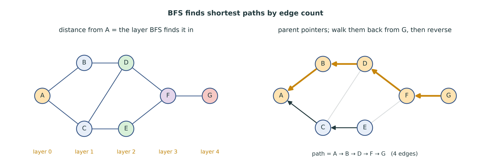
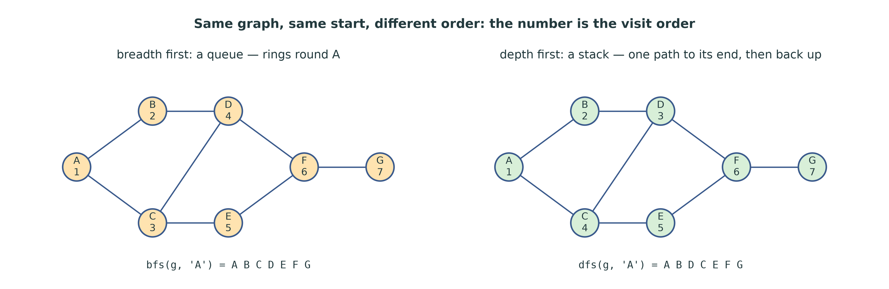
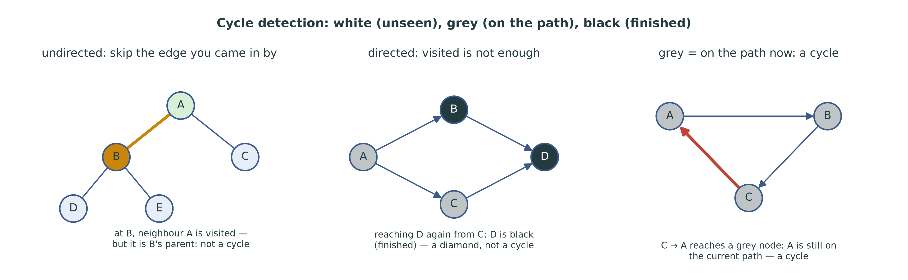
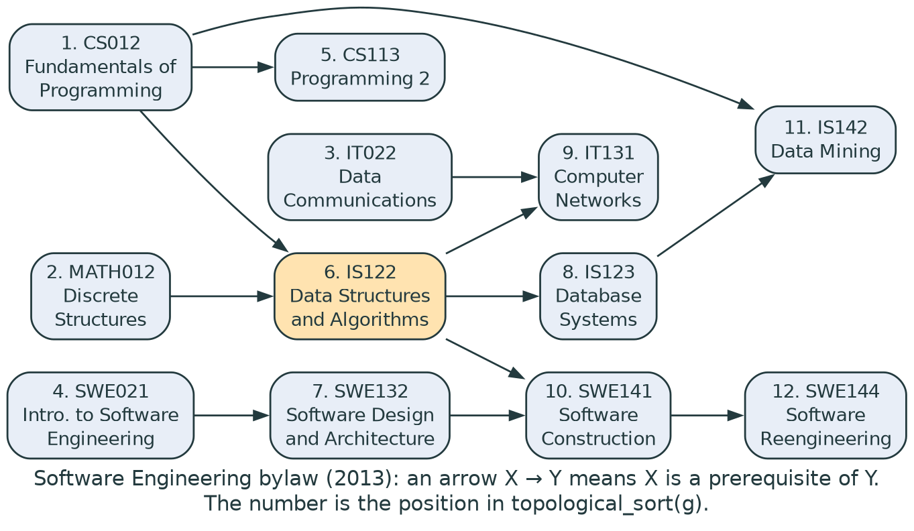
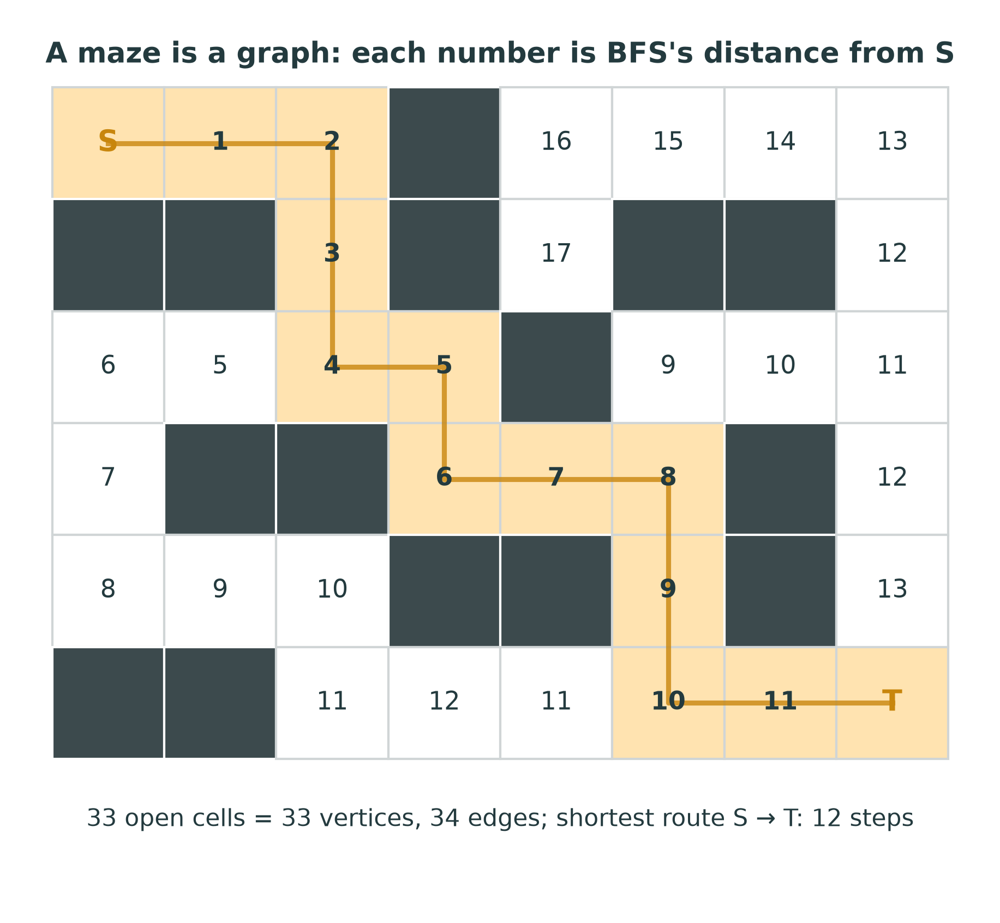

::: {.handout-only}

> **How to read this document.** This is the handout for Lecture 14. It holds
> everything on the slides, plus what I said out loud. A graph is the most
> general structure in the course: every structure you have built so far is a
> special case of it. This week you store one in two ways and measure the
> difference, then walk it in the two orders every other graph algorithm is
> built from — breadth first, with your queue, and depth first, with your
> stack.
>
> Slides: `DSA27-L14-slides.pdf` · Code: `dsa/graph.py` ·
> Tests: `tests/test_graph.py`

:::

# Where We Are

## The last structure

Every structure so far was a graph with rules:

- a **linked list**: each node points to at most one next node;
- a **tree**: one root, one parent per node, no cycles;
- a **graph**: nodes and edges, **no rules at all**.

Today: store one, then **search** it — breadth first and depth first.

::: {.handout-only}

A linked list is a graph in which every node has one outgoing edge (or none).
A tree (Week 11) is a graph in which every node except the root has exactly one
parent and no path loops back. Drop those rules and you have a **graph**: any
set of things, and any set of connections between them. That freedom is why
graphs model so much — roads between cities, friendships, links between web
pages, wires on a chip, dependencies between software packages, and the
prerequisites between the courses of your own degree.

It is also why this week comes last among the structures: a graph needs
everything before it. `dsa/graph.py` stores its edges in your `DynamicArray`
(Week 4) inside your `ChainingHashMap` (Week 13); breadth-first search runs on
your `CircularQueue` (Week 7); depth-first search runs on the call stack
(Week 3) or on your own `Stack` (Week 6). If one of those is broken, this week
finds it.

*Graph* in Arabic: المخطط, also البيان. *Graph search*: البحث في المخطط.

:::

## Today

1. The words: vertex, edge, degree, path, cycle, component, DAG
2. Two representations: adjacency list and adjacency matrix — measured
3. Breadth-first search, with a queue — and shortest paths
4. Depth-first search, recursive and with your own stack
5. Components, cycles, topological sort
6. A maze, and your own degree's prerequisites

# The Vocabulary

## Vertices and edges

{width=100%}

- **Vertex** (node) — الرأس. **Edge** — الحافة. V vertices, E edges.
- **Undirected**: an edge goes both ways. **Directed**: it has a direction.
- **Degree** — الدرجة: the number of edges at a vertex.

::: {.handout-only}

A graph is a pair: a set of **vertices** (also called **nodes**; the course
code says *node*) and a set of **edges**, each joining two vertices. The two
ends of an edge are **adjacent**, متجاوران, and each is a **neighbour** of the
other. We write V for the number of vertices and E for the number of edges; all
costs this week are stated in V and E.

**Directed or undirected**, موجَّه and غير موجَّه. In an undirected graph an
edge A–B can be walked both ways: a friendship, a two-way road. In a directed
graph an edge A $\rightarrow$ B goes one way only: "follows" on social media, a one-way
street, "is a prerequisite of". `Graph(directed=True)` records only A $\rightarrow$ B;
`Graph()` records the edge in both directions.

**Degree.** In an undirected graph, the degree of a vertex is the number of
edges touching it. In the left panel, D has degree 3. Every edge has two ends,
so adding up all the degrees counts every edge twice:

$$\sum_{v} \deg(v) = 2E$$

— here $2 + 2 + 3 + 3 + 2 + 3 + 1 = 16 = 2 \times 8$. This is sometimes called
the *handshake lemma*: at a party, the handshakes counted per person add up to
twice the number of handshakes. In a directed graph each vertex has an
**out-degree** (edges leaving) and an **in-degree** (edges arriving); in the
right panel A has out-degree 2 and in-degree 0. `degree(node)` in
`dsa/graph.py` returns the number of edges **leaving** the node, which is the
out-degree for a directed graph and the plain degree for an undirected one.

**Sparse and dense.** A simple undirected graph has at most $V(V-1)/2$ edges,
so E is somewhere between 0 and about $V^2/2$. A graph with E close to V (a road
map, where a junction joins three or four roads) is **sparse**; one with E
close to $V^2$ is **dense**. Most real graphs are sparse — a social network of
a billion people is not a billion friends each. This single fact decides the
representation, as the measured slide will show.

:::

## Paths, cycles and components

- **Path** — المسار: a sequence of vertices, each joined to the next by an
  edge. Its **length** is its number of edges.
- **Cycle** — الدورة: a path that returns to where it started.
- **Connected** — every vertex can reach every other. A **connected
  component**, المركّبة المتصلة, is a largest connected piece.
- **DAG**, مخطط موجَّه لا دوري: a directed graph with **no** cycle.

::: {.handout-only}

In the middle panel of the figure, A–B–D–F–G is a path of length 4, and
C–D–F–E–C is a cycle of length 4. A path is usually required to be **simple** —
no vertex twice — and a cycle to have at least three vertices in an undirected
graph: going A–B–A along the same edge does not count. That detail is exactly
the trap of undirected cycle detection later.

A **tree** is a connected undirected graph with no cycle. A tree with V vertices
always has exactly $V - 1$ edges: one fewer and it falls apart, one more and it
has a cycle. (Week 11's trees are rooted trees, which pick one vertex as the
root and point every edge away from it.)

A **DAG** — a *directed acyclic graph* — is the shape of every dependency
problem: prerequisites, build steps, spreadsheet cells, package installs. The
diamond on the right of the figure is a DAG: you can reach D in two ways, but
you can never get back to A. DAGs are the graphs that have a **topological
order**, which ends the lecture.

:::

## Connected components

{width=86%}

One search from a vertex visits **exactly its component**. To find all
components: start a new search from every vertex not yet seen.

::: {.handout-only}

This graph has nine vertices, six edges and four components; I, with no edges
at all, is a component on its own. The number of components answers practical
questions: is this road network in one piece? after this cable is cut, can
every office still reach the server? how many separate friend groups are there?
The algorithm is on a later slide, once we have a search to run.

"Connected" is defined here for undirected graphs, and `connected_components`
expects one. In a directed graph, "A can reach B" does not mean "B can reach A",
and the idea splits into *weakly* and *strongly* connected components; the
strongly connected ones need a cleverer algorithm (Tarjan's, 1972), beyond this
course.

:::

## Graphs are everywhere

| Problem | Vertices | Edges | Kind |
|---|---|---|---|
| Maze, game map | open cells | neighbouring cells | undirected |
| Road map | junctions | roads | (un)directed |
| Web | pages | links | directed |
| Your degree | courses | "is a prerequisite of" | DAG |
| Build, installs | files, packages | "is needed by" | DAG |

::: {.handout-only}

The same two searches answer questions on all of them: is there a way through
the maze, and what is the shortest one? which pages can be reached from this
one? in what order can I take these courses, and is that even possible? The
lecture ends with two of these rows worked in full — the maze and the
prerequisites of the Software Engineering programme.

Graph theory began with a walk. In 1736 Leonhard Euler asked whether a walk
through Königsberg could cross each of its seven bridges exactly once. He
answered it by drawing the city as four land masses (vertices) joined by
bridges (edges) and throwing away everything else: the first time a problem
was solved by recognising that only the connections matter.

:::

# Two Representations

## Adjacency list and adjacency matrix

{width=100%}

- **List**: for each vertex, the vertices it reaches.
- **Matrix**: a V × V grid; cell [i][j] is 1 when there is an edge i $\rightarrow$ j.

::: {.handout-only}

Both panels describe the test file's sample graph: A–B, A–C, B–C, B–D.

**The adjacency list**, قائمة التجاور, keeps, for every vertex, a list of its
neighbours. In `dsa/graph.py`, `Graph._adjacent` is a `ChainingHashMap` from
each node to a `DynamicArray` of its neighbours, in the order the edges were
added. The hash map is what lets the nodes be anything hashable — strings,
numbers, `(row, column)` tuples for a maze — and still be found in $O(1)$ on
average. An undirected edge is stored **twice**, once in each end's list, so the
list holds $V + 2E$ cells: 4 + 2 × 4 = 12 here.

A hash map hands its keys back in bucket order, which for strings changes from
one run of Python to the next (string hashing is randomised for security). So
`Graph` also keeps `_order`, a `DynamicArray` of the nodes in the order they
were added, and `nodes()` returns that. Without it, any algorithm that loops
over all the nodes — components, cycle detection, topological sort — would give
a different, equally correct answer on every run, and no trace in this handout
could be checked.

**The adjacency matrix**, مصفوفة التجاور, numbers the vertices 0 to V $-$ 1 and
keeps a V × V grid of booleans. In `MatrixGraph`, `_index` maps a node to its
number, `_order` maps a number back to its node, and `_matrix` is a
`DynamicArray` of rows, each a `DynamicArray` of `True`/`False`. An undirected
graph gives a **symmetric** matrix: cell [A][B] and cell [B][A] are both set.
It always holds $V^2$ cells, however few edges there are: 16 here.

**What `add_node` must not do.** Adding a node that is already there must leave
its edges alone. The careless version, `self._adjacent.put(node,
DynamicArray())` with no check, replaces the node's neighbour list with an empty
one and silently drops its edges — and since `add_edge` calls `add_node` on
both ends, every new edge would wipe the old edges of its endpoints.
`test_adding_a_node_twice_keeps_its_edges` is there for that bug.

:::

## The trade-off

| | Adjacency list | Adjacency matrix |
|---|---|---|
| Memory | $O(V + E)$ | $O(V^2)$ |
| `has_edge(u, v)` | $O(\deg u)$ | **$O(1)$** |
| `neighbours(u)` | **$O(\deg u)$** | $O(V)$ — scan the row |
| `add_node` | $O(1)$ | $O(V)$ — a new column |
| One BFS or DFS | **$O(V + E)$** | $O(V^2)$ |

::: {.handout-only}

**Why a search costs $O(V + E)$ on the list.** A search visits each vertex once
and, at each vertex, looks at its neighbours once. The total work on the
neighbour lists is the sum of all the degrees, which is $2E$ (undirected) or
$E$ (directed). Add $O(1)$ per vertex for taking it off the queue or stack, and
the total is $O(V + E)$ — proportional to the size of the graph, which is the
best any algorithm that must look at the whole graph can do.

**Why it costs $O(V^2)$ on the matrix.** The search does the same thing, but
finding the neighbours of a vertex means scanning its whole row of V cells,
whether they are 0 or 1. V vertices times V cells is $V^2$, even for a graph
with almost no edges.

**The matrix's prize** is `has_edge`: one cell, $O(1)$. On the list, asking
"is there an edge from u to v?" means scanning u's neighbours, $O(\deg u)$ —
up to $O(V)$ in a dense graph.

**The rule of thumb.** Sparse graph, or you walk it: the list. Dense graph, and
you mostly ask "is there an edge?": the matrix. Because most real graphs are
sparse, the adjacency list is the default almost everywhere; `networkx` uses
one (a dictionary of dictionaries).

:::

## Measured

{width=100%}

::: {.handout-only}

Real measurements of the reference `dsa/graph.py`, on random graphs built with
a fixed seed. Both classes pass the same 63 tests; they differ only in cost.

**Left: memory**, counted as the cells each structure actually stores, on a
sparse graph with E = 2V (average degree 4). At V = 1,600 the list stores 8,000
cells and the matrix 2,560,000 — 320 times more. The list's line has slope 1
on the log–log plot, the matrix's slope 2.

**Middle: one BFS** on the same kind of sparse graph. The matrix line has slope
2: each doubling of V made the BFS between 2.4 and 6 times slower — about four
on average, as $O(V^2)$ predicts — and at
V = 2,000 it took about 3.9 seconds, against about 60 milliseconds on the list.
The list's line is close to slope 1, with visible noise — these runs shared the
machine with other work, and at these small times that shows. The shapes are
the point: $O(V^2)$ against $O(V + E)$.

**Right: `has_edge`** on a dense graph, every vertex joined to about half of the
others. The matrix answers in about 6–8 microseconds at every size — flat,
$O(1)$. The list's time grows with the degree, which grows with V: about
240 microseconds at V = 800, some 30 times slower. On a dense graph that is
asked this question constantly, the matrix is worth its memory.

Your own numbers will differ; the slopes will not. Draw your own with the
`14-graphs` notebook once `dsa/graph.py` works.

:::

# Breadth-First Search

## Rings round the start

{width=100%}

Visit the start, then **everything 1 edge away**, then everything 2 away, …

A **queue** keeps the frontier in order: first discovered, first expanded.

::: {.handout-only}

Breadth-first search, BFS — البحث بالعرض أولاً — explores a graph like a ripple on
water: the start first, then all its neighbours, then all *their* unvisited
neighbours, and so on outwards. Lecture 07 promised that a queue would do this,
and here it is. A vertex waits in the queue from the moment it is **discovered**
until it is **taken** off the front; because the queue is FIFO, everything
discovered from layer 1 is taken before anything discovered from layer 2.

In the figure, the running example — seven vertices, eight edges — is searched
from A. After A is taken, B and C wait. B is taken and adds D; C is taken and
adds E (its neighbour D is already waiting); D adds F; E adds nothing (F is
already waiting); F adds G. The visit order is A B C D E F G.

:::

## The algorithm

```text
bfs(graph, start)
    order   = empty list
    visited = empty hash map;  visited[start] = True
    queue   = empty CircularQueue;  enqueue start
    while the queue is not empty:
        node = dequeue
        append node to order
        for each neighbour of node, in graph.neighbours(node) order:
            if neighbour is not in visited:
                visited[neighbour] = True      # mark when queued
                enqueue neighbour
    return order
```

Each vertex is enqueued once and dequeued once: **$O(V + E)$** on a list.

::: {.handout-only}

This is the structure of `bfs` in the reference solution. Three details decide
whether yours is right.

**Mark a vertex when you enqueue it, not when you dequeue it.** If you only
mark on dequeue, a vertex can be discovered twice before it is taken — in the
example, D is a neighbour of both B and C — and it goes into the queue twice.
The visit order then has D twice unless you also check on dequeue, and on a
dense graph the queue can hold $O(E)$ entries instead of $O(V)$. Marking on
enqueue means "already in the queue or already done", which is exactly the set
you must not add again.

**The visited set is your hash map**, `ChainingHashMap`, with `True` as the
value: `neighbour in visited` is an average $O(1)$ lookup. A Python `set` would
do the same job, and the storage rule forbids it inside `dsa/`. Without any
visited set at all, the search goes round the cycle A–B–C–A for ever:
`test_bfs_visits_each_node_once` checks for that.

**The queue is your `CircularQueue`**, and it must grow: BFS does not know in
advance how many vertices will wait at once. That is why Lecture 07 made growing
the challenge. A `SlowQueue` would also work, but every dequeue would shift the
whole queue: $O(V)$ per dequeue, $O(V^2)$ for the search.

`bfs` returns only the vertices **reachable** from the start. On a graph with
several components, the others are simply never discovered —
`test_search_from_isolated_node` starts from a vertex with no edges and expects
just `["Z"]`.

:::

## Trace: `bfs(G, "A")`

| Take | Discover (enqueue) | Queue afterwards | Order so far |
|---|---|---|---|
| A | B, C | B C | A |
| B | D (A is visited) | C D | A B |
| C | E (A, D are visited) | D E | A B C |
| D | F | E F | A B C D |
| E | — (C, F are visited) | F | A B C D E |
| F | G | G | A B C D E F |
| G | — | empty | A B C D E F G |

::: {.handout-only}

The neighbour lists, in the order the edges were added, are
A: B C · B: A D · C: A D E · D: B C F · E: C F · F: D E G · G: F.
The neighbour order decides the tie-breaks: A lists B before C, so B is taken
first. Change the order of the edges and you get a different — equally correct
— BFS order, but the **layers** never change: {A}, {B, C}, {D, E}, {F}, {G}.
`test_bfs_visits_by_distance` checks only what does not depend on the
tie-breaks: D, two edges from A, comes after B.

This table was produced by running the reference solution on `G_EDGES` in
`tools/figures_l14.py`.

:::

## Shortest paths, by edge count

{width=96%}

The first time BFS reaches a vertex, it has come by a **shortest** path.

Remember **who discovered whom** (a parent map), then walk back from the goal.

::: {.handout-only}

**Why the first arrival is by a shortest path.** The queue holds vertices in
non-decreasing order of distance: first the start (distance 0), then everything
at distance 1, then everything at distance 2, and so on, because each vertex at
distance d discovers only vertices at distance d + 1. So a vertex at distance d
is discovered while BFS is taking the vertices of layer d $-$ 1, before any longer
route can reach it. "Shortest" here means **fewest edges** — every edge counts
as 1. (This argument was first written down for mazes by E. F. Moore in 1959.)

**`shortest_path_unweighted(graph, start, goal)`** is BFS with one change: the
visited map stores, for each vertex, the vertex it was discovered **from** —
its *parent* — with `None` for the start. When the goal is taken off the queue,
follow the parents back: G $\leftarrow$ F $\leftarrow$ D $\leftarrow$ B $\leftarrow$ A. That list runs goal-first, so
reverse it: `["A", "B", "D", "F", "G"]`, four edges. When the queue empties
without reaching the goal, it is unreachable: return `None`. When start and goal
are the same, the answer is `[start]` — a path of length 0.

The parent pointers form a tree — the **BFS tree** — whose paths from A are all
shortest paths. There are two shortest paths from A to F here (A–B–D–F and
A–C–E–F); BFS records one of them, the one through whichever parent discovered F
first. `test_shortest_path_is_shortest_not_merely_a_path` builds a graph with a
long way round (A–X–Y–Z) and a short one (A–B–Z): DFS might find the long one;
BFS cannot.

The parent map is a `ChainingHashMap` again, and it doubles as the visited set:
a vertex is visited exactly when it has a parent entry. That needs a hash map
whose `in` works when the stored value is `None` — the start's parent. Week 13's
`__contains__` catches the `KeyError` from `get` rather than comparing the value
with `None`, so it does.

:::

# Depth-First Search

## One path to its end, then back up

{width=100%}

DFS goes **deep** first: follow a neighbour, then its neighbour, … until stuck;
then **back up** to the last vertex with an unvisited neighbour.

::: {.handout-only}

Depth-first search, DFS — البحث بالعمق أولاً — is how you would explore a maze with
a ball of string: keep walking into unexplored corridors, and when you reach a
dead end, wind the string back to the last junction with a corridor you have not
tried. From A it goes to B (A's first neighbour), then to D (B's first unvisited
neighbour), then to C (D's first unvisited neighbour), then to E, F and G. The
order is A B D C E F G, against BFS's A B C D E F G.

`test_dfs_goes_deep_and_bfs_goes_wide` tells them apart on the smallest graph
that can: A–B, B–C, A–D. DFS goes A, B, C before it touches D; BFS takes D
before C.

DFS does **not** find shortest paths: it reached C through B and D, three edges,
when C is a neighbour of A. What it gives instead is structure — the order in
which vertices are finished, which detects cycles and gives topological orders.

:::

## Recursive DFS: the call stack does the work

```text
dfs(graph, start)
    order = empty list;  visited = empty hash map
    visit(start)
    return order

visit(node)
    visited[node] = True
    append node to order
    for each neighbour of node, in graph.neighbours(node) order:
        if neighbour is not in visited:
            visit(neighbour)
```

**$O(V + E)$** on a list — and **$O(V)$ stack** in the worst case.

::: {.handout-only}

This is `dfs` and its helper `_dfs_visit` in the reference solution. Each call
is one vertex; the loop inside it is that vertex's neighbours; returning from a
call is "backing up". Everything DFS has to remember — which vertex it is in,
and how far through that vertex's neighbours it has got — lives in the call
stack of Lecture 03, one frame per vertex on the current path.

That is also its weakness. The deepest path can be as long as V $-$ 1 edges: on a
graph that is one long chain, recursive DFS makes V nested calls. Python stops
at 1,000 frames by default: the reference `dfs` on a chain of 1,000 edges
raises `RecursionError`, while on a chain of 900 it works. Raising the limit
with `sys.setrecursionlimit` only moves the wall. The real answer is the next
slide.

:::

## DFS with your own stack

```text
dfs_iterative(graph, start)
    order = empty list;  visited = empty hash map
    stack = empty Stack;  push start
    while the stack is not empty:
        node = pop
        if node is in visited:  continue    # a second copy
        visited[node] = True                # mark when taken
        append node to order
        for each neighbour, in REVERSE order:
            if it is not in visited:  push it
    return order
```

Same order as `dfs`, and no recursion limit.

::: {.handout-only}

Replace BFS's queue by a stack and the search becomes depth-first: the most
recently discovered vertex is expanded next. Two details make the order match
the recursive `dfs` exactly, which `test_dfs_and_dfs_iterative_agree` demands.

**Push the neighbours in reverse.** A stack gives back the last thing pushed. To
explore B before C (A's list is B, C), push C first and B last.

**Mark when you pop, not when you push.** The recursive version marks a vertex
when it *enters* it, and it can reach a vertex by a later, deeper route before
the earlier call gets round to it. The stack must allow the same: a vertex may
be pushed more than once, and the first time it is popped wins; later copies
are skipped. So the stack can hold up to $O(E)$ entries, not $O(V)$.

**Trace on G**, stack written bottom $\rightarrow$ top:

| Pop | Action | Push | Stack afterwards | Order |
|---|---|---|---|---|
| A | visit | C, B | C B | A |
| B | visit | D | C D | A B |
| D | visit | F, C | C F C | A B D |
| C | visit | E | C F E | A B D C |
| E | visit | F | C F F | A B D C E |
| F | visit | G | C F G | A B D C E F |
| G | visit | — | C F | A B D C E F G |
| F | already visited: skip | | C | |
| C | already visited: skip | | empty | |

C was pushed twice — by A and by D — and D's copy, the deeper route, was taken
first, exactly as recursion would. This trace was produced by running the
reference solution.

:::

## Why the two orders can differ

"Mark when pushed", BFS-style, with a stack:

| Variant | Order from A |
|---|---|
| recursive `dfs` | A B D C E F G |
| stack, mark on pop, push reversed | A B D C E F G |
| stack, mark on **push**, push reversed | A B D **F E G C** |
| stack, mark on push, push in order | A C E F G D B |

::: {.handout-only}

The last two rows are the tempting shortcut: copy BFS, swap the queue for a
stack. They are real depth-first searches — each follows a path as far as it
can before backing up — and they visit every reachable vertex once in
$O(V + E)$. For reachability, or for counting components, they are fine.

But they are **not** the same order as recursive DFS. Marking C when A pushes
it means that when D later looks at C, C is "already visited" and is not pushed
again; so C waits at the bottom of the stack under A's copy and is visited last,
instead of being entered from D. The recursive DFS would have gone A $\rightarrow$ B $\rightarrow$ D $\rightarrow$ C.
All four rows were produced by running code on the same graph.

The order matters when an algorithm depends on it — cycle detection and
topological sort use exactly the recursive order, in which a vertex is
"on the path" from the moment it is entered until every vertex below it is
finished. So: mark on pop, and push neighbours in reverse, when you want the
recursive order. `test_dfs_and_dfs_iterative_agree` fails for the shortcut.

Why not always write the iterative version? The recursive one is shorter and
reads like its definition; the iterative one survives a graph deeper than
Python's recursion limit. In languages with larger stacks, recursive DFS is the
common choice; in Python, on big graphs, write your own stack.

:::

## BFS and DFS side by side

| | BFS | DFS |
|---|---|---|
| Container | **queue** (FIFO) | **stack** (LIFO) — or the call stack |
| Order | rings, by distance | one path to its end, then back up |
| Shortest path by edges | **yes** | no |
| Time, adjacency list | $O(V + E)$ | $O(V + E)$ |
| Time, adjacency matrix | $O(V^2)$ | $O(V^2)$ |
| Extra memory | $O(V)$ | $O(V)$ recursive; up to $O(E)$ own stack |
| Good for | distances, "nearest", levels | cycles, topological order, mazes, backtracking |

::: {.handout-only}

The two searches are one loop with one choice: which waiting vertex to expand
next. The oldest gives BFS; the newest gives DFS. (Let a *priority queue* —
Week 12 — choose the nearest by weighted distance, and you have Dijkstra's
algorithm; see the last section.)

Both need a visited set, and both work on either representation unchanged,
because they only ever call `graph.neighbours(node)`. That is the adjacency
list and matrix's shared contract paying off: the tests run every search
against both classes.

:::

# Using the Searches

## Connected components

```text
connected_components(graph)
    seen = empty hash map;  components = empty list
    for each node in graph.nodes():
        if node is not in seen:
            component = bfs(graph, node)
            mark every member of component as seen
            append component to components
    return components
```

**$O(V + E)$** in total — each vertex is searched from once.

::: {.handout-only}

Each call of `bfs` visits exactly the component of its start (it can never
cross to another component — there is no edge to cross), and the loop starts a
new search only from a vertex that no earlier search reached. So every vertex
is in exactly one component, and the total work is still $O(V + E)$: every
vertex and every edge belongs to exactly one of the searches.

On the components figure, the loop starts searches at A, D, F and I:
`[['A', 'B', 'C'], ['D', 'E'], ['F', 'G', 'H'], ['I']]`. Any search would do
in place of `bfs` — `dfs` gives the same groups, listed in a different order.

:::

## Cycles: undirected and directed are different

{width=100%}

- **Undirected:** a visited neighbour that is **not your parent** closes a
  cycle.
- **Directed:** a neighbour that is **grey** — still on the current path.

::: {.handout-only}

**Undirected: the parent check.** Run DFS, remembering for each vertex the
vertex it was entered from. When a vertex has a neighbour that is already
visited, you have found a second route to it — a cycle — **unless** that
neighbour is simply the vertex you came from. In an undirected graph every edge
is stored in both directions, so when DFS enters B from A, B's neighbour list
contains A, and A is visited. That is not a cycle; it is the same edge seen
from the other end. Forget the parent check and **every** undirected graph with
an edge looks cyclic: `test_undirected_tree_has_no_cycle` is that trap.

```text
cycle_from(node, parent)                # undirected
    visited[node] = True
    for each neighbour of node:
        if neighbour is not visited:
            if cycle_from(neighbour, node):  return True
        else if neighbour != parent:  return True
    return False
```

**Directed: three colours.** In a directed graph "already visited" is not
enough. In the diamond A $\rightarrow$ B $\rightarrow$ D and A $\rightarrow$ C $\rightarrow$ D, DFS reaches D from B, finishes
it, backs up to A, goes to C, and meets D again. D is visited — but there is no
cycle: no path leads from D back to C. What matters is whether the vertex is
**on the current path**, the chain of calls still running. So each vertex has
one of three colours:

- **white** — not yet seen (in the code: not in the map);
- **grey** — entered, and its call is still running: on the current path;
- **black** — finished: every vertex below it is done.

An edge to a **grey** vertex points back into the current path: a cycle. An
edge to a **black** vertex is only a second route to finished work, like
C $\rightarrow$ D in the diamond (`test_directed_diamond_is_not_a_cycle`). In A $\rightarrow$ B $\rightarrow$ C $\rightarrow$ A,
when DFS at C looks at A, A is grey — its call is still waiting for B's, which
is waiting for C's — so C $\rightarrow$ A closes a cycle.

```text
cycle_from(node)                        # directed
    colour[node] = GREY
    for each neighbour of node:
        if colour[neighbour] is GREY:  return True
        if colour[neighbour] is WHITE and cycle_from(neighbour):  return True
    colour[node] = BLACK
    return False
```

In both cases `has_cycle` runs the helper from every vertex not yet visited
(white), because a cycle can sit in any component. That is $O(V + E)$ in total.
The undirected parent check is wrong for directed graphs (A $\rightarrow$ B, B $\rightarrow$ A **is** a
cycle, and the parent check would skip it), and the three colours would be
wrong for undirected ones (every edge would be seen back into a grey parent).
The docstring's warning — "the two cases genuinely differ" — is the point.

:::

## Topological sort

{width=80%}

An order of the vertices in which **every edge points forwards**.
It exists **exactly when the graph is a DAG**.

::: {.handout-only}

A topological order, الترتيب الطوبولوجي, of a directed graph lists every vertex
so that for every edge X $\rightarrow$ Y, X comes before Y. For prerequisites, it is an
order in which you could take every course without ever taking one before its
prerequisites. For a build, it is an order that compiles every file after the
files it depends on.

If the graph has a cycle, no such order exists: in A $\rightarrow$ B $\rightarrow$ C $\rightarrow$ A, A must come
before B, B before C, and C before A — impossible. If it has no cycle, one
always exists, and usually many: MATH012 and CS012 can come in either order.
The tests accept any valid order; `test_topological_sort_respects_every_edge`
checks every edge.

The figure is real: twelve courses from the specifications in the **Software
Engineering bylaw (2013)**, with an arrow for each prerequisite it lists — for
example, IS122 (this course) needs CS012 and MATH012, and is itself needed by
IS123 Database Systems, IT131 Computer Networks and SWE141 Software
Construction. It is only part of the programme; the numbers are the order the
reference `topological_sort` returned.

:::

## Kahn's algorithm: take what nothing waits on

1. Count each vertex's **in-degree** — its unmet prerequisites.
2. Queue every vertex with in-degree 0.
3. Repeat: dequeue X, output it; for each X $\rightarrow$ Y, subtract 1 from Y's count; if
   it reaches 0, enqueue Y.
4. Output shorter than V? The rest wait on each other: **a cycle** — return
   `None`.

**$O(V + E)$**: each vertex queued once, each edge crossed once.

::: {.handout-only}

This is `topological_sort` in the reference solution (A. B. Kahn, 1962). The
in-degrees live in a `ChainingHashMap` from vertex to count, the ready vertices
in a `CircularQueue`. It is how you would plan a degree by hand: take the
courses with no prerequisites; crossing them off frees other courses; take those
next.

**Trace on the prerequisites graph** (vertices in the order they were added:
CS012, CS113, IS122, MATH012, IS123, IS142, IT022, IT131, SWE021, SWE132,
SWE141, SWE144):

| Take | Counts that reach 0 | Ready queue afterwards |
|---|---|---|
| *(start)* | CS012, MATH012, IT022, SWE021 have none | CS012 MATH012 IT022 SWE021 |
| CS012 | CS113 (IS122 and IS142 still wait) | MATH012 IT022 SWE021 CS113 |
| MATH012 | IS122 | IT022 SWE021 CS113 IS122 |
| IT022 | — (IT131 still waits on IS122) | SWE021 CS113 IS122 |
| SWE021 | SWE132 | CS113 IS122 SWE132 |
| CS113 | — | IS122 SWE132 |
| IS122 | IS123, IT131 (SWE141 waits on SWE132) | SWE132 IS123 IT131 |
| SWE132 | SWE141 | IS123 IT131 SWE141 |
| IS123 | IS142 | IT131 SWE141 IS142 |
| IT131 | — | SWE141 IS142 |
| SWE141 | SWE144 | IS142 SWE144 |
| IS142, SWE144 | — | empty |

Twelve vertices out: a valid order. Add a made-up edge SWE144 $\rightarrow$ SWE021 and
the reference returns `None`: SWE021, SWE132, SWE141 and SWE144 then wait on
each other for ever, so only eight vertices come out. A real bylaw with such a
cycle could not be completed — which is exactly what the check detects.

**The other classic method** is DFS: run the three-colour DFS from every white
vertex and record each vertex when it turns **black**. A vertex finishes only
after everything it points to has finished, so the reverse of the finishing
order is a topological order — and meeting a grey vertex means there is none.
It is the same cost, and W14-C3 in the question bank asks you to write it.

:::

# Two Real Graphs

## A maze is a graph

{width=62%}

Open cells are vertices; neighbouring open cells are joined. BFS from S gives
every cell's distance — and the shortest route to T.

::: {.handout-only}

Nothing about the maze needs a special algorithm. `maze_graph` in
`tools/figures_l14.py` turns each open cell into a vertex named by its
`(row, column)` tuple — a tuple is hashable, so your hash map takes it — and
joins it to its open neighbours on the right and below; the graph is undirected,
so that covers left and up too. The 33 open cells give 33 vertices and
34 edges. `shortest_path_unweighted` returns the 12-step route highlighted, and
the numbers are the BFS layers: every cell with a 7 is exactly 7 steps from S.

The dead ends show BFS's thoroughness and its cost: to be sure the route is
shortest, it explored the whole maze up to distance 12, including the corridor
at the top right that leads nowhere near T. A DFS might have found *a* route
faster, but not a guaranteed shortest one. This is how game characters find
their way on a grid, and how circuit-board routers laid wires in the 1960s
(C. Y. Lee's algorithm, 1961, is BFS on a grid).

:::

## Your degree is a DAG

- **Topological sort** $\rightarrow$ a valid study plan.
- **Cycle check** $\rightarrow$ can the plan be completed at all?
- **BFS from IS122** $\rightarrow$ everything this course unlocks.
- **Layers** of Kahn's algorithm $\rightarrow$ the fewest semesters, if you could take
  anything that is ready.

::: {.handout-only}

Every question a registrar asks about a study plan is a graph question. Which
courses can I take now? The ones whose in-degree has dropped to 0. What does
failing IS122 delay? Everything reachable from IS122: IS123, IT131, SWE141, and
through them IS142 and SWE144. How many semesters, at the least? The number of
layers when Kahn's algorithm takes all the ready courses at once — here four:
{CS012, MATH012, IT022, SWE021}, {CS113, IS122, SWE132}, {IS123, IT131, SWE141},
{IS142, SWE144}. No plan can do better, because the chains
CS012 $\rightarrow$ IS122 $\rightarrow$ IS123 $\rightarrow$ IS142 and SWE021 $\rightarrow$ SWE132 $\rightarrow$ SWE141 $\rightarrow$ SWE144 are four
courses long. (Real plans are also limited by the credit hours per semester.)

Your own programme's full prerequisite list is in its bylaw
(`docs/course/regulations/`), in the course specifications. Typing it into a
`Graph(directed=True)` is a good hour with this week's code: W14-C4 in the
question bank does exactly that with the layers.

:::

# Beyond the Bylaw

## Weighted graphs: named, not examined

- **Weighted edges**: a road has a length, a link a cost.
- **Dijkstra's algorithm**: shortest paths by total weight — BFS with a
  **priority queue** (Week 12) instead of a queue.
- **Minimum spanning tree** (Prim, Kruskal): the cheapest set of edges that
  keeps a graph connected.

Neither is declared by the bylaw for this course.

::: {.handout-only}

BFS's "shortest" counts edges. When edges have different lengths — a 2 km road
and a 40 km road — the path with the fewest edges is not the shortest. Edsger
Dijkstra's algorithm (1959) keeps the same loop but takes from a priority queue
the waiting vertex with the smallest distance so far, and it works as long as
no weight is negative. The same 1959 paper also solved the minimum spanning
tree problem. `viz.draw.draw_graph` already draws edge weights when a networkx
graph has them, if you want to experiment.

These, and balanced trees and NP-completeness, are what this course does
**not** reach (`docs/course/02-coverage.md`, "Deliberately outside the declared
content"). AI students meet all of them in AI3001 Analysis and Design of AI
Algorithms; for SWE and Medical Informatics students, this week is the last
graph content in the degree, which is one more reason to finish the exercises.
Not examinable.

:::

# This Week

## Exercises: `dsa/graph.py`

| Exercise | Target | The trap |
|---|---|---|
| `add_node`, `add_edge` | $O(1)$ | adding twice keeps the edges |
| `neighbours`, `edges`, ... | $O(\deg)$, $O(V + E)$ | undirected edges reported **once** |
| `MatrixGraph` | see the table | a new row **and** a new column |
| `bfs`, `shortest_path_unweighted` | $O(V + E)$ | mark on enqueue; parents |
| `dfs`, `dfs_iterative` | $O(V + E)$ | mark on pop; push reversed |
| `has_cycle`, `topological_sort` | $O(V + E)$ | parent against grey; `None` |

```powershell
pytest tests/test_graph.py -v
```

::: {.handout-only}

The table leaves out `nodes`, `has_edge`, `degree` and `connected_components`, which have no trap beyond those listed (one search per unseen node, for the last). 63 tests: most run twice, once on `Graph` and once on `MatrixGraph`, so a
failure shows which representation is wrong. `dsa/graph.py` imports your
`ChainingHashMap` and `DynamicArray`, and the searches need your
`CircularQueue` (growing, Lecture 07's challenge) and your `Stack`: if
`tests/test_hashmap.py` or `tests/test_stack_queue.py` fail, fix them first.
`to_networkx` is given to you, and so are `__len__`, `__contains__` and
`__repr__` of both classes.

:::

## Homework 14 — before Lecture 15

1. **Implement** `dsa/graph.py` until all 63 tests pass.
2. **Trace** `bfs` and `dfs_iterative` from A on the test file's sample graph,
   with the queue or stack after every step.
3. **Measure** a BFS on `Graph` against `MatrixGraph` in
   `notebooks/14-graphs.ipynb`, for V = 250 to 2,000.
4. **Your degree.** Type ten prerequisites of your own programme into a
   directed `Graph`, and print a topological order.

::: {.handout-only}

For item 3, build the graphs before timing — `MatrixGraph` spends $O(V^2)$ just
on `add_node` — and use a sparse graph, E about 2V. Expect the matrix line to
rise with slope 2 on a log–log plot.

For item 4, the specifications are in `docs/course/regulations/`; the lab
shows how to draw the result with `viz.draw.draw_graph`.

:::

# Summary

## Seven things to keep

1. A graph is vertices and edges; lists and trees are graphs with rules.
2. **List**: $O(V + E)$ memory, neighbours in $O(\deg)$. **Matrix**: $V^2$
   memory, `has_edge` in $O(1)$.
3. **BFS** uses a queue, visits in layers, finds shortest paths **by edge
   count**. Mark on enqueue.
4. **DFS** uses a stack — the call stack or yours. Own stack: mark on pop,
   push reversed.
5. Both are **$O(V + E)$** on a list, $O(V^2)$ on a matrix.
6. Cycles: undirected — not the parent; directed — **grey**, not merely
   visited.
7. A topological order exists **exactly** for a DAG: Kahn, or reversed DFS
   finish order.

## Next

**Week 15 — Principles of language translation.** A tokenizer, a
recursive-descent parser and an evaluator: a **stack**, **recursion** and a
**tree**, together — and an expression's parse tree is one more graph.

::: {.handout-only}

---

## Sources and further reading

- **T. H. Cormen, C. E. Leiserson, R. L. Rivest and C. Stein.** *Introduction to
  Algorithms*, 3rd ed., MIT Press, 2009, chapter 22, "Elementary Graph
  Algorithms" — representations, BFS, DFS with white/grey/black colours,
  topological sort.
- **M. T. Goodrich, R. Tamassia and M. H. Goldwasser.** *Data Structures and
  Algorithms in Python*, Wiley, 2013, chapter 14, "Graph Algorithms" — the same
  material in Python.
- **R. Sedgewick and K. Wayne.** *Algorithms*, 4th ed., Addison-Wesley, 2011,
  sections 4.1 "Undirected Graphs" and 4.2 "Directed Graphs".
- **E. F. Moore.** "The shortest path through a maze", *Proceedings of an
  International Symposium on the Theory of Switching*, Harvard University
  Press, 1959 — breadth-first search.
- **A. B. Kahn.** "Topological sorting of large networks", *Communications of
  the ACM* 5(11), 1962.
- **R. Tarjan.** "Depth-first search and linear graph algorithms", *SIAM
  Journal on Computing* 1(2), 1972.
- **E. W. Dijkstra.** "A note on two problems in connexion with graphs",
  *Numerische Mathematik* 1, 1959 — shortest paths and spanning trees, beyond
  this course.
- **Faculty of Computers and Information Sciences, Mansoura University.**
  Software Engineering programme bylaw, 2013, course specifications — the
  prerequisites in the topological-sort figure.

Every figure in this lecture is generated by `tools/figures_l14.py` from what
the reference `dsa/graph.py` returns. The measured figure is real timing and
will differ on your machine.

:::
