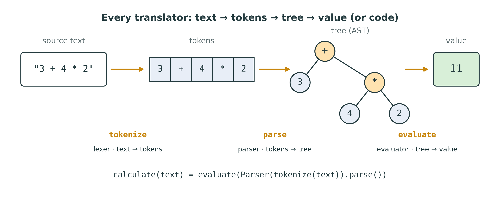
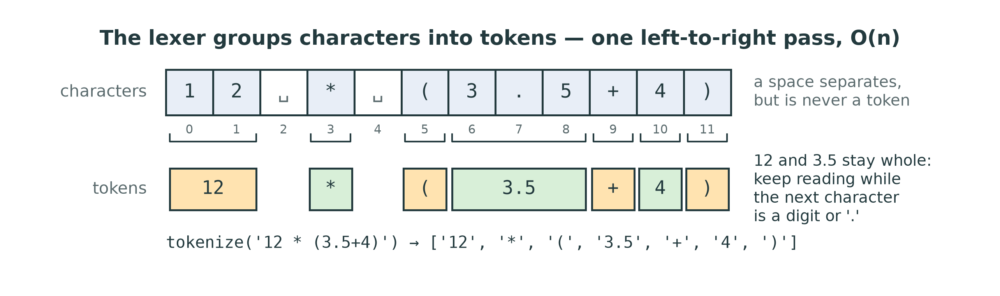
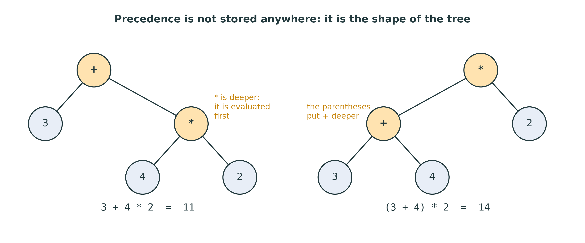
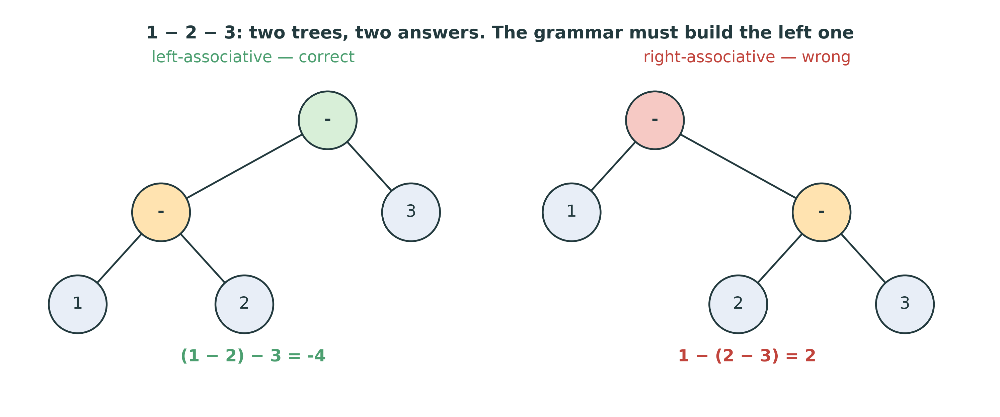
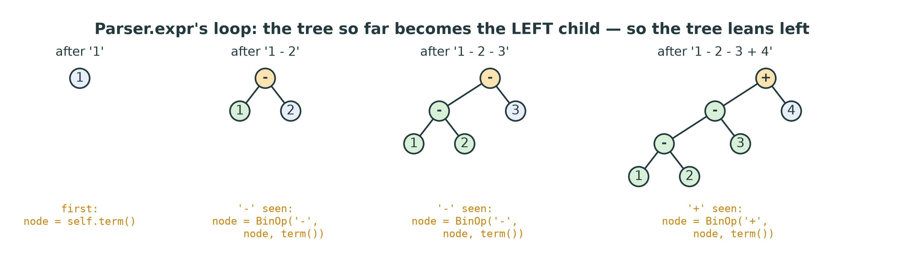
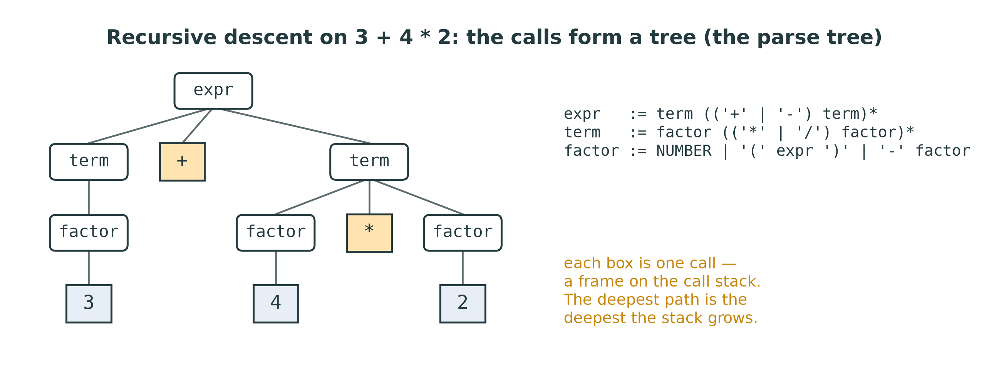
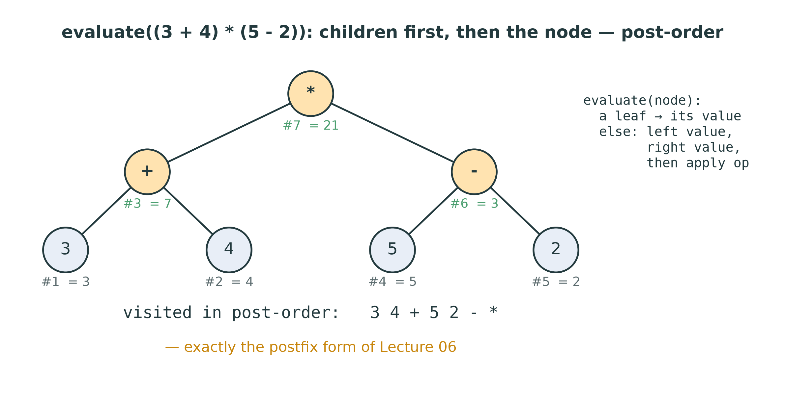
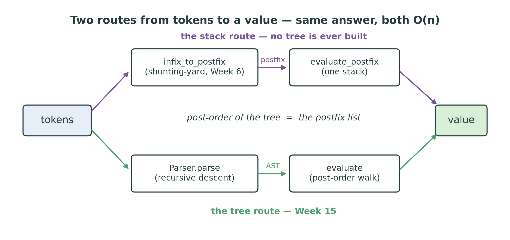
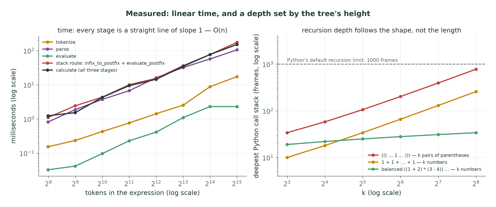
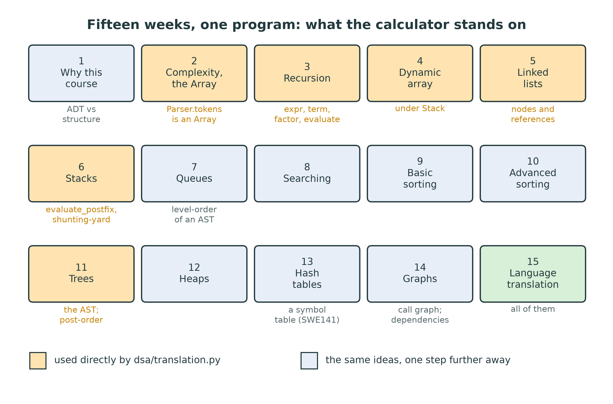

::: {.handout-only}

> **How to read this document.** This is the handout for Lecture 15, the last
> of the course. It holds everything on the slides, plus what I said out loud.
> This week you build a small but complete translator: it reads a line of
> arithmetic as text and computes its value, in three stages that every
> compiler and interpreter has. It needs a stack, recursion and a tree at once,
> which is why it closes the course. The handout ends with a look back over the
> fifteen weeks and a map for the final exam.
>
> Slides: `DSA27-L15-slides.pdf` · Code: `dsa/translation.py` ·
> Tests: `tests/test_translation.py`

:::

# Where We Are

## Fourteen weeks of parts. One machine.

You have built: the `Array`, recursion, the dynamic array, linked lists,
**stacks**, queues, searches, sorts, **trees**, heaps, hash tables, graphs.

Today they meet in one program:

```python
>>> calculate("2 * (3 + (4 - 1))")
12.0
```

Text in, a number out. How does a machine **read**?

::: {.handout-only}

Every program you have written this term was text until something read it.
When you press *Run*, CPython reads your file character by character, groups
the characters into words, works out how the words fit together, and only then
does anything. That reading is **language translation**, and the bylaws of 2013
and 2014 ask this course for "an introduction to the principles of language
translation" (`docs/course/02-coverage.md`, row 19).

We will not build a Python. We will build the smallest language that still has
every hard part: arithmetic with `+ - * /`, parentheses and a unary minus.
Small enough to finish in a week; big enough that precedence, associativity,
nesting and error messages all have to be got right.

*Language translation* in Arabic: ترجمة اللغات.

:::

## Today

1. What a translator does: compiler, interpreter, three stages
2. Stage 1 — the **lexer**: text $\to$ tokens
3. Grammars: precedence and associativity as **shape**
4. Stage 2 — **recursive descent**: tokens $\to$ tree
5. Stage 3 — **evaluation**: a post-order walk
6. Two routes to one answer: the Week 6 stack against the tree
7. Measured; where this grows up; the course, looking back

# What a Translator Does

## Compiler or interpreter?

| | Reads the source … | … and produces | Example |
|---|---|---|---|
| **Compiler** | once, ahead of time | another program (machine code, bytecode) | `gcc`, `javac` |
| **Interpreter** | as it runs | the **result** directly | a shell, a calculator |
| **Both** | compiles to bytecode, then interprets it | | CPython, the JVM |

Our `calculate` is an interpreter. The front half is the same for both.

::: {.handout-only}

A **translator** turns text written in one language into
something else: another language, or an action. A **compiler**
translates the whole program first and hands you the result to
run later: C and C++ compile to machine code, Java to bytecode for the JVM. An
**interpreter** executes as it reads, and gives you the answer rather
than a program: a calculator, a shell, a spreadsheet formula.

Python is both, which surprises most people. When you run a file, CPython
first **compiles** it to bytecode (the `.pyc` files in `__pycache__`), then its
**interpreter loop** runs the bytecode. You will see that bytecode at the end
of the lecture, and it will look familiar.

The distinction matters less than it seems, because the first stages are
identical: both must read the text and understand its structure before they
can do anything with it. That shared front end is this week's subject.

*Translator* in Arabic: المترجم. *Compiler*: المُصرِّف. *Interpreter*: المفسِّر.

:::

## Three stages

{width=100%}

Lexer, parser, evaluator: each stage has one job, and each can say no.

::: {.handout-only}

| Stage | Input $\to$ output | This week | Structure it uses |
|---|---|---|---|
| **Lexer** | text $\to$ tokens | `tokenize` | a scan (Week 2) |
| **Parser** | tokens $\to$ tree | `Parser` | recursion (Week 3), the `Array` |
| **Evaluator** | tree $\to$ value | `evaluate` | a tree walk (Week 11) |

- The **lexer**, the *lexical analyser*, reads characters and
  groups them into **tokens**: numbers, operators, parentheses.
  It knows nothing about structure; `3 + + 4` tokenizes happily.
- The **parser**, the *syntax analyser*, reads the tokens and
  decides how they fit together, according to a **grammar**. It
  produces a **tree** — the *abstract syntax tree*, or **AST**
  — and rejects anything the grammar does not allow.
- The **evaluator** walks the tree and computes the value. In a
  compiler, this stage is replaced by *code generation*: the same walk, but
  it writes instructions instead of computing numbers.

Each stage checks one kind of mistake. `3 $ 4` is a **lexical** error: `$` is
not a token of our language. `3 + * 4` is a **syntax** error: every token is
fine, but they are in an order the grammar forbids. `1 / 0` is a **runtime**
error: a perfectly formed expression whose value does not exist. Python
reports the same three kinds, and now you will know which stage raised each.

*Parser* in Arabic: المحلل النحوي. *Abstract syntax tree*: شجرة الإعراب المجردة.
*Evaluator*: المُقيِّم.

:::

# Stage 1: The Lexer

## Characters into tokens

{width=100%}

`tokenize("12 * (3.5+4)")` $\to$ `['12', '*', '(', '3.5', '+', '4', ')']`

- Whitespace **separates**, but is never a token.
- A number **keeps going** while the next character is a digit or `.`.
- Anything else is an error: `ValueError`.

::: {.handout-only}

A token is the smallest piece that means something. In `12 * (3.5+4)` there
are 12 characters but only 7 tokens: `12` is one number, not a 1 followed by a
2, and the spaces mean nothing except "here one token ends". Notice the lexer
does not need spaces at all: `3+4` and `3 + 4` give the same tokens, because
`+` can never be part of a number.

The lexer is a single left-to-right scan with an index `i`, the loop shape you
have written since Lab 01. At each position it looks at one character and
decides:

1. a space — skip it;
2. one of `+ - * / ( )` — it is a whole token by itself;
3. a digit or a decimal point — the start of a number: keep moving `i` while
   the next character is a digit or `.`, then cut the number out of the text
   in one piece;
4. anything else — raise `ValueError`, naming the character and its position.

Each character is looked at a constant number of times, so `tokenize` is
$O(n)$ in the length of the text. The docstring forbids regular expressions:
real lexers are often generated from them, but scanning by hand is how you
learn what a regular expression is doing for you.

**Two traps.** The inner loop that reads a number must check `i < len(text)`
**before** reading `text[i]`: a number at the very end of the text is the
normal case, not an edge case, and forgetting the check raises `IndexError` on
nearly every test. And a number must not contain two points: `1..2` is a
lexical error, not the number 1.

*Token* in Arabic: وحدة لفظية. *Lexer*: المحلل اللفظي.

:::

# Grammars

## Rules that say what is allowed

```text
expr   := term (('+' | '-') term)*
term   := factor (('*' | '/') factor)*
factor := NUMBER | '(' expr ')' | '-' factor
```

Read `:=` as "is", `|` as "or", `( … )*` as "zero or more times".

::: {.handout-only}

A **grammar** is a finite set of rules that describes an
infinite set of sentences. The notation is **EBNF** — Extended Backus–Naur
Form. John Backus and Peter Naur used the plain form, BNF, to define Algol 60
in 1960 (Naur edited the report), and every programming language since has been
specified this way; the Python Language Reference defines Python's syntax in a
grammar of the same kind.

Read the three rules as three sentences:

- an **expression** is a term, followed by any number of `+ term` or `- term`;
- a **term** is a factor, followed by any number of `* factor` or `/ factor`;
- a **factor** is a number, or a whole expression in parentheses, or a minus
  sign followed by a factor.

The names are traditional: a *term* is something you add, a *factor* something
you multiply. Plain BNF has no `*` for repetition, so the same grammar is
written with recursion instead — `expr := expr '+' term | term` — and that
version hides a trap we will fall into on purpose later.

Notice the third rule mentions `expr`, the first. The grammar is **recursive**:
an expression can contain a factor that contains an expression. That is what
lets `((((7))))` be as deep as you like, and it is why the parser will be
recursive too.

*Grammar* in Arabic: القواعد النحوية.

:::

## Precedence is the shape of the grammar

{width=88%}

`expr` is built from `term`s, so every `*` is grouped **before** any `+` sees
it. No table of numbers — the **layering** of the rules does it.

::: {.handout-only}

In Week 6 the shunting-yard algorithm needed a precedence table:
`{"+": 1, "-": 1, "*": 2, "/": 2}`. The grammar has no table anywhere, yet it
gets `3 + 4 * 2` right. How?

An `expr` is a sum of `term`s, and a `term` is a product of `factor`s. So to
read `3 + 4 * 2` as an `expr`, the parser must split it into terms at the `+`
signs: the terms are `3` and `4 * 2`. The `*` is swallowed **inside** the second
term before the `+` is ever applied. In the tree, that means `*` sits **deeper**
than `+`, and deeper nodes are evaluated first.

Precedence is therefore not a property of the operators; it
is a property of **which rule each operator lives in**. The lower the rule —
the closer to `factor` — the tighter the operator binds. To add a new level,
such as `^` for powers, you add a new rule between `term` and `factor`; that is
problem W15-C5.

Parentheses work because `factor := '(' expr ')'`: a parenthesised expression,
however loose its operators, is a **factor** — the tightest thing there is. In
the right-hand tree, `3 + 4` is pushed below the `*`.

*Precedence* in Arabic: أولوية العمليات.

:::

## Associativity: which way the tree leans

{width=88%}

`1 - 2 - 3` means `(1 - 2) - 3 = -4`. Operators of **equal** precedence group
from the **left**: the tree must lean left.

::: {.handout-only}

Precedence decides between *different* levels. **Associativity**
decides between operators on the *same* level. For `+` and `*` the
order hardly matters mathematically, but for `-` and `/` it changes the answer:
`8 / 4 / 2` is `(8 / 4) / 2 = 1`, not `8 / (4 / 2) = 4`.

All four of our operators are **left-associative**, as in mathematics and in
Python. In the tree, left-associative means that each new operator takes the
tree built so far as its **left** child. The right-hand tree in the figure is
what a plausible-looking but wrong parser builds — and it passes every test that
does not contain two `-` or two `/` in a row (W15-B1).

Exponentiation is the classic **right**-associative operator: `2 ** 3 ** 2` is
`2 ** 9 = 512` in Python, not `8 ** 2 = 64`. In Week 6 you saw associativity as
"pop on higher **or equal** precedence"; here you will see it as "loop, not
recursion" — the same fact in two costumes.

*Associativity* in Arabic: خاصية التجميع.

:::

# Stage 2: Recursive Descent

## One method per rule

| Grammar | Code |
|---|---|
| a rule | a method: `expr`, `term`, `factor` |
| a rule named inside another | a **call** |
| `( … )*` | a `while` loop |
| `a \| b \| c` | `if` / `elif` on the next token |
| a token in quotes | check it, then `advance()` |

The methods call each other **down** the grammar — and back **up** through the
parentheses. Hence *recursive descent*.

::: {.handout-only}

**Recursive descent** is the most direct way ever
found to turn a grammar into a program: you translate it line by line using the
table above, and the parser is finished. It is not a toy. The front ends of GCC
and Clang for C and C++ are hand-written recursive-descent parsers, and so were
many famous compilers before them.

`Parser` in `dsa/translation.py` holds the tokens in the course `Array` and one
integer, `position`: the index of the next token to read. Two helpers are given:

- `peek()` returns the current token **without** consuming it, or `None` at the
  end;
- `advance()` returns the current token **and** moves past it.

Everything the parser does is a decision made by **peeking** at one token: "is
the next thing a `+`?", "is it a `(`?". A parser that decides by looking one
token ahead, never back, is called *predictive*, and our grammar was written so
that one token is always enough.

*Recursive descent* in Arabic: التحليل التنازلي العودي.

:::

## `expr`, in full

```python
def expr(self):
    node = self.term()
    while self.peek() in ("+", "-"):
        op = self.advance()
        node = BinOp(op, node, self.term())  # the old tree goes LEFT
    return node
```

`term` is the same shape, one level down: `factor` for `term`, `*` and `/` for
`+` and `-`.

::: {.handout-only}

This is the reference solution's `expr`, without its docstring (and shown
without the class's indentation), and it is the template for `term`. Read it against the rule
`expr := term (('+' | '-') term)*`: first a `term`; then a loop that runs for
as long as the next token is `+` or `-`; inside, consume the operator and parse
one more `term`.

The line that matters is the last one in the loop. The tree built so far,
`node`, becomes the **left** child of a new `BinOp`, and the new term becomes
the right. Do this three times and the tree leans left — exactly the
associativity we need, built by a loop with no special effort.

`self.peek() in ("+", "-")` is safe at the end of the input: `peek()` returns
`None`, and `None in ("+", "-")` is simply `False`. The loop ends; `expr`
returns what it has; whoever called it decides whether stopping there is
allowed.

:::

## The loop builds a left-leaning tree

{width=100%}

::: {.handout-only}

The figure is `expr` on `1 - 2 - 3 + 4`, one snapshot per turn of the loop.
Green is the old `node`, now hanging on the left; amber is the new root. After
three turns the root is the **last** operator, `+`, and the first subtraction is
deepest — so it is evaluated first. That is `((1 - 2) - 3) + 4 = 0`, which is
what `1 - 2 - 3 + 4` means.

`term` builds `*` and `/` chains the same way, and each of its operands is a
`factor`, so a `term` inside an `expr` is a finished subtree before `expr`
places it. That is how the two loops combine into one tree with precedence and
associativity both right.

:::

## `factor`: where the recursion closes

Look at the next token:

- **a number** $\to$ consume it; return `Num(float(token))`.
- **`(`** $\to$ consume it; `node = self.expr()`; the next token **must** be `)`
  — consume it; return `node`.
- **`-`** $\to$ consume it; return `BinOp("-", Num(0.0), self.factor())`.
- **anything else**, or the end $\to$ `ValueError`.

`factor` calls `expr`: the grammar's recursion, and the parser's.

::: {.handout-only}

This is the method with the most cases and the fewest lines per case. Three
points need care.

**The parentheses.** After `self.expr()` returns, the parser has consumed
everything up to — but not including — the token that stopped the inner
expression. If that token is `)`, good: consume it, or the outer parser will
meet it and complain about an unexpected `)`. If it is anything else, the
parentheses are unbalanced: `"(3 + 4"` must raise `ValueError`, not quietly
return 7.

**Unary minus.** `-5` has no left operand, so we invent one: it becomes the
tree for `0 - 5`. The operand is a `factor`, not an `expr`, so the minus binds
tightly: `-5 + 2` is `(0 - 5) + 2 = -3`. With `self.expr()` there instead, the
minus would swallow the whole rest of the line, and `-5 + 2` would become
`-(5 + 2) = -7` (W15-B3). Because `factor` calls itself, `- - 3` is 3, and
`2 - -3` is 5.

**Running out.** `"3 +"` reaches `factor` after the `+` with nothing left:
`peek()` is `None`. Check for `None` first; an index into `None` raises
`TypeError`, the wrong exception with an unhelpful message.

Then `parse`, the entry point: refuse an empty token list, call `expr`, and
afterwards insist that **every** token has been used. `"3 + 4 )"` parses `3 + 4`
and stops at the `)`; without that last check, it would be accepted as 7.

:::

## The calls are the parse tree

{width=94%}

Each call is a frame on the call stack (Lecture 03). The **deepest** chain of
calls is the **deepest** the stack grows.

::: {.handout-only}

The figure was drawn by recording every call and return of the reference
parser on `3 + 4 * 2`. Each rounded box is one call; its children are the calls
it made and the tokens it consumed, left to right. This tree of calls is called
the **parse tree** (or *concrete syntax tree*): it records every rule used,
including the ones that did nothing but pass a value up, like the `term` above
`3`.

The AST is the parse tree with the scaffolding removed. Collapse every box that
has a single child into that child, and put each operator in the place of the
box that consumed it: what is left is the tree `+` over `3` and `*`, with `4`
and `2` under the `*` — the AST of the pipeline figure. That is why it is
called *abstract*: it keeps the structure and drops the grammar's bookkeeping.

At any moment during parsing, the frames on Python's call stack are exactly one
path from the root of this tree down to the box being worked on. You never
built a stack for the parser, because Python's call stack **is** the parser's
stack. Week 6 said recursion is a stack; this is recursion using that stack to
remember "I am inside a `term`, inside an `expr`, inside a parenthesis, inside
an `expr`".

:::

## Two grammars that look right and are not

**Right recursion** — `expr := term ('+' expr)?`

```python
node = self.term()
if self.peek() in ("+", "-"):
    return BinOp(self.advance(), node, self.expr())
```

`1 - 2 - 3` $\to$ **2**. Wrong, silently.

**Left recursion** — `expr := expr '+' term | term`

```python
left = self.expr()     # before reading any token
```

`RecursionError`, on every input.

::: {.handout-only}

Both come from writing the recursive BNF form directly as code.

The **right-recursive** version is the most common recursive-descent bug in
student code. It parses every correct expression without an error, and gets
precedence right, because `term` still does its job. Only associativity is
wrong: the recursive call parses the whole **rest** of the line and puts it on
the right. On the Week 15 tests it fails exactly 3 of 55: the tree test for
`1 - 2 - 3`, `calculate("1 - 2 - 3")` (2 instead of -4), and the test that
compares the two routes. `8 / 4 / 2` survives only because `term` was written
with a loop — the same bug in `term` would fail it too.

The **left-recursive** version is the grammar that textbooks write for
left-associative operators, and it is correct *as a grammar*. As a
recursive-descent program it never terminates: `expr` calls `expr` with
`position` unchanged, which calls `expr` with `position` unchanged, until
Python stops it at 1,000 frames. A recursion must make progress towards its
base case (Lecture 03) — this one consumes nothing before recursing. That is why
our grammar is written with `( … )*`: the repetition becomes a loop, and the
loop builds the left-leaning tree that the left recursion described.

:::

## Errors: say no, and say where

| Input | Stage | Raised |
|---|---|---|
| `3 $ 4` | lexer | `ValueError` |
| *(empty text)*, `3 +`, `* 3`, `()` | parser | `ValueError` |
| `(3 + 4`, `3 + 4 )`, `3 4` | parser | `ValueError` |
| `1 / 0` | evaluator | `ZeroDivisionError` |

::: {.handout-only}

The reference solution's messages:

- `3 $ 4` — `unexpected character '$' at position 2` (the lexer);
- empty text — `empty expression` (`parse`);
- `3 +` — `unexpected end of input` (`factor`, finding nothing after the `+`);
- `* 3` and `()` — `unexpected '*'` and `unexpected ')'` (`factor`, finding a
  token that cannot start a factor);
- `(3 + 4` — `missing ')'` (`factor`, after the inner `expr`);
- `3 + 4 )` — `unexpected ')' after the expression` (`parse`, with a token left
  over); `3 4` gives `unexpected '4' after the expression` for the same reason:
  `expr` parses the 3, finds no `+` or `-`, and returns;
- `1 / 0` — `ZeroDivisionError: division by zero`, raised by Python's own `/`
  inside `evaluate`.

The tests check only the exception **type**, so yours may word them
differently.

A parser's job is as much to **reject** as to accept. A calculator that
answered 7 to `3 + 4 )` would be hiding a mistake from its user, and a compiler
that did the same would turn a typo into a bug. Good translators also say
**where** the problem is — a position, a line and column — because a message
without a location sends the programmer hunting. Real parsers go further and
**recover**: they skip to a likely restart point and keep parsing, so that one
run reports every error, not just the first. That is beyond this course.

:::

# Stage 3: Walking the Tree

## The AST is a Week 11 tree

- `Num(value)` — a **leaf**. `BinOp(op, left, right)` — a node with two
  children.
- Height = the depth of nesting. Size = the number of tokens, minus the
  parentheses.

```python
from viz.draw import draw_tree
from dsa.translation import Parser, tokenize, to_edges
draw_tree(to_edges(Parser(tokenize("3 + 4 * 2")).parse()))
```

::: {.handout-only}

`Num` and `BinOp` are node classes, given to you, exactly like `TreeNode` in
`dsa/tree.py` — the storage rule's "node objects". An expression tree is a
**binary tree** but not a binary **search** tree: its order means "which
operand is which", not "smaller on the left".

`to_edges` (given) turns a tree into the list of (parent, child) pairs that
`viz.draw.draw_tree` renders. It names each node `label#n`, because one tree can
hold the same number twice: in `2 + 2` the two leaves are different nodes that
happen to print alike, and without the `#n` Graphviz would draw them as one
(`test_to_edges_keeps_duplicate_values_apart`).

Every tree in this lecture is the tree the reference parser actually built;
`tools/figures_l15.py` parses each expression and draws the result.

:::

## `evaluate` is a post-order walk

{width=88%}

A leaf: its value. Otherwise: evaluate the **left**, evaluate the **right**,
**then** apply the operator. Children first — post-order (Lecture 11).

::: {.handout-only}

`evaluate` is recursion on a tree, and it could not be shorter: a base case
for `Num`, and for `BinOp` two recursive calls followed by one arithmetic step
chosen by `node.op`. An operator that is none of the four raises `ValueError`;
dividing by zero raises `ZeroDivisionError` on its own, because Python's `/`
does.

Each node is visited once and does $O(1)$ work, so evaluation is $O(n)$ in the
number of nodes. The recursion is as deep as the tree is **high**: for a
balanced tree that is about $\log_2 n$, but for `1 + 1 + … + 1` the tree leans
left all the way down, its height is n - 1, and a thousand-term sum reaches
Python's recursion limit. The measured figure below shows this.

Now read the order in which the figure visits the nodes: `3 4 + 5 2 - *`. That
is the **postfix** form of `(3 + 4) * (5 - 2)`, from Lecture 06. It is not a
coincidence. Evaluating postfix with a stack processes the operands before
their operator; evaluating a tree in post-order does the same. The postfix list
**is** the post-order traversal of the expression tree, written out flat
(W15-C1).

:::

## `calculate`: the three stages, in three lines

```python
tokens = tokenize(text)
tree = Parser(tokens).parse()
return evaluate(tree)
```

::: {.handout-only}

The body of the reference `calculate`, exactly. It is the least interesting
code of the week and the most satisfying to write: the moment the three stages
stop being three exercises and become one program. Each stage can fail with its
own exception, and `calculate` lets every one of them through to the caller.

Keeping the stages separate is the point of the design. You can test the lexer
without a parser, and the evaluator on a tree you built by hand
(`test_evaluate_a_hand_built_tree`) — which is how compilers are built and
tested too.

:::

# Two Routes, One Answer

## The stack route and the tree route

{width=94%}

`test_both_routes_agree`: for `3 + 4 * 2`, `(3 + 4) * 2`, `1 - 2 - 3` and
`8 / 4 / 2`, both routes give the same value.

::: {.handout-only}

Week 6 already had a complete calculator: `infix_to_postfix` (Dijkstra's
shunting-yard, with an operator stack) followed by `evaluate_postfix` (with a
value stack). No tree and no recursion, and it is $O(n)$ too. So why build the
tree route at all?

- **The tree can be used more than once.** Evaluate it, print it back with
  minimal parentheses (W15-C3), simplify it, differentiate it, or generate code
  from it. The stack route produces a value and forgets the structure; a
  compiler needs the structure.
- **The grammar grows; the table does not.** Unary minus is one line in
  `factor`. The Week 6 `infix_to_postfix` has no idea what to do with `-5`: it
  treats the minus as binary, produces `5 -`, and `evaluate_postfix` rejects
  that with `ValueError`. Supporting it needs special cases in the algorithm.
  Function calls, variables and `if` are routine in a grammar and awkward in
  shunting-yard.
- **Errors are easier to explain** when a rule is being parsed: "missing `)`
  after the expression that started at position 4".

And why keep the stack route? It needs no recursion, so no depth limit; and
postfix is a perfect **target**. The stack is where the tree route ends up: the
post-order walk of the tree *is* the postfix list. Python itself does exactly
this — shown at the end of the lecture.

The shunting-yard algorithm is, in a sense, the post-order walk of a tree it
never builds; recursive descent builds the tree and then walks it.

:::

# Measured

## Linear time; depth set by the shape

{width=100%}

::: {.handout-only}

**Left: time.** Every stage, timed with the reference solution on balanced
expressions from 253 to 32,765 tokens. On a log–log plot every line has slope
about 1: doubling the input roughly doubles the time, $O(n)$, for the lexer, the parser,
the evaluator and the Week 6 stack route alike. The lines wobble a little
because the machine was busy with other work while measuring; the slope is what
to read, not any single point.

**Constant factors.** Parsing dominates: in this run it was 5 to 10 times
slower than tokenizing and 30 to 50 times slower than evaluating, because every token passes
through several method calls (`expr`, `term`, `factor`, `peek`, `advance`) and
each of those goes through the bounds check of the course `Array`. The stack
route costs about the same as the tree route: both pass each token through a
few Python-level function calls.

**Right: depth.** The deepest Python call stack reached while running
`calculate`, counted exactly, for three shapes of input with k numbers or k pairs
of parentheses:

- **Nested parentheses**, `((( … 1 … )))`: three frames per pair —
  `expr`, `term`, `factor` — so the depth is about 3k: 778 frames at k = 256.
  With Python's default limit of 1,000 frames, about 330 pairs of parentheses
  raise `RecursionError`.
- **A flat chain**, `1 + 1 + … + 1`: the parser handles it with a loop, but the
  tree it builds leans left all the way down, and `evaluate` recurses once per
  level: about k frames, 258 at k = 256. A chain of about a thousand numbers
  fails — in `evaluate`, not in the parser.
- **Balanced** input: 34 frames at k = 256. The depth grows with $\log_2 k$,
  because the height of a balanced tree does (Lecture 11).

So: the time of a translator depends on the **length** of its input, but its
recursion depth depends on the **shape** — the height of the tree. This is
the balanced-against-degenerate lesson of Week 11, met again from the other
side. Real compilers raise their stack limits, or evaluate deep chains with a
loop and an explicit stack, for exactly this reason.

:::

# Where This Grows Up

## From calculator to compiler

```python
>>> import ast
>>> ast.dump(ast.parse("3 + 4 * 2", mode="eval"))
Expression(body=BinOp(left=Constant(value=3),
  op=Add(), right=BinOp(left=Constant(value=4),
  op=Mult(), right=Constant(value=2))))
>>> import dis
>>> dis.dis(compile("a + b * c", "<s>", "eval"))
LOAD_NAME a;  LOAD_NAME b;  LOAD_NAME c
BINARY_OP *;  BINARY_OP +
```

Python's own tree is our tree. Its bytecode is our **postfix**.

::: {.handout-only}

The first line is CPython's own parser, from its standard `ast` module, on the
same expression: a `BinOp` for `+` whose right child is a `BinOp` for `*` —
the shape our parser builds, with longer names. (The real output is one line,
in quotes; it is broken here to fit.) Parse `x - y - z` and you get the left-leaning tree of
the associativity figure.

The second is CPython's compiler: the bytecode for `a + b * c` (Python 3.14),
condensed here to the instruction names, without the line numbers and the
`RESUME` and `RETURN_VALUE` instructions around them. Push
`a`, push `b`, push `c`, multiply the top two, add the top two: **postfix**,
run on a stack machine. Every Python program you have written this term was
turned into a post-order walk of its syntax tree and executed with a stack. The
two routes of this lecture are not rivals; a real compiler uses both, one after
the other.

**What a real translator adds.** Variables need a **symbol table** — a hash
table from names to values or types (Week 13). Control flow — `if`, loops,
functions — becomes a **graph** of basic blocks that the optimiser walks
(Week 14). Types are checked by walking the AST before anything runs. And the
evaluator is replaced by a **code generator**: the same post-order walk,
emitting instructions instead of computing numbers.

**Where you meet it again.** For Software Engineering students (2013 bylaw),
this course is a prerequisite of **SWE141 Software Construction**, which covers
"BNF and basic theory of grammars and parsing… formal languages" (2013, p. 42).
There the grammar becomes a formal object, and parsers are generated from it by
tools rather than written by hand. Whatever your program, you now know what
happens between pressing *Run* and the first line executing.

:::

# The Course, Looking Back

## Fifteen weeks, one program

{width=92%}

::: {.handout-only}

`dsa/translation.py` stands on more of the course than any other module:

- **The `Array`** (Week 2) holds the parser's tokens: `Parser.__init__` calls
  `Array.from_values`.
- **Recursion** (Week 3) *is* the parser, and the evaluator; the base cases are
  a number and a leaf.
- **The dynamic array** (Week 4) is inside your `Stack`, which `evaluate_postfix`
  and `infix_to_postfix` use (Week 6).
- **Node objects and references** (Week 5) are what `Num` and `BinOp` are.
- **The tree** and its **post-order** walk (Week 11) are the AST and `evaluate`.
- **Hash tables** (Week 13) and **graphs** (Week 14) are one step away: the
  symbol table and the control-flow graph of a real compiler.

Queues, searching, sorting and heaps do not appear in the calculator, and it
would be dishonest to pretend otherwise: one small program cannot need
everything. You could walk an AST level by level with your `CircularQueue`, as
`level_order` walks a search tree, but the calculator has no reason to. What
the capstone shows is not that every structure is used every time, but that a
real program is **assembled** from them — and that you can now read one and
name its parts.

:::

## What to carry out of the course

| Week | The idea |
|---|---|
| 1–2 | An ADT is a contract; a structure keeps it at a **cost**. Measure, don't guess. |
| 3 | Recursion = a base case + progress. It **is** a stack. |
| 4–5 | Contiguous against linked: amortised $O(1)$ append vs $O(1)$ head. |
| 6–7 | Restrict access to one end or two, and the right algorithm appears. |
| 8–10 | An **invariant** (sorted) buys speed; sorting pays for it: $O(n \log n)$. |
| 11–12 | Trees: $O(h)$; balanced h = $\log n$. A heap **is** an array. |
| 13–14 | Hashing: $O(1)$ **average**. Graphs: BFS with a queue, DFS with a stack. |
| 15 | A grammar's shape **is** its precedence; a translator uses them all. |

::: {.handout-only}

If you remember one sentence from each row a year from now, the course has
done its job. The single idea that ran through all of them: **the same
behaviour can be kept by different structures at very different costs**, and
the engineer's work is to choose — with a measurement, not a guess.

:::

# This Week

## Exercises: `dsa/translation.py`

| Function | Target | The trap |
|---|---|---|
| `tokenize` | $O(n)$ | numbers stay whole; `i < len(text)` in the inner loop; unknown character |
| `Parser.expr`, `term` | $O(n)$ overall | a **loop**; the old tree goes on the **left** |
| `Parser.factor` | | consume the `)`; unary minus calls `factor`; `None` at the end |
| `Parser.parse` | | empty input; tokens left over |
| `evaluate` | $O(n)$ | children **first**; unknown operator |
| `calculate` | $O(n)$ | three lines |

```powershell
pytest tests/test_translation.py -v
```

::: {.handout-only}

Fifty-five tests: 13 for the lexer, 12 for postfix (your Week 6 work, plus one
that pairs it with `tokenize`), 14 for the parser, 4 for `evaluate`, 10 end to
end with `calculate` and the two-routes test, and 2 for `to_edges`.
`evaluate_postfix` should already pass; if it does not, the stack must be fixed
first, because two of the end-to-end tests use it.

`Parser.__init__`, `peek`, `advance`, `Num`, `BinOp` and `to_edges` are given.
The `Parser` keeps its tokens in the course `Array`; `tokenize` returns a
Python list, because a list is the interface the tests use — the storage rule
allows lists for data passed in and out.

:::

## Homework 15 — before the final exam

1. **Implement** `dsa/translation.py` until all 55 tests pass.
2. **Draw** the AST, by hand, of `8 / 4 / 2`, `2 * (3 + 4) - 5` and
   `-(1 - 2) * 3`. Then check with `draw_tree(to_edges(...))`.
3. **Trace** the calls of `expr`, `term` and `factor` on `(1 + 2) * 3`, as an
   indented list — one line per call, with the tokens it consumes.
4. **Break it.** Replace the `while` in `expr` with the right-recursive version
   of this lecture. Which tests fail, and why only those?

::: {.handout-only}

For item 3, a quick way to check your trace is to add a `print` with an indent
of `"  " * depth` at the start of each method, and a `depth` counter that goes
up on entry and down on return. Remove it before you run the tests.

For item 4, predict first: which of the test expressions contain two `+`/`-`
operators at the same level, one after the other?

:::

## Preparing for the final

- **Format:** 30 marks multiple choice, 30 marks written — traces, drawings,
  complexity, code on paper.
- **Pass rule:** $\geq$ 60% overall **and** $\geq$ 30% of the final.
- **Every week** has a question bank with worked answers. Do them **closed**,
  then mark yourself.
- **Draw** every structure after every operation. The exam rewards pictures.

::: {.handout-only}

The written part of the final can ask any of the question types of the bank:
traces, drawings of a structure after each operation, complexity with a
justification, find-and-fix, and short code. Everything declared for the course
is examinable; dynamic programming is not (`docs/course/01-study-plan.md`,
"Two notes on scope").

A plan for the last weeks: take the mock papers already in the bank under exam
conditions, in one sitting, closed book, with no computer. Mark them with the
answer files. For each question you lose, go back to that week's handout, redo
the question bank for that week, and write the relevant `dsa/` function again
from memory on paper. What you cannot write on paper you do not yet know.

The exact date and rules of the final exam will be announced by the faculty; the
course guide (`docs/course/00-course-guide.md`) has the grading rules and their
sources.

:::

# Summary

## Seven things to keep

1. A translator has three stages: **lexer** (text $\to$ tokens), **parser**
   (tokens $\to$ tree), **evaluator** or code generator (tree $\to$ value or code).
2. A grammar in EBNF: `expr`, `term`, `factor` — one rule per precedence level.
3. **Precedence is the shape of the grammar**: the lower the rule, the tighter
   the operator.
4. **Recursive descent**: one method per rule; `( … )*` is a loop; parentheses
   recurse back to `expr`.
5. Left-associative = the old tree becomes the **left** child. Left recursion
   never terminates; right recursion gets `1 - 2 - 3` wrong.
6. Evaluation is a **post-order** walk, and post-order of the AST **is**
   postfix.
7. Time is $O(n)$; recursion depth is the tree's **height**.

## Next

**The final exam.** Everything from Week 1 to Week 15.

Then, depending on your program: **SWE141 Software Construction** (grammars and
parsing, grown up), **AI3001** (algorithm design), and every course that asks
you to choose a structure and defend the choice.

::: {.handout-only}

---

## Sources and further reading

- **A. V. Aho, M. S. Lam, R. Sethi and J. D. Ullman.** *Compilers: Principles,
  Techniques, and Tools*, 2nd ed., Addison-Wesley, 2006 — chapter 2, "A Simple
  Syntax-Directed Translator", builds a translator for exactly this grammar;
  chapters 3–4 are lexing and parsing in depth. The "dragon book".
- **R. Nystrom.** *Crafting Interpreters*, Genever Benning, 2021 — chapters 4–7
  write a scanner, a recursive-descent parser and a tree-walking evaluator in
  the same style as this lecture; free to read at craftinginterpreters.com.
- **P. Naur (ed.).** "Report on the Algorithmic Language ALGOL 60",
  *Communications of the ACM* 3(5), 1960 — the first language defined by a
  grammar in Backus–Naur Form.
- **N. Wirth.** *Compiler Construction*, Addison-Wesley, 1996 — a whole compiler
  built by recursive descent, one procedure per rule.
- **E. W. Dijkstra.** "Algol 60 translation", Mathematisch Centrum report
  MR 35, 1961 — the shunting-yard algorithm of Lecture 06.
- **Python documentation.** The `ast` and `dis` modules, and "Full Grammar
  specification" in the Python Language Reference.

Every figure in this lecture is generated by `tools/figures_l15.py`. The trees
are the ones the reference parser builds; the measured figure is real
measurement and will differ slightly on your machine.

:::
